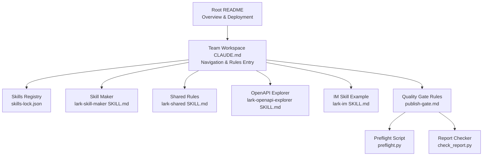
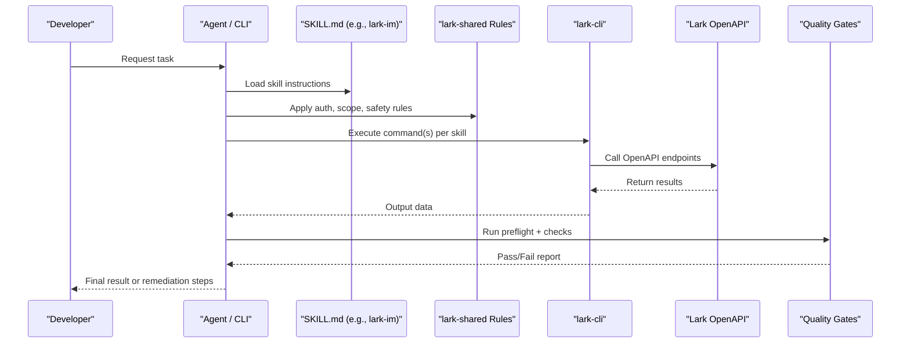
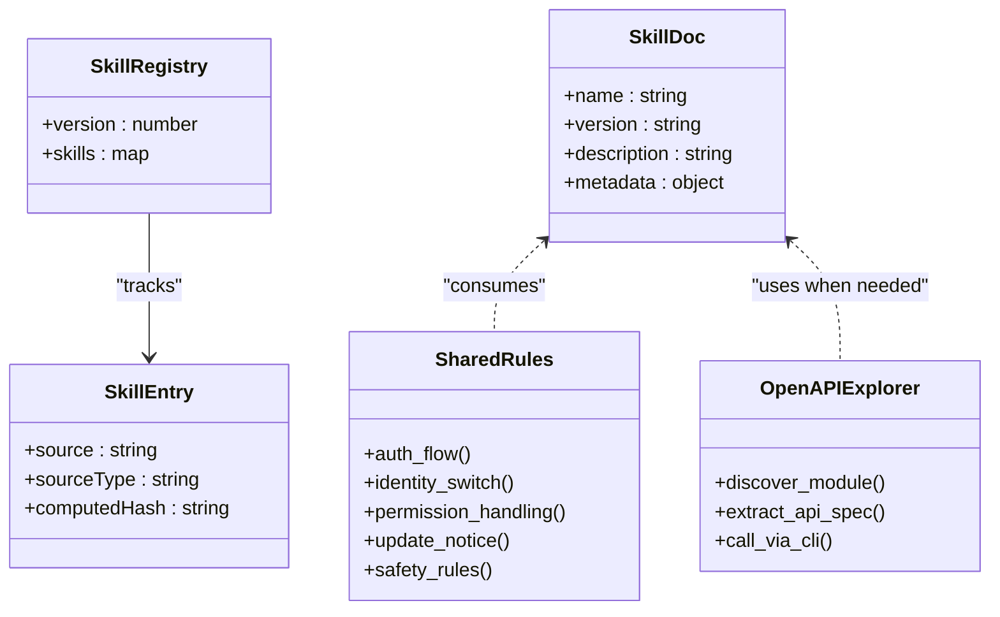
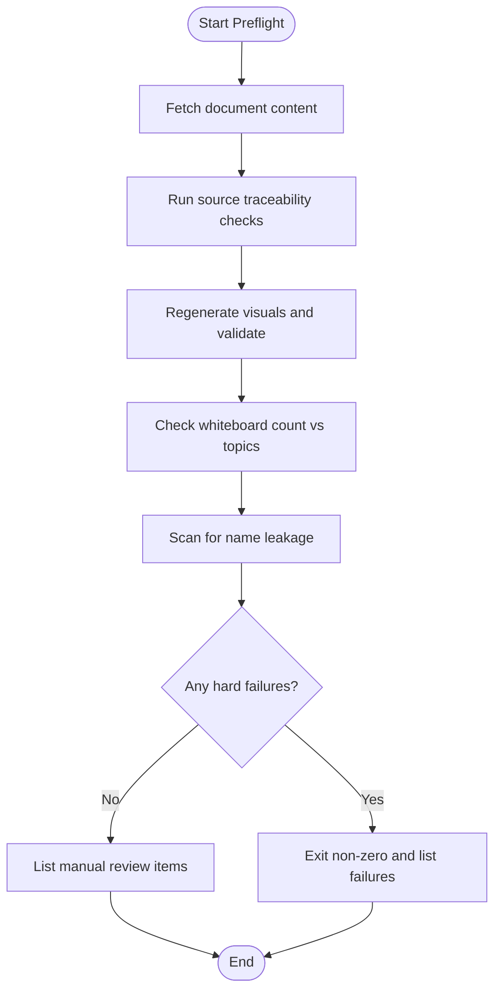
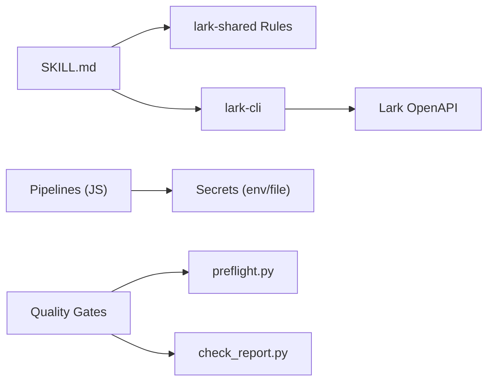

# Advanced Topics and Extensions

<cite>
**Referenced Files in This Document**
- [README.md](file://README.md)
- [team/CLAUDE.md](file://team/CLAUDE.md)
- [.claude/team/rules/publish-gate.md](file://.claude/team/rules/publish-gate.md)
- [team/scripts/preflight.py](file://team/scripts/preflight.py)
- [team/scripts/check_report.py](file://team/scripts/check_report.py)
- [team/.agents/skills/lark-skill-maker/SKILL.md](file://team/.agents/skills/lark-skill-maker/SKILL.md)
- [team/.agents/skills/lark-shared/SKILL.md](file://team/.agents/skills/lark-shared/SKILL.md)
- [team/.agents/skills/lark-im/SKILL.md](file://team/.agents/skills/lark-im/SKILL.md)
- [team/.agents/skills/lark-openapi-explorer/SKILL.md](file://team/.agents/skills/lark-openapi-explorer/SKILL.md)
- [team/skills-lock.json](file://team/skills-lock.json)
- [team/simworld/docs/skills/contributing.md](file://team/simworld/docs/skills/contributing.md)
- [team/simworld/skills/README.md](file://team/simworld/skills/README.md)
- [team/pipelines/gic-report.js](file://team/pipelines/gic-report.js)
- [team/.agents/skills/lark-apps/references/lark-apps-html-publish.md](file://team/.agents/skills/lark-apps/references/lark-apps-html-publish.md)
</cite>

## Table of Contents
1. Introduction
2. Project Structure
3. Core Components
4. Architecture Overview
5. Detailed Component Analysis
6. Dependency Analysis
7. Performance Considerations
8. Troubleshooting Guide
9. Conclusion
10. Appendices

## Introduction
This document explains how to extend the system with custom skills, modify rules, and integrate external APIs. It focuses on the skill module architecture, extension points, best practices, configuration options for registration and parameter passing, error handling strategies, and a quality gate system that validates extensions and maintains consistency across the codebase. Practical examples demonstrate skill development, rule customization, and integration patterns.

## Project Structure
The repository is a monorepo with two independent project areas: personal automation (meal) and team Lark workspace interactions. Skills are centrally maintained under team directories and referenced by agents and CLI tools. The root README provides high-level context and deployment notes.

**Diagram sources**
- [README.md:1-79](file://README.md#L1-L79)
- [team/CLAUDE.md:1-37](file://team/CLAUDE.md#L1-L37)
- [team/skills-lock.json:1-136](file://team/skills-lock.json#L1-L136)
- [team/.agents/skills/lark-skill-maker/SKILL.md:1-86](file://team/.agents/skills/lark-skill-maker/SKILL.md#L1-L86)
- [team/.agents/skills/lark-shared/SKILL.md:1-169](file://team/.agents/skills/lark-shared/SKILL.md#L1-L169)
- [team/.agents/skills/lark-openapi-explorer/SKILL.md:1-154](file://team/.agents/skills/lark-openapi-explorer/SKILL.md#L1-L154)
- [team/.agents/skills/lark-im/SKILL.md:1-207](file://team/.agents/skills/lark-im/SKILL.md#L1-L207)
- [.claude/team/rules/publish-gate.md:1-19](file://.claude/team/rules/publish-gate.md#L1-L19)
- [team/scripts/preflight.py:1-110](file://team/scripts/preflight.py#L1-L110)
- [team/scripts/check_report.py:1-195](file://team/scripts/check_report.py#L1-L195)

**Section sources**
- [README.md:1-79](file://README.md#L1-L79)
- [team/CLAUDE.md:1-37](file://team/CLAUDE.md#L1-L37)

## Core Components
- Skill registry and versioning: skills-lock.json tracks source and computed hash for each lark-* skill, enabling deterministic upgrades from open.feishu.cn.
- Skill authoring: lark-skill-maker defines the SKILL.md template and principles for creating new skills.
- Shared runtime rules: lark-shared documents authentication, identity switching, permission handling, update checks, and safety rules.
- OpenAPI discovery: lark-openapi-explorer guides discovering native Lark OpenAPI when existing skills or shortcuts do not cover a need.
- Example skill: lark-im demonstrates shortcut usage, resource relationships, permissions, and operational notes.
- Quality gates: publish-gate rules enforce preflight checks via scripts before declaring completion.

Key responsibilities:
- Registration and upgrade control: skills-lock.json
- Authoring guidance: lark-skill-maker SKILL.md
- Runtime behavior and security: lark-shared SKILL.md
- Discovery path for missing APIs: lark-openapi-explorer SKILL.md
- Concrete usage example: lark-im SKILL.md
- Validation pipeline: preflight.py and check_report.py

**Section sources**
- [team/skills-lock.json:1-136](file://team/skills-lock.json#L1-L136)
- [team/.agents/skills/lark-skill-maker/SKILL.md:1-86](file://team/.agents/skills/lark-skill-maker/SKILL.md#L1-L86)
- [team/.agents/skills/lark-shared/SKILL.md:1-169](file://team/.agents/skills/lark-shared/SKILL.md#L1-L169)
- [team/.agents/skills/lark-openapi-explorer/SKILL.md:1-154](file://team/.agents/skills/lark-openapi-explorer/SKILL.md#L1-L154)
- [team/.agents/skills/lark-im/SKILL.md:1-207](file://team/.agents/skills/lark-im/SKILL.md#L1-L207)
- [.claude/team/rules/publish-gate.md:1-19](file://.claude/team/rules/publish-gate.md#L1-L19)
- [team/scripts/preflight.py:1-110](file://team/scripts/preflight.py#L1-L110)
- [team/scripts/check_report.py:1-195](file://team/scripts/check_report.py#L1-L195)

## Architecture Overview
The extension architecture centers on Markdown-based skills consumed by agents and CLI. Skills orchestrate lark-cli commands, which call Lark OpenAPI endpoints. A lock file ensures consistent versions. Quality gates run automated checks before publishing.

**Diagram sources**
- [team/.agents/skills/lark-im/SKILL.md:1-207](file://team/.agents/skills/lark-im/SKILL.md#L1-L207)
- [team/.agents/skills/lark-shared/SKILL.md:1-169](file://team/.agents/skills/lark-shared/SKILL.md#L1-L169)
- [team/.agents/skills/lark-openapi-explorer/SKILL.md:1-154](file://team/.agents/skills/lark-openapi-explorer/SKILL.md#L1-L154)
- [.claude/team/rules/publish-gate.md:1-19](file://.claude/team/rules/publish-gate.md#L1-L19)
- [team/scripts/preflight.py:1-110](file://team/scripts/preflight.py#L1-L110)
- [team/scripts/check_report.py:1-195](file://team/scripts/check_report.py#L1-L195)

## Detailed Component Analysis

### Skill Module Architecture
- Single source of truth: skills reside under team directories; IDEs and agents load them via symlinks or direct paths.
- Versioned registry: skills-lock.json records source and computed hash for each skill, enabling reproducible upgrades.
- Authoring contract: SKILL.md frontmatter includes name, version, description, and metadata such as required binaries.
- Shared runtime: lark-shared centralizes authentication, identity selection, permission errors, update notices, and safety constraints.
- Discovery fallback: lark-openapi-explorer provides a structured process to find native OpenAPI when no skill covers the need.

**Diagram sources**
- [team/skills-lock.json:1-136](file://team/skills-lock.json#L1-L136)
- [team/.agents/skills/lark-skill-maker/SKILL.md:1-86](file://team/.agents/skills/lark-skill-maker/SKILL.md#L1-L86)
- [team/.agents/skills/lark-shared/SKILL.md:1-169](file://team/.agents/skills/lark-shared/SKILL.md#L1-L169)
- [team/.agents/skills/lark-openapi-explorer/SKILL.md:1-154](file://team/.agents/skills/lark-openapi-explorer/SKILL.md#L1-L154)

**Section sources**
- [team/simworld/skills/README.md:1-42](file://team/simworld/skills/README.md#L1-L42)
- [team/simworld/docs/skills/contributing.md:1-33](file://team/simworld/docs/skills/contributing.md#L1-L33)
- [team/skills-lock.json:1-136](file://team/skills-lock.json#L1-L136)
- [team/.agents/skills/lark-skill-maker/SKILL.md:1-86](file://team/.agents/skills/lark-skill-maker/SKILL.md#L1-L86)
- [team/.agents/skills/lark-shared/SKILL.md:1-169](file://team/.agents/skills/lark-shared/SKILL.md#L1-L169)
- [team/.agents/skills/lark-openapi-explorer/SKILL.md:1-154](file://team/.agents/skills/lark-openapi-explorer/SKILL.md#L1-L154)

### Creating Custom Skills
Steps:
- Create a new directory under skills with a SKILL.md containing YAML frontmatter (name, version, description, metadata).
- Follow the template and principles in lark-skill-maker to define commands, multi-step workflows, and permissions.
- Reference lark-shared for authentication, identity, and safety rules at the top of your skill.
- If no existing skill or shortcut covers the need, use lark-openapi-explorer to discover native OpenAPI and call it via lark-cli api.

Best practices:
- Keep description keyword-rich to improve triggerability.
- Always specify required scopes and identity requirements.
- Use --dry-run for destructive operations and confirm user intent.
- Prefer shortcuts over raw API calls when available.

**Section sources**
- [team/.agents/skills/lark-skill-maker/SKILL.md:1-86](file://team/.agents/skills/lark-skill-maker/SKILL.md#L1-L86)
- [team/.agents/skills/lark-shared/SKILL.md:1-169](file://team/.agents/skills/lark-shared/SKILL.md#L1-L169)
- [team/.agents/skills/lark-openapi-explorer/SKILL.md:1-154](file://team/.agents/skills/lark-openapi-explorer/SKILL.md#L1-L154)

### Modifying Existing Rules
Rule modifications should be centralized and referenced rather than duplicated. For example, the navigation page points to specific rules files for sourcing, memory model, and publishing gates. When updating rules:
- Edit the single source file under .claude/team/rules.
- Ensure all references remain valid.
- Validate changes using the quality gate scripts before delivery.

**Section sources**
- [team/CLAUDE.md:1-37](file://team/CLAUDE.md#L1-L37)
- [.claude/team/rules/publish-gate.md:1-19](file://.claude/team/rules/publish-gate.md#L1-L19)

### Integrating New External APIs
Patterns:
- Prefer lark-cli shortcuts and registered APIs first.
- If uncovered, use lark-openapi-explorer to locate official docs and extract method, path, parameters, and scopes.
- Call via lark-cli api with appropriate flags and identity.
- For non-Lark services, follow secret handling and base URL normalization rules as demonstrated in image generation skill documentation.

Security considerations:
- Never embed secrets in replies or files.
- Normalize base URLs and avoid trailing slashes.
- Use environment variables or protected files for keys.

**Section sources**
- [team/.agents/skills/lark-openapi-explorer/SKILL.md:1-154](file://team/.agents/skills/lark-openapi-explorer/SKILL.md#L1-L154)
- [team/pipelines/gpt_image_gen/SKILL.txt:23-55](file://team/pipelines/gpt_image_gen/SKILL.txt#L23-L55)

### Configuration Options for Skill Registration and Upgrades
- skills-lock.json fields:
  - version: registry schema version
  - skills.<name>.source: origin (e.g., open.feishu.cn)
  - skills.<name>.sourceType: e.g., well-known
  - skills.<name>.computedHash: integrity checksum
- Upgrade workflow:
  - Pull updated skills from the declared source.
  - Update computedHash after verifying content.
  - Commit lock file changes alongside skill updates.

**Section sources**
- [team/skills-lock.json:1-136](file://team/skills-lock.json#L1-L136)
- [team/simworld/docs/skills/contributing.md:30-33](file://team/simworld/docs/skills/contributing.md#L30-L33)

### Parameter Passing and Data Flow
- Skills instruct agents to pass parameters via lark-cli flags and JSON bodies.
- Multi-step flows must explicitly document how outputs from one step become inputs for subsequent steps.
- Identity selection (--as user or --as bot) affects token type and permissions; ensure correct identity per operation.

**Section sources**
- [team/.agents/skills/lark-im/SKILL.md:1-207](file://team/.agents/skills/lark-im/SKILL.md#L1-L207)
- [team/.agents/skills/lark-shared/SKILL.md:1-169](file://team/.agents/skills/lark-shared/SKILL.md#L1-L169)

### Error Handling Strategies
- Permission denied or scope errors: consult lark-shared for resolution paths based on identity.
- High-risk write confirmation: exit code 10 indicates confirmation_required; present risk details to user and retry with --yes only after explicit consent.
- Network/server failures: follow documented scenarios and retry policies.
- Credential file validation: certain publish flows block sensitive files unless explicitly waived.

**Section sources**
- [team/.agents/skills/lark-shared/SKILL.md:1-169](file://team/.agents/skills/lark-shared/SKILL.md#L1-L169)
- [team/.agents/skills/lark-apps/references/lark-apps-html-publish.md:118-149](file://team/.agents/skills/lark-apps/references/lark-apps-html-publish.md#L118-L149)

### Quality Gate System
The quality gate enforces deterministic checks before declaring completion:
- Source traceability: exclude items, audience violations, hearsay, jargon, duplication, and internal leaks.
- Rendering checks: regenerate topic visuals and validate geometry.
- Attachment completeness: ensure whiteboard blocks match topics.
- Name leakage: prevent unintended names in public-facing sections.

**Diagram sources**
- [team/scripts/preflight.py:1-110](file://team/scripts/preflight.py#L1-L110)
- [team/scripts/check_report.py:1-195](file://team/scripts/check_report.py#L1-L195)
- [.claude/team/rules/publish-gate.md:1-19](file://.claude/team/rules/publish-gate.md#L1-L19)

**Section sources**
- [.claude/team/rules/publish-gate.md:1-19](file://.claude/team/rules/publish-gate.md#L1-L19)
- [team/scripts/preflight.py:1-110](file://team/scripts/preflight.py#L1-L110)
- [team/scripts/check_report.py:1-195](file://team/scripts/check_report.py#L1-L195)

### Practical Examples

#### Example 1: Develop a New Skill
- Create SKILL.md with frontmatter and describe triggers and commands.
- Reference lark-shared for auth and safety.
- If no shortcut exists, use lark-openapi-explorer to find native API and call via lark-cli api.

**Section sources**
- [team/.agents/skills/lark-skill-maker/SKILL.md:1-86](file://team/.agents/skills/lark-skill-maker/SKILL.md#L1-L86)
- [team/.agents/skills/lark-openapi-explorer/SKILL.md:1-154](file://team/.agents/skills/lark-openapi-explorer/SKILL.md#L1-L154)

#### Example 2: Customize Reporting Rules
- Update rules under .claude/team/rules for sourcing, style, or gating.
- Validate with preflight and check_report before announcing completion.

**Section sources**
- [team/CLAUDE.md:1-37](file://team/CLAUDE.md#L1-L37)
- [.claude/team/rules/publish-gate.md:1-19](file://.claude/team/rules/publish-gate.md#L1-L19)
- [team/scripts/preflight.py:1-110](file://team/scripts/preflight.py#L1-L110)
- [team/scripts/check_report.py:1-195](file://team/scripts/check_report.py#L1-L195)

#### Example 3: Integrate an External Image Generation API
- Set BASE_URL without trailing slash.
- Handle secrets via environment variables or protected files.
- Implement async create-poll flow and status handling.

**Section sources**
- [team/pipelines/gpt_image_gen/SKILL.txt:23-55](file://team/pipelines/gpt_image_gen/SKILL.txt#L23-L55)

## Dependency Analysis
Skills depend on lark-cli and shared rules. The registry ensures consistent versions. Pipelines may rely on environment variables and protected key files.

**Diagram sources**
- [team/.agents/skills/lark-shared/SKILL.md:1-169](file://team/.agents/skills/lark-shared/SKILL.md#L1-L169)
- [team/.agents/skills/lark-im/SKILL.md:1-207](file://team/.agents/skills/lark-im/SKILL.md#L1-L207)
- [team/pipelines/gic-report.js:49-73](file://team/pipelines/gic-report.js#L49-L73)
- [team/scripts/preflight.py:1-110](file://team/scripts/preflight.py#L1-L110)
- [team/scripts/check_report.py:1-195](file://team/scripts/check_report.py#L1-L195)

**Section sources**
- [team/skills-lock.json:1-136](file://team/skills-lock.json#L1-L136)
- [team/pipelines/gic-report.js:49-73](file://team/pipelines/gic-report.js#L49-L73)

## Performance Considerations
- Prefer shortcuts over raw API calls to reduce round-trips and simplify logic.
- Batch operations where supported (e.g., message retrieval, reactions).
- Avoid unnecessary re-fetches; cache intermediate results within a session if safe.
- Use pagination flags and limits to control payload sizes.
- Regenerate visuals only when necessary; preflight runs can be expensive.

[No sources needed since this section provides general guidance]

## Troubleshooting Guide
Common issues and resolutions:
- Authentication and identity:
  - Use lark-shared to switch between user and bot identities and handle scope errors.
  - For agent-assisted auth, follow split-flow to avoid blocking the same conversation turn.
- Permission denied:
  - Inspect error responses for missing scopes and console links; guide users to enable required permissions.
- High-risk write confirmation:
  - Exit code 10 requires explicit user consent; never auto-append --yes.
- Credential file validation:
  - Publish flows block sensitive files; remove them or explicitly waive with user confirmation.
- Report quality:
  - Run preflight and check_report to catch exclusions, audience violations, hearsay, jargon, duplication, and leaks.

**Section sources**
- [team/.agents/skills/lark-shared/SKILL.md:1-169](file://team/.agents/skills/lark-shared/SKILL.md#L1-L169)
- [team/.agents/skills/lark-apps/references/lark-apps-html-publish.md:118-149](file://team/.agents/skills/lark-apps/references/lark-apps-html-publish.md#L118-L149)
- [team/scripts/preflight.py:1-110](file://team/scripts/preflight.py#L1-L110)
- [team/scripts/check_report.py:1-195](file://team/scripts/check_report.py#L1-L195)

## Conclusion
Extending the system revolves around well-structured skills, disciplined rule management, and robust quality gates. By following the authoring template, leveraging shared runtime rules, using the OpenAPI explorer when needed, and enforcing preflight checks, teams can safely add capabilities, customize behaviors, and integrate external services while maintaining consistency and reliability.

[No sources needed since this section summarizes without analyzing specific files]

## Appendices

### Appendix A: Skill Frontmatter Fields
- name: unique identifier for the skill
- version: semantic version
- description: human-readable summary including trigger keywords
- metadata.requires.bins: required binaries (e.g., lark-cli)

**Section sources**
- [team/.agents/skills/lark-skill-maker/SKILL.md:1-86](file://team/.agents/skills/lark-skill-maker/SKILL.md#L1-L86)

### Appendix B: Registry Schema Notes
- version: registry format version
- skills: map of skill name to entry
  - source: canonical source (e.g., open.feishu.cn)
  - sourceType: classification (e.g., well-known)
  - computedHash: integrity checksum

**Section sources**
- [team/skills-lock.json:1-136](file://team/skills-lock.json#L1-L136)