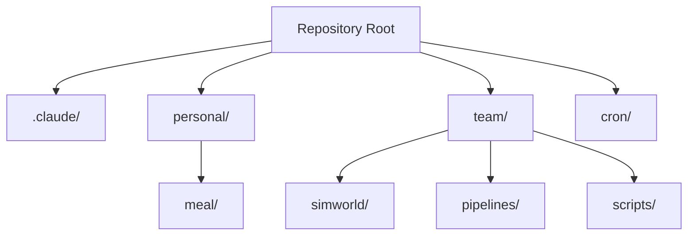
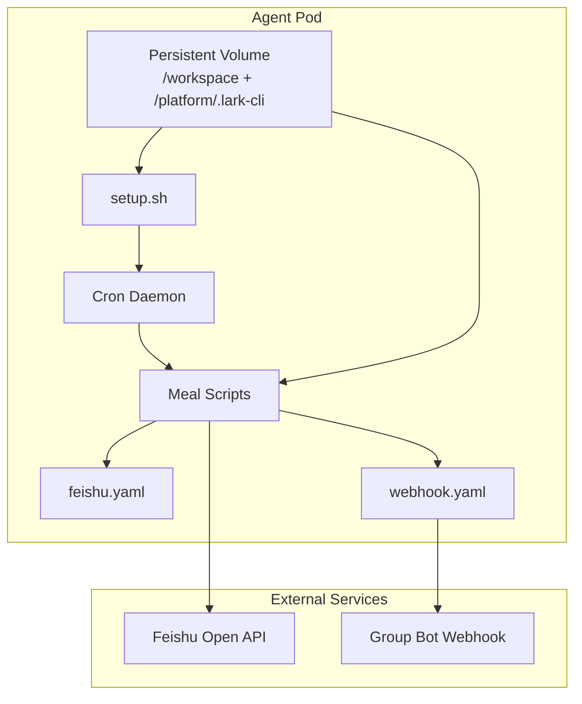
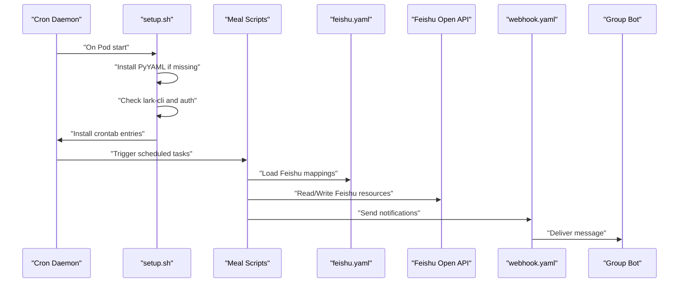
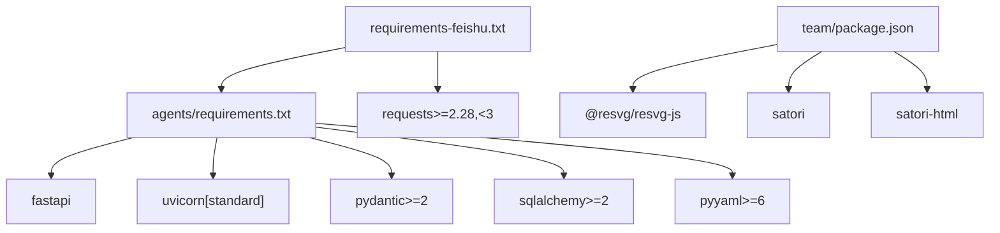

# Development and Deployment Guide

<cite>
**Referenced Files in This Document**
- [README.md](file://README.md)
- [setup.sh](file://personal/meal/setup.sh)
- [feishu.yaml](file://personal/meal/config/feishu.yaml)
- [webhook.yaml](file://personal/meal/config/webhook.yaml)
- [requirements-feishu.txt](file://team/simworld/requirements-feishu.txt)
- [requirements.txt](file://team/simworld/agents/feishu-agent/requirements.txt)
- [package.json](file://team/package.json)
- [lark-cli-setup.md](file://team/simworld/docs/feishu/lark-cli-setup.md)
</cite>

## Table of Contents
1. [Introduction](#introduction)
2. [Project Structure](#project-structure)
3. [Core Components](#core-components)
4. [Architecture Overview](#architecture-overview)
5. [Detailed Component Analysis](#detailed-component-analysis)
6. [Dependency Analysis](#dependency-analysis)
7. [Performance Considerations](#performance-considerations)
8. [Troubleshooting Guide](#troubleshooting-guide)
9. [Conclusion](#conclusion)
10. [Appendices](#appendices)

## Introduction
This guide explains how to set up the development environment and deploy the systems in this monorepo. It covers prerequisites (Python 3, Node.js runtime, Lark CLI installation, Feishu account setup), local development configuration, dependency management, testing strategies, environment-specific options for deployment targets, practical examples for setup and initialization, and the Agent Pod deployment model including persistent storage and container orchestration considerations. It also addresses common issues such as dependency conflicts, authentication problems, and permission errors during deployment.

The repository is a multi-project workspace with two independent areas:
- personal/meal: Family recipe automation using Python 3, PyYAML, and lark-cli.
- team: Simulation department Feishu workspace interactions using lark-cli, Python, and Node.js.

All content outputs reside in Feishu; the repository holds rules, reusable scripts, and Feishu mappings only.

**Section sources**
- [README.md:1-79](file://README.md#L1-L79)

## Project Structure
High-level layout:
- .claude/: Workspace rules and skills
- personal/: Personal automation area (meal system)
- team/: Team Feishu workspace (skills, pipelines, tools)
- cron/: Local scheduling and triggers (not part of cloud repo)

[No sources needed since this diagram shows conceptual workflow, not actual code structure]

**Section sources**
- [README.md:1-79](file://README.md#L1-L79)

## Core Components
- Meal System (personal/meal):
  - Python 3 scripts driven by PyYAML and lark-cli.
  - Configuration files define Feishu data source mapping and webhook settings.
  - Setup script restores runtime dependencies and schedules tasks after Pod restarts.

- Team Workspace (team/):
  - Python dependencies for Feishu agent services and general requests.
  - Node.js dependencies for SVG/image generation utilities.
  - Documentation for Lark CLI setup and onboarding.

Key responsibilities:
- meal/setup.sh: Ensures PyYAML, lark-cli availability, installs crontab entries, and starts cron daemon if possible.
- personal/meal/config/feishu.yaml: Maps Feishu root folder and Base/table tokens used by scripts.
- personal/meal/config/webhook.yaml: Defines Feishu group bot webhook URL and default send time.
- team/simworld/requirements-feishu.txt: Aggregates Python dependencies for Feishu-related components.
- team/simworld/agents/feishu-agent/requirements.txt: FastAPI-based Bot/Webhook service dependencies.
- team/package.json: Node.js dependencies for image/SVG rendering.
- team/simworld/docs/feishu/lark-cli-setup.md: Lark CLI installation and configuration instructions.

**Section sources**
- [setup.sh:1-84](file://personal/meal/setup.sh#L1-L84)
- [feishu.yaml:1-19](file://personal/meal/config/feishu.yaml#L1-L19)
- [webhook.yaml:1-6](file://personal/meal/config/webhook.yaml#L1-L6)
- [requirements-feishu.txt:1-15](file://team/simworld/requirements-feishu.txt#L1-L15)
- [requirements.txt:1-8](file://team/simworld/agents/feishu-agent/requirements.txt#L1-L8)
- [package.json:1-8](file://team/package.json#L1-L8)
- [lark-cli-setup.md](file://team/simworld/docs/feishu/lark-cli-setup.md)

## Architecture Overview
The system runs inside an Agent Pod with persistent volumes for project files and Lark CLI credentials. Scheduling is handled via cron jobs installed by the setup script. The meal system reads/writes Feishu resources based on configuration mappings and sends notifications through a webhook.

**Diagram sources**
- [setup.sh:1-84](file://personal/meal/setup.sh#L1-L84)
- [feishu.yaml:1-19](file://personal/meal/config/feishu.yaml#L1-L19)
- [webhook.yaml:1-6](file://personal/meal/config/webhook.yaml#L1-L6)
- [README.md:76-79](file://README.md#L76-L79)

## Detailed Component Analysis

### Prerequisites
- Python 3: Required for meal scripts and Feishu agent services.
- Node.js runtime: Required for team pipeline utilities (SVG/image generation).
- Lark CLI: Installed separately as a binary; authentication stored under /platform/.lark-cli.
- Feishu Account: Create a Feishu app and configure permissions; ensure access to target folders and tables.

Practical steps:
- Install Python 3 and pip.
- Install Node.js and npm.
- Install Lark CLI following the provided documentation.
- Initialize and authenticate Lark CLI so that /platform/.lark-cli/config.json exists.

**Section sources**
- [README.md:76-79](file://README.md#L76-L79)
- [lark-cli-setup.md](file://team/simworld/docs/feishu/lark-cli-setup.md)

### Local Development Configuration
- Ensure PyYAML is available:
  - The setup script checks and installs PyYAML if missing.
- Verify Lark CLI presence and authentication:
  - The setup script checks PATH and config file existence.
- Configure Feishu data source mapping:
  - Update feishu.yaml with correct root_folder, Base app_token, table_id, and folder tokens.
- Configure webhook notification:
  - Update webhook.yaml with the group bot webhook URL and desired send_time.

Example actions:
- Run the setup script once after Pod startup or when restoring environment.
- Validate cron entries and timezone handling (UTC vs Beijing time).

**Section sources**
- [setup.sh:20-43](file://personal/meal/setup.sh#L20-L43)
- [setup.sh:45-65](file://personal/meal/setup.sh#L45-L65)
- [feishu.yaml:1-19](file://personal/meal/config/feishu.yaml#L1-L19)
- [webhook.yaml:1-6](file://personal/meal/config/webhook.yaml#L1-L6)

### Dependency Management
- Python dependencies:
  - Use requirements-feishu.txt to install Feishu-related packages.
  - agents/feishu-agent/requirements.txt lists FastAPI, uvicorn, pydantic, sqlalchemy, pyyaml for the Bot/Webhook service.
- Node.js dependencies:
  - team/package.json includes @resvg/resvg-js, satori, satori-html for rendering.

Recommended commands:
- Install Python dependencies: pip install -r team/simworld/requirements-feishu.txt
- Install Node.js dependencies: cd team && npm install

Notes:
- Lark CLI is not included in Python requirements; install it separately per documentation.

**Section sources**
- [requirements-feishu.txt:1-15](file://team/simworld/requirements-feishu.txt#L1-L15)
- [requirements.txt:1-8](file://team/simworld/agents/feishu-agent/requirements.txt#L1-L8)
- [package.json:1-8](file://team/package.json#L1-L8)

### Testing Strategies
- Unit tests:
  - For Feishu agent services, run unit tests within the agents directory if present.
- Integration tests:
  - Validate Feishu connectivity by running a small script that fetches a known resource using configured tokens.
- Cron validation:
  - Inspect crontab entries and simulate execution paths to ensure scripts run at expected times.
- Webhook validation:
  - Trigger a notification and verify delivery to the group bot.

Best practices:
- Keep test fixtures minimal and avoid storing sensitive credentials in version control.
- Use environment variables or mounted secrets for credentials in CI/CD.

[No sources needed since this section provides general guidance]

### Environment-Specific Configuration Options
- Timezone:
  - Pod timezone is UTC; schedule jobs accordingly (Beijing time = UTC+8).
- Persistent storage:
  - /workspace and /platform are persisted across Pod restarts.
- Cron daemon:
  - The setup script attempts to start cron/crond; can be skipped via SKIP_CRON_DAEMON=1.
- Feishu tokens and folders:
  - Update feishu.yaml for different environments (dev/staging/prod) by changing tokens and folder IDs.

Operational tips:
- After Pod restart, re-run setup.sh to restore runtime dependencies and cron entries.
- Confirm /platform/.lark-cli/config.json exists; otherwise re-authenticate Lark CLI.

**Section sources**
- [setup.sh:45-81](file://personal/meal/setup.sh#L45-L81)
- [README.md:76-79](file://README.md#L76-L79)
- [feishu.yaml:1-19](file://personal/meal/config/feishu.yaml#L1-L19)

### Practical Examples
- Initial environment setup:
  - Install Python 3, Node.js, and Lark CLI.
  - Authenticate Lark CLI to create /platform/.lark-cli/config.json.
  - Run setup.sh to install PyYAML, set up crontab, and start cron daemon.
- Credential configuration:
  - Edit feishu.yaml with your Feishu Base and folder tokens.
  - Edit webhook.yaml with your group bot webhook URL.
- System initialization:
  - Verify cron entries with crontab -l.
  - Execute meal scripts manually to validate Feishu connectivity and webhook delivery.

**Section sources**
- [setup.sh:1-84](file://personal/meal/setup.sh#L1-L84)
- [feishu.yaml:1-19](file://personal/meal/config/feishu.yaml#L1-L19)
- [webhook.yaml:1-6](file://personal/meal/config/webhook.yaml#L1-L6)

### Agent Pod Deployment Model
- Persistent volumes:
  - /workspace contains project files; /platform stores Lark CLI credentials.
- Container orchestration:
  - Ensure the Pod mounts persistent volumes for both directories.
  - Start cron daemon inside the container or rely on host scheduler if preferred.
- Scheduling:
  - Crontab entries are managed by setup.sh; they are idempotent and safe to rerun.

Considerations:
- Avoid storing content locally; all outputs go to Feishu.
- Keep secrets out of images; mount them at runtime.

**Section sources**
- [README.md:76-79](file://README.md#L76-L79)
- [setup.sh:45-81](file://personal/meal/setup.sh#L45-L81)

### Data Flow Diagram

**Diagram sources**
- [setup.sh:20-81](file://personal/meal/setup.sh#L20-L81)
- [feishu.yaml:1-19](file://personal/meal/config/feishu.yaml#L1-L19)
- [webhook.yaml:1-6](file://personal/meal/config/webhook.yaml#L1-L6)

## Dependency Analysis

**Diagram sources**
- [requirements-feishu.txt:1-15](file://team/simworld/requirements-feishu.txt#L1-L15)
- [requirements.txt:1-8](file://team/simworld/agents/feishu-agent/requirements.txt#L1-L8)
- [package.json:1-8](file://team/package.json#L1-L8)

**Section sources**
- [requirements-feishu.txt:1-15](file://team/simworld/requirements-feishu.txt#L1-L15)
- [requirements.txt:1-8](file://team/simworld/agents/feishu-agent/requirements.txt#L1-L8)
- [package.json:1-8](file://team/package.json#L1-L8)

## Performance Considerations
- Prefer batch operations when reading/writing Feishu resources to reduce API calls.
- Cache frequently accessed metadata locally in memory during a single job run.
- Schedule heavy tasks during off-peak hours to minimize contention.
- Monitor webhook delivery latency and adjust retry/backoff strategies if necessary.

[No sources needed since this section provides general guidance]

## Troubleshooting Guide
Common issues and resolutions:
- Dependency conflicts:
  - Symptom: ImportError for yaml or package version mismatch.
  - Resolution: Reinstall PyYAML using the setup script or pip; align versions with requirements files.
- Authentication problems:
  - Symptom: Lark CLI cannot access Feishu resources.
  - Resolution: Ensure /platform/.lark-cli/config.json exists; re-run lark-cli config init and auth login.
- Permission errors:
  - Symptom: Access denied to Feishu Base or folders.
  - Resolution: Verify app permissions and folder sharing; update feishu.yaml tokens to match current resources.
- Cron not triggering:
  - Symptom: Tasks do not run automatically.
  - Resolution: Check crontab entries; confirm cron daemon is running; verify timezone offsets.

Diagnostic steps:
- Run setup.sh again to restore dependencies and cron entries.
- Inspect crontab -l output and logs for failed jobs.
- Test Feishu connectivity with a simple read operation using configured tokens.

**Section sources**
- [setup.sh:20-43](file://personal/meal/setup.sh#L20-L43)
- [setup.sh:45-81](file://personal/meal/setup.sh#L45-L81)
- [feishu.yaml:1-19](file://personal/meal/config/feishu.yaml#L1-L19)

## Conclusion
This guide outlined the prerequisites, environment setup, dependency management, testing strategies, and deployment considerations for the monorepo’s meal and team systems. By leveraging persistent storage, Lark CLI authentication, and carefully configured Feishu mappings, you can reliably operate the systems in an Agent Pod. Follow the troubleshooting steps to resolve common issues and maintain stable operations.

[No sources needed since this section summarizes without analyzing specific files]

## Appendices
- Quick checklist:
  - Install Python 3, Node.js, Lark CLI.
  - Authenticate Lark CLI and ensure /platform/.lark-cli/config.json exists.
  - Update feishu.yaml and webhook.yaml for your environment.
  - Run setup.sh to install dependencies and schedule tasks.
  - Validate cron entries and Feishu connectivity.

[No sources needed since this section provides general guidance]