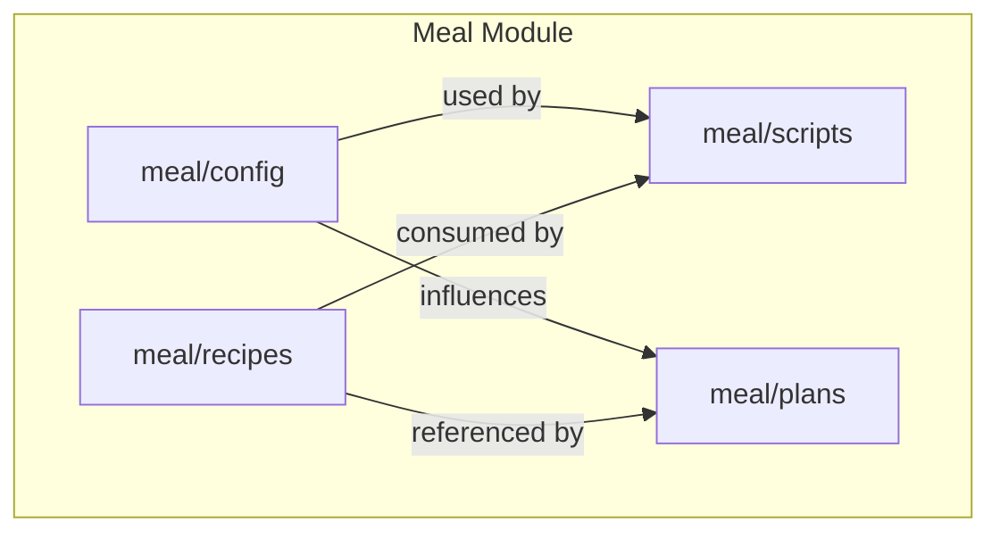
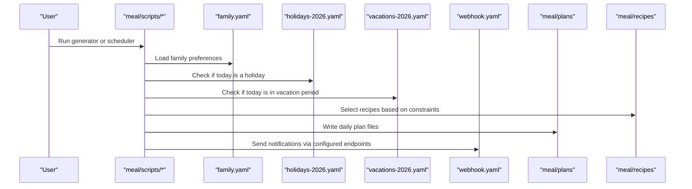
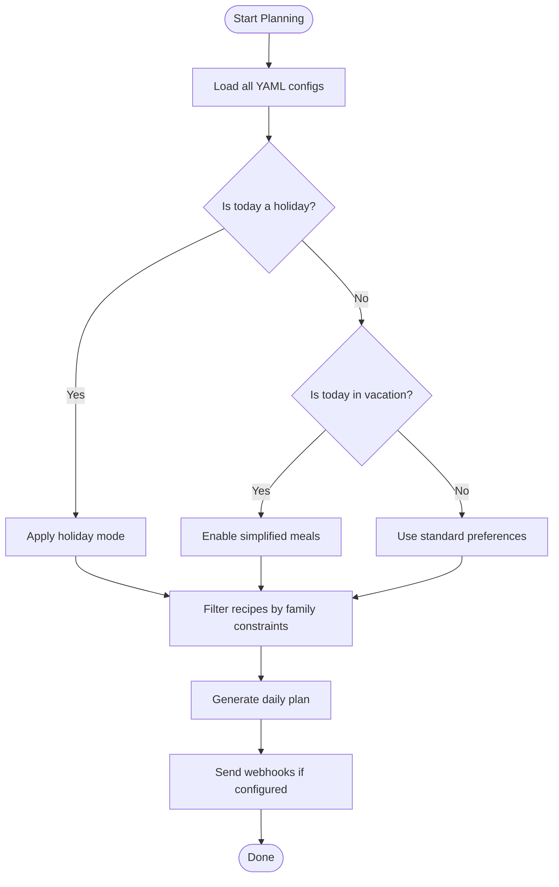
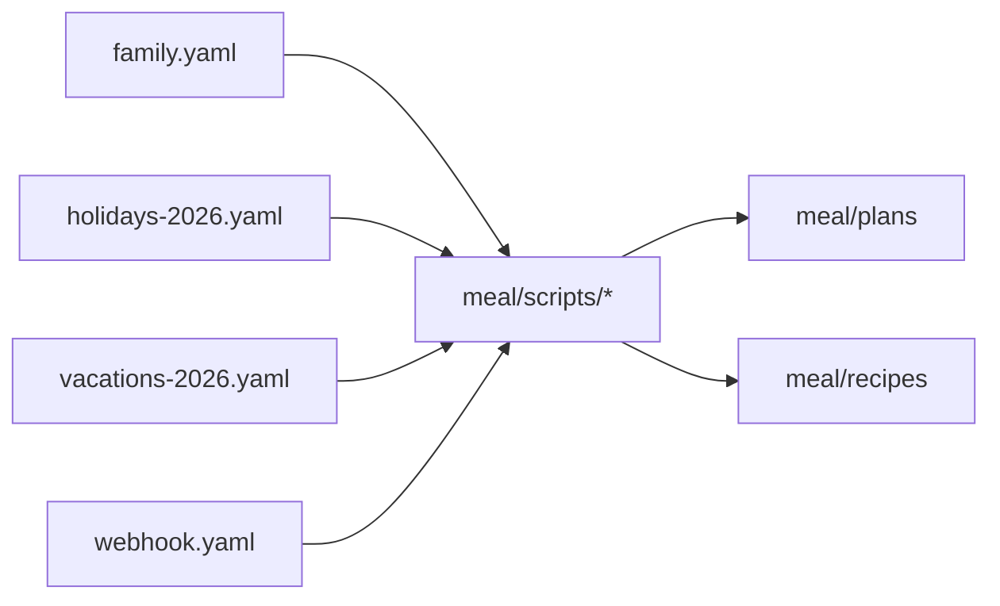

# Configuration and Settings

<cite>
**Referenced Files in This Document**
- [meal/config/family.yaml](file://meal/config/family.yaml)
- [meal/config/holidays-2026.yaml](file://meal/config/holidays-2026.yaml)
- [meal/config/vacations-2026.yaml](file://meal/config/vacations-2026.yaml)
- [meal/config/webhook.yaml](file://meal/config/webhook.yaml)
- [meal/README.md](file://meal/README.md)
- [meal/setup.sh](file://meal/setup.sh)
</cite>

## Table of Contents
1. [Introduction](#introduction)
2. [Project Structure](#project-structure)
3. [Core Components](#core-components)
4. [Architecture Overview](#architecture-overview)
5. [Detailed Component Analysis](#detailed-component-analysis)
6. [Dependency Analysis](#dependency-analysis)
7. [Performance Considerations](#performance-considerations)
8. [Troubleshooting Guide](#troubleshooting-guide)
9. [Conclusion](#conclusion)
10. [Appendices](#appendices)

## Introduction
This document explains the Configuration and Settings management system for meal planning. It covers YAML-based configuration files that define family profiles, dietary restrictions, cooking equipment availability, preference settings, holiday calendar entries, vacation periods, and webhook endpoints. It also provides field specifications, validation rules, customization guidance, best practices, backup strategies, and migration procedures to keep your settings reliable and up-to-date.

## Project Structure
The configuration files are organized under a dedicated directory within the meal module:
- meal/config/family.yaml: Family members, preferences, and constraints
- meal/config/holidays-2026.yaml: Holiday calendar affecting meal planning logic
- meal/config/vacations-2026.yaml: Vacation periods with simplified meal options
- meal/config/webhook.yaml: Webhook endpoints for notifications or integrations

[No sources needed since this diagram shows conceptual structure]

**Section sources**
- [meal/README.md](file://meal/README.md)
- [meal/setup.sh](file://meal/setup.sh)

## Core Components
- Family profile and preferences (family.yaml): Defines household members, dietary restrictions, preferred cuisines, cooking equipment availability, and general preferences used by planning scripts.
- Holiday calendar (holidays-2026.yaml): Declares holidays and special days that alter meal planning behavior (e.g., simpler meals, different schedules).
- Vacation periods (vacations-2026.yaml): Specifies date ranges where simplified meal options apply automatically.
- Webhooks (webhook.yaml): Configures outbound notification endpoints for plan updates or reminders.

These components are consumed by generation and notification scripts to produce daily plans and send alerts.

**Section sources**
- [meal/config/family.yaml](file://meal/config/family.yaml)
- [meal/config/holidays-2026.yaml](file://meal/config/holidays-2026.yaml)
- [meal/config/vacations-2026.yaml](file://meal/config/vacations-2026.yaml)
- [meal/config/webhook.yaml](file://meal/config/webhook.yaml)

## Architecture Overview
The configuration system is declarative: YAML files describe intent, and scripts read them to drive planning and notifications.

**Diagram sources**
- [meal/config/family.yaml](file://meal/config/family.yaml)
- [meal/config/holidays-2026.yaml](file://meal/config/holidays-2026.yaml)
- [meal/config/vacations-2026.yaml](file://meal/config/vacations-2026.yaml)
- [meal/config/webhook.yaml](file://meal/config/webhook.yaml)
- [meal/README.md](file://meal/README.md)

## Detailed Component Analysis

### Family Profile and Preferences (family.yaml)
Purpose:
- Define who eats at home and their dietary needs
- Capture equipment availability to constrain recipe selection
- Store global preferences that influence planning

Key fields (typical structure; adjust to your actual file):
- family_members: list of people
  - name: string (required)
  - allergies: array of strings (optional)
  - dislikes: array of strings (optional)
  - preferred_cuisines: array of strings (optional)
- dietary_restrictions: object or array describing shared constraints (e.g., vegetarian, halal)
- cooking_equipment: object listing available tools (e.g., oven, air_fryer, instant_pot)
- preferences:
  - max_meals_per_day: integer (optional)
  - avoid_repeats_within_days: integer (optional)
  - default_portion_size: string (optional)

Validation rules:
- All names must be non-empty strings
- Arrays should contain unique values to avoid redundant filtering
- Equipment keys should match known identifiers used by recipes
- Numeric fields must be positive integers where applicable

Customization tips:
- Add new family members by appending to the list
- Use allergies and dislikes to exclude incompatible recipes
- Mark only the equipment you actually own to prevent uncookable suggestions

**Section sources**
- [meal/config/family.yaml](file://meal/config/family.yaml)

### Holiday Calendar (holidays-2026.yaml)
Purpose:
- Declare holidays and special days that change meal planning logic (e.g., lighter meals, fewer courses)

Typical fields:
- holidays: list of entries
  - date: ISO date string (YYYY-MM-DD)
  - label: short description (optional)
  - mode: enum indicating planning behavior (e.g., simple, festive, off)
  - notes: free-form text (optional)

Validation rules:
- Dates must be valid ISO dates within the expected year
- Mode values must be from the supported set recognized by scripts
- Duplicate dates should be avoided unless explicitly intended

Adding a new holiday:
- Insert a new entry with a valid date and appropriate mode
- Keep labels concise and consistent across years

**Section sources**
- [meal/config/holidays-2026.yaml](file://meal/config/holidays-2026.yaml)

### Vacation Periods (vacations-2026.yaml)
Purpose:
- Specify date ranges during which simplified meal options are preferred

Typical fields:
- vacations: list of entries
  - start_date: ISO date string
  - end_date: ISO date string
  - reason: optional note (e.g., “summer trip”)
  - simplify_mode: boolean or enum controlling how simplification applies

Validation rules:
- start_date must not be after end_date
- Both dates must be valid ISO dates
- Overlapping ranges are allowed but may require careful review by scripts

Configuring simplified meals:
- Enable simplify_mode to reduce complexity during travel or busy periods
- Combine with holiday entries for predictable behavior on long weekends

**Section sources**
- [meal/config/vacations-2026.yaml](file://meal/config/vacations-2026.yaml)

### Webhook Endpoints (webhook.yaml)
Purpose:
- Configure outbound notifications for plan updates, reminders, or external integrations

Typical fields:
- endpoints: list of webhook definitions
  - name: identifier for the endpoint (required)
  - url: full HTTP(S) URL (required)
  - method: HTTP method (default GET/POST depending on implementation)
  - headers: key-value pairs for authentication or content type (optional)
  - payload_template: reference to template or inline structure (optional)
  - retry_policy: number of retries and backoff strategy (optional)
  - enabled: boolean flag to toggle without deleting (optional)

Validation rules:
- URLs must be well-formed and reachable
- Headers should include any required tokens or API keys securely
- Avoid storing secrets in plain text; prefer environment variables or secret managers when possible

Practical guidance:
- Create separate endpoints per channel (e.g., chat, email)
- Use enabled flags to temporarily disable noisy endpoints during testing

**Section sources**
- [meal/config/webhook.yaml](file://meal/config/webhook.yaml)

### Conceptual Overview
The following flowchart summarizes how configuration affects planning decisions:

[No sources needed since this diagram shows conceptual workflow]

## Dependency Analysis
Configuration files are inputs to scripts that generate plans and send notifications. The relationships are one-way: scripts depend on configuration, not vice versa.

**Diagram sources**
- [meal/config/family.yaml](file://meal/config/family.yaml)
- [meal/config/holidays-2026.yaml](file://meal/config/holidays-2026.yaml)
- [meal/config/vacations-2026.yaml](file://meal/config/vacations-2026.yaml)
- [meal/config/webhook.yaml](file://meal/config/webhook.yaml)
- [meal/README.md](file://meal/README.md)

**Section sources**
- [meal/README.md](file://meal/README.md)

## Performance Considerations
- Keep configuration files small and focused; split by purpose as done here.
- Avoid overly complex filters in family preferences to reduce recipe evaluation overhead.
- Limit webhook payloads and use batching where possible to minimize network calls.
- Cache frequently accessed config data in memory during script runs to avoid repeated parsing.

[No sources needed since this section provides general guidance]

## Troubleshooting Guide
Common issues and resolutions:
- Invalid dates in holidays or vacations: Ensure ISO format and logical ordering (start before end).
- Unknown equipment keys: Align equipment identifiers with those used by recipes.
- Webhook failures: Verify URLs, headers, and network reachability; enable logging to diagnose.
- Unexpected meal modes: Confirm whether a date falls under a holiday or vacation entry.

Operational checks:
- Validate YAML syntax using a linter before committing changes.
- Test configurations against a sample day to confirm expected behavior.
- Review logs generated by scripts for errors related to missing fields or invalid values.

**Section sources**
- [meal/config/family.yaml](file://meal/config/family.yaml)
- [meal/config/holidays-2026.yaml](file://meal/config/holidays-2026.yaml)
- [meal/config/vacations-2026.yaml](file://meal/config/vacations-2026.yaml)
- [meal/config/webhook.yaml](file://meal/config/webhook.yaml)

## Conclusion
The configuration system centers on clear, versioned YAML files that drive meal planning and notifications. By maintaining accurate family profiles, keeping holiday and vacation entries current, and configuring reliable webhooks, you can ensure consistent and personalized meal plans. Follow the validation rules and best practices outlined here to keep your setup robust and easy to maintain.

[No sources needed since this section summarizes without analyzing specific files]

## Appendices

### Field Specifications Summary
- family.yaml
  - family_members[].name: string, required
  - family_members[].allergies: array of strings, optional
  - family_members[].dislikes: array of strings, optional
  - family_members[].preferred_cuisines: array of strings, optional
  - dietary_restrictions: object/array, optional
  - cooking_equipment: object, optional
  - preferences.max_meals_per_day: integer, optional
  - preferences.avoid_repeats_within_days: integer, optional
  - preferences.default_portion_size: string, optional
- holidays-2026.yaml
  - holidays[].date: ISO date, required
  - holidays[].label: string, optional
  - holidays[].mode: enum, required
  - holidays[].notes: string, optional
- vacations-2026.yaml
  - vacations[].start_date: ISO date, required
  - vacations[].end_date: ISO date, required
  - vacations[].reason: string, optional
  - vacations[].simplify_mode: boolean or enum, optional
- webhook.yaml
  - endpoints[].name: string, required
  - endpoints[].url: string, required
  - endpoints[].method: string, optional
  - endpoints[].headers: object, optional
  - endpoints[].payload_template: string/object, optional
  - endpoints[].retry_policy: object, optional
  - endpoints[].enabled: boolean, optional

**Section sources**
- [meal/config/family.yaml](file://meal/config/family.yaml)
- [meal/config/holidays-2026.yaml](file://meal/config/holidays-2026.yaml)
- [meal/config/vacations-2026.yaml](file://meal/config/vacations-2026.yaml)
- [meal/config/webhook.yaml](file://meal/config/webhook.yaml)

### Best Practices
- Version control all configuration changes with descriptive commit messages.
- Prefer additive changes (new entries) over destructive edits when possible.
- Use comments sparingly to explain exceptions or context.
- Keep secrets out of YAML; use environment variables or secret stores.

[No sources needed since this section provides general guidance]

### Backup Strategy
- Regularly snapshot the meal/config directory.
- Include both configuration and generated plans in backups for reproducibility.
- Maintain a rolling archive by year (e.g., holidays-2026.yaml, vacations-2026.yaml).

[No sources needed since this section provides general guidance]

### Migration Procedures
- When updating settings:
  - Back up existing YAML files.
  - Introduce new fields incrementally and validate with tests.
  - Update scripts to handle deprecated fields gracefully.
  - Document breaking changes and provide migration notes.
- For webhook changes:
  - Add new endpoints alongside old ones, then retire gradually.
  - Monitor error rates during transition.

[No sources needed since this section provides general guidance]