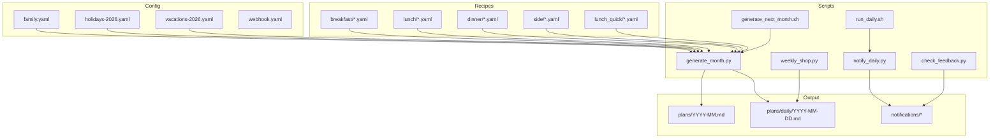
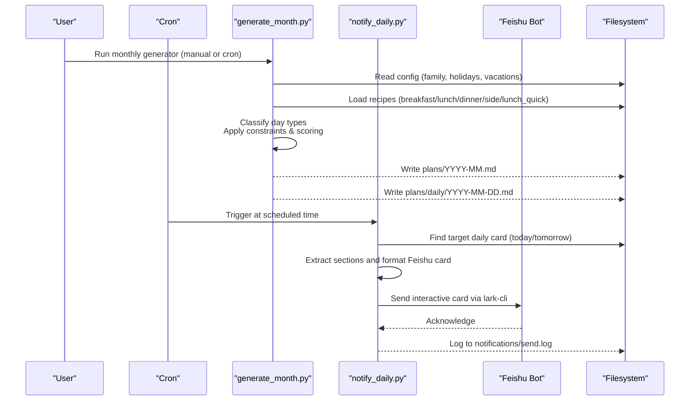
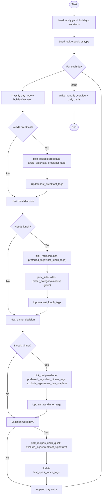
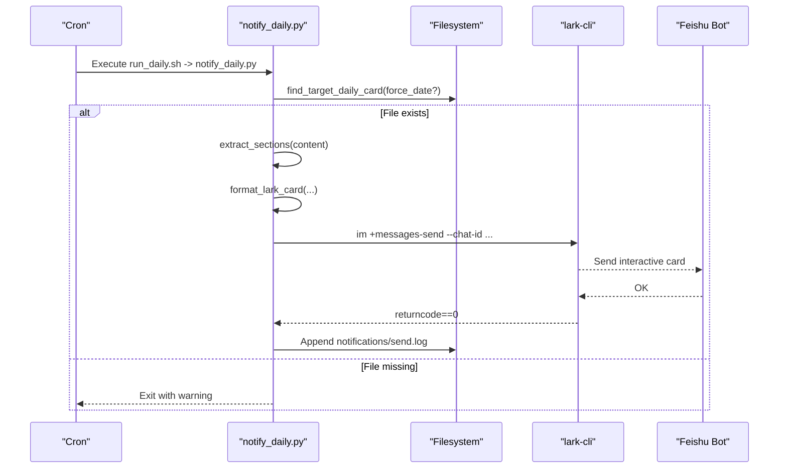
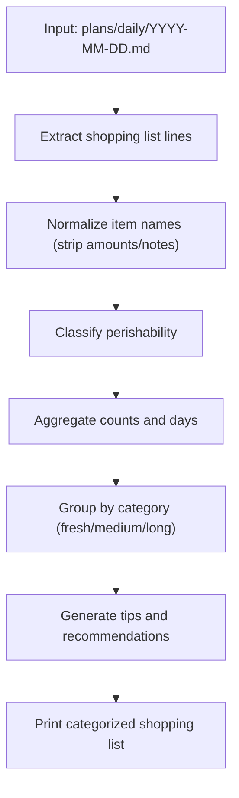
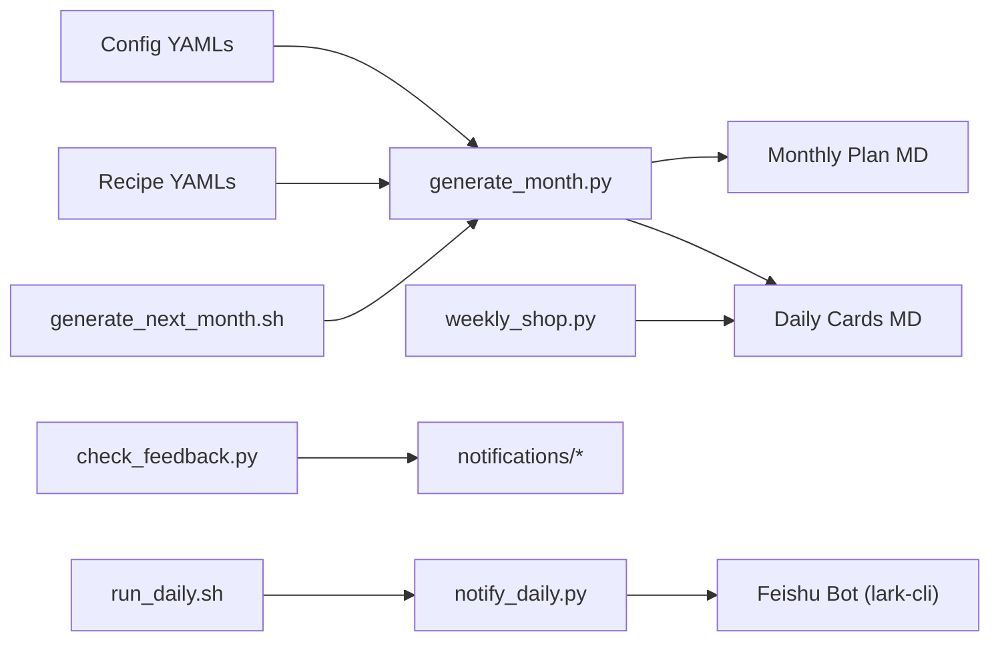

# Family Meal Planning System

<cite>
**Referenced Files in This Document**
- [personal/meal/scripts/generate_month.py](file://personal/meal/scripts/generate_month.py)
- [personal/meal/scripts/notify_daily.py](file://personal/meal/scripts/notify_daily.py)
- [personal/meal/scripts/run_daily.sh](file://personal/meal/scripts/run_daily.sh)
- [personal/meal/scripts/generate_next_month.sh](file://personal/meal/scripts/generate_next_month.sh)
- [personal/meal/scripts/check_feedback.py](file://personal/meal/scripts/check_feedback.py)
- [personal/meal/scripts/weekly_shop.py](file://personal/meal/scripts/weekly_shop.py)
- [personal/meal/setup.sh](file://personal/meal/setup.sh)
- [personal/meal/config/webhook.yaml](file://personal/meal/config/webhook.yaml)
- [personal/meal/config/feishu.yaml](file://personal/meal/config/feishu.yaml)
- [cron/scripts/meal-notify.sh](file://cron/scripts/meal-notify.sh)
- [cron/scripts/meal-generate-month.sh](file://cron/scripts/meal-generate-month.sh)
</cite>

## Update Summary
**Changes Made**
- Updated all file path references from `meal/` to `personal/meal/` throughout the documentation
- Updated cron script paths to reflect the new directory structure
- Updated setup script references and deployment instructions
- Maintained all existing functionality descriptions while correcting path references

## Table of Contents
1. Introduction
2. Project Structure
3. Core Components
4. Architecture Overview
5. Detailed Component Analysis
6. Dependency Analysis
7. Performance Considerations
8. Troubleshooting Guide
9. Conclusion
10. Appendices

## Introduction
This document describes the Family Meal Planning System designed for a family of four (two adults and two young children). The system automatically generates daily meal notifications and monthly plans using constraint-based algorithms. It balances nutrition, respects dietary preferences and cooking constraints, reduces ingredient waste through cross-day reuse, and adapts to holidays and school vacations. Notifications are delivered via Feishu (Lark), and all planning logic is driven by YAML configuration files processed by Python scripts.

Key outcomes:
- Daily Feishu notifications with next-day or same-day menus, prep steps, and shopping lists
- Monthly plan generation with no-repeat rules across meals and days
- Holiday-aware scheduling and vacation-mode quick lunches
- Ingredient optimization and variety maintenance
- Practical guidance for adding recipes, customizing settings, and troubleshooting

## Project Structure
The project is organized into configuration, recipe data, generated plans, automation scripts, and deployment helpers. The system has been reorganized under the `personal/meal/` directory structure.

**Diagram sources**
- [personal/meal/scripts/generate_month.py:1-685](file://personal/meal/scripts/generate_month.py#L1-L685)
- [personal/meal/scripts/notify_daily.py:1-279](file://personal/meal/scripts/notify_daily.py#L1-L279)
- [personal/meal/scripts/run_daily.sh:1-9](file://personal/meal/scripts/run_daily.sh#L1-L9)
- [personal/meal/scripts/generate_next_month.sh:1-19](file://personal/meal/scripts/generate_next_month.sh#L1-L19)
- [personal/meal/scripts/check_feedback.py:1-137](file://personal/meal/scripts/check_feedback.py#L1-L137)
- [personal/meal/scripts/weekly_shop.py:1-328](file://personal/meal/scripts/weekly_shop.py#L1-L328)
- [personal/meal/config/webhook.yaml:1-6](file://personal/meal/config/webhook.yaml#L1-L6)
- [personal/meal/config/feishu.yaml:1-19](file://personal/meal/config/feishu.yaml#L1-L19)

## Core Components
- Configuration layer
  - Family profile, preferences, appliances, and constraints
  - Holidays and workday compensations
  - School vacations for weekday quick lunch mode
  - Webhook URL and send time (for documentation; current notification uses app bot)
  - Feishu integration configuration for data source mapping
- Recipe database
  - Structured YAML per category: breakfast, lunch, dinner, side, lunch_quick
  - Fields include title, type, difficulty, total_time, servings, tools, tags, ingredient_tags, ingredients, night_prep, morning_steps, noon_steps, steps, notes
- Planning engine
  - Constraint-based selection with anti-repetition, cross-meal signature deduplication, ingredient clustering, and month rotation
  - Day-type classification (workday, weekend, holiday) and vacation-aware quick lunch insertion
- Output layer
  - Monthly overview Markdown
  - Daily cards with full details and shopping list
  - Feishu card messages and logs
- Automation and operations
  - Cron-driven daily notification and month-end plan generation
  - Feedback polling and weekly shopping planner

**Section sources**
- [personal/meal/config/webhook.yaml:1-6](file://personal/meal/config/webhook.yaml#L1-L6)
- [personal/meal/config/feishu.yaml:1-19](file://personal/meal/config/feishu.yaml#L1-L19)
- [personal/meal/scripts/generate_month.py:1-685](file://personal/meal/scripts/generate_month.py#L1-L685)
- [personal/meal/scripts/notify_daily.py:1-279](file://personal/meal/scripts/notify_daily.py#L1-L279)
- [personal/meal/scripts/run_daily.sh:1-9](file://personal/meal/scripts/run_daily.sh#L1-L9)
- [personal/meal/scripts/generate_next_month.sh:1-19](file://personal/meal/scripts/generate_next_month.sh#L1-L19)
- [personal/meal/scripts/check_feedback.py:1-137](file://personal/meal/scripts/check_feedback.py#L1-L137)
- [personal/meal/scripts/weekly_shop.py:1-328](file://personal/meal/scripts/weekly_shop.py#L1-L328)

## Architecture Overview
End-to-end flow from configuration and recipes to outputs and notifications.

**Diagram sources**
- [personal/meal/scripts/generate_month.py:1-685](file://personal/meal/scripts/generate_month.py#L1-L685)
- [personal/meal/scripts/notify_daily.py:1-279](file://personal/meal/scripts/notify_daily.py#L1-L279)
- [personal/meal/scripts/run_daily.sh:1-9](file://personal/meal/scripts/run_daily.sh#L1-L9)
- [personal/meal/scripts/generate_next_month.sh:1-19](file://personal/meal/scripts/generate_next_month.sh#L1-L19)

## Detailed Component Analysis

### Planning Engine (generate_month.py)
Responsibilities:
- Load YAML configs and recipe pools
- Classify each date as workday, weekend, or holiday; detect vacation periods
- Select meals under constraints:
  - No repeat within a month per meal type
  - Cross-meal signature deduplication to avoid same staple across breakfast/lunch/dinner
  - Ingredient clustering to reduce waste (prefer shared ingredient_tags)
  - Anti-clustering for breakfast to ensure variety
  - Month rotation to avoid identical sequences across months
- Generate monthly overview and daily cards with shopping lists

Algorithm highlights:
- pick_recipes: filters by used titles and signatures, applies preferred/avoided tags, falls back to index cycling
- pick_side: selects side dishes with category preference and tag matching
- generate_month_plan: orchestrates day-by-day selection and writes outputs

**Diagram sources**
- [personal/meal/scripts/generate_month.py:1-685](file://personal/meal/scripts/generate_month.py#L1-L685)

**Section sources**
- [personal/meal/scripts/generate_month.py:1-685](file://personal/meal/scripts/generate_month.py#L1-L685)

### Notification Flow (notify_daily.py)
Responsibilities:
- Determine target date based on Beijing time and optional --date flag
- Locate the corresponding daily card
- Parse sections and build a Feishu interactive card
- Send via lark-cli to a DM chat ID
- Log success/failure

**Diagram sources**
- [personal/meal/scripts/notify_daily.py:1-279](file://personal/meal/scripts/notify_daily.py#L1-L279)
- [personal/meal/scripts/run_daily.sh:1-9](file://personal/meal/scripts/run_daily.sh#L1-L9)

**Section sources**
- [personal/meal/scripts/notify_daily.py:1-279](file://personal/meal/scripts/notify_daily.py#L1-L279)
- [personal/meal/scripts/run_daily.sh:1-9](file://personal/meal/scripts/run_daily.sh#L1-L9)

### Weekly Shopping Planner (weekly_shop.py)
Responsibilities:
- Aggregate ingredients from daily cards for a given week
- Classify perishability (short/medium/long shelf life)
- Provide tips for single-use fresh items and shared ingredients
- Produce categorized supermarket-style lists

**Diagram sources**
- [personal/meal/scripts/weekly_shop.py:1-328](file://personal/meal/scripts/weekly_shop.py#L1-L328)

**Section sources**
- [personal/meal/scripts/weekly_shop.py:1-328](file://personal/meal/scripts/weekly_shop.py#L1-L328)

### Feedback Poller (check_feedback.py)
Responsibilities:
- Query recent messages from a Feishu group using lark-cli
- Detect feedback keywords related to taste, portion size, repetition, etc.
- Persist findings to notifications/feedback.md

**Section sources**
- [personal/meal/scripts/check_feedback.py:1-137](file://personal/meal/scripts/check_feedback.py#L1-L137)

### Deployment and Scheduling
- setup.sh installs PyYAML if missing, verifies lark-cli presence, installs crontab entries, and starts cron daemon when available
- run_daily.sh ensures dependencies and invokes notify_daily.py
- generate_next_month.sh runs on the last day of the month to generate next month's plan

**Updated** Path references updated to reflect the new `personal/meal/` directory structure

**Section sources**
- [personal/meal/setup.sh:1-84](file://personal/meal/setup.sh#L1-L84)
- [personal/meal/scripts/run_daily.sh:1-9](file://personal/meal/scripts/run_daily.sh#L1-L9)
- [personal/meal/scripts/generate_next_month.sh:1-19](file://personal/meal/scripts/generate_next_month.sh#L1-L19)
- [cron/scripts/meal-notify.sh:1-5](file://cron/scripts/meal-notify.sh#L1-L5)
- [cron/scripts/meal-generate-month.sh:1-5](file://cron/scripts/meal-generate-month.sh#L1-L5)

## Dependency Analysis
High-level dependency relationships among components.

**Diagram sources**
- [personal/meal/scripts/generate_month.py:1-685](file://personal/meal/scripts/generate_month.py#L1-L685)
- [personal/meal/scripts/notify_daily.py:1-279](file://personal/meal/scripts/notify_daily.py#L1-L279)
- [personal/meal/scripts/run_daily.sh:1-9](file://personal/meal/scripts/run_daily.sh#L1-L9)
- [personal/meal/scripts/generate_next_month.sh:1-19](file://personal/meal/scripts/generate_next_month.sh#L1-L19)
- [personal/meal/scripts/check_feedback.py:1-137](file://personal/meal/scripts/check_feedback.py#L1-L137)
- [personal/meal/scripts/weekly_shop.py:1-328](file://personal/meal/scripts/weekly_shop.py#L1-L328)

**Section sources**
- [personal/meal/scripts/generate_month.py:1-685](file://personal/meal/scripts/generate_month.py#L1-L685)
- [personal/meal/scripts/notify_daily.py:1-279](file://personal/meal/scripts/notify_daily.py#L1-L279)

## Performance Considerations
- Deterministic selection with index cycling prevents starvation and avoids expensive recomputation
- Ingredient tag matching is O(n) per pool; typical pools are small (<100), so performance is negligible
- Month rotation ensures varied sequences without additional computation
- File I/O dominates runtime; batch write of daily cards is efficient
- Avoid excessive logging in hot paths; keep cron logs concise

## Troubleshooting Guide
Common issues and resolutions:
- Missing PyYAML after Pod restart
  - Re-run setup.sh to install dependencies and restore cron jobs
- Feishu notification fails
  - Ensure lark-cli is installed and authorized; verify chat ID and message JSON; check notifications/send.log
- No daily card found
  - Run generate_month.py for the relevant month first; confirm plans/daily/YYYY-MM-DD.md exists
- Repetitive meals or lack of variety
  - Expand recipe pools; add ingredient_tags to improve clustering; adjust family preferences (e.g., kid_friendly, taste_priority)
- Ingredient waste
  - Use ingredient_economy.cross_day_reuse; leverage weekly_shop.py to identify single-use fresh items and consolidate purchases
- Vacation mode not triggering
  - Verify vacations-2026.yaml ranges and that generate_month.py loads them; ensure lunch_quick recipes exist
- **Updated** Cron job path errors
  - Ensure cron scripts reference the correct `personal/meal/` directory paths instead of the old `meal/` paths
  - Check that `cron/scripts/meal-notify.sh` and `cron/scripts/meal-generate-month.sh` have been updated with new paths

**Section sources**
- [personal/meal/setup.sh:1-84](file://personal/meal/setup.sh#L1-L84)
- [personal/meal/scripts/notify_daily.py:1-279](file://personal/meal/scripts/notify_daily.py#L1-L279)
- [personal/meal/scripts/generate_month.py:1-685](file://personal/meal/scripts/generate_month.py#L1-L685)
- [personal/meal/scripts/weekly_shop.py:1-328](file://personal/meal/scripts/weekly_shop.py#L1-L328)
- [cron/scripts/meal-notify.sh:1-5](file://cron/scripts/meal-notify.sh#L1-L5)
- [cron/scripts/meal-generate-month.sh:1-5](file://cron/scripts/meal-generate-month.sh#L1-L5)

## Conclusion
The Family Meal Planning System combines structured YAML configurations, a robust constraint-based planner, and automated Feishu notifications to deliver practical, nutritious, and varied meal plans for a family of four. Its design emphasizes ingredient efficiency, holiday awareness, and ease of customization, while providing operational resilience through setup and cron automation. The system has been successfully reorganized under the `personal/meal/` directory structure while maintaining all existing functionality.

## Appendices

### Data Model: Recipe YAML Schema
Core fields used across categories:
- title: string
- type: enum {breakfast, lunch, dinner, side, lunch_quick}
- difficulty: string
- total_time: string
- servings: integer
- tools: array of strings
- series: string (optional)
- tags: array of strings
- ingredient_tags: array of strings
- ingredients: map of section to list of items
  - name: string
  - amount: string
  - note: string (optional)
  - optional: boolean (optional)
- night_prep: array of strings (optional)
- morning_steps: array of strings (optional, breakfast)
- noon_steps: array of strings (optional, lunch_quick)
- steps: array of step objects or strings (optional, main courses)
  - step: string
  - tool: string (optional)
- notes: string (optional)

### Configuration Options Reference
- webhook.yaml
  - url, send_time (documented; current implementation uses lark-cli DM)
- feishu.yaml
  - root_folder, recipe_base configuration for Feishu Base integration
  - folders mapping for different data categories

Practical examples:
- Add a new breakfast recipe: create a YAML under recipes/breakfast following the schema; ensure ingredient_tags and tools are set
- Modify family preferences: edit family.yaml to reflect new tastes, appliance availability, or child-friendly priorities
- Customize meal generation rules: adjust breakfast components_required, holiday_meal dish counts, or enable/disable vacation_quick_lunch

**Section sources**
- [personal/meal/config/webhook.yaml:1-6](file://personal/meal/config/webhook.yaml#L1-L6)
- [personal/meal/config/feishu.yaml:1-19](file://personal/meal/config/feishu.yaml#L1-L19)

### Output Artifacts
- Monthly overview: plans/YYYY-MM.md
- Daily cards: plans/daily/YYYY-MM-DD.md (includes prep steps, ingredients, and shopping list)
- Logs: notifications/send.log, notifications/cron.log, notifications/feedback.md

### Directory Structure Reference
The system is now organized under `personal/meal/` with the following key directories:
- `config/`: YAML configuration files for webhooks and Feishu integration
- `scripts/`: Python and shell scripts for meal planning and notifications
- `recipes/`: Recipe YAML files organized by meal type
- `plans/`: Generated monthly and daily meal plans
- `notifications/`: Log files and feedback data

**Section sources**
- [personal/meal/config/webhook.yaml:1-6](file://personal/meal/config/webhook.yaml#L1-L6)
- [personal/meal/config/feishu.yaml:1-19](file://personal/meal/config/feishu.yaml#L1-L19)
- [cron/scripts/meal-notify.sh:1-5](file://cron/scripts/meal-notify.sh#L1-L5)
- [cron/scripts/meal-generate-month.sh:1-5](file://cron/scripts/meal-generate-month.sh#L1-L5)