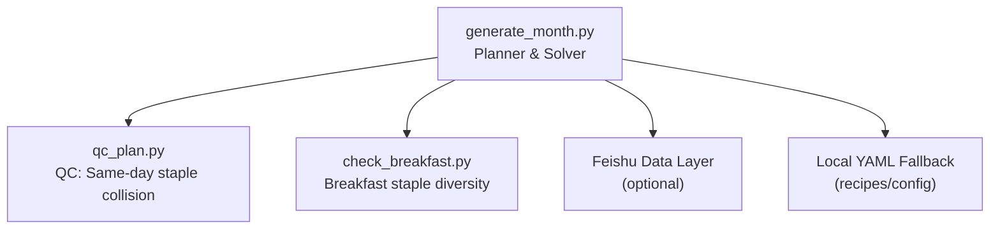
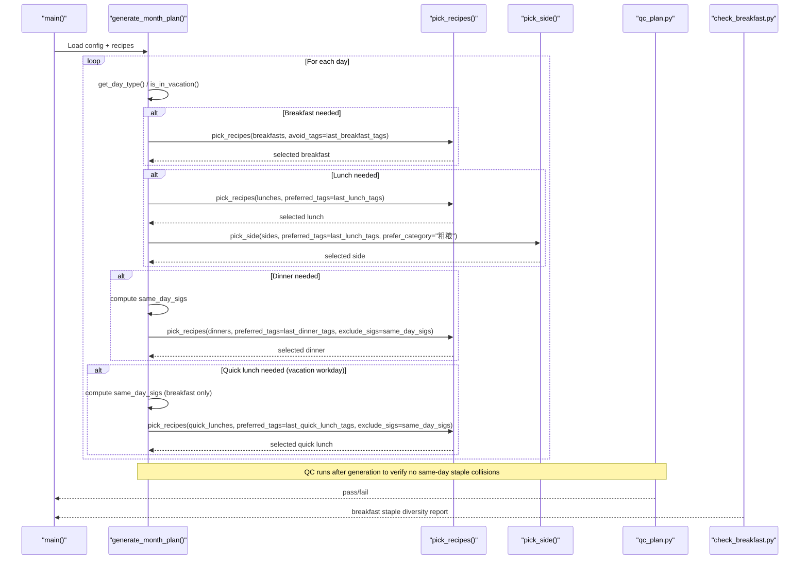
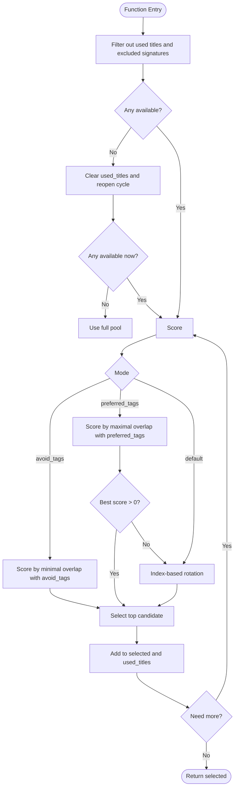
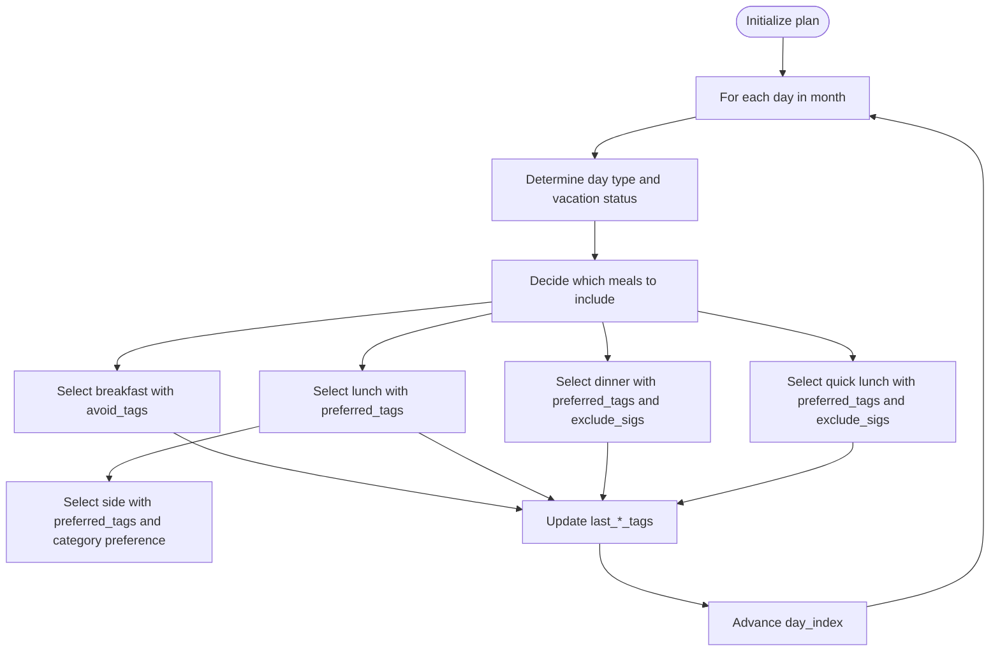
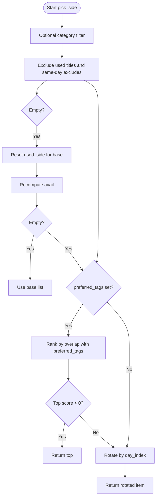
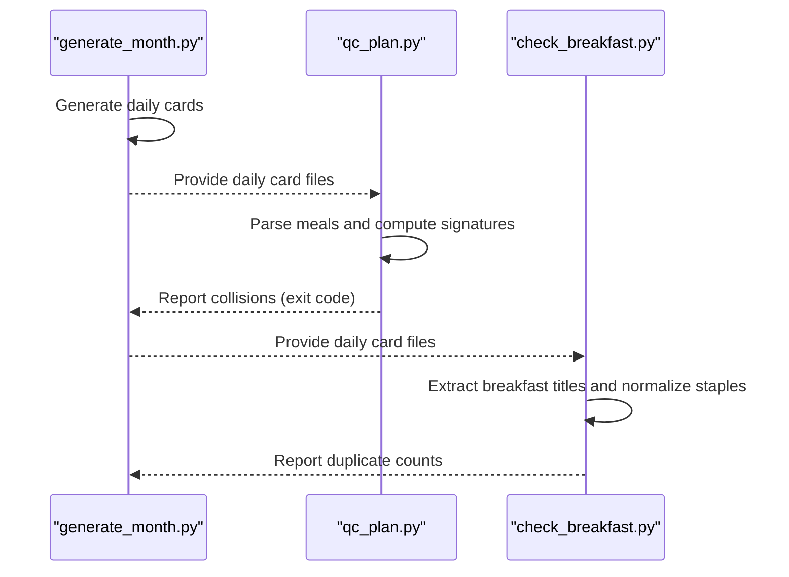
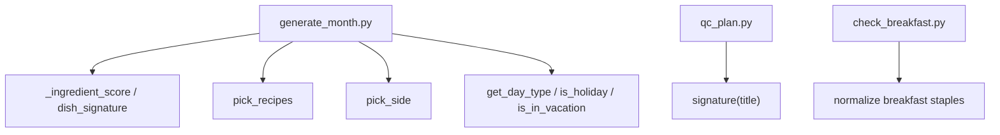

# Constraint Satisfaction Engine

<cite>
**Referenced Files in This Document**
- [generate_month.py](file://personal/meal/scripts/generate_month.py)
- [check_breakfast.py](file://personal/meal/scripts/check_breakfast.py)
- [qc_plan.py](file://personal/meal/scripts/qc_plan.py)
</cite>

## Table of Contents
1. [Introduction](#introduction)
2. [Project Structure](#project-structure)
3. [Core Components](#core-components)
4. [Architecture Overview](#architecture-overview)
5. [Detailed Component Analysis](#detailed-component-analysis)
6. [Dependency Analysis](#dependency-analysis)
7. [Performance Considerations](#performance-considerations)
8. [Troubleshooting Guide](#troubleshooting-guide)
9. [Conclusion](#conclusion)

## Introduction
This document explains the constraint satisfaction engine that drives the meal generation algorithm. It focuses on how the system balances multiple competing constraints:
- Nutritional balance across meals (e.g., lunch as “hearty,” dinner as “light”)
- Cooking time and preparation windows (night prep, morning steps, quick lunch)
- Ingredient availability and waste reduction via clustering/anti-clustering
- Family preferences through ingredient tags and variety requirements
- Hard constraints such as same-day dish signature exclusion to avoid repeating the same staple across meals

The engine uses a deterministic scoring and selection pipeline with a strict constraint hierarchy:
1) Same-day dish signature exclusion (highest priority)
2) Ingredient clustering/anti-clustering logic
3) Index-based rotation for variety

It also includes quality control tools to validate outputs and ensure diversity.

## Project Structure
The constraint satisfaction engine is implemented in Python scripts under personal/meal/scripts/. The key files are:
- generate_month.py: Core planner and constraint solver
- qc_plan.py: Quality control checker for same-day cross-meal staple collisions
- check_breakfast.py: Breakfast diversity analyzer focusing on staple components

**Diagram sources**
- [generate_month.py:1-685](file://personal/meal/scripts/generate_month.py#L1-L685)
- [qc_plan.py:1-88](file://personal/meal/scripts/qc_plan.py#L1-L88)
- [check_breakfast.py:1-57](file://personal/meal/scripts/check_breakfast.py#L1-L57)

**Section sources**
- [generate_month.py:1-685](file://personal/meal/scripts/generate_month.py#L1-L685)
- [qc_plan.py:1-88](file://personal/meal/scripts/qc_plan.py#L1-L88)
- [check_breakfast.py:1-57](file://personal/meal/scripts/check_breakfast.py#L1-L57)

## Core Components
- Recipe pools by category: breakfast, lunch (hard dishes), dinner (light meals), side (extra dishes), lunch_quick (quick lunches during vacations).
- Day-type logic: workday, weekend, holiday; vacation mode adds quick lunch on workdays.
- Scoring functions:
  - _ingredient_score(recipe, preferred_tags): overlap count between recipe’s ingredient_tags and provided tags.
  - dish_signature(title): extracts the staple name from title to enforce same-day uniqueness.
- Selection function: pick_recipes(recipes_pool, count, used_titles, day_index, preferred_tags=None, avoid_tags=None, exclude_sigs=None) implements the constraint hierarchy.
- Side selection: pick_side(sides, used_side, day_index, preferred_tags=None, exclude_titles=None, prefer_category=None) supports extra dishes with category preference and reuse avoidance.
- Monthly planning loop: generate_month_plan(year, month, recipes, holidays, vacations) orchestrates daily decisions, including index rotation and month seeding.

Key behaviors:
- Highest priority: exclude_sigs prevents same-day staple repetition across meals.
- Secondary: preferred_tags encourages ingredient clustering (reduce waste); avoid_tags promotes anti-clustering (breakfast diversity).
- Tertiary: index-based rotation ensures variety when scores do not differentiate.

**Section sources**
- [generate_month.py:114-184](file://personal/meal/scripts/generate_month.py#L114-L184)
- [generate_month.py:187-216](file://personal/meal/scripts/generate_month.py#L187-L216)
- [generate_month.py:218-342](file://personal/meal/scripts/generate_month.py#L218-L342)

## Architecture Overview
The monthly planner iterates over each calendar day, determines meal needs based on day type and vacation status, then selects dishes using the constraint hierarchy.

**Diagram sources**
- [generate_month.py:218-342](file://personal/meal/scripts/generate_month.py#L218-L342)
- [qc_plan.py:24-83](file://personal/meal/scripts/qc_plan.py#L24-L83)
- [check_breakfast.py:15-56](file://personal/meal/scripts/check_breakfast.py#L15-L56)

## Detailed Component Analysis

### Constraint Hierarchy and Selection Logic
The core selection function applies constraints in order:
1) Hard filter: remove titles already used today and dishes whose staple signature appears elsewhere today.
2) Soft scoring:
   - If avoid_tags is set (breakfast), rank by minimal overlap with yesterday’s tags (anti-clustering).
   - Else if preferred_tags is set and pool has enough candidates, rank by maximal overlap (clustering).
   - Else fallback to index-based rotation.
3) Cycle reset: if the pool is exhausted, clear used_titles to allow re-entry into the cycle while still respecting same-day signatures.

**Diagram sources**
- [generate_month.py:135-184](file://personal/meal/scripts/generate_month.py#L135-L184)

**Section sources**
- [generate_month.py:135-184](file://personal/meal/scripts/generate_month.py#L135-L184)

### Scoring Functions and Mathematical Models
- Ingredient overlap score:
  - Input: recipe.ingredient_tags (set), preferred_tags or avoid_tags (set)
  - Output: integer overlap count = |recipe.ingredient_tags ∩ preferred_tags|
  - Complexity: O(k) where k is number of tags per recipe
- Dish signature extraction:
  - Input: title string
  - Output: staple name before first “+” and before any parentheses
  - Purpose: hard constraint enforcement for same-day staple uniqueness

These functions are lightweight and deterministic, enabling fast evaluation across large pools.

**Section sources**
- [generate_month.py:114-133](file://personal/meal/scripts/generate_month.py#L114-L133)

### Daily Planning Loop and Day-Type Logic
- Day types: workday, weekend, holiday; special handling for compensation workdays and school vacations.
- Meal composition:
  - Breakfast: always included; anti-clustering against previous day’s tags.
  - Lunch: “hard dishes” pool; clustering with previous lunch tags; add one side dish (prefer “粗粮” category).
  - Dinner: “light meals” pool; clustering with previous dinner tags; enforce same-day staple exclusion vs breakfast/lunch.
  - Quick lunch: added on vacation workdays; same-day staple exclusion vs breakfast; clustering with previous quick lunch tags.
- Month seeding: rotate each pool by a month-dependent seed to avoid identical sequences across months.

**Diagram sources**
- [generate_month.py:96-112](file://personal/meal/scripts/generate_month.py#L96-L112)
- [generate_month.py:218-342](file://personal/meal/scripts/generate_month.py#L218-L342)

**Section sources**
- [generate_month.py:96-112](file://personal/meal/scripts/generate_month.py#L96-L112)
- [generate_month.py:218-342](file://personal/meal/scripts/generate_month.py#L218-L342)

### Side Dish Selection
- Category filtering: optionally restrict to a specific category (e.g., “粗粮”).
- Reuse avoidance: exclude titles already used this cycle; reset per category when exhausted.
- Clustering: prefer sides sharing ingredients with the main meal.

**Diagram sources**
- [generate_month.py:187-216](file://personal/meal/scripts/generate_month.py#L187-L216)

**Section sources**
- [generate_month.py:187-216](file://personal/meal/scripts/generate_month.py#L187-L216)

### Quality Control and Diversity Checks
- qc_plan.py: Parses daily cards and verifies that the same-day staple signature does not repeat across meals. Exits non-zero on violations.
- check_breakfast.py: Analyzes breakfast staples by stripping drink/egg components and reports duplicates within a month.

**Diagram sources**
- [qc_plan.py:24-83](file://personal/meal/scripts/qc_plan.py#L24-L83)
- [check_breakfast.py:15-56](file://personal/meal/scripts/check_breakfast.py#L15-L56)

**Section sources**
- [qc_plan.py:1-88](file://personal/meal/scripts/qc_plan.py#L1-L88)
- [check_breakfast.py:1-57](file://personal/meal/scripts/check_breakfast.py#L1-L57)

### Practical Examples and Scenarios
- Ensuring breakfast diversity while minimizing ingredient overlap with previous days:
  - The engine sets avoid_tags to the previous day’s breakfast tags, ranking candidates by minimal overlap. This reduces consecutive-day ingredient clustering and improves taste variety.
- Preventing same-day staple collisions:
  - Before selecting dinner (and quick lunch), the engine computes same_day_sigs from breakfast and lunch titles and excludes those staples from the dinner pool. This enforces the highest-priority constraint.
- Reducing food waste via clustering:
  - For lunch and dinner, preferred_tags are derived from the previous meal’s tags, encouraging shared ingredients across meals and reducing leftovers.
- Vacation workday quick lunch:
  - On school vacation workdays, a quick lunch is added with its own tag memory and same-day staple exclusion relative to breakfast.

[No sources needed since this section synthesizes behavior without quoting specific lines]

## Dependency Analysis
- Internal dependencies:
  - generate_month.py depends on helper functions for scoring, signature extraction, and selection.
  - qc_plan.py and check_breakfast.py depend on generated daily cards and parse them to validate constraints.
- External dependencies:
  - Optional Feishu data layer for loading recipes and configs; falls back to local YAML when unavailable.

**Diagram sources**
- [generate_month.py:114-184](file://personal/meal/scripts/generate_month.py#L114-L184)
- [qc_plan.py:24-36](file://personal/meal/scripts/qc_plan.py#L24-L36)
- [check_breakfast.py:15-24](file://personal/meal/scripts/check_breakfast.py#L15-L24)

**Section sources**
- [generate_month.py:1-685](file://personal/meal/scripts/generate_month.py#L1-685)
- [qc_plan.py:1-88](file://personal/meal/scripts/qc_plan.py#L1-L88)
- [check_breakfast.py:1-57](file://personal/meal/scripts/check_breakfast.py#L1-L57)

## Performance Considerations
- Time complexity:
  - Scoring per recipe is linear in the number of tags; selection sorts candidates once per meal slot per day.
  - With moderate pool sizes (dozens of recipes), performance is dominated by I/O and formatting rather than computation.
- Determinism and stability:
  - Index-based rotation and month seeding provide stable, reproducible plans.
- Scalability:
  - Adding new categories or constraints can be integrated by extending pick_recipes/pick_side and adjusting scoring parameters.

[No sources needed since this section provides general guidance]

## Troubleshooting Guide
- Same-day staple collision detected:
  - Run qc_plan.py to identify exact dates and meals involved. Adjust exclude_sigs usage or review pool composition.
- Breakfast lacks variety:
  - Use check_breakfast.py to analyze staple duplication patterns. Tune avoid_tags scope or expand breakfast pool.
- Unexpected repeats across months:
  - Verify month seeding and rotation logic; ensure pools are sufficiently diverse and month_seed differs.

**Section sources**
- [qc_plan.py:58-83](file://personal/meal/scripts/qc_plan.py#L58-L83)
- [check_breakfast.py:26-56](file://personal/meal/scripts/check_breakfast.py#L26-L56)

## Conclusion
The constraint satisfaction engine combines hard exclusions, soft scoring, and deterministic rotation to produce balanced, varied, and practical meal plans. Its design prioritizes same-day staple uniqueness, leverages ingredient tagging for both clustering and anti-clustering, and maintains variety through index-based cycling. Quality control tools complement the planner by validating outputs and highlighting areas for improvement.