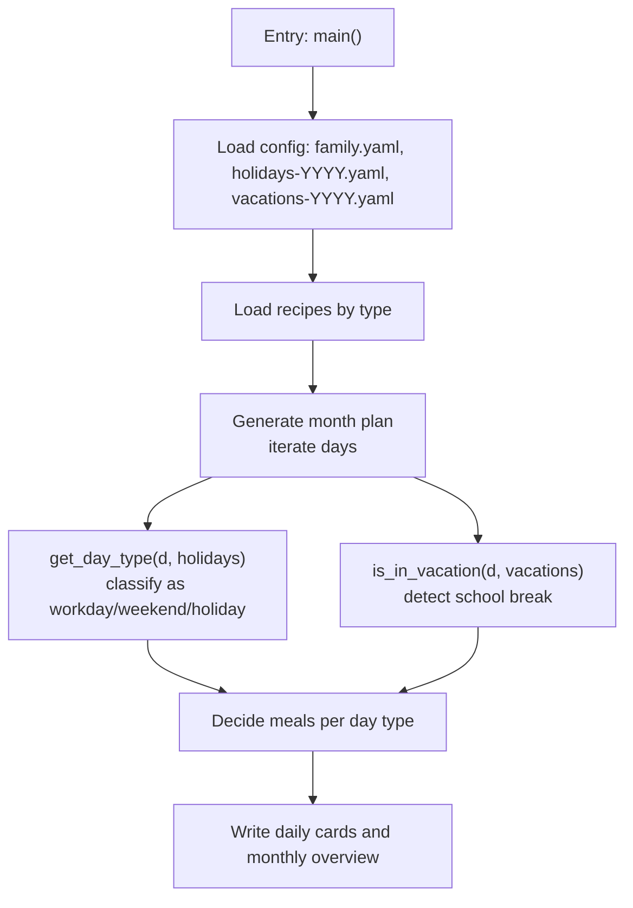
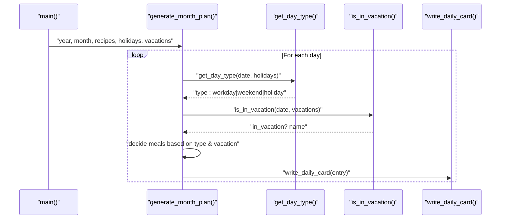
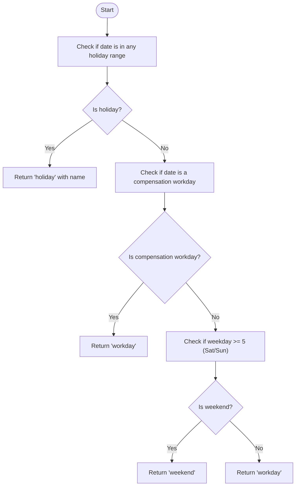
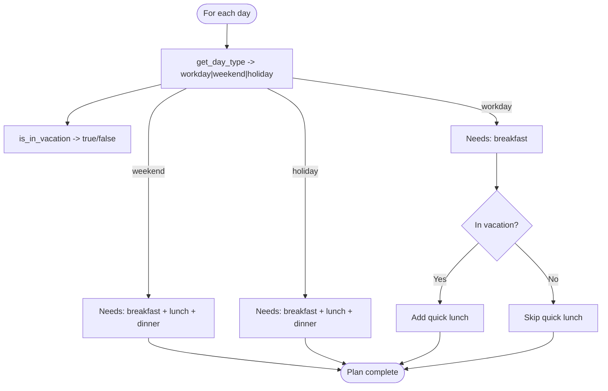
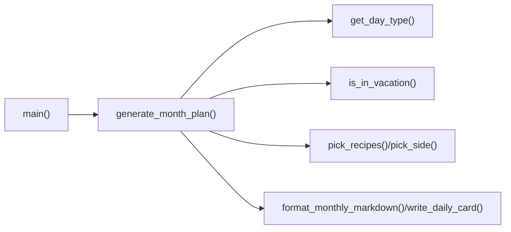

# Holiday and Vacation Handling

<cite>
**Referenced Files in This Document**
- [generate_month.py](file://personal/meal/scripts/generate_month.py)
</cite>

## Table of Contents
1. [Introduction](#introduction)
2. [Project Structure](#project-structure)
3. [Core Components](#core-components)
4. [Architecture Overview](#architecture-overview)
5. [Detailed Component Analysis](#detailed-component-analysis)
6. [Dependency Analysis](#dependency-analysis)
7. [Performance Considerations](#performance-considerations)
8. [Troubleshooting Guide](#troubleshooting-guide)
9. [Conclusion](#conclusion)

## Introduction
This document explains how the meal planning system adapts to holidays, compensation workdays (调休上班日), weekends, and school vacations. It focuses on the date classification logic that drives meal complexity and timing, including quick lunch options during school breaks when children are home. Practical examples illustrate how plans differ across day types, and configuration structures for holidays and vacations are described. Edge cases such as consecutive holidays and overlapping vacation periods are addressed.

## Project Structure
The holiday and vacation handling is implemented within the monthly plan generator script. The key entry point loads family and calendar configurations, classifies each date, and generates daily cards with appropriate meals based on the day type and vacation status.

**Diagram sources**
- [generate_month.py:616-685](file://personal/meal/scripts/generate_month.py#L616-L685)
- [generate_month.py:218-342](file://personal/meal/scripts/generate_month.py#L218-L342)
- [generate_month.py:96-111](file://personal/meal/scripts/generate_month.py#L96-L111)
- [generate_month.py:86-93](file://personal/meal/scripts/generate_month.py#L86-L93)

**Section sources**
- [generate_month.py:616-685](file://personal/meal/scripts/generate_month.py#L616-L685)

## Core Components
- Date classification: get_day_type determines whether a date is a workday, weekend, or holiday. It also recognizes compensation workdays (调休上班日).
- Holiday detection: is_holiday checks if a date falls within any configured holiday range.
- Compensation workday detection: is_workday_compensation checks if a date is listed as a make-up workday under holidays.
- Vacation detection: is_in_vacation checks if a date falls within any configured vacation period (e.g., winter/summer breaks).
- Meal selection logic: generate_month_plan uses day type and vacation status to decide which meals to include and their complexity.

Key behaviors:
- Workday: breakfast only; no full lunch/dinner. If in vacation, add a quick lunch option.
- Weekend/Holiday: breakfast + full lunch + dinner. No quick lunch.
- Quick lunch: simplified weekday-style lunch suitable for 2 people, prepared quickly when children are home during school breaks.

**Section sources**
- [generate_month.py:96-111](file://personal/meal/scripts/generate_month.py#L96-L111)
- [generate_month.py:67-74](file://personal/meal/scripts/generate_month.py#L67-L74)
- [generate_month.py:77-83](file://personal/meal/scripts/generate_month.py#L77-L83)
- [generate_month.py:86-93](file://personal/meal/scripts/generate_month.py#L86-L93)
- [generate_month.py:218-342](file://personal/meal/scripts/generate_month.py#L218-L342)

## Architecture Overview
The system’s control flow centers on iterating through each day of the target month, classifying it, and generating meals accordingly.

**Diagram sources**
- [generate_month.py:616-685](file://personal/meal/scripts/generate_month.py#L616-L685)
- [generate_month.py:218-342](file://personal/meal/scripts/generate_month.py#L218-L342)
- [generate_month.py:96-111](file://personal/meal/scripts/generate_month.py#L96-L111)
- [generate_month.py:86-93](file://personal/meal/scripts/generate_month.py#L86-L93)

## Detailed Component Analysis

### Date Classification: get_day_type
Purpose:
- Classify a given date into one of three categories: workday, weekend, or holiday.
- Recognize compensation workdays (调休上班日) so that a weekend becomes a workday when required.

Logic:
1. Check if the date is within any holiday range. If yes, return holiday with the holiday name.
2. Check if the date is a compensation workday (listed under holidays.workdays). If yes, return workday.
3. Check if the date is Saturday or Sunday. If yes, return weekend.
4. Otherwise, return workday.

**Diagram sources**
- [generate_month.py:96-111](file://personal/meal/scripts/generate_month.py#L96-L111)
- [generate_month.py:67-74](file://personal/meal/scripts/generate_month.py#L67-L74)
- [generate_month.py:77-83](file://personal/meal/scripts/generate_month.py#L77-L83)

Practical implications:
- Holidays override weekends and normal schedules.
- Compensation workdays force a workday schedule even on Saturdays/Sundays.
- Regular weekdays default to workday unless overridden by holidays or compensation rules.

**Section sources**
- [generate_month.py:96-111](file://personal/meal/scripts/generate_month.py#L96-L111)
- [generate_month.py:67-74](file://personal/meal/scripts/generate_month.py#L67-L74)
- [generate_month.py:77-83](file://personal/meal/scripts/generate_month.py#L77-L83)

### Vacation Detection: is_in_vacation
Purpose:
- Detect if a date falls within any configured vacation period (e.g., winter/summer school breaks).
- When true, enable quick lunch options for workdays because children are home.

Behavior:
- Returns a boolean indicating whether the date is inside any vacation range and the associated vacation name.

Impact on meal planning:
- On workdays inside vacations, the system adds a quick lunch (simplified, fast-prep) while keeping breakfast.
- Full lunch and dinner remain reserved for weekends and holidays.

**Section sources**
- [generate_month.py:86-93](file://personal/meal/scripts/generate_month.py#L86-L93)
- [generate_month.py:269-278](file://personal/meal/scripts/generate_month.py#L269-L278)

### Meal Planning Logic by Day Type
Decision matrix:
- Workday:
  - Breakfast: always included.
  - Lunch/Dinner: excluded.
  - Quick lunch: included only if in vacation.
- Weekend/Holiday:
  - Breakfast: included.
  - Full lunch: included (heavier “hard dishes” pool).
  - Dinner: included (lighter “simple meals” pool).
  - Quick lunch: excluded.

Meal pools and complexity:
- Lunch pool: richer dishes from the dinner recipe directory (meat-heavy, more complex).
- Dinner pool: simpler meals from the lunch recipe directory (noodles/rice bowls, lighter).
- Side dishes: added to lunch to balance nutrition and variety.
- Quick lunch pool: fast-prep meals designed for 2 people, minimal time.

**Diagram sources**
- [generate_month.py:218-342](file://personal/meal/scripts/generate_month.py#L218-L342)
- [generate_month.py:269-278](file://personal/meal/scripts/generate_month.py#L269-L278)

Examples:
- Regular workday: breakfast only.
- School-break workday: breakfast + quick lunch.
- Weekend: breakfast + full lunch (with side) + dinner.
- Holiday: same as weekend (full lunch + dinner).

**Section sources**
- [generate_month.py:218-342](file://personal/meal/scripts/generate_month.py#L218-L342)

### Configuration Structure for Holidays and Vacations
Holidays:
- Expected structure includes a list of holiday entries with fields:
  - start: start date string (YYYY-MM-DD)
  - end: end date string (YYYY-MM-DD)
  - name: holiday name
  - workdays: optional list of compensation workday dates (YYYY-MM-DD)

Vacations:
- Expected structure includes a list of vacation entries with fields:
  - start: start date string (YYYY-MM-DD)
  - end: end date string (YYYY-MM-DD)
  - name: vacation name

Loading behavior:
- Holidays are loaded from a file named holidays-YYYY.yaml.
- Vacations are loaded from vacations-YYYY.yaml; if unavailable, an empty list is used.

Notes:
- The code safely handles missing vacation files by falling back to an empty list.
- Holiday ranges are inclusive; both start and end dates are considered part of the holiday.

**Section sources**
- [generate_month.py:624-632](file://personal/meal/scripts/generate_month.py#L624-L632)
- [generate_month.py:67-74](file://personal/meal/scripts/generate_month.py#L67-L74)
- [generate_month.py:77-83](file://personal/meal/scripts/generate_month.py#L77-L83)
- [generate_month.py:86-93](file://personal/meal/scripts/generate_month.py#L86-L93)

### Edge Cases
Consecutive holidays:
- Handled naturally by inclusive range checks; each day within the range is classified as holiday until the range ends.

Overlapping vacation periods:
- The first matching vacation range will mark the date as in vacation; subsequent ranges do not change the outcome. This ensures consistent quick lunch availability during any overlapping break.

Compensation workdays on weekends:
- Explicitly checked after holiday detection; if a weekend date is listed as a compensation workday, it is treated as a workday, suppressing full lunch/dinner and enabling quick lunch if in vacation.

Month rotation and uniqueness:
- Recipe pools are rotated by month seed to avoid identical sequences across months.
- Cross-meal deduplication prevents repeating the same staple dish within the same day (e.g., breakfast and dinner sharing the same base).

**Section sources**
- [generate_month.py:67-74](file://personal/meal/scripts/generate_month.py#L67-L74)
- [generate_month.py:77-83](file://personal/meal/scripts/generate_month.py#L77-L83)
- [generate_month.py:218-342](file://personal/meal/scripts/generate_month.py#L218-L342)

## Dependency Analysis
High-level dependencies:
- main orchestrates loading configs and recipes, then delegates to generate_month_plan.
- generate_month_plan depends on:
  - get_day_type for date classification
  - is_in_vacation for vacation detection
  - pick_recipes/pick_side for meal selection and diversity
  - write_daily_card/format_monthly_markdown for output

**Diagram sources**
- [generate_month.py:616-685](file://personal/meal/scripts/generate_month.py#L616-L685)
- [generate_month.py:218-342](file://personal/meal/scripts/generate_month.py#L218-L342)
- [generate_month.py:96-111](file://personal/meal/scripts/generate_month.py#L96-L111)
- [generate_month.py:86-93](file://personal/meal/scripts/generate_month.py#L86-L93)

**Section sources**
- [generate_month.py:616-685](file://personal/meal/scripts/generate_month.py#L616-L685)
- [generate_month.py:218-342](file://personal/meal/scripts/generate_month.py#L218-L342)

## Performance Considerations
- Date checks are O(1) per holiday/vacation entry; typical lists are small, so overall cost per day is low.
- Recipe selection uses simple scoring and sorting; complexity scales with pool size but remains lightweight for hundreds of recipes.
- Month-based rotation avoids repeated patterns without extra computation.

[No sources needed since this section provides general guidance]

## Troubleshooting Guide
Common issues and resolutions:
- Missing vacation file:
  - Behavior: Falls back to an empty list; no quick lunches will be added.
  - Resolution: Ensure vacations-YYYY.yaml exists or provide correct path via configuration loader.
- Unexpected workday on weekend:
  - Cause: Date appears in holidays[].workdays.
  - Resolution: Remove or adjust the compensation workday entry.
- Overlapping vacations:
  - Behavior: First match wins; ensure names reflect the intended period.
  - Resolution: Consolidate overlapping ranges if necessary.
- Repeated dishes across days:
  - Cause: Deterministic selection without sufficient pool diversity.
  - Resolution: Expand recipe pools or adjust rotation seeds; verify ingredient tag usage.

**Section sources**
- [generate_month.py:624-632](file://personal/meal/scripts/generate_month.py#L624-L632)
- [generate_month.py:77-83](file://personal/meal/scripts/generate_month.py#L77-L83)
- [generate_month.py:218-342](file://personal/meal/scripts/generate_month.py#L218-L342)

## Conclusion
The holiday and vacation handling system cleanly separates date classification from meal selection, enabling flexible adaptation to special calendar events. By recognizing holidays, compensation workdays, weekends, and school vacations, it adjusts meal complexity and timing appropriately—providing full weekend-style meals on non-workdays and streamlined quick lunches during school breaks. The configuration-driven approach supports edge cases like consecutive holidays and overlapping vacations, ensuring robust and predictable planning.