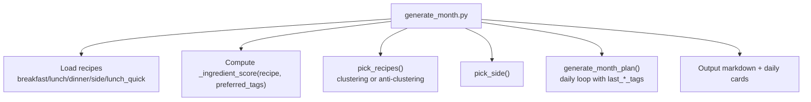
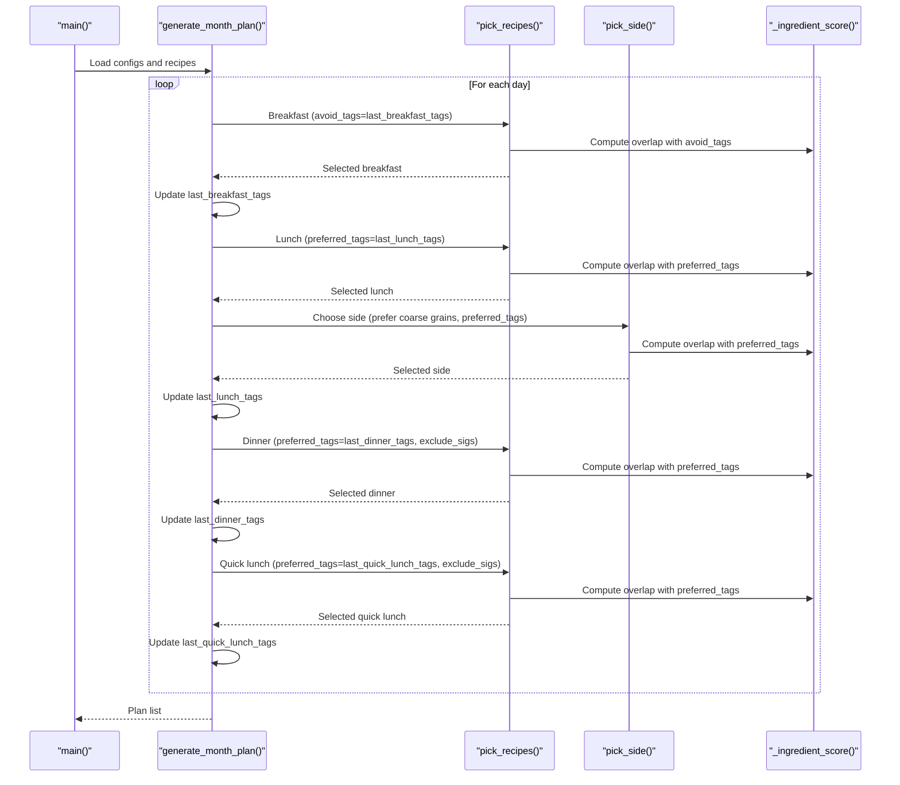
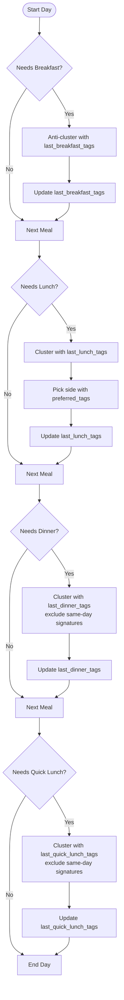
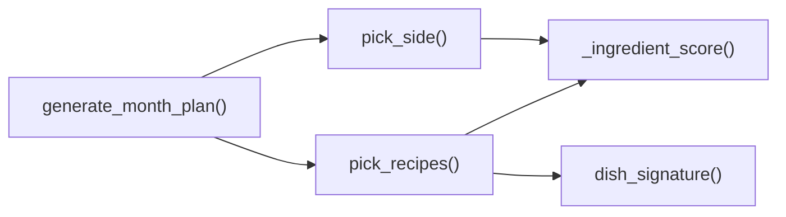

# Ingredient Optimization System

<cite>
**Referenced Files in This Document**
- [generate_month.py](file://personal/meal/scripts/generate_month.py)
</cite>

## Table of Contents
1. [Introduction](#introduction)
2. [Project Structure](#project-structure)
3. [Core Components](#core-components)
4. [Architecture Overview](#architecture-overview)
5. [Detailed Component Analysis](#detailed-component-analysis)
6. [Dependency Analysis](#dependency-analysis)
7. [Performance Considerations](#performance-considerations)
8. [Troubleshooting Guide](#troubleshooting-guide)
9. [Conclusion](#conclusion)

## Introduction
This document explains the ingredient optimization system that reduces food waste by strategically sharing ingredients across meals while maintaining variety. The core mechanism is a scoring function that measures compatibility between recipes based on shared ingredient tags. The system applies two complementary strategies:
- Clustering for main meals to reuse ingredients and minimize waste
- Anti-clustering for breakfasts to ensure daily variety

It also tracks the last meal’s ingredient tags to make intelligent pairing decisions, with clear fallback mechanisms when optimal matches are not available.

## Project Structure
The ingredient optimization logic resides in a single script responsible for generating monthly meal plans and daily recipe cards. It loads recipes from YAML files (or an external data source), computes scores using ingredient tags, and outputs structured plans.

**Diagram sources**
- [generate_month.py:113-121](file://personal/meal/scripts/generate_month.py#L113-L121)
- [generate_month.py:134-184](file://personal/meal/scripts/generate_month.py#L134-L184)
- [generate_month.py:186-215](file://personal/meal/scripts/generate_month.py#L186-L215)
- [generate_month.py:218-342](file://personal/meal/scripts/generate_month.py#L218-L342)

**Section sources**
- [generate_month.py:1-685](file://personal/meal/scripts/generate_month.py#L1-L685)

## Core Components
- _ingredient_score(recipe, preferred_tags): Computes how many ingredient tags overlap between a candidate recipe and a set of preferred tags. Higher overlap means higher score.
- pick_recipes(recipes_pool, count, used_titles, day_index, preferred_tags, avoid_tags, exclude_sigs): Selects non-repeating recipes with optional clustering (preferred_tags) or anti-clustering (avoid_tags). Includes cycle reset and index-based rotation as fallbacks.
- pick_side(sides, used_side, day_index, preferred_tags, exclude_titles, prefer_category): Chooses a side dish that shares ingredients with the main meal when possible; otherwise rotates by index.
- generate_month_plan(year, month, recipes, holidays, vacations): Orchestrates daily planning, maintains last_breakfast_tags, last_lunch_tags, last_dinner_tags, last_quick_lunch_tags, and applies the dual strategy per meal type.

Key behaviors:
- Breakfast uses anti-clustering via avoid_tags=last_breakfast_tags to avoid repeating similar ingredients on consecutive days.
- Lunch, dinner, and quick lunch use clustering via preferred_tags=last_*_tags to share ingredients with the previous meal of the same type.
- Side dishes prefer categories like “coarse grains” and cluster with the main meal’s tags when possible.

**Section sources**
- [generate_month.py:113-121](file://personal/meal/scripts/generate_month.py#L113-L121)
- [generate_month.py:134-184](file://personal/meal/scripts/generate_month.py#L134-L184)
- [generate_month.py:186-215](file://personal/meal/scripts/generate_month.py#L186-L215)
- [generate_month.py:218-342](file://personal/meal/scripts/generate_month.py#L218-L342)

## Architecture Overview
The system follows a pipeline: load recipes → compute scores → select meals with constraints → update state → output plans.

**Diagram sources**
- [generate_month.py:218-342](file://personal/meal/scripts/generate_month.py#L218-L342)
- [generate_month.py:134-184](file://personal/meal/scripts/generate_month.py#L134-L184)
- [generate_month.py:186-215](file://personal/meal/scripts/generate_month.py#L186-L215)
- [generate_month.py:113-121](file://personal/meal/scripts/generate_month.py#L113-L121)

## Detailed Component Analysis

### Scoring Function: _ingredient_score
Purpose:
- Quantifies compatibility between a recipe and a set of preferred tags by counting overlaps.

Behavior:
- Returns 0 if preferred_tags is empty or the recipe has no ingredient_tags.
- Otherwise returns the number of shared tags.

Complexity:
- O(k) where k is the number of tags in the recipe (set intersection size).

Usage:
- Used by pick_recipes and pick_side to rank candidates.

**Section sources**
- [generate_month.py:113-121](file://personal/meal/scripts/generate_month.py#L113-L121)

### Recipe Selection: pick_recipes
Purpose:
- Selects one or more unique recipes from a pool with optional clustering or anti-clustering.

Inputs:
- recipes_pool: Candidate recipes
- count: Number of recipes to pick
- used_titles: Set of already-used titles (prevents repeats)
- day_index: Rotation index for deterministic cycling
- preferred_tags: Tags to cluster with (positive preference)
- avoid_tags: Tags to avoid clustering with (negative preference)
- exclude_sigs: Dish signatures to exclude within the same day

Algorithm highlights:
- If avoid_tags is provided (anti-clustering), it sorts by lowest overlap first, then by original index.
- If preferred_tags is provided and there are enough candidates, it sorts by highest overlap first; if best score > 0, picks the top match; otherwise falls back to index rotation.
- If neither condition applies, it rotates by day_index.
- Cycle reset: When all candidates are exhausted, clears used_titles to allow re-cycling without locking into repetitive patterns.

Fallbacks:
- Index-based rotation ensures progress even when no matching tags exist.
- Excluding same-day dish signatures prevents duplicate staples across meals on the same day.

**Section sources**
- [generate_month.py:134-184](file://personal/meal/scripts/generate_month.py#L134-L184)

### Side Dish Selection: pick_side
Purpose:
- Picks one side dish that complements the main meal by sharing ingredients when possible.

Inputs:
- sides: Candidate side dishes
- used_side: Already-used side titles
- day_index: Rotation index
- preferred_tags: Tags from the main meal to cluster with
- exclude_titles: Titles to exclude within the same day
- prefer_category: Optional category filter (e.g., “coarse grains”)

Algorithm highlights:
- Filters by category if specified.
- Removes already-used and same-day excluded titles.
- If preferred_tags is present, sorts by descending overlap; if top score > 0, selects it; otherwise rotates by day_index.

**Section sources**
- [generate_month.py:186-215](file://personal/meal/scripts/generate_month.py#L186-L215)

### Daily Planning: generate_month_plan
Purpose:
- Builds a full-month plan, applying the dual strategy per meal type and updating last meal tag sets.

Key responsibilities:
- Determines day types (workday, weekend, holiday) and whether to include lunch/dinner/quick lunch.
- Applies anti-clustering for breakfast using avoid_tags=last_breakfast_tags.
- Applies clustering for lunch, dinner, and quick lunch using preferred_tags=last_*_tags.
- Enforces same-day cross-meal uniqueness via dish_signature exclusion.
- Maintains last_breakfast_tags, last_lunch_tags, last_dinner_tags, last_quick_lunch_tags to inform next-day choices.
- Rotates pools by month seed to avoid identical sequences across months.

Flowchart of selection logic:

**Diagram sources**
- [generate_month.py:218-342](file://personal/meal/scripts/generate_month.py#L218-L342)

**Section sources**
- [generate_month.py:218-342](file://personal/meal/scripts/generate_month.py#L218-L342)

### Examples and Trade-offs
- Prioritizing shared ingredients:
  - If yesterday’s lunch had tags {chicken, broccoli}, today’s lunch will prefer recipes containing those tags, reducing waste by reusing leftovers or common components.
- Ensuring variety:
  - Breakfast avoids clustering with yesterday’s tags, so you won’t get the same flavor profile twice in a row.
- Trade-offs:
  - Strong clustering can lead to repetition over time; the algorithm mitigates this by rotating indices and resetting cycles when pools are exhausted.
  - Anti-clustering may occasionally select less optimal pairings for main meals if strict avoidance is enforced; however, breakfast is designed for variety, not economy.
- Fallback mechanisms:
  - When no positive overlap exists, the system falls back to index-based rotation to maintain diversity and avoid stagnation.
  - Same-day signature exclusion prevents duplicate staples across meals on the same day.

[No sources needed since this section provides conceptual examples and trade-off analysis]

## Dependency Analysis
High-level dependencies:
- generate_month.py depends on:
  - YAML configuration and recipe files (or feishu_data if available)
  - Standard library modules for date/time, calendar, argparse, yaml, pathlib, os, sys

Internal relationships:
- generate_month_plan orchestrates pick_recipes and pick_side.
- pick_recipes and pick_side both rely on _ingredient_score.
- dish_signature supports same-day cross-meal deduplication.

**Diagram sources**
- [generate_month.py:113-121](file://personal/meal/scripts/generate_month.py#L113-L121)
- [generate_month.py:124-133](file://personal/meal/scripts/generate_month.py#L124-L133)
- [generate_month.py:134-184](file://personal/meal/scripts/generate_month.py#L134-L184)
- [generate_month.py:186-215](file://personal/meal/scripts/generate_month.py#L186-L215)
- [generate_month.py:218-342](file://personal/meal/scripts/generate_month.py#L218-L342)

**Section sources**
- [generate_month.py:1-685](file://personal/meal/scripts/generate_month.py#L1-L685)

## Performance Considerations
- Scoring complexity:
  - _ingredient_score runs in O(k) per recipe, where k is the number of ingredient tags.
- Sorting overhead:
  - pick_recipes and pick_side sort candidate lists by score; overall cost is O(n log n) per selection pass, where n is the number of available candidates.
- Memory usage:
  - Sets for used_titles and last_*_tags keep memory footprint low and operations fast.
- Scalability:
  - For large recipe pools, consider precomputing tag sets and caching scores if repeated evaluations occur.

[No sources needed since this section provides general guidance]

## Troubleshooting Guide
Common issues and resolutions:
- No recipes loaded:
  - Ensure recipe directories exist and contain valid YAML files, or configure the external data source.
- Repetitive menus:
  - Verify that used_titles clearing and cycle_reset logic is active; check that dish_signature excludes same-day duplicates.
- Lack of variety in breakfast:
  - Confirm avoid_tags is correctly set to last_breakfast_tags and that last_breakfast_tags updates after selection.
- Missing side dishes:
  - Ensure sides pool is populated and prefer_category filters are appropriate; verify exclude_titles does not overly restrict options.

**Section sources**
- [generate_month.py:134-184](file://personal/meal/scripts/generate_month.py#L134-L184)
- [generate_month.py:186-215](file://personal/meal/scripts/generate_month.py#L186-L215)
- [generate_month.py:218-342](file://personal/meal/scripts/generate_month.py#L218-L342)

## Conclusion
The ingredient optimization system balances ingredient economy and meal diversity through a simple yet effective scoring and selection mechanism. By clustering main meals around previous ingredient tags and anti-clustering breakfasts, it minimizes waste while ensuring variety. Robust fallbacks and same-day exclusions prevent repetition and improve user experience.

[No sources needed since this section summarizes without analyzing specific files]