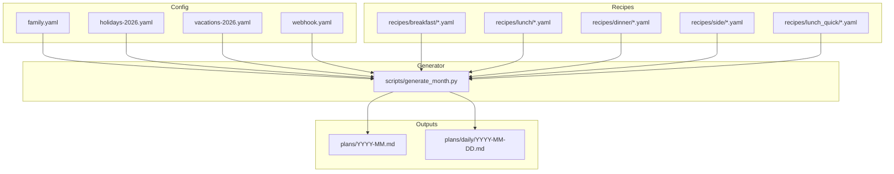
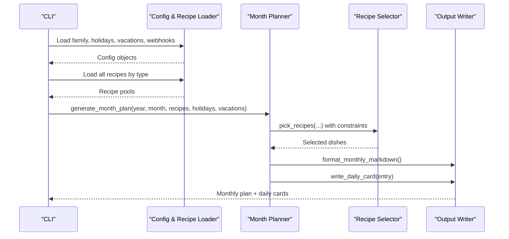
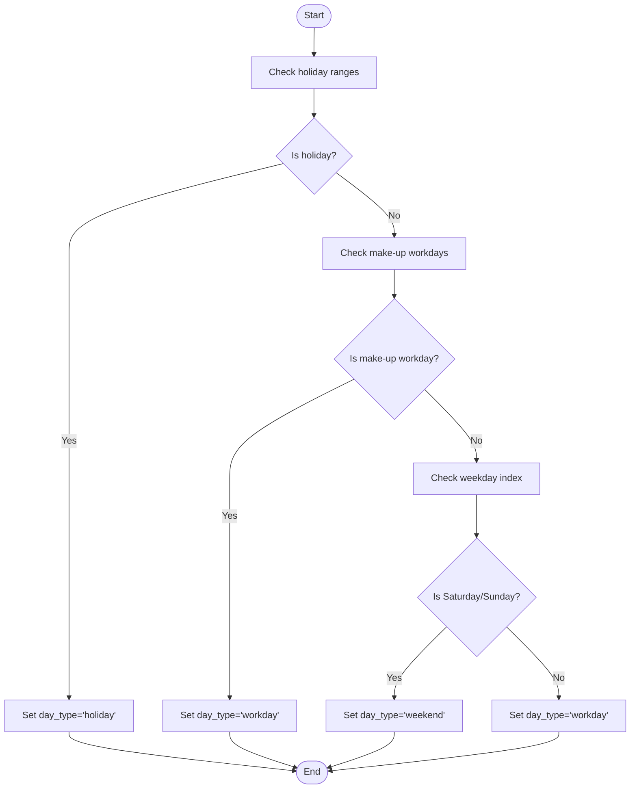
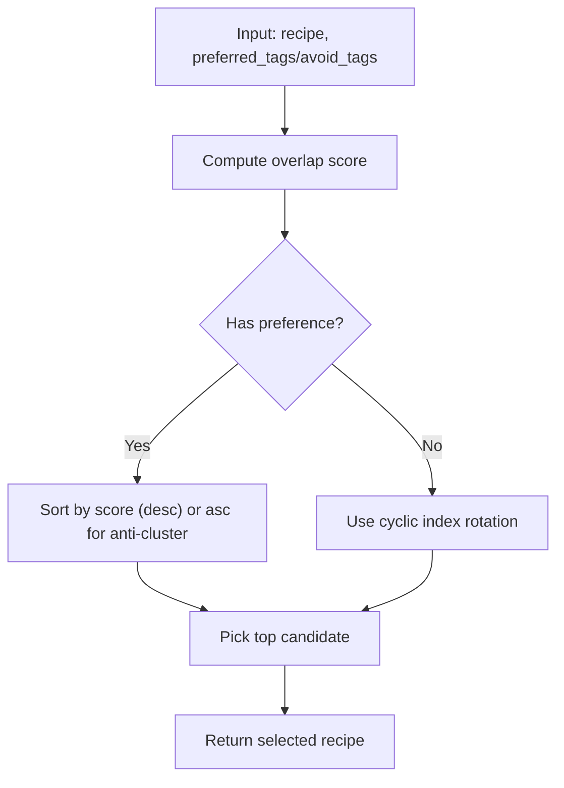
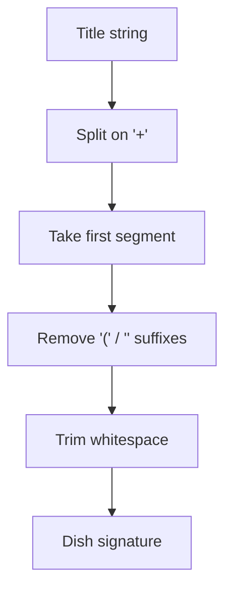
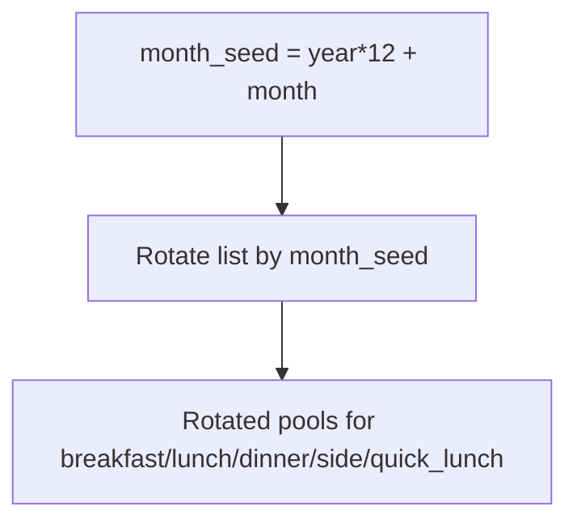
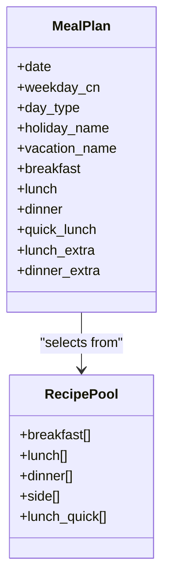
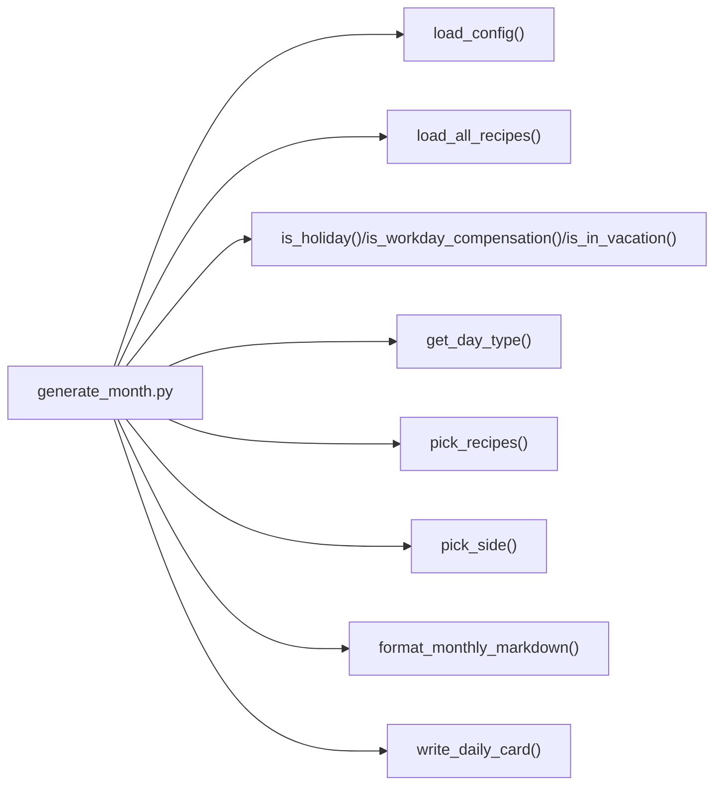

# Meal Generation Algorithm

<cite>
**Referenced Files in This Document**
- [generate_month.py](file://personal/meal/scripts/generate_month.py)
- [family.yaml](file://meal/config/family.yaml)
- [holidays-2026.yaml](file://meal/config/holidays-2026.yaml)
- [vacations-2026.yaml](file://meal/config/vacations-2026.yaml)
- [webhook.yaml](file://meal/config/webhook.yaml)
- [README.md](file://meal/README.md)
</cite>

## Table of Contents
1. [Introduction](#introduction)
2. [Project Structure](#project-structure)
3. [Core Components](#core-components)
4. [Architecture Overview](#architecture-overview)
5. [Detailed Component Analysis](#detailed-component-analysis)
6. [Dependency Analysis](#dependency-analysis)
7. [Performance Considerations](#performance-considerations)
8. [Troubleshooting Guide](#troubleshooting-guide)
9. [Conclusion](#conclusion)
10. [Appendices](#appendices)

## Introduction
This document explains the Meal Generation Algorithm that builds balanced weekly and monthly meal plans using a constraint satisfaction engine. The system balances nutritional variety, time constraints, cooking difficulty, and family preferences while minimizing food waste through strategic ingredient sharing across meals. It also handles holiday-aware scheduling, vacation periods, and differentiates weekend vs weekday meals. Practical examples illustrate how complex constraints are satisfied and how trade-offs between optimization goals are managed.

## Project Structure
The meal planning system is implemented as a Python script with YAML-based configuration and recipe catalogs. Key directories:
- config: Family profile, holidays, vacations, and webhook settings
- recipes: Recipe catalogs by meal type (breakfast, lunch, dinner, side, lunch_quick)
- plans: Generated monthly overview and daily cards
- scripts: Core generation logic and utilities

**Diagram sources**
- [generate_month.py](file://personal/meal/scripts/generate_month.py)
- [family.yaml](file://meal/config/family.yaml)
- [holidays-2026.yaml](file://meal/config/holidays-2026.yaml)
- [vacations-2026.yaml](file://meal/config/vacations-2026.yaml)
- [webhook.yaml](file://meal/config/webhook.yaml)

**Section sources**
- [generate_month.py](file://personal/meal/scripts/generate_month.py)
- [README.md](file://meal/README.md)

## Core Components
- Configuration loader: Loads family, holidays, vacations, and webhook settings from YAML or remote source with local fallback.
- Recipe loader: Reads all recipes for each meal type from YAML files or remote source with local fallback.
- Day-type classifier: Determines if a date is workday, weekend, or holiday; accounts for make-up workdays.
- Vacation detector: Identifies school vacation windows where children are home at noon.
- Selection engine: Picks recipes per day with constraints including no-repeat within cycle, cross-meal signature deduplication, ingredient clustering/anti-clustering, and category preference for sides.
- Output formatter: Produces monthly overview and daily cards with shopping lists and prep instructions.

Key responsibilities:
- Constraint satisfaction: No repeat titles within a cycle; avoid same dish signature across meals on the same day; prefer ingredient overlap to reduce waste; anti-cluster breakfasts to ensure variety.
- Time and difficulty awareness: Uses quick-lunch pool for vacation weekdays; separates “hard” lunches and “light” dinners.
- Holiday and vacation handling: Adjusts meal composition and adds quick lunch during vacations.

**Section sources**
- [generate_month.py](file://personal/meal/scripts/generate_month.py)

## Architecture Overview
The algorithm follows a deterministic selection pipeline with scoring heuristics. It rotates recipe pools per month to avoid identical sequences across months.

**Diagram sources**
- [generate_month.py](file://personal/meal/scripts/generate_month.py)

## Detailed Component Analysis

### Day-Type Classification and Scheduling Rules
- Classifies dates into workday, weekend, or holiday.
- Recognizes make-up workdays when weekends require work.
- During vacations, workdays include a quick lunch option.

**Diagram sources**
- [generate_month.py](file://personal/meal/scripts/generate_month.py)

**Section sources**
- [generate_month.py](file://personal/meal/scripts/generate_month.py)

### Ingredient Scoring and Clustering/Anti-Clustering
- Ingredient score computes overlap between a recipe’s tags and a reference set.
- Breakfast uses anti-clustering against previous day’s tags to maximize variety.
- Lunch and dinner use clustering against previous meal’s tags to share ingredients and reduce waste.
- Side dishes prefer categories like “coarse grains” and cluster with main meals.

**Diagram sources**
- [generate_month.py](file://personal/meal/scripts/generate_month.py)

**Section sources**
- [generate_month.py](file://personal/meal/scripts/generate_month.py)

### Cross-Meal Signature Deduplication
- Extracts a “dish signature” from the title (before “+” and parentheses).
- Prevents the same staple from appearing in multiple meals on the same day (e.g., breakfast and dinner both featuring the same noodle base).

**Diagram sources**
- [generate_month.py](file://personal/meal/scripts/generate_month.py)

**Section sources**
- [generate_month.py](file://personal/meal/scripts/generate_month.py)

### Month Rotation and Variety Across Months
- Rotates each recipe pool by a seed derived from year and month to avoid identical sequences across months.
- Ensures deterministic but varied outputs over time.

**Diagram sources**
- [generate_month.py](file://personal/meal/scripts/generate_month.py)

**Section sources**
- [generate_month.py](file://personal/meal/scripts/generate_month.py)

### Meal Composition Strategy
- Lunch uses “hard dishes” (richer proteins and vegetables), paired with a coarse-grain side.
- Dinner uses “light meals” (noodles, rice bowls, dumplings) with built-in staples and soups.
- Quick lunch pool is used only during vacations on workdays.

**Diagram sources**
- [generate_month.py](file://personal/meal/scripts/generate_month.py)

**Section sources**
- [generate_month.py](file://personal/meal/scripts/generate_month.py)

### Mathematical Models and Trade-offs
- Objective function (conceptual):
  - Maximize variety: minimize repeated titles and signatures within cycles and across same-day meals.
  - Minimize waste: maximize ingredient tag overlap between consecutive meals.
  - Respect constraints: enforce day-type rules, vacation adjustments, and category preferences for sides.
- Heuristic approach:
  - Deterministic selection with scoring and tie-breaking by original order and cyclic index.
  - Anti-clustering for breakfast ensures daily variety.
  - Clustering for lunch/dinner promotes ingredient reuse.
  - Cross-meal signature exclusion prevents redundant staples.
- Trade-offs:
  - Strong clustering reduces waste but may reduce perceived variety; mitigated by anti-clustering for breakfast and cross-meal signature checks.
  - Strict no-repeat within cycle can force early reset of history when pools are exhausted, restoring diversity.

[No sources needed since this section provides general guidance]

## Dependency Analysis
- External dependencies:
  - Standard library modules for file I/O, YAML parsing, calendar math, and argument parsing.
  - Optional Feishu integration for loading configs and recipes and uploading outputs; falls back to local files when unavailable.
- Internal dependencies:
  - Generator orchestrates loaders, planner, selector, and writers.
  - Planner depends on day-type classifier, vacation detector, and selection engine.
  - Writers depend on planner output structures.

**Diagram sources**
- [generate_month.py](file://personal/meal/scripts/generate_month.py)

**Section sources**
- [generate_month.py](file://personal/meal/scripts/generate_month.py)

## Performance Considerations
- Complexity:
  - Per-day selection is O(n log n) due to sorting by ingredient scores; n is pool size.
  - Overall complexity is O(D * n log n) for D days in the month.
- Optimizations:
  - Precompute ingredient tags once per recipe.
  - Use sets for used titles and signatures to achieve O(1) membership checks.
  - Avoid unnecessary recomputation by caching last meal tags.
- Scalability:
  - For large pools, consider batching and approximate nearest-neighbor strategies if needed.

[No sources needed since this section provides general guidance]

## Troubleshooting Guide
- Missing Feishu data:
  - The generator automatically falls back to local YAML files if Feishu integration is unavailable.
- Empty recipe pools:
  - Ensure recipe YAML files exist under the correct directories and are valid YAML.
- Unexpected repeats:
  - If pools are small, the algorithm resets usage history to continue selection; verify pool sizes and rotation seeds.
- Holiday/vacation misclassification:
  - Verify holiday and vacation date ranges in configuration files.
- Output not generated:
  - Confirm permissions to write to plans directories and check console logs for errors.

**Section sources**
- [generate_month.py](file://personal/meal/scripts/generate_month.py)

## Conclusion
The Meal Generation Algorithm implements a practical constraint satisfaction engine that balances variety, nutrition, time, and waste reduction. It leverages deterministic heuristics with ingredient clustering/anti-clustering, cross-meal signature deduplication, and holiday/vacation-aware scheduling. The result is a robust, maintainable system producing diverse and efficient weekly and monthly meal plans.

[No sources needed since this section summarizes without analyzing specific files]

## Appendices

### Practical Examples
- Example 1: Minimizing waste via ingredient sharing
  - Lunch includes a protein-heavy dish; dinner selects a noodle bowl whose tags overlap with lunch’s vegetable tags, reducing duplicate purchases.
- Example 2: Ensuring variety while maintaining economy
  - Breakfast avoids repeating previous day’s ingredient tags; lunch clusters with previous lunch; dinner excludes same-day staple signatures.
- Example 3: Holiday and vacation handling
  - On a holiday, full meals are scheduled; during school vacations on workdays, a quick lunch is added alongside breakfast.

[No sources needed since this section provides conceptual examples]