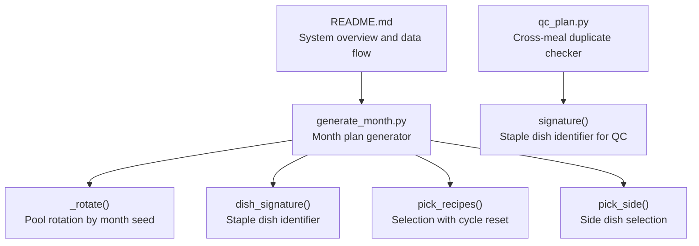
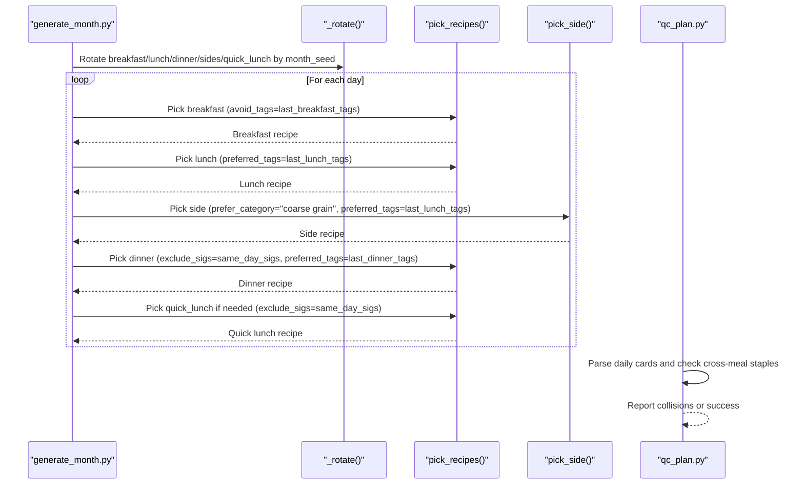
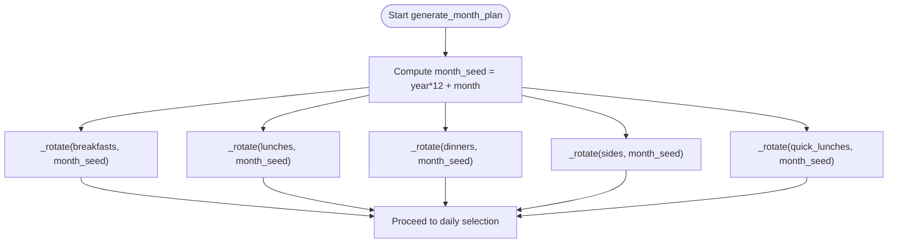
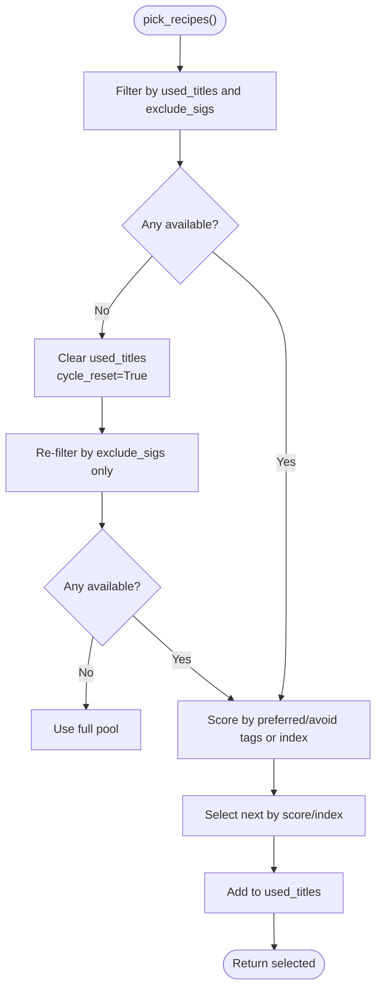
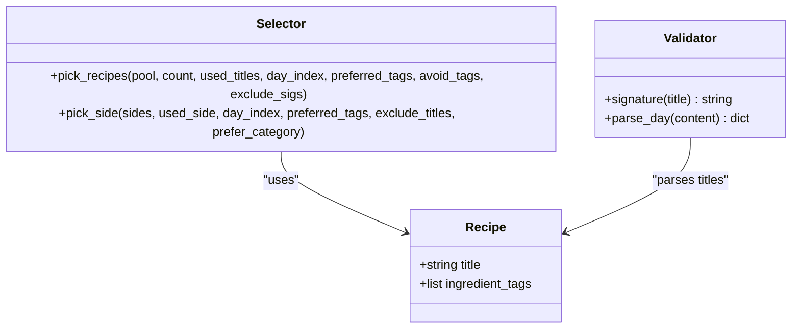
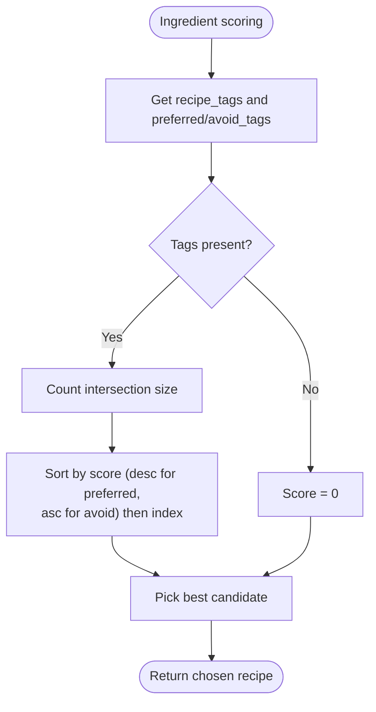
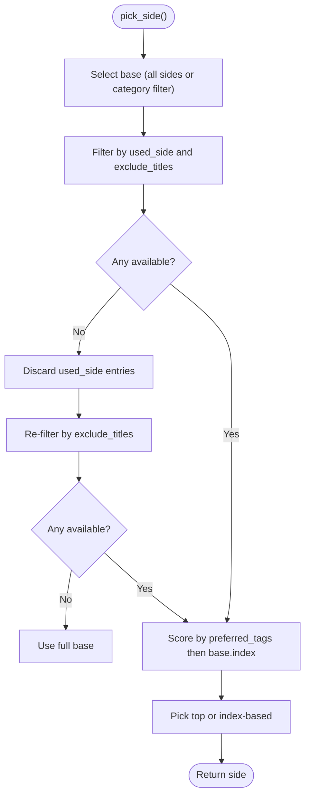
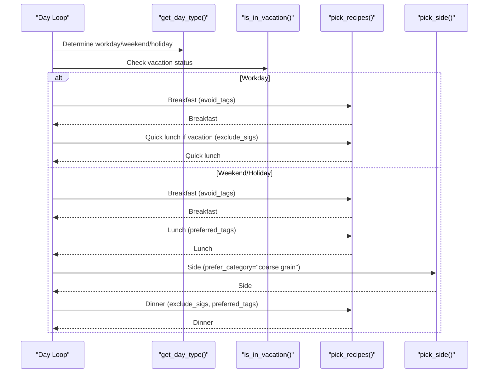
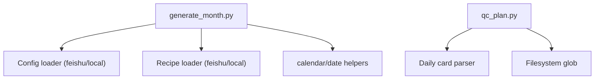

# Variety Maintenance and Rotation

<cite>
**Referenced Files in This Document**
- [generate_month.py](file://personal/meal/scripts/generate_month.py)
- [qc_plan.py](file://personal/meal/scripts/qc_plan.py)
- [README.md](file://personal/meal/README.md)
</cite>

## Table of Contents
1. [Introduction](#introduction)
2. [Project Structure](#project-structure)
3. [Core Components](#core-components)
4. [Architecture Overview](#architecture-overview)
5. [Detailed Component Analysis](#detailed-component-analysis)
6. [Dependency Analysis](#dependency-analysis)
7. [Performance Considerations](#performance-considerations)
8. [Troubleshooting Guide](#troubleshooting-guide)
9. [Conclusion](#conclusion)

## Introduction
This document explains the variety maintenance system that ensures diverse meal selections over time. It focuses on:
- Month-based rotation using a seed derived from year and month to shift recipe pools, preventing identical monthly patterns.
- Cycle reset logic that clears used recipe sets when pools are exhausted, allowing recipes to reappear in new contexts.
- Cross-meal deduplication using a dish signature to prevent the same staple dish from appearing in both breakfast and dinner on the same day.
- Examples illustrating long-term variety with short-term constraints.
- The balance between deterministic scheduling and variety, including fallback strategies when constraints conflict.

## Project Structure
The variety maintenance logic is implemented in the meal generation script and validated by a quality control script. The project README provides context about data sources (Feishu Base), configuration, and workflows.

**Diagram sources**
- [generate_month.py:218-244](file://personal/meal/scripts/generate_month.py#L218-L244)
- [generate_month.py:124-133](file://personal/meal/scripts/generate_month.py#L124-L133)
- [generate_month.py:135-184](file://personal/meal/scripts/generate_month.py#L135-L184)
- [generate_month.py:187-216](file://personal/meal/scripts/generate_month.py#L187-L216)
- [qc_plan.py:24-31](file://personal/meal/scripts/qc_plan.py#L24-L31)
- [README.md:38-44](file://personal/meal/README.md#L38-L44)

**Section sources**
- [README.md:1-137](file://personal/meal/README.md#L1-L137)

## Core Components
- Month-based rotation: Each recipe pool is rotated by a seed computed as year*12 + month, ensuring different starting points across months.
- Dish signature extraction: A canonical staple dish name is derived from each recipe title to enable cross-meal deduplication within the same day.
- Selection with cycle reset: When a pool is fully used, the used set is cleared to allow reuse while preserving other constraints.
- Ingredient-based clustering and anti-clustering: Preferred tags increase overlap with previous meals; avoid tags reduce overlap with yesterday’s breakfast.
- Side dish selection: Picks sides aligned with main courses’ ingredients and category preferences, with its own cycle reset.

Key responsibilities:
- Rotation and seeding: Prevents identical monthly sequences.
- Deduplication: Ensures no repeated staple dishes across meals on the same day.
- Variety: Balances ingredient diversity and repetition avoidance.
- Determinism: Uses stable ordering and indices to produce reproducible plans.

**Section sources**
- [generate_month.py:218-244](file://personal/meal/scripts/generate_month.py#L218-L244)
- [generate_month.py:124-133](file://personal/meal/scripts/generate_month.py#L124-L133)
- [generate_month.py:135-184](file://personal/meal/scripts/generate_month.py#L135-L184)
- [generate_month.py:187-216](file://personal/meal/scripts/generate_month.py#L187-L216)

## Architecture Overview
The monthly planning pipeline loads recipe pools, rotates them by month seed, then iterates through days to select meals while enforcing variety and deduplication rules. Quality control validates outputs against cross-meal duplication constraints.

**Diagram sources**
- [generate_month.py:218-244](file://personal/meal/scripts/generate_month.py#L218-L244)
- [generate_month.py:294-337](file://personal/meal/scripts/generate_month.py#L294-L337)
- [generate_month.py:135-184](file://personal/meal/scripts/generate_month.py#L135-L184)
- [generate_month.py:187-216](file://personal/meal/scripts/generate_month.py#L187-L216)
- [qc_plan.py:58-83](file://personal/meal/scripts/qc_plan.py#L58-L83)

## Detailed Component Analysis

### Month-Based Rotation Mechanism
- Seed computation: month_seed = year * 12 + month.
- Rotation function: _rotate(lst, n) shifts list by n positions modulo length.
- Applied to all pools: breakfasts, lunches, dinners, sides, quick_lunches.
- Purpose: Avoid identical monthly patterns caused by deterministic selection.

**Diagram sources**
- [generate_month.py:231-243](file://personal/meal/scripts/generate_month.py#L231-L243)

**Section sources**
- [generate_month.py:218-244](file://personal/meal/scripts/generate_month.py#L218-L244)

### Cycle Reset Logic
- Trigger: When available recipes become empty after excluding used titles and cross-meal signatures.
- Action: Clear used_titles to restart the cycle; continue with remaining constraints.
- Effect: Allows recipes to reappear in new contexts without locking into repetitive patterns.

**Diagram sources**
- [generate_month.py:135-184](file://personal/meal/scripts/generate_month.py#L135-L184)

**Section sources**
- [generate_month.py:135-184](file://personal/meal/scripts/generate_month.py#L135-L184)

### Cross-Meal Deduplication via dish_signature
- Signature extraction: Takes the title, splits at “+” or “＋”, removes parenthetical notes, and trims whitespace to get the staple dish name.
- Usage: Passed as exclude_sigs to pick_recipes for dinner and quick_lunch to avoid repeating the same staple dish within the same day.
- Validation: qc_plan.py independently parses daily cards and checks for collisions using a similar signature function.

**Diagram sources**
- [generate_month.py:124-133](file://personal/meal/scripts/generate_month.py#L124-L133)
- [generate_month.py:135-184](file://personal/meal/scripts/generate_month.py#L135-L184)
- [generate_month.py:187-216](file://personal/meal/scripts/generate_month.py#L187-L216)
- [qc_plan.py:24-31](file://personal/meal/scripts/qc_plan.py#L24-L31)
- [qc_plan.py:39-55](file://personal/meal/scripts/qc_plan.py#L39-L55)

**Section sources**
- [generate_month.py:124-133](file://personal/meal/scripts/generate_month.py#L124-L133)
- [generate_month.py:317-337](file://personal/meal/scripts/generate_month.py#L317-L337)
- [qc_plan.py:24-31](file://personal/meal/scripts/qc_plan.py#L24-L31)
- [qc_plan.py:58-83](file://personal/meal/scripts/qc_plan.py#L58-L83)

### Ingredient-Based Clustering and Anti-Clustering
- Preferred tags: Increase overlap with previous meals to reduce waste (used for lunch, dinner, sides).
- Avoid tags: Reduce overlap with yesterday’s breakfast to ensure daily variety.
- Scoring: Matches ingredient_tags intersection counts; ties broken by original order or index.

**Diagram sources**
- [generate_month.py:114-122](file://personal/meal/scripts/generate_month.py#L114-L122)
- [generate_month.py:160-180](file://personal/meal/scripts/generate_month.py#L160-L180)

**Section sources**
- [generate_month.py:114-122](file://personal/meal/scripts/generate_month.py#L114-L122)
- [generate_month.py:160-180](file://personal/meal/scripts/generate_month.py#L160-L180)

### Side Dish Selection
- Category preference: Prioritizes coarse grains for lunch extras.
- Overlap: Aligns with last_lunch_tags to minimize waste.
- Cycle reset: Clears used_side when exhausted, still respecting same-day exclusions.

**Diagram sources**
- [generate_month.py:187-216](file://personal/meal/scripts/generate_month.py#L187-L216)

**Section sources**
- [generate_month.py:187-216](file://personal/meal/scripts/generate_month.py#L187-L216)

### Daily Meal Orchestration
- Day type detection: Workday vs weekend/holiday determines which meals are planned.
- Vacation handling: Adds quick lunch on workdays during vacations.
- Same-day signature exclusion: Prevents staple dish repeats across breakfast, lunch, dinner, and quick lunch.

**Diagram sources**
- [generate_month.py:96-111](file://personal/meal/scripts/generate_month.py#L96-L111)
- [generate_month.py:86-93](file://personal/meal/scripts/generate_month.py#L86-L93)
- [generate_month.py:294-337](file://personal/meal/scripts/generate_month.py#L294-L337)

**Section sources**
- [generate_month.py:96-111](file://personal/meal/scripts/generate_month.py#L96-L111)
- [generate_month.py:86-93](file://personal/meal/scripts/generate_month.py#L86-L93)
- [generate_month.py:294-337](file://personal/meal/scripts/generate_month.py#L294-L337)

## Dependency Analysis
- generate_month.py depends on:
  - YAML loading utilities and calendar/date helpers.
  - Optional Feishu data layer for config and recipes (fallback to local files).
- qc_plan.py depends on:
  - Regex parsing of daily markdown cards.
  - File globbing to scan generated daily cards.

**Diagram sources**
- [generate_month.py:34-44](file://personal/meal/scripts/generate_month.py#L34-L44)
- [generate_month.py:47-64](file://personal/meal/scripts/generate_month.py#L47-L64)
- [qc_plan.py:13-21](file://personal/meal/scripts/qc_plan.py#L13-L21)

**Section sources**
- [generate_month.py:34-44](file://personal/meal/scripts/generate_month.py#L34-L44)
- [generate_month.py:47-64](file://personal/meal/scripts/generate_month.py#L47-L64)
- [qc_plan.py:13-21](file://personal/meal/scripts/qc_plan.py#L13-L21)

## Performance Considerations
- Time complexity:
  - Rotation: O(N) per pool.
  - Selection: Filtering and scoring are O(P) where P is pool size; sorting adds O(P log P) when scoring is applied.
  - Daily iteration: O(D * P) where D is days in month.
- Space complexity:
  - Used sets scale with number of unique titles per pool.
  - Side dish selection maintains a separate used set.
- Optimizations:
  - Prefer index-based fallback when scoring yields zero matches to avoid unnecessary sorting.
  - Early exit when pools are exhausted and reset occurs.

[No sources needed since this section provides general guidance]

## Troubleshooting Guide
- Cross-meal staple collision:
  - Symptom: Same staple dish appears in multiple meals on the same day.
  - Resolution: Ensure exclude_sigs is correctly computed from breakfast and lunch signatures before selecting dinner or quick lunch.
  - Validation: Run qc_plan.py to detect collisions in generated daily cards.
- Pool exhaustion leading to repetition:
  - Symptom: Recipes repeat too frequently due to small pools.
  - Resolution: Verify cycle_reset behavior clears used_titles; consider expanding pools or adjusting preferred/avoid tags.
- Ingredient clustering conflicts:
  - Symptom: Too much overlap causing monotony or insufficient variety.
  - Resolution: Tune preferred_tags and avoid_tags; rely on index-based fallback when scores are zero.

**Section sources**
- [qc_plan.py:58-83](file://personal/meal/scripts/qc_plan.py#L58-L83)
- [generate_month.py:135-184](file://personal/meal/scripts/generate_month.py#L135-L184)
- [generate_month.py:317-337](file://personal/meal/scripts/generate_month.py#L317-L337)

## Conclusion
The variety maintenance system combines deterministic scheduling with dynamic constraints to deliver diverse, practical meal plans:
- Month-based rotation prevents identical monthly patterns.
- Cycle reset allows recipes to reappear in new contexts once pools are exhausted.
- Cross-meal deduplication avoids staple dish collisions within the same day.
- Ingredient-based clustering and anti-clustering balance waste reduction with daily variety.
When constraints conflict, the algorithm falls back to index-based selection, preserving determinism while maintaining overall variety.

[No sources needed since this section summarizes without analyzing specific files]