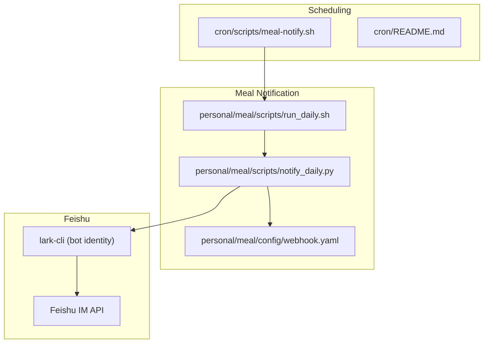
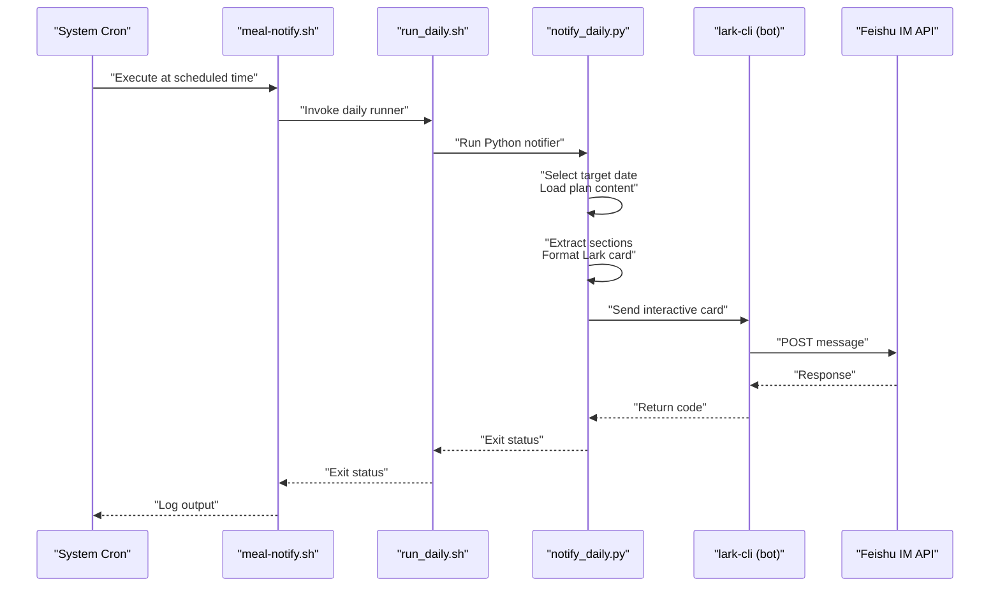
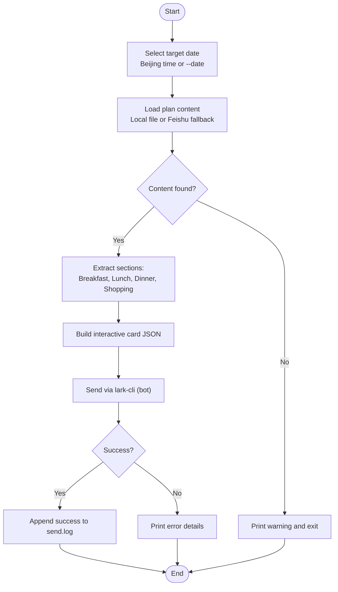
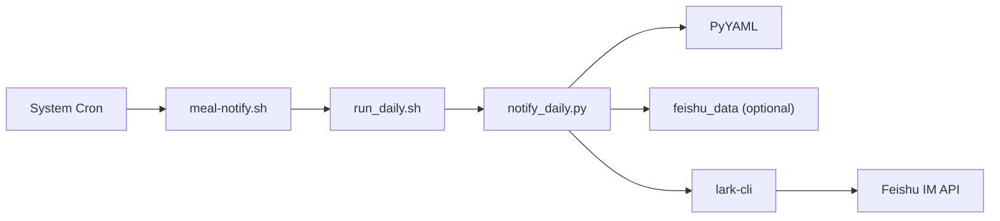

# Notification and Delivery System

<cite>
**Referenced Files in This Document**
- [meal-notify.sh](file://cron/scripts/meal-notify.sh)
- [README.md](file://cron/README.md)
- [run_daily.sh](file://personal/meal/scripts/run_daily.sh)
- [notify_daily.py](file://personal/meal/scripts/notify_daily.py)
- [webhook.yaml](file://personal/meal/config/webhook.yaml)
</cite>

## Table of Contents
1. [Introduction](#introduction)
2. [Project Structure](#project-structure)
3. [Core Components](#core-components)
4. [Architecture Overview](#architecture-overview)
5. [Detailed Component Analysis](#detailed-component-analysis)
6. [Dependency Analysis](#dependency-analysis)
7. [Performance Considerations](#performance-considerations)
8. [Troubleshooting Guide](#troubleshooting-guide)
9. [Conclusion](#conclusion)

## Introduction
This document explains the Notification and Delivery System that automates daily meal notifications, shopping lists, and preparation reminders via Feishu (Lark). It covers:
- Feishu integration for delivering structured meal cards with recipes, ingredients, and step-by-step instructions
- Message formatting logic that transforms Markdown plans into rich interactive cards
- Cron job scheduling that triggers notifications at specified times
- Error handling and retry strategies for failed deliveries
- Troubleshooting guidance for common issues such as webhook authentication failures and message formatting problems

The system is designed to be resilient, configurable, and easy to operate in containerized environments where timezone and dependency availability may vary.

## Project Structure
The notification pipeline spans two main areas:
- cron/: Scheduling and entry points for scheduled tasks
- personal/meal/: Core Python script and configuration for building and sending notifications

**Diagram sources**
- [meal-notify.sh:1-4](file://cron/scripts/meal-notify.sh#L1-L4)
- [README.md:1-36](file://cron/README.md#L1-L36)
- [run_daily.sh:1-9](file://personal/meal/scripts/run_daily.sh#L1-L9)
- [notify_daily.py:1-300](file://personal/meal/scripts/notify_daily.py#L1-L300)
- [webhook.yaml:1-6](file://personal/meal/config/webhook.yaml#L1-L6)

**Section sources**
- [README.md:1-36](file://cron/README.md#L1-L36)
- [meal-notify.sh:1-4](file://cron/scripts/meal-notify.sh#L1-L4)
- [run_daily.sh:1-9](file://personal/meal/scripts/run_daily.sh#L1-L9)
- [notify_daily.py:1-300](file://personal/meal/scripts/notify_daily.py#L1-L300)
- [webhook.yaml:1-6](file://personal/meal/config/webhook.yaml#L1-L6)

## Core Components
- Cron entrypoint: Triggers the daily notification process at a fixed time.
- Daily runner: Ensures dependencies are present and invokes the Python notifier.
- Notifier: Loads plan content, formats it into a Feishu interactive card, and sends it via lark-cli using bot identity.
- Configuration: Holds Feishu webhook URL and send time; also references holiday schedules for contextual headers.

Key responsibilities:
- Timezone-aware selection of “today” vs “tomorrow” based on Beijing time
- Robust fallbacks when local plan files are missing by attempting to fetch from Feishu-backed data source
- Structured message composition supporting breakfast, lunch, dinner, and shopping list sections
- Logging of delivery outcomes

**Section sources**
- [meal-notify.sh:1-4](file://cron/scripts/meal-notify.sh#L1-L4)
- [run_daily.sh:1-9](file://personal/meal/scripts/run_daily.sh#L1-L9)
- [notify_daily.py:1-300](file://personal/meal/scripts/notify_daily.py#L1-L300)
- [webhook.yaml:1-6](file://personal/meal/config/webhook.yaml#L1-L6)

## Architecture Overview
The end-to-end flow starts from the system scheduler, proceeds through a shell wrapper, then into the Python notifier which composes a rich card and dispatches it via lark-cli under bot identity.

**Diagram sources**
- [meal-notify.sh:1-4](file://cron/scripts/meal-notify.sh#L1-L4)
- [run_daily.sh:1-9](file://personal/meal/scripts/run_daily.sh#L1-L9)
- [notify_daily.py:1-300](file://personal/meal/scripts/notify_daily.py#L1-L300)

## Detailed Component Analysis

### Cron Job Scheduling
- The cron entrypoint executes the daily runner and appends logs to a dedicated log file.
- The cron README documents how to install and manage scheduled tasks.

Operational notes:
- Ensure the crontab installs the correct schedule for meal notifications.
- Logs are appended to the notifications directory for observability.

**Section sources**
- [meal-notify.sh:1-4](file://cron/scripts/meal-notify.sh#L1-L4)
- [README.md:1-36](file://cron/README.md#L1-L36)

### Daily Runner
- Changes into the project root and ensures PyYAML is available before invoking the notifier.
- Appends stdout/stderr to a cron log for troubleshooting.

Resilience features:
- Self-healing dependency installation if PyYAML is missing in ephemeral containers.

**Section sources**
- [run_daily.sh:1-9](file://personal/meal/scripts/run_daily.sh#L1-L9)

### Notifier: notify_daily.py
Responsibilities:
- Determine target date based on Beijing time or an explicit --date argument
- Load plan content from local Markdown files or fall back to Feishu-backed data source
- Extract meal sections (breakfast, lunch, dinner) and shopping list
- Build a structured interactive card with header, sections, and note
- Send via lark-cli using bot identity to a configured chat ID
- Log success/failure to notifications/send.log

Timezone behavior:
- Uses UTC internally and adds 8 hours to compute Beijing time for decision-making.

Content resolution:
- If the local daily plan file exists, use it.
- Otherwise, attempt to fetch from Feishu-backed data source if available.
- If neither is available, print a warning and exit.

Message formatting:
- Converts Markdown sections into Lark markdown-friendly text
- Preserves headings, bold text, lists, and checkboxes
- Adds a consistent footer note about preparation tips

Delivery mechanism:
- Uses lark-cli with --as bot to send interactive cards to a specific chat ID
- Captures return codes and prints detailed error messages on failure

Error handling:
- HTTP and network errors during direct webhook calls are caught and logged
- Subprocess failures are captured and printed for diagnostics

Configuration:
- Reads webhook configuration from YAML (for reference and potential future use)
- References holiday configuration to include holiday names in card headers

Example usage:
- Run with optional --date YYYY-MM-DD to target a specific day
- Default behavior selects today before 18:00 Beijing time, otherwise tomorrow

**Section sources**
- [notify_daily.py:1-300](file://personal/meal/scripts/notify_daily.py#L1-L300)
- [webhook.yaml:1-6](file://personal/meal/config/webhook.yaml#L1-L6)

### Message Formatting System
The formatter builds a structured interactive card with:
- Header including date, weekday, optional holiday tag, and label (“Today’s Menu” or “Tomorrow’s Menu”)
- Sections for each meal with preserved formatting
- Shopping list rendered as a bulleted checklist
- A note block with preparation guidance

Data model overview:
- Input: Markdown content with section markers for meals and shopping list
- Processing: Section extraction and conversion to Lark markdown
- Output: JSON payload for interactive card sent via lark-cli

**Diagram sources**
- [notify_daily.py:1-300](file://personal/meal/scripts/notify_daily.py#L1-L300)

### Feishu Integration Details
- Identity: Bot identity via lark-cli (--as bot)
- Target: Direct message chat ID configured in the notifier
- Payload: Interactive card JSON with header, elements, and note blocks
- Transport: lark-cli forwards to Feishu IM API

Notes:
- The webhook YAML contains a group bot webhook URL and send_time for reference; current delivery uses lark-cli with bot identity rather than direct webhook posting.

**Section sources**
- [notify_daily.py:1-300](file://personal/meal/scripts/notify_daily.py#L1-L300)
- [webhook.yaml:1-6](file://personal/meal/config/webhook.yaml#L1-L6)

## Dependency Analysis
High-level dependencies:
- Shell scripts depend on Python runtime and PyYAML
- Python notifier depends on:
  - Standard library modules (datetime, json, yaml, urllib, subprocess)
  - Optional feishu_data module for fetching daily cards from Feishu
  - External tool lark-cli for sending messages

**Diagram sources**
- [meal-notify.sh:1-4](file://cron/scripts/meal-notify.sh#L1-L4)
- [run_daily.sh:1-9](file://personal/meal/scripts/run_daily.sh#L1-L9)
- [notify_daily.py:1-300](file://personal/meal/scripts/notify_daily.py#L1-L300)

**Section sources**
- [meal-notify.sh:1-4](file://cron/scripts/meal-notify.sh#L1-L4)
- [run_daily.sh:1-9](file://personal/meal/scripts/run_daily.sh#L1-L9)
- [notify_daily.py:1-300](file://personal/meal/scripts/notify_daily.py#L1-L300)

## Performance Considerations
- Minimal overhead: The pipeline performs lightweight file I/O and a single outbound call per run.
- Dependency self-healing avoids repeated failures due to missing packages in ephemeral environments.
- Avoid unnecessary retries: The current design logs failures but does not implement automatic retry loops; consider adding exponential backoff if needed.

[No sources needed since this section provides general guidance]

## Troubleshooting Guide
Common issues and resolutions:
- Webhook authentication failures
  - Verify lark-cli is configured with bot identity and credentials
  - Confirm the target chat ID is valid and accessible by the bot
  - Check lark-cli auth status and re-authenticate if necessary
- Network errors
  - Inspect cron logs for HTTP/network error messages
  - Validate outbound connectivity and firewall rules
- Missing plan content
  - Ensure monthly plan generation has been executed
  - Confirm local daily files exist or Feishu-backed data source is reachable
- Message formatting problems
  - Validate Markdown structure includes expected section markers
  - Review the formatter’s handling of headings, bold text, lists, and checkboxes
- Dependency issues
  - Confirm PyYAML is installed; the runner attempts to install it automatically
  - In restricted environments, pre-install PyYAML to avoid runtime delays

Operational checks:
- Review notifications/cron.log for execution traces
- Review notifications/send.log for successful deliveries
- Use --date flag to test with a specific day without altering system time

**Section sources**
- [notify_daily.py:1-300](file://personal/meal/scripts/notify_daily.py#L1-L300)
- [run_daily.sh:1-9](file://personal/meal/scripts/run_daily.sh#L1-L9)

## Conclusion
The Notification and Delivery System provides a robust, automated pipeline for delivering daily meal notifications to Feishu. It combines reliable scheduling, resilient dependency management, flexible content sourcing, and structured message formatting to ensure timely and informative updates. With clear logging and straightforward configuration, it is well-suited for both development and production environments.

[No sources needed since this section summarizes without analyzing specific files]