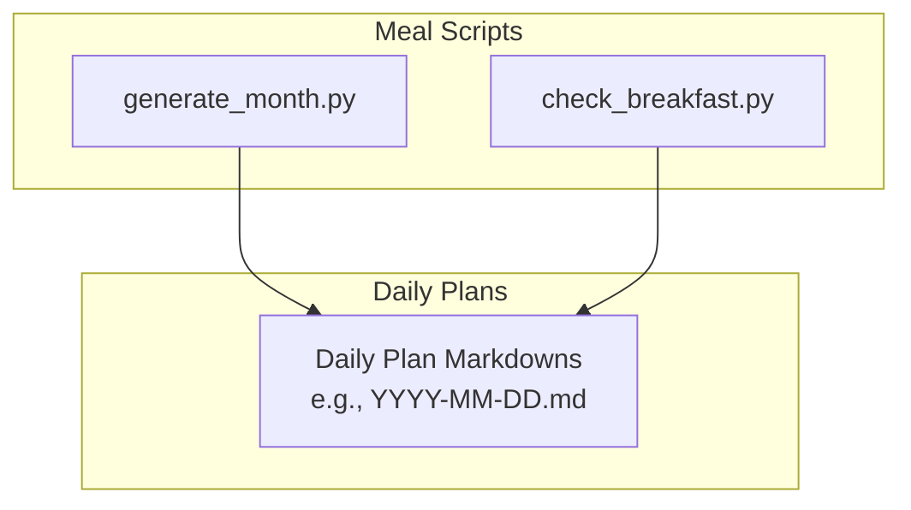
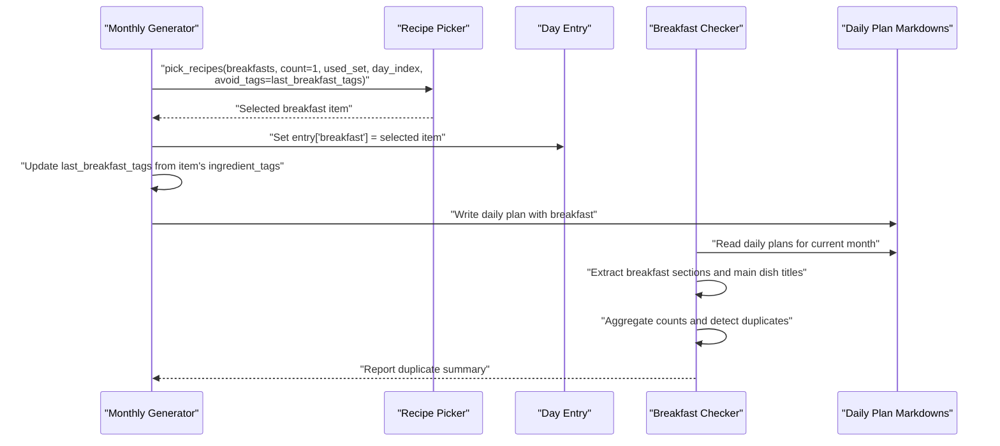
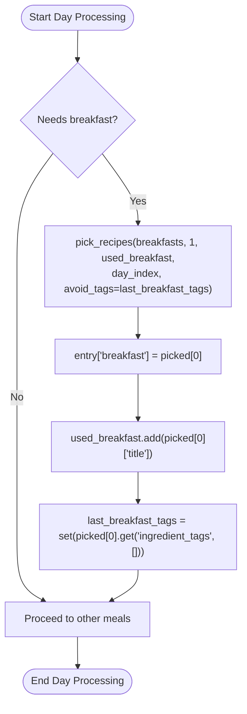
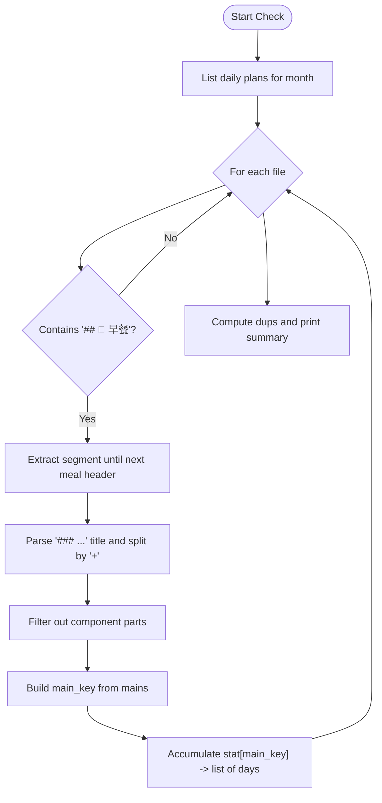
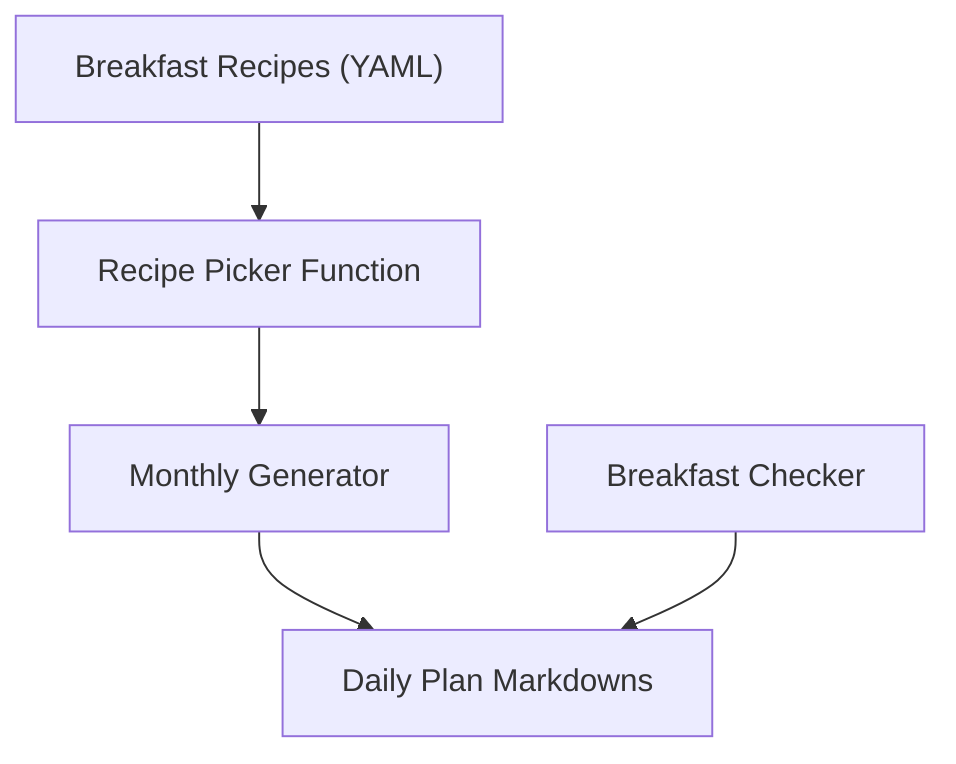

# Breakfast Recipes

<cite>
**Referenced Files in This Document**
- [check_breakfast.py](file://personal/meal/scripts/check_breakfast.py)
- [generate_month.py](file://personal/meal/scripts/generate_month.py)
</cite>

## Table of Contents
1. [Introduction](#introduction)
2. [Project Structure](#project-structure)
3. [Core Components](#core-components)
4. [Architecture Overview](#architecture-overview)
5. [Detailed Component Analysis](#detailed-component-analysis)
6. [Dependency Analysis](#dependency-analysis)
7. [Performance Considerations](#performance-considerations)
8. [Troubleshooting Guide](#troubleshooting-guide)
9. [Conclusion](#conclusion)

## Introduction
This document explains the breakfast recipe category within the meal planning system. It focuses on how breakfast recipes are organized, named, and integrated into the morning workflow of the monthly planner. It also outlines typical characteristics such as preparation time patterns (including overnight prep), complexity levels, and nutritional emphasis on energy and protein. Finally, it describes common breakfast patterns like drink + dish combinations, overnight strategies, and quick morning assembly techniques, and how these align with family dietary requirements, especially for children.

## Project Structure
The breakfast-related logic is implemented in Python scripts under the personal meal module. The key files involved in breakfast handling are:
- A script that scans daily plan Markdowns to analyze breakfast main dishes and detect duplicates over a month window.
- A script that generates monthly plans and selects breakfast items using anti-clustering to avoid repeating similar ingredients on consecutive days.

[No sources needed since this diagram shows conceptual structure]

## Core Components
- Monthly generation and breakfast selection:
  - The generator builds a day-by-day plan and assigns breakfast when conditions require it. It uses an anti-clustering strategy to avoid reusing similar ingredient tags from the previous day, ensuring variety across mornings.
  - It tracks used breakfast titles and updates “last breakfast ingredient tags” after each selection to enforce diversity.
- Breakfast quality check:
  - The checker parses daily plan Markdowns, extracts the breakfast section, identifies the main dish title(s), aggregates them by combination, and reports whether any main dish repeats within a 30-day window.

These components together ensure that breakfasts are varied, nutritionally balanced, and easy to manage at scale.

**Section sources**
- [generate_month.py:280-342](file://personal/meal/scripts/generate_month.py#L280-L342)
- [check_breakfast.py:26-56](file://personal/meal/scripts/check_breakfast.py#L26-L56)

## Architecture Overview
The breakfast workflow integrates with the broader meal planning pipeline. The generator produces a structured plan per day, including breakfast, lunch, dinner, and optional quick lunch entries. The checker validates the resulting plan’s breakfast diversity.

**Diagram sources**
- [generate_month.py:280-342](file://personal/meal/scripts/generate_month.py#L280-L342)
- [check_breakfast.py:26-56](file://personal/meal/scripts/check_breakfast.py#L26-L56)

## Detailed Component Analysis

### Monthly Generator: Breakfast Selection Logic
- Purpose: Assign one breakfast per day when required, while avoiding repetition of similar ingredients compared to the previous day.
- Key behaviors:
  - Conditionally includes breakfast based on day type and schedule needs.
  - Uses a picker function with anti-clustering constraints to diversify ingredient usage.
  - Maintains a set of already-used breakfast titles to prevent exact repeats.
  - Updates “last breakfast ingredient tags” after each selection to inform the next day’s choice.

**Diagram sources**
- [generate_month.py:280-342](file://personal/meal/scripts/generate_month.py#L280-L342)

**Section sources**
- [generate_month.py:280-342](file://personal/meal/scripts/generate_month.py#L280-L342)

### Breakfast Checker: Duplicate Detection Over 30 Days
- Purpose: Validate that breakfast main dishes do not repeat within a 30-day window.
- Key behaviors:
  - Scans daily plan Markdowns for the current month.
  - Extracts the breakfast section and identifies the main dish title(s).
  - Aggregates counts by main dish combination and reports duplicates if found.

**Diagram sources**
- [check_breakfast.py:26-56](file://personal/meal/scripts/check_breakfast.py#L26-L56)

**Section sources**
- [check_breakfast.py:26-56](file://personal/meal/scripts/check_breakfast.py#L26-L56)

### Naming Conventions and File Organization Patterns
- Naming pattern:
  - Breakfast recipe filenames follow a numeric prefix followed by a descriptive Chinese name, often combining multiple items separated by a hyphen or plus-like separators. Examples include patterns like “01-奶香玉米汁-西葫芦鸡蛋饼.yaml”.
  - The naming convention typically reflects a drink + dish combination or a multi-item breakfast set.
- File organization:
  - Recipes are stored as YAML files grouped by meal category (e.g., breakfast, lunch, dinner).
  - Daily plans are generated as Markdown files per date, referencing selected recipes.

Note: While specific YAML contents are not analyzed here, the naming conventions and organization are evident from the repository structure and script behavior.

**Section sources**
- [generate_month.py:280-342](file://personal/meal/scripts/generate_month.py#L280-L342)
- [check_breakfast.py:26-56](file://personal/meal/scripts/check_breakfast.py#L26-L56)

### Typical Characteristics of Breakfast Recipes
- Preparation time:
  - Many breakfasts are designed for quick morning assembly, leveraging pre-prepared components or overnight methods (e.g., soaking grains, pre-mixing batters, pre-cooking proteins).
- Complexity levels:
  - Breakfasts tend to be low-to-medium complexity, optimized for speed and reliability during busy mornings.
- Nutritional focus:
  - Emphasis on energy-dense carbohydrates paired with protein-rich items (e.g., eggs, dairy, legumes, nuts) to sustain morning activity and support children’s growth.
- Common patterns:
  - Drink + dish combinations (e.g., soy milk or corn juice paired with pancakes or steamed buns).
  - Overnight preparation strategies (e.g., pre-soaking oats, preparing porridge bases, marinating proteins).
  - Quick assembly techniques (e.g., pan-frying pre-formed patties, assembling sandwiches, reheating pre-cooked items).

[No sources needed since this section provides general guidance]

### Integration With Family Dietary Requirements
- Children’s nutrition:
  - The system emphasizes child-friendly options, balancing energy and protein while keeping flavors mild and textures appealing.
- Anti-clustering:
  - By avoiding repeated ingredient tags on consecutive days, the planner reduces monotony and encourages diverse nutrient intake across the week.
- Cross-meal de-duplication:
  - The generator avoids reusing the same main dish signature across different meals on the same day, preventing redundancy and promoting variety.

**Section sources**
- [generate_month.py:280-342](file://personal/meal/scripts/generate_month.py#L280-L342)

## Dependency Analysis
The breakfast workflow depends on:
- Recipe datasets (YAML files) categorized by meal type.
- Daily plan Markdowns produced by the generator.
- Utility functions for picking recipes and computing signatures/tags.

[No sources needed since this diagram shows conceptual dependencies]

## Performance Considerations
- Efficiency of selection:
  - Using ingredient tag sets and anti-clustering minimizes computational overhead while maximizing variety.
- Scalability:
  - The checker processes daily Markdowns linearly; performance scales with the number of days in the month.
- Memory usage:
  - Tracking used titles and ingredient tags requires minimal memory relative to dataset size.

[No sources needed since this section provides general guidance]

## Troubleshooting Guide
- If breakfasts appear repetitive:
  - Verify that ingredient tags are correctly assigned to recipes and that the generator’s anti-clustering parameters are active.
  - Use the checker to identify duplicate main dish combinations and adjust recipe tagging accordingly.
- If breakfast sections are missing in daily plans:
  - Ensure the generator’s condition for including breakfast is met for the given day type and schedule.
  - Confirm that the daily plan Markdowns contain the expected breakfast header and formatting.

**Section sources**
- [generate_month.py:280-342](file://personal/meal/scripts/generate_month.py#L280-L342)
- [check_breakfast.py:26-56](file://personal/meal/scripts/check_breakfast.py#L26-L56)

## Conclusion
The breakfast recipe category is designed for practicality, variety, and nutritional balance. Through anti-clustering and cross-meal de-duplication, the system ensures diverse morning menus that meet family dietary needs, particularly for children. The naming conventions and file organization support clear identification and management of breakfast items, while the scripts provide robust validation and generation capabilities.