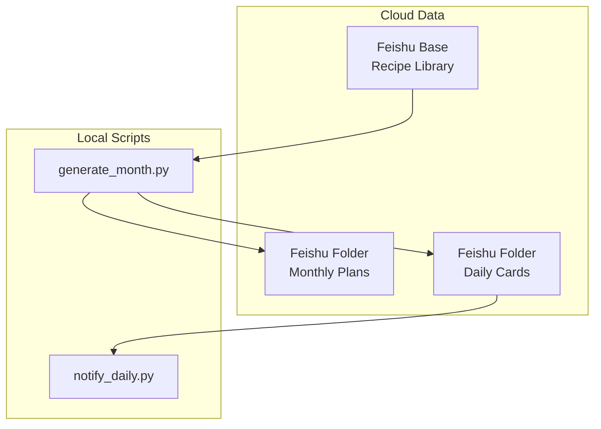
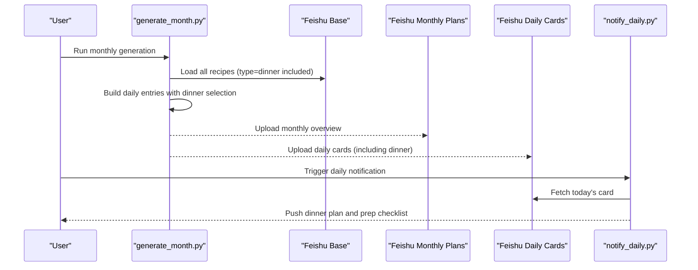
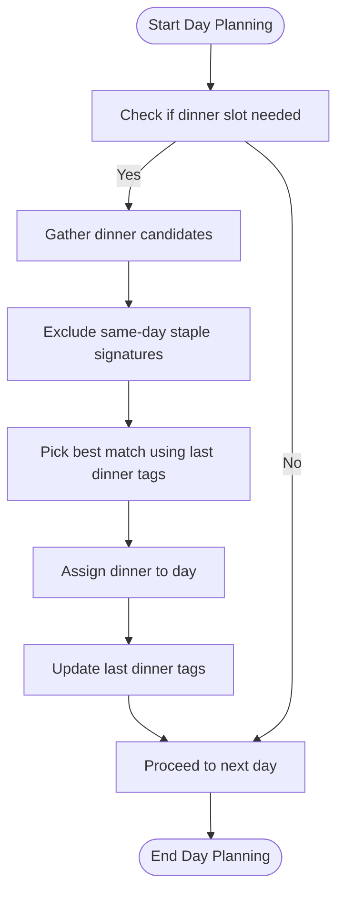
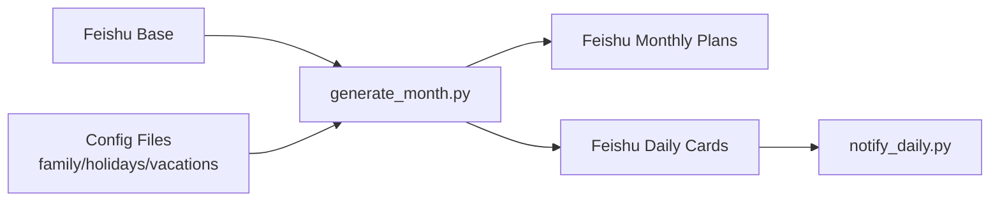

# Dinner Recipes

<cite>
**Referenced Files in This Document**
- [README.md](file://personal/meal/README.md)
- [generate_month.py](file://personal/meal/scripts/generate_month.py)
</cite>

## Table of Contents
1. [Introduction](#introduction)
2. [Project Structure](#project-structure)
3. [Core Components](#core-components)
4. [Architecture Overview](#architecture-overview)
5. [Detailed Component Analysis](#detailed-component-analysis)
6. [Dependency Analysis](#dependency-analysis)
7. [Performance Considerations](#performance-considerations)
8. [Troubleshooting Guide](#troubleshooting-guide)
9. [Conclusion](#conclusion)

## Introduction
This document explains the dinner recipe category within the family meal planning system. It focuses on how dinner recipes are modeled, selected, and scheduled alongside other meals, with emphasis on longer preparation times, more complex techniques, and a family dining experience. It also outlines typical dinner patterns (main + sides), seasonal ingredient usage, special occasion considerations, weekend/holiday scheduling integration, leftover management strategies, common cooking methods and their nutritional benefits, and how dinner recipes integrate with weekly/monthly meal planning algorithms.

## Project Structure
The dinner recipe category is part of a broader meal planning system that stores recipes in a cloud Base and generates monthly plans via scripts. The relevant structure for this topic includes:
- Recipe metadata and YAML schema used by the generator
- Monthly plan generation logic that selects dinner entries per day
- Daily notification flow that surfaces dinner plans to users

[No sources needed since this diagram shows conceptual workflow, not actual code structure]

**Section sources**
- [README.md:40-44](file://personal/meal/README.md#L40-L44)
- [README.md:48-66](file://personal/meal/README.md#L48-L66)

## Core Components
- Dinner recipe model: Each recipe has fields such as title, type, difficulty, total_time, servings, tools, ingredients, night_prep, morning_steps or noon_steps, and notes. Dinner recipes typically have higher total_time and may include multi-step procedures suitable for family-sized servings.
- Dinner selection algorithm: For each day, the generator picks one dinner entry while avoiding same-day repetition of staple dishes across breakfast/lunch/dinner. It also considers last-dinner ingredient tags to diversify flavors and nutrition.
- Integration points: The generator reads all recipes from the cloud Base, builds a month-long plan, and uploads both monthly overview and daily cards back to Feishu. Daily notifications pull the current day’s card and push it to chat.

Key characteristics of dinner recipes inferred from the system:
- Longer preparation time: Represented by total_time; dinners often require more steps and coordination.
- Family-oriented servings: servings commonly align with family size.
- Multi-component meals: Often paired with side dishes or soups, reflected in ingredient lists and notes.
- Night prep support: night_prep enables advance preparation to reduce weekday evening workload.

**Section sources**
- [README.md:117-136](file://personal/meal/README.md#L117-L136)
- [generate_month.py:317-327](file://personal/meal/scripts/generate_month.py#L317-L327)

## Architecture Overview
The dinner recipe lifecycle spans data ingestion, planning, and delivery:

**Diagram sources**
- [README.md:40-44](file://personal/meal/README.md#L40-L44)
- [README.md:92-107](file://personal/meal/README.md#L92-L107)

## Detailed Component Analysis

### Dinner Recipe Model and Attributes
Dinner recipes follow the shared YAML schema used across categories. Important attributes for dinner planning include:
- type: set to dinner
- total_time: indicates overall duration; dinners tend to be longer
- servings: family-size portions
- tools: equipment required (e.g., steamer, oven, pot)
- ingredients: structured list with amounts and optional notes
- night_prep: tasks that can be done the previous evening
- notes: guidance for pairing sides or timing

These attributes enable the planner to balance complexity, time, and family needs.

**Section sources**
- [README.md:117-136](file://personal/meal/README.md#L117-L136)

### Dinner Selection Algorithm
The generator assigns one dinner per day with constraints:
- Avoid repeating the same staple dish signature within the same day across breakfast/lunch/dinner
- Prefer diversity by considering the last dinner’s ingredient tags
- Ensure feasibility given total_time and available tools

**Diagram sources**
- [generate_month.py:317-327](file://personal/meal/scripts/generate_month.py#L317-L327)

**Section sources**
- [generate_month.py:317-327](file://personal/meal/scripts/generate_month.py#L317-L327)

### Typical Dinner Patterns
- Main dish + side dish combinations: Many dinner recipes include multiple components (e.g., protein + vegetable + starch/soup). The ingredient structure supports multi-item meals.
- Seasonal ingredients usage: Ingredient tags and notes allow seasonal alignment; planners can adjust selections based on availability and freshness.
- Special occasion preparations: The system supports a “special” category; dinner can be elevated for holidays by selecting richer recipes and coordinating with holiday configs.

[No sources needed since this section doesn't analyze specific files]

### Weekend and Holiday Scheduling Integration
- Weekends: Longer total_time dinners are more feasible; night_prep helps streamline Saturday/Sunday cooking.
- Holidays: Holiday configurations (holidays.yaml) influence plan generation; dinners can be prioritized for celebratory menus and larger servings.

[No sources needed since this section doesn't analyze specific files]

### Leftover Management Strategies
- Night prep reduces weekday stress by preparing components ahead.
- Multi-component dinners naturally produce leftovers that can be repurposed into quick lunches or next-day sides.
- Ingredient tag diversity avoids monotony and encourages creative reuse.

[No sources needed since this section doesn't analyze specific files]

### Common Cooking Methods and Nutritional Benefits
Typical dinner methods supported by the toolset and recipe structures include:
- Steaming: Preserves nutrients and moisture; ideal for fish, vegetables, and dumplings.
- Braising: Tenderizes tougher cuts and develops deep flavors; good for stews and root vegetables.
- Roasting: Enhances caramelization and texture; suitable for meats and root vegetables.
- Boiling/Simmering: Efficient for soups and grains; retains water-soluble vitamins when broth is consumed.

Nutritional benefits:
- Steaming and boiling minimize added fats and preserve micronutrients.
- Braising and roasting improve digestibility and flavor without excessive oil.
- Balanced dinners combining proteins, vegetables, and whole grains support sustained energy and satiety.

[No sources needed since this section doesn't analyze specific files]

### Relationship Between Dinner Recipes and Weekly Meal Planning Algorithms
- Cross-meal de-duplication: The planner ensures staple dishes do not repeat within the same day across breakfast/lunch/dinner, improving variety.
- Tag-based diversity: Last dinner ingredient tags inform subsequent choices to avoid repetitive flavors and nutrient profiles.
- Time-aware scheduling: total_time influences placement; longer dinners are favored on weekends or days with more flexibility.
- Config-driven adjustments: Family, holiday, and vacation settings shape dinner frequency and complexity.

**Section sources**
- [generate_month.py:317-327](file://personal/meal/scripts/generate_month.py#L317-L327)
- [README.md:117-136](file://personal/meal/README.md#L117-L136)

## Dependency Analysis
High-level dependencies relevant to dinner planning:
- generate_month.py depends on feishu_data.py to load recipes and upload plans/cards.
- notify_daily.py depends on daily cards stored in Feishu to deliver dinner information.
- Configuration files (family.yaml, holidays.yaml, vacations.yaml) influence selection and scheduling.

**Diagram sources**
- [README.md:40-44](file://personal/meal/README.md#L40-L44)
- [README.md:92-107](file://personal/meal/README.md#L92-L107)

**Section sources**
- [README.md:40-44](file://personal/meal/README.md#L40-L44)
- [README.md:92-107](file://personal/meal/README.md#L92-L107)

## Performance Considerations
- Batch operations: Generating an entire month at once reduces repeated I/O overhead.
- Caching: Runtime cache (.feishu_cache) minimizes redundant downloads during notifications.
- De-duplication efficiency: Using dish signatures and ingredient tags keeps selection fast and predictable.

[No sources needed since this section provides general guidance]

## Troubleshooting Guide
- If dinner slots are missing: Verify that dinner recipes exist in the Base and that the generator ran successfully for the target month.
- If duplicates occur: Check same-day staple signature filtering and ensure ingredient tags are populated for diversity.
- If notifications fail: Confirm daily cards are present in Feishu and that notify_daily.py can fetch them.

**Section sources**
- [README.md:92-107](file://personal/meal/README.md#L92-L107)

## Conclusion
Dinner recipes in this system are designed for family-centered, slightly more involved meals that benefit from planning and preparation. The generator balances variety, time, and nutrition through cross-meal de-duplication and tag-based diversity. Integrating with weekend/holiday schedules and leveraging night prep yields practical, sustainable dinner routines. By understanding the model, selection logic, and integration points, families can consistently enjoy balanced, flavorful dinners with minimal weekday friction.