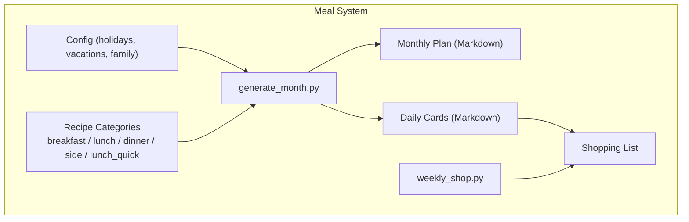
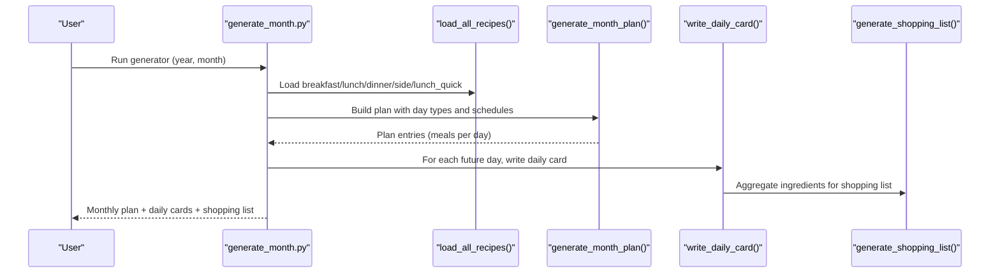
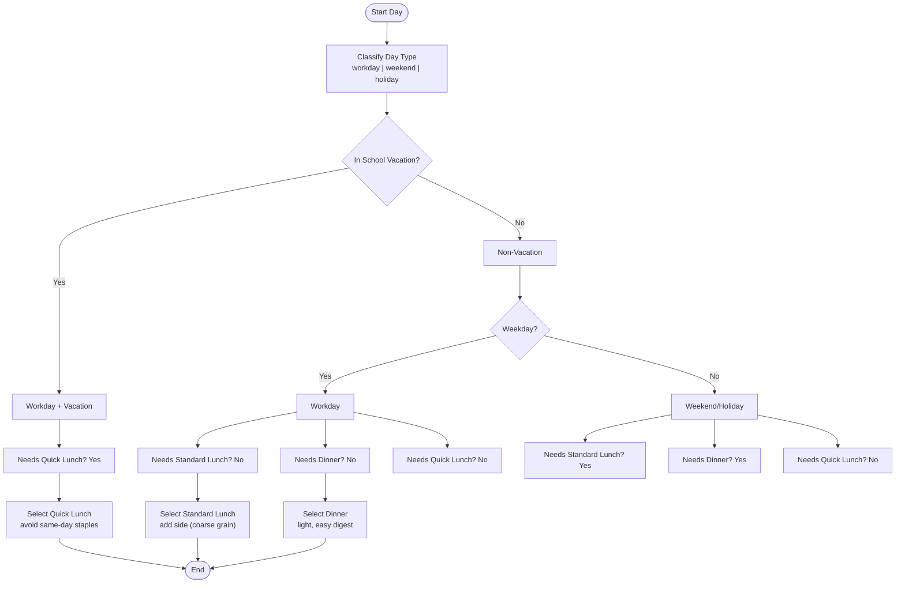
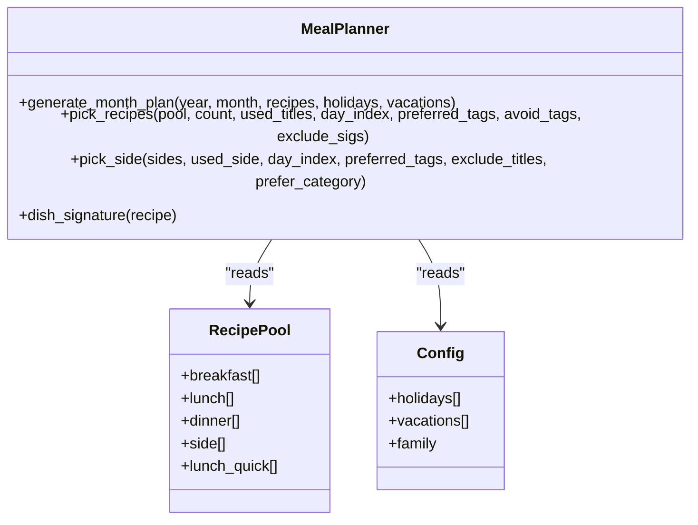
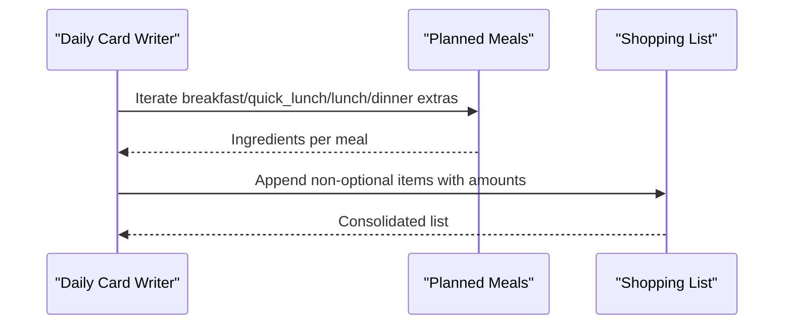
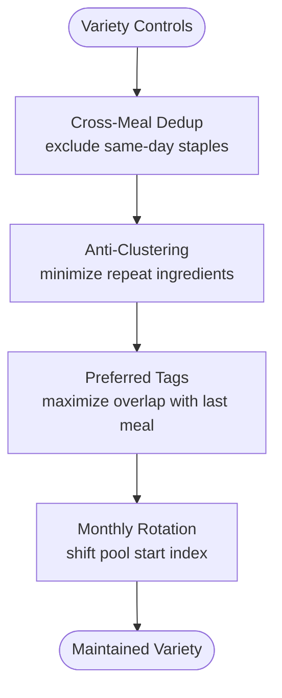
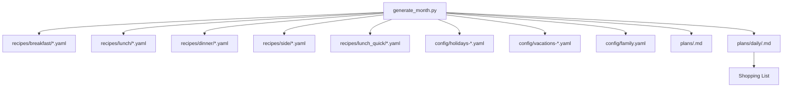

# Lunch Recipes

<cite>
**Referenced Files in This Document**
- [generate_month.py](file://personal/meal/scripts/generate_month.py)
- [weekly_shop.py](file://personal/meal/scripts/weekly_shop.py)
</cite>

## Table of Contents
1. [Introduction](#introduction)
2. [Project Structure](#project-structure)
3. [Core Components](#core-components)
4. [Architecture Overview](#architecture-overview)
5. [Detailed Component Analysis](#detailed-component-analysis)
6. [Dependency Analysis](#dependency-analysis)
7. [Performance Considerations](#performance-considerations)
8. [Troubleshooting Guide](#troubleshooting-guide)
9. [Conclusion](#conclusion)
10. [Appendices](#appendices)

## Introduction
This document explains the lunch recipe system with a focus on both standard lunch recipes and quick lunch variants (lunch_quick). It clarifies their roles, scheduling logic, typical characteristics, selection criteria, and integration points such as shopping list generation and weekly variety maintenance. The goal is to make the system understandable for both technical and non-technical users.

## Project Structure
The meal planning system organizes recipes by category and uses a generator script to produce monthly plans and daily cards. Key elements:
- Recipe categories include breakfast, lunch, dinner, side, and lunch_quick.
- A monthly plan generator reads configuration and recipe data, applies scheduling rules, and outputs Markdown plans and daily cards.
- A weekly shopping utility supports ingredient aggregation for procurement.

[No sources needed since this diagram shows conceptual workflow, not actual code structure]

## Core Components
- Monthly plan generator: Loads recipes and config, determines day types (workday, weekend, holiday), decides which meals are needed, selects dishes using clustering and anti-clustering strategies, and writes outputs.
- Quick lunch variant: Designed for workdays during school vacations when children are home; prepared quickly with minimal midday effort.
- Side dishes: Added to full-day lunches to balance nutrition and reduce waste via ingredient overlap.
- Shopping list generation: Aggregates ingredients from planned meals into a consolidated list.

**Section sources**
- [generate_month.py:218-342](file://personal/meal/scripts/generate_month.py#L218-L342)
- [generate_month.py:345-412](file://personal/meal/scripts/generate_month.py#L345-L412)
- [generate_month.py:436-588](file://personal/meal/scripts/generate_month.py#L436-L588)
- [generate_month.py:591-602](file://personal/meal/scripts/generate_month.py#L591-L602)
- [weekly_shop.py](file://personal/meal/scripts/weekly_shop.py)

## Architecture Overview
The system orchestrates recipe selection and output generation through a clear pipeline:
- Input: Config (holidays, vacations, family preferences) and recipe pools by category.
- Processing: Day-type classification, meal necessity determination, dish selection with preference and avoidance logic, and cross-meal deduplication.
- Output: Monthly overview Markdown and per-day detailed cards including ingredients, steps, prep tasks, and shopping lists.

**Diagram sources**
- [generate_month.py:616-685](file://personal/meal/scripts/generate_month.py#L616-L685)
- [generate_month.py:218-342](file://personal/meal/scripts/generate_month.py#L218-L342)
- [generate_month.py:436-588](file://personal/meal/scripts/generate_month.py#L436-L588)
- [generate_month.py:591-602](file://personal/meal/scripts/generate_month.py#L591-L602)

## Detailed Component Analysis

### Standard Lunch vs. Quick Lunch (lunch_quick)
- Standard lunch: Used on weekends/holidays; paired with a side dish (preferably coarse grains) to ensure balanced nutrition and variety.
- Quick lunch: Used only on workdays during school vacations; designed for speed (≤30 minutes midday) and often includes pre-night preparation.

Key scheduling logic:
- Workday without vacation: No standard lunch or dinner; no quick lunch.
- Workday with vacation: Include quick lunch; still skip standard lunch and dinner.
- Weekend/holiday: Include standard lunch and dinner; no quick lunch.

Selection strategy:
- Avoid repeating the same staple across meals on the same day.
- Prefer ingredient overlap with previous meals to reduce waste.
- Rotate starting points by month to avoid identical sequences across months.

**Diagram sources**
- [generate_month.py:263-342](file://personal/meal/scripts/generate_month.py#L263-L342)

**Section sources**
- [generate_month.py:263-342](file://personal/meal/scripts/generate_month.py#L263-L342)

### Typical Lunch Characteristics
- Balanced nutrition: Protein-rich main plus vegetables and/or whole grains; sides emphasize coarse grains for fiber and satiety.
- Moderate preparation time: Standard lunches may require more steps; quick lunches emphasize ≤30 minutes midday with optional pre-night prep.
- Portability considerations: Noodle/rice-based meals and soups are common patterns that travel well and reheat easily.

Examples of common patterns:
- Rice dishes: One-pot rice with meat/vegetables; pair with soup or salad.
- Noodle meals: Stir-fried noodles or broth-based noodles; add protein and greens.
- Soup combinations: Light soups complementing rice/noodles; good for hot weather.

[No sources needed since this section provides general guidance]

### Selection Logic Based on Context
- Work schedules: Determines whether standard lunch/dinner are needed; quick lunch appears only on vacation workdays.
- Weather conditions: Not explicitly encoded; however, soup-heavy or lighter meals can be favored by curating recipe tags and categories.
- Ingredient availability: Ingredient overlap with previous meals reduces waste; rotation prevents monotony.

**Diagram sources**
- [generate_month.py:114-216](file://personal/meal/scripts/generate_month.py#L114-L216)
- [generate_month.py:218-342](file://personal/meal/scripts/generate_month.py#L218-L342)

**Section sources**
- [generate_month.py:114-216](file://personal/meal/scripts/generate_month.py#L114-L216)
- [generate_month.py:218-342](file://personal/meal/scripts/generate_month.py#L218-L342)

### Integration with Shopping List Generation
- Daily cards aggregate all ingredients from selected meals and append a “shopping list” section.
- Optional weekly shop utility consolidates items for procurement planning.

**Diagram sources**
- [generate_month.py:569-588](file://personal/meal/scripts/generate_month.py#L569-L588)
- [generate_month.py:591-602](file://personal/meal/scripts/generate_month.py#L591-L602)
- [weekly_shop.py](file://personal/meal/scripts/weekly_shop.py)

**Section sources**
- [generate_month.py:569-588](file://personal/meal/scripts/generate_month.py#L569-L588)
- [generate_month.py:591-602](file://personal/meal/scripts/generate_month.py#L591-L602)
- [weekly_shop.py](file://personal/meal/scripts/weekly_shop.py)

### Weekly Meal Variety Maintenance
- Cross-meal deduplication: Prevents repeating the same staple within the same day (e.g., avoiding tomato egg noodles for both breakfast and dinner).
- Anti-clustering for breakfast: Minimizes consecutive days sharing many ingredients.
- Preferred tagging: Encourages ingredient overlap between consecutive meals to reduce waste while maintaining variety.
- Monthly rotation: Shifts starting indices by month to avoid identical sequences across months.

**Diagram sources**
- [generate_month.py:124-184](file://personal/meal/scripts/generate_month.py#L124-L184)
- [generate_month.py:230-244](file://personal/meal/scripts/generate_month.py#L230-L244)

**Section sources**
- [generate_month.py:124-184](file://personal/meal/scripts/generate_month.py#L124-L184)
- [generate_month.py:230-244](file://personal/meal/scripts/generate_month.py#L230-L244)

## Dependency Analysis
- The generator depends on:
  - Recipe pools by category (breakfast, lunch, dinner, side, lunch_quick).
  - Configuration for holidays, vacations, and family settings.
- Outputs depend on:
  - Monthly plan formatting.
  - Daily card writing.
  - Shopping list aggregation.

**Diagram sources**
- [generate_month.py:616-685](file://personal/meal/scripts/generate_month.py#L616-L685)
- [generate_month.py:218-342](file://personal/meal/scripts/generate_month.py#L218-L342)

**Section sources**
- [generate_month.py:616-685](file://personal/meal/scripts/generate_month.py#L616-L685)

## Performance Considerations
- Deterministic selection: Using day_index and monthly rotation ensures predictable outcomes without heavy computation.
- Efficient filtering: Exclude sets and tag matching keep selection fast even with larger recipe pools.
- Batch outputs: Writing monthly and daily files in one run minimizes I/O overhead.

[No sources needed since this section provides general guidance]

## Troubleshooting Guide
- Missing recipes: Ensure all required categories exist and contain valid YAML files; otherwise, the generator will exit early.
- Empty plans: Verify holidays and vacations configurations are correctly loaded; incorrect dates can misclassify day types.
- Repetition issues: Check tag definitions and avoid/preferred logic; adjust ingredient_tags to improve variety.
- Shopping list gaps: Confirm optional flags are set appropriately so non-essential items do not clutter the list.

**Section sources**
- [generate_month.py:642-644](file://personal/meal/scripts/generate_month.py#L642-L644)
- [generate_month.py:263-342](file://personal/meal/scripts/generate_month.py#L263-L342)
- [generate_month.py:591-602](file://personal/meal/scripts/generate_month.py#L591-L602)

## Conclusion
The lunch recipe system distinguishes between standard lunches and quick lunches to match different schedules and contexts. It balances nutrition, convenience, and variety through careful selection logic, cross-meal deduplication, and ingredient overlap strategies. Integrated outputs include monthly plans, daily cards, and shopping lists, supporting efficient meal planning and procurement.

[No sources needed since this section summarizes without analyzing specific files]

## Appendices
- Example usage: Run the generator with year and month parameters to produce plans and daily cards.
- Extending categories: Add new recipe types by updating loading and selection logic accordingly.

[No sources needed since this section provides general guidance]