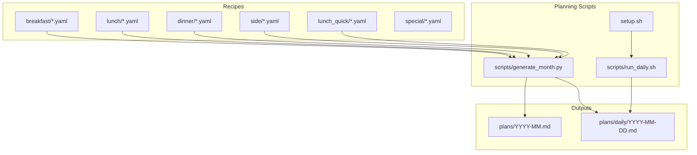
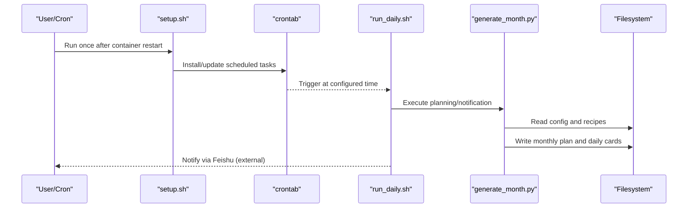
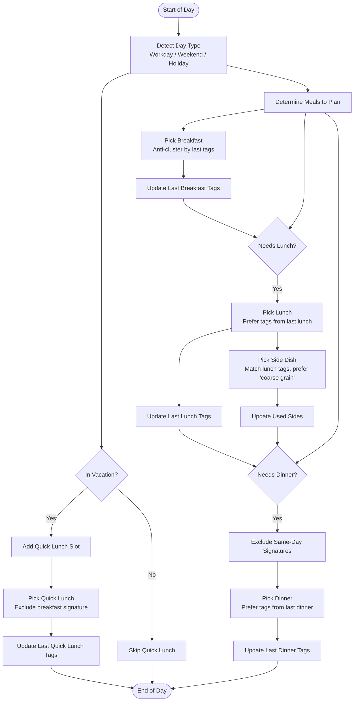
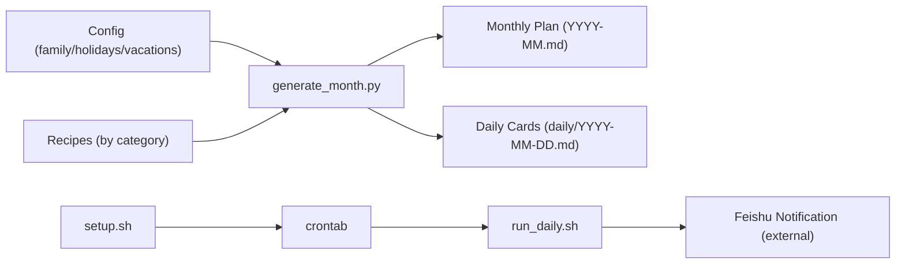

# Recipe Categories and Guidelines

<cite>
**Referenced Files in This Document**
- [generate_month.py](file://meal/scripts/generate_month.py)
- [run_daily.sh](file://meal/scripts/run_daily.sh)
- [setup.sh](file://meal/setup.sh)
</cite>

## Table of Contents
1. [Introduction](#introduction)
2. [Project Structure](#project-structure)
3. [Core Components](#core-components)
4. [Architecture Overview](#architecture-overview)
5. [Detailed Component Analysis](#detailed-component-analysis)
6. [Dependency Analysis](#dependency-analysis)
7. [Performance Considerations](#performance-considerations)
8. [Troubleshooting Guide](#troubleshooting-guide)
9. [Conclusion](#conclusion)
10. [Appendices](#appendices)

## Introduction
This document defines the recipe categories used by the meal planning system, their characteristics, typical preparation times, complexity levels, and nutritional considerations. It also explains how each category integrates with the meal planning algorithm and scheduling logic, including naming conventions, file organization patterns, and example recipes that demonstrate best practices for each meal type. Finally, it addresses how categories relate to family dietary requirements and holiday/vacation scheduling.

## Project Structure
The meal system organizes recipes by category under a single directory tree and uses scripts to generate monthly plans and daily cards. The key directories are:
- recipes/breakfast: Breakfast recipes
- recipes/lunch: Lunch recipes (used as “hard dishes” pool for lunch)
- recipes/dinner: Dinner recipes (used as “light meals” pool for dinner)
- recipes/side: Side dishes and staple sides
- recipes/lunch_quick: Quick lunch options for vacation workdays
- recipes/special: Special occasion recipes

**Diagram sources**
- [generate_month.py](file://meal/scripts/generate_month.py)
- [run_daily.sh](file://meal/scripts/run_daily.sh)
- [setup.sh](file://meal/setup.sh)

**Section sources**
- [generate_month.py](file://meal/scripts/generate_month.py)
- [run_daily.sh](file://meal/scripts/run_daily.sh)
- [setup.sh](file://meal/setup.sh)

## Core Components
- Category pools: breakfast, lunch, dinner, side, lunch_quick, special
- Planning engine: generates monthly plan and daily cards based on day type (workday/weekend/holiday), vacations, and ingredient-based selection rules
- Notification and setup: cron-driven daily notification and environment bootstrap

Key behaviors from the planning script:
- Day-type detection considers holidays, make-up workdays, weekends, and vacations
- Meal assignment:
  - Workdays: breakfast only; during school vacations, add a quick lunch
  - Weekends/holidays: breakfast + lunch + dinner
- Selection strategies:
  - Avoid repeating titles within the same day across meals
  - Prefer or avoid ingredient tags to reduce waste or variety clustering
  - Rotate starting points per month to avoid identical sequences across months

**Section sources**
- [generate_month.py](file://meal/scripts/generate_month.py)

## Architecture Overview
The planning pipeline loads configuration (family, holidays, vacations), reads all recipe YAML files by category, applies selection heuristics, and writes both a monthly overview and individual daily cards. A daily cron job triggers notifications using generated daily cards.

**Diagram sources**
- [setup.sh](file://meal/setup.sh)
- [run_daily.sh](file://meal/scripts/run_daily.sh)
- [generate_month.py](file://meal/scripts/generate_month.py)

## Detailed Component Analysis

### Category Definitions and Characteristics
- breakfast
  - Purpose: Morning meals designed for speed and child-friendly flavors
  - Typical prep time: Short morning steps; often includes “night prep” items
  - Complexity: Low to moderate
  - Nutritional focus: Balanced carbs/protein/fats; dairy/soy options; gentle flavors
  - Integration: Always included; uses anti-clustering to avoid repeating similar ingredients back-to-back
- lunch
  - Purpose: Main midday meal (“eat well at noon”)
  - Typical prep time: Moderate; may include multiple components
  - Complexity: Moderate to high
  - Nutritional focus: Hearty proteins, vegetables, and grains; paired with a side dish
  - Integration: Uses preferred ingredient tags to cluster with previous lunch for efficiency
- dinner
  - Purpose: Lighter evening meals (“eat less at night”)
  - Typical prep time: Short to moderate; easy digestion emphasis
  - Complexity: Low to moderate
  - Nutritional focus: Lighter proteins, soups/noodles/rice bowls; minimal heavy sauces
  - Integration: Cross-meal deduplication prevents same main staple as breakfast/lunch
- side
  - Purpose: Supplementary dishes and staples (vegetables, soups, whole grains)
  - Typical prep time: Short
  - Complexity: Low
  - Nutritional focus: Fiber, micronutrients, complex carbs; complements lunch
  - Integration: Selected to match lunch’s ingredient tags when possible; category filter supports “coarse grain” preference
- lunch_quick
  - Purpose: Fast lunches for vacation workdays (prepped the night before; ≤30 minutes at noon)
  - Typical prep time: Minimal at cooking time; relies on “night prep”
  - Complexity: Low
  - Nutritional focus: Balanced but quick; suitable for two servings
  - Integration: Added only during vacations on workdays; cross-meal deduplication against breakfast
- special
  - Purpose: Occasional or festival recipes
  - Typical prep time: Variable; often longer
  - Complexity: Moderate to high
  - Nutritional focus: Seasonal or celebratory; not part of routine rotation
  - Integration: Not used by the default planner; kept for manual inclusion or future extensions

Naming conventions and file organization:
- Each category is a folder under recipes/<category>/
- Files use numeric prefixes for stable ordering (e.g., 01-, 02-)
- Filenames encode dish names; the planner extracts a “dish signature” from the title to prevent same-day repeats across meals
- Example files exist for each category (see Appendix for paths)

Family dietary requirements integration:
- Ingredient tags support preference matching and anti-clustering
- Holiday and vacation configs influence which meals are planned and whether quick lunch is added
- Family profile drives output tone and constraints (e.g., child-friendly, low spice/oil)

**Section sources**
- [generate_month.py](file://meal/scripts/generate_month.py)

### Algorithmic Flow: Category Selection and Scheduling

**Diagram sources**
- [generate_month.py](file://meal/scripts/generate_month.py)

**Section sources**
- [generate_month.py](file://meal/scripts/generate_month.py)

### Category-Specific Best Practices and Examples
- breakfast
  - Keep morning steps short; leverage “night prep” where possible
  - Vary textures and flavors daily; avoid repeating similar base ingredients
  - Example path: [breakfast/01-奶香玉米汁-西葫芦鸡蛋饼.yaml](file://meal/recipes/breakfast/01-奶香玉米汁-西葫芦鸡蛋饼.yaml)
- lunch
  - Choose hearty mains with built-in vegetables/staples
  - Pair with a side dish emphasizing coarse grains or seasonal vegetables
  - Example path: [lunch/01-茄汁肉酱蝴蝶面-鲫鱼汤.yaml](file://meal/recipes/lunch/01-茄汁肉酱蝴蝶面-鲫鱼汤.yaml)
- dinner
  - Favor lighter preparations (soups, noodles, rice bowls)
  - Ensure no overlap of main staple with breakfast/lunch on the same day
  - Example path: [dinner/01-香菇滑鸡-上汤娃娃菜.yaml](file://meal/recipes/dinner/01-香菇滑鸡-上汤娃娃菜.yaml)
- side
  - Focus on fiber-rich vegetables, legumes, and whole grains
  - Use category tags like “coarse grain” to complement lunch
  - Example path: [side/01-蒜蓉油麦菜.yaml](file://meal/recipes/side/01-蒜蓉油麦菜.yaml)
- lunch_quick
  - Design for two servings; rely on “night prep” and simple noon steps
  - Keep total active time ≤30 minutes
  - Example path: [lunch_quick/03-番茄虾仁蛋炒饭.yaml](file://meal/recipes/lunch_quick/03-番茄虾仁蛋炒饭.yaml)
- special
  - Reserve for festivals or special days; not auto-scheduled
  - Example path: [special/01-蜜枣粽子.yaml](file://meal/recipes/special/01-蜜枣粽子.yaml)

[No sources needed since this section references file paths without analyzing code]

## Dependency Analysis
- Configuration inputs: family, holidays, vacations
- Recipe inputs: categorized YAML files
- Outputs: monthly plan markdown and daily card markdowns
- Scheduling: crontab entries installed by setup.sh; run_daily.sh executes notification logic

**Diagram sources**
- [generate_month.py](file://meal/scripts/generate_month.py)
- [run_daily.sh](file://meal/scripts/run_daily.sh)
- [setup.sh](file://meal/setup.sh)

**Section sources**
- [generate_month.py](file://meal/scripts/generate_month.py)
- [run_daily.sh](file://meal/scripts/run_daily.sh)
- [setup.sh](file://meal/setup.sh)

## Performance Considerations
- Deterministic rotation per month avoids identical sequences across months while preserving reproducibility
- Ingredient-tag scoring reduces food waste by clustering shared ingredients across consecutive meals
- Title and signature deduplication prevents repetitive staples within the same day
- Side dish selection prioritizes category filters (e.g., coarse grains) to improve nutritional balance

[No sources needed since this section provides general guidance]

## Troubleshooting Guide
- Missing dependencies: PyYAML installation is handled by setup.sh and run_daily.sh; if cron jobs fail, re-run setup.sh
- Timezone awareness: Crontab runs in UTC; schedule offsets are applied in comments and scripts
- No recipes found: Ensure recipe YAML files exist under the correct category folders; the generator exits early if none are found
- Overlap issues: If same-day overlaps occur, verify dish signatures in titles and ensure unique naming

**Section sources**
- [setup.sh](file://meal/setup.sh)
- [run_daily.sh](file://meal/scripts/run_daily.sh)
- [generate_month.py](file://meal/scripts/generate_month.py)

## Conclusion
The meal planning system categorizes recipes into six types, each with distinct goals, timing, and complexity. The planning algorithm integrates these categories with family schedules, holidays, and vacations, applying smart selection heuristics to produce balanced, varied, and efficient weekly and monthly plans. Clear naming and file organization enable reliable automation and maintainability.

[No sources needed since this section summarizes without analyzing specific files]

## Appendices

### Category Summary Table
- breakfast: Short prep, child-friendly, anti-clustering by tags
- lunch: Hearty mains, paired with side, tag-preference clustering
- dinner: Lighter meals, cross-meal signature deduplication
- side: Vegetables/grains, category filters (e.g., coarse grain)
- lunch_quick: Vacation workday fast lunch, night prep driven
- special: Occasional recipes, not auto-scheduled

[No sources needed since this section provides general guidance]

### Example Recipe Paths
- breakfast: [meal/recipes/breakfast/01-奶香玉米汁-西葫芦鸡蛋饼.yaml](file://meal/recipes/breakfast/01-奶香玉米汁-西葫芦鸡蛋饼.yaml)
- lunch: [meal/recipes/lunch/01-茄汁肉酱蝴蝶面-鲫鱼汤.yaml](file://meal/recipes/lunch/01-茄汁肉酱蝴蝶面-鲫鱼汤.yaml)
- dinner: [meal/recipes/dinner/01-香菇滑鸡-上汤娃娃菜.yaml](file://meal/recipes/dinner/01-香菇滑鸡-上汤娃娃菜.yaml)
- side: [meal/recipes/side/01-蒜蓉油麦菜.yaml](file://meal/recipes/side/01-蒜蓉油麦菜.yaml)
- lunch_quick: [meal/recipes/lunch_quick/03-番茄虾仁蛋炒饭.yaml](file://meal/recipes/lunch_quick/03-番茄虾仁蛋炒饭.yaml)
- special: [meal/recipes/special/01-蜜枣粽子.yaml](file://meal/recipes/special/01-蜜枣粽子.yaml)

[No sources needed since this section lists file paths without analyzing code]