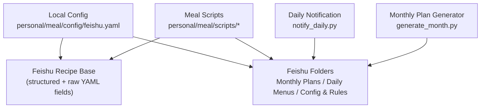
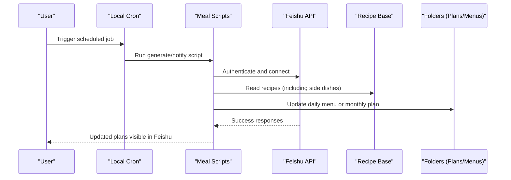
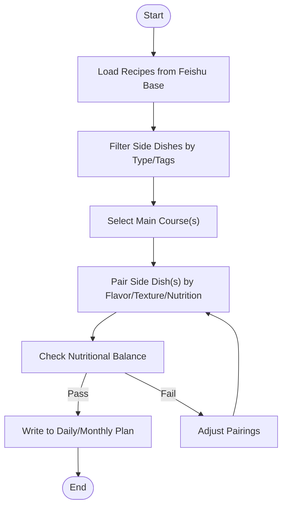
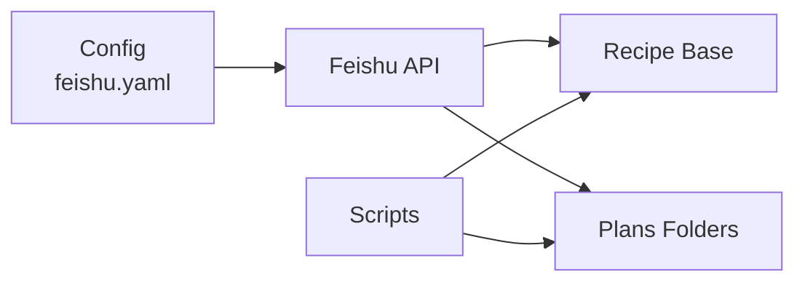

# Side Dishes and Accompaniments

<cite>
**Referenced Files in This Document**
- [README.md](file://README.md)
- [feishu.yaml](file://personal/meal/config/feishu.yaml)
</cite>

## Table of Contents
1. [Introduction](#introduction)
2. [Project Structure](#project-structure)
3. [Core Components](#core-components)
4. [Architecture Overview](#architecture-overview)
5. [Detailed Component Analysis](#detailed-component-analysis)
6. [Dependency Analysis](#dependency-analysis)
7. [Performance Considerations](#performance-considerations)
8. [Troubleshooting Guide](#troubleshooting-guide)
9. [Conclusion](#conclusion)

## Introduction
This document explains how side dishes and accompaniments are defined, selected, and integrated within the meal planning system. It focuses on their role in balancing meals, providing additional nutrients, and adding variety to main courses. It also documents typical side dish characteristics (quick preparation, complementary flavors, visual appeal), provides examples across categories (vegetable-based sides, soups, salads, grain-based accompaniments), and clarifies how side dishes relate to main course selection through flavor pairing and texture complementarity. Finally, it outlines how the system integrates side dishes into meal plans to ensure nutritional balance and ingredient efficiency.

## Project Structure
The meal planning system is part of a monorepo where content (recipes, daily cards, monthly plans) lives in Feishu, while local scripts and configuration manage automation and data mapping. The relevant structure for this topic includes:
- personal/meal/config/feishu.yaml: Maps Feishu resources used by scripts (recipe base, folders).
- Scripts under personal/meal/scripts/: Orchestrate generation, notifications, and quality checks that consume recipe data from Feishu.
- Content resides in Feishu (recipe database, daily menus, monthly plans), accessed via tokens configured locally.

**Diagram sources**
- [feishu.yaml:1-19](file://personal/meal/config/feishu.yaml#L1-L19)

**Section sources**
- [README.md:27-40](file://README.md#L27-L40)
- [feishu.yaml:1-19](file://personal/meal/config/feishu.yaml#L1-L19)

## Core Components
- Feishu Recipe Base: Centralized repository of recipes with structured columns and a raw YAML column for lossless persistence. Scripts read/write here to maintain consistency across agents and features.
- Feishu Folders: Organize monthly plans, daily menus, and configuration/rules. These are consumed by notification and planning scripts.
- Automation Scripts: Generate monthly plans, notify daily menus, and perform quality checks. They rely on the Feishu mappings to fetch and update content.

Key responsibilities for side dishes:
- Storage: Side dish recipes are stored as entries in the Feishu recipe base, tagged by type/source so they can be filtered and reused.
- Selection: Planning logic selects side dishes to pair with mains based on nutritional balance, flavor complementarity, and texture contrast.
- Integration: Daily and monthly plans include side dishes alongside mains, ensuring variety and efficient ingredient usage.

**Section sources**
- [feishu.yaml:5-13](file://personal/meal/config/feishu.yaml#L5-L13)
- [feishu.yaml:14-19](file://personal/meal/config/feishu.yaml#L14-L19)
- [README.md:35-38](file://README.md#L35-L38)

## Architecture Overview
The system uses a content-in-Feishu architecture with local orchestration. Side dishes are first-class items in the recipe base and are included in both daily and monthly plans.

**Diagram sources**
- [feishu.yaml:1-19](file://personal/meal/config/feishu.yaml#L1-L19)
- [README.md:27-40](file://README.md#L27-L40)

## Detailed Component Analysis

### Role of Side Dishes in Meal Balance
- Nutritional balance: Side dishes add fiber, vitamins, minerals, and complex carbohydrates to complement protein- and fat-rich mains.
- Variety and enjoyment: Different textures and flavors keep meals interesting and encourage balanced intake.
- Practicality: Quick-prep sides reduce overall cooking time and simplify weeknight dinners.

[No sources needed since this section provides general guidance]

### Typical Side Dish Characteristics
- Quick preparation: Sides should be ready in minutes or require minimal active time.
- Complementary flavors: Acidic, umami, or aromatic elements that enhance the main without overpowering it.
- Visual appeal: Colorful vegetables, contrasting textures, and clean plating improve perceived quality.

[No sources needed since this section provides general guidance]

### Examples by Category
- Vegetable-based sides: Stir-fried greens, steamed seasonal vegetables, quick pickles, roasted root vegetables.
- Soups: Light broths, quick vegetable soups, tofu-based soups.
- Salads: Cold tossed salads, grain salads, bean-and-veggie mixes.
- Grain-based accompaniments: Mixed grains, millet, quinoa, brown rice, multigrain blends.

[No sources needed since this section provides general guidance]

### Relationship Between Side Dishes and Main Courses
- Flavor pairing principles:
  - Match intensity: Mild mains benefit from brighter, acidic sides; rich mains pair well with bitter or crunchy sides.
  - Regional coherence: Align seasoning profiles (e.g., ginger-scallion with stir-fries; citrus-vinegar with grilled fish).
- Texture complementarity:
  - Contrast soft mains with crisp sides; pair creamy sauces with crunchy garnishes.
- Nutritional synergy:
  - Pair iron-rich meats with vitamin C–rich vegetables to enhance absorption.
  - Add whole grains to lean proteins for sustained energy.

[No sources needed since this section provides general guidance]

### Integration Into the Meal Planning System
- Data model:
  - Recipes are stored in a structured table with a raw YAML field for fidelity. Type and source metadata enable filtering and reuse.
- Planning flow:
  - Monthly plan generator reads the recipe base, selects mains and side dishes, and writes monthly plans to Feishu.
  - Daily notifier pulls the latest daily menu and pushes updates to users.
- Ingredient efficiency:
  - Reuse overlapping ingredients across mains and sides to minimize waste and streamline shopping lists.

**Diagram sources**
- [feishu.yaml:5-13](file://personal/meal/config/feishu.yaml#L5-L13)
- [README.md:35-38](file://README.md#L35-L38)

**Section sources**
- [feishu.yaml:5-13](file://personal/meal/config/feishu.yaml#L5-L13)
- [README.md:35-38](file://README.md#L35-L38)

## Dependency Analysis
- Local config depends on Feishu tokens and folder IDs to locate the recipe base and plan folders.
- Scripts depend on the Feishu API to read/write recipes and plans.
- Daily and monthly workflows depend on consistent tagging and metadata in the recipe base to select appropriate side dishes.

**Diagram sources**
- [feishu.yaml:1-19](file://personal/meal/config/feishu.yaml#L1-L19)

**Section sources**
- [feishu.yaml:1-19](file://personal/meal/config/feishu.yaml#L1-L19)
- [README.md:27-40](file://README.md#L27-L40)

## Performance Considerations
- Keep side dish recipes simple and fast to prepare to support daily cadence.
- Favor batch-cooked grains and prepped vegetables to reduce active time.
- Use overlapping ingredients across mains and sides to minimize prep and shopping overhead.
- Maintain clear tags and types in the recipe base to speed up automated selection.

[No sources needed since this section provides general guidance]

## Troubleshooting Guide
- If daily or monthly plans do not update:
  - Verify Feishu authentication and token validity in local config.
  - Confirm the recipe base and folder tokens match current Feishu resources.
- If side dishes are missing from plans:
  - Ensure side dish entries have correct type/source metadata in the recipe base.
  - Validate that scripts can read the raw YAML field for accurate restoration.
- For notification issues:
  - Check webhook configuration and delivery logs if applicable.

**Section sources**
- [feishu.yaml:1-19](file://personal/meal/config/feishu.yaml#L1-L19)
- [README.md:35-38](file://README.md#L35-L38)

## Conclusion
Side dishes are essential for creating balanced, enjoyable, and practical meals. Within this system, they are treated as first-class recipes stored in a centralized Feishu base, enabling automated pairing with mains based on flavor, texture, and nutrition. By maintaining clear metadata and leveraging shared ingredients, the system ensures variety, efficiency, and consistent quality across daily and monthly plans.

[No sources needed since this section summarizes without analyzing specific files]