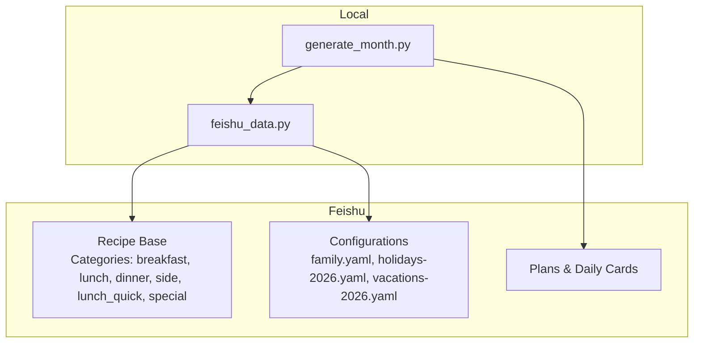
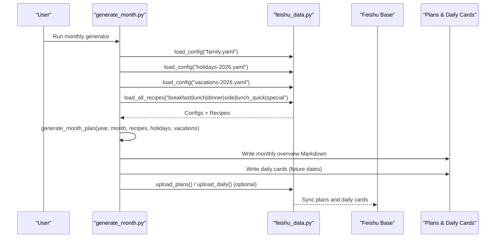
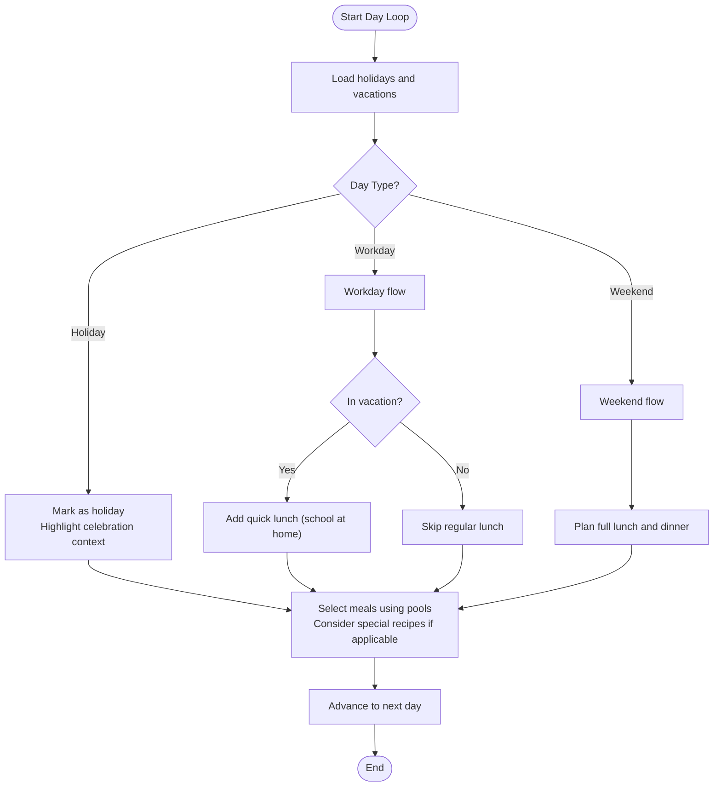
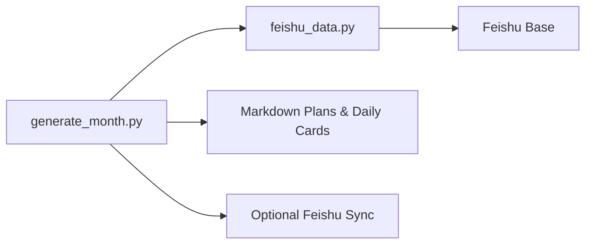

# Special Occasion Recipes

<cite>
**Referenced Files in This Document**
- [README.md](file://README.md)
- [generate_month.py](file://personal/meal/scripts/generate_month.py)
- [feishu_data.py](file://personal/meal/scripts/feishu_data.py)
</cite>

## Table of Contents
1. Introduction
2. Project Structure
3. Core Components
4. Architecture Overview
5. Detailed Component Analysis
6. Dependency Analysis
7. Performance Considerations
8. Troubleshooting Guide
9. Conclusion

## Introduction
This document explains how special occasion recipes and seasonal dishes are integrated into the family meal planning system. It covers:
- What makes a recipe “special” (festive themes, cultural significance, enhanced presentation)
- How special recipes relate to holiday calendars, vacations, and family celebrations
- Examples of traditional Chinese festival foods, birthday celebrations, and seasonal specialties
- The scheduling logic for special recipes within monthly plans, including advance preparation and ingredient sourcing
- How special recipes align with family cultural traditions, dietary preferences, and nutritional needs during celebrations

The system’s content (recipes, plans, configurations) lives in Feishu; local scripts orchestrate generation and synchronization.

## Project Structure
At a high level:
- Scripts live locally and read/write data via Feishu
- Monthly plan generation integrates holidays and vacations to shape daily meals
- A dedicated “special” recipe category is supported by the data layer

**Diagram sources**
- [generate_month.py](file://personal/meal/scripts/generate_month.py)
- [feishu_data.py](file://personal/meal/scripts/feishu_data.py)

**Section sources**
- [README.md](file://README.md)

## Core Components
- Monthly plan generator: orchestrates day-by-day selection across meal types, respects holidays/vacations, and writes monthly overview plus daily cards.
- Data access layer: loads configs and recipes from Feishu when available, otherwise falls back to local YAML files.
- Recipe categories: includes a “special” category alongside standard meal types.

Key responsibilities:
- Holiday detection and workday compensation handling
- Vacation-aware weekday lunch provisioning (quick lunches)
- Ingredient-based clustering and anti-clustering to diversify flavors and reduce waste
- Rotation across months to avoid repetitive sequences

**Section sources**
- [generate_month.py](file://personal/meal/scripts/generate_month.py)
- [feishu_data.py](file://personal/meal/scripts/feishu_data.py)

## Architecture Overview
The monthly planner reads configuration and recipe catalogs, determines each day’s type (workday, weekend, holiday), and selects appropriate meals. Special occasion recipes can be included in the catalog and surfaced on relevant days or used as celebratory additions.

**Diagram sources**
- [generate_month.py](file://personal/meal/scripts/generate_month.py)
- [feishu_data.py](file://personal/meal/scripts/feishu_data.py)

## Detailed Component Analysis

### Scheduling Logic for Special Recipes
Special recipes are part of the same catalog pipeline as other meal types. While the default planner focuses on breakfast/lunch/dinner/side/quick-lunch pools, the presence of a “special” category indicates that festive or celebratory dishes can be curated and scheduled. Typical integration patterns include:
- Flagging certain days as “holiday” based on configured holiday ranges
- Using vacation windows to adjust meal composition (e.g., adding quick lunches on school holidays)
- Leveraging ingredient tags to cluster or diversify dishes around celebrations

**Diagram sources**
- [generate_month.py](file://personal/meal/scripts/generate_month.py)

**Section sources**
- [generate_month.py](file://personal/meal/scripts/generate_month.py)

### Holiday and Vacation Integration
- Holidays: Dates are matched against configured holiday ranges; matching days are labeled as holidays and highlighted in outputs.
- Workday compensation: Certain weekends may be treated as workdays based on configuration.
- Vacations: School vacation periods trigger additional weekday lunches (quick style) to accommodate children at home.

These rules directly influence which meals are planned and how many per day.

**Section sources**
- [generate_month.py](file://personal/meal/scripts/generate_month.py)

### Recipe Selection and Diversity Controls
- Ingredient-based scoring: Recipes carry ingredient tags; the planner prefers dishes sharing ingredients with previous meals to reduce waste (clustering) or avoids repeating similar ingredients (anti-clustering).
- Cross-meal deduplication: Prevents the same staple dish from appearing in multiple meals on the same day.
- Month rotation: Each pool is rotated by a seed derived from year/month to avoid identical sequences across months.

These mechanisms ensure variety and practicality even when special recipes are introduced.

**Section sources**
- [generate_month.py](file://personal/meal/scripts/generate_month.py)

### Data Layer and “Special” Category Support
- Config loading: Prioritizes Feishu-backed config; falls back to local YAML when offline.
- Recipe loading: Supports multiple categories, including “special,” enabling festive and seasonal dishes to be part of the catalog.
- Upload hooks: Optional sync of generated plans and daily cards to Feishu.

This design allows special recipes to coexist with everyday meals while keeping all content centrally managed in Feishu.

**Section sources**
- [feishu_data.py](file://personal/meal/scripts/feishu_data.py)
- [generate_month.py](file://personal/meal/scripts/generate_month.py)

## Dependency Analysis
- generate_month.py depends on feishu_data.py for configuration and recipe retrieval.
- Both rely on Feishu Base for authoritative content; local YAML serves as fallback.
- Output artifacts are written locally and optionally synchronized to Feishu.

**Diagram sources**
- [generate_month.py](file://personal/meal/scripts/generate_month.py)
- [feishu_data.py](file://personal/meal/scripts/feishu_data.py)

**Section sources**
- [README.md](file://README.md)
- [generate_month.py](file://personal/meal/scripts/generate_month.py)
- [feishu_data.py](file://personal/meal/scripts/feishu_data.py)

## Performance Considerations
- Deterministic selection with rotation reduces repetition without heavy computation.
- Ingredient tag matching uses set operations and simple sorting; complexity is linear in pool size per selection.
- Offline fallback avoids network latency when Feishu is unavailable.

[No sources needed since this section provides general guidance]

## Troubleshooting Guide
- Missing Feishu connectivity: The script falls back to local YAML; verify local paths if Feishu is down.
- No recipes found: Ensure recipe categories exist in Feishu or locally; the generator exits early if none are loaded.
- Unexpected day types: Confirm holiday ranges and workday compensation entries in configuration.
- Duplicate staples across meals: The cross-meal signature check prevents repeats; review title normalization if duplicates persist.

**Section sources**
- [generate_month.py](file://personal/meal/scripts/generate_month.py)

## Conclusion
Special occasion recipes integrate seamlessly into the existing meal planning system through shared data structures and scheduling logic. By leveraging holiday and vacation inputs, ingredient-based diversity controls, and optional Feishu synchronization, families can celebrate festivals and birthdays while maintaining balanced, low-waste, and culturally meaningful meals.

[No sources needed since this section summarizes without analyzing specific files]