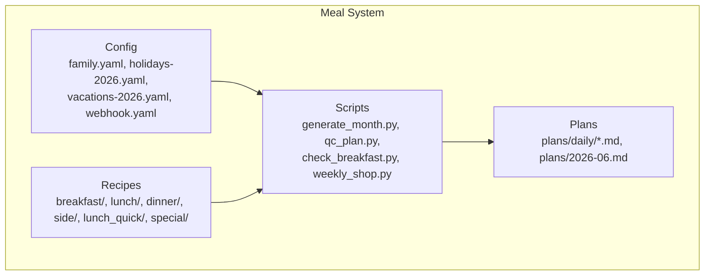
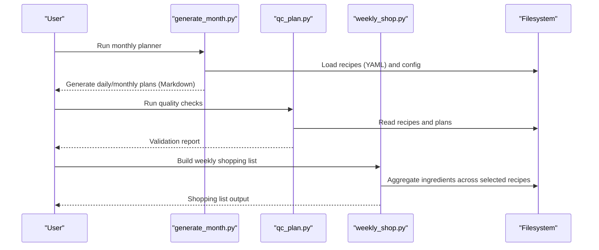
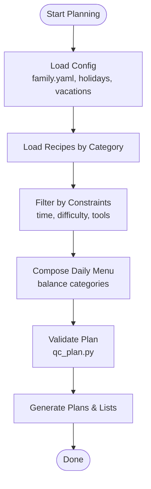
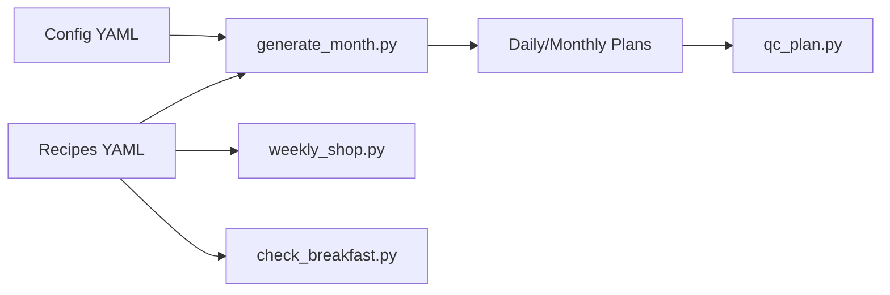

# Recipe Database Management

<cite>
**Referenced Files in This Document**
- [meal/README.md](file://meal/README.md)
- [meal/config/family.yaml](file://meal/config/family.yaml)
- [meal/config/holidays-2026.yaml](file://meal/config/holidays-2026.yaml)
- [meal/config/vacations-2026.yaml](file://meal/config/vacations-2026.yaml)
- [meal/config/webhook.yaml](file://meal/config/webhook.yaml)
- [meal/scripts/check_breakfast.py](file://meal/scripts/check_breakfast.py)
- [meal/scripts/generate_month.py](file://meal/scripts/generate_month.py)
- [meal/scripts/qc_plan.py](file://meal/scripts/qc_plan.py)
- [meal/scripts/weekly_shop.py](file://meal/scripts/weekly_shop.py)
- [meal/recipes/breakfast/01-奶香玉米汁-西葫芦鸡蛋饼.yaml](file://meal/recipes/breakfast/01-奶香玉米汁-西葫芦鸡蛋饼.yaml)
- [meal/recipes/dinner/01-香菇滑鸡-上汤娃娃菜.yaml](file://meal/recipes/dinner/01-香菇滑鸡-上汤娃娃菜.yaml)
- [meal/recipes/lunch/01-茄汁肉酱蝴蝶面-鲫鱼汤.yaml](file://meal/recipes/lunch/01-茄汁肉酱蝴蝶面-鲫鱼汤.yaml)
- [meal/recipes/side/01-蒜蓉油麦菜.yaml](file://meal/recipes/side/01-蒜蓉油麦菜.yaml)
- [meal/recipes/lunch_quick/03-番茄虾仁蛋炒饭.yaml](file://meal/recipes/lunch_quick/03-番茄虾仁蛋炒饭.yaml)
- [meal/recipes/special/01-蜜枣粽子.yaml](file://meal/recipes/special/01-蜜枣粽子.yaml)
</cite>

## Table of Contents
1. [Introduction](#introduction)
2. [Project Structure](#project-structure)
3. [Core Components](#core-components)
4. [Architecture Overview](#architecture-overview)
5. [Detailed Component Analysis](#detailed-component-analysis)
6. [Dependency Analysis](#dependency-analysis)
7. [Performance Considerations](#performance-considerations)
8. [Troubleshooting Guide](#troubleshooting-guide)
9. [Conclusion](#conclusion)
10. [Appendices](#appendices)

## Introduction
This document explains the Recipe Database Management system used to organize, validate, and plan meals using YAML-based recipe files. It covers:
- The canonical YAML schema for recipes (required fields and conventions)
- Recipe categories and their characteristics
- How recipe types relate to meal planning logic
- Concrete examples from actual recipes
- Common issues such as ingredient standardization, nutritional tagging, and validation rules

The system is primarily data-driven: recipes are stored as YAML files under category folders, and scripts read these files to generate plans, check quality, and produce shopping lists.

## Project Structure
At a high level, the meal subsystem contains:
- Recipes organized by category under meal/recipes/<category>/
- Configuration for family preferences, holidays, vacations, and webhooks under meal/config/
- Scripts that generate monthly plans, perform quality checks, and build weekly shopping lists under meal/scripts/
- Generated daily and monthly plans under meal/plans/

**Diagram sources**
- [meal/config/family.yaml](file://meal/config/family.yaml)
- [meal/config/holidays-2026.yaml](file://meal/config/holidays-2026.yaml)
- [meal/config/vacations-2026.yaml](file://meal/config/vacations-2026.yaml)
- [meal/config/webhook.yaml](file://meal/config/webhook.yaml)
- [meal/scripts/generate_month.py](file://meal/scripts/generate_month.py)
- [meal/scripts/qc_plan.py](file://meal/scripts/qc_plan.py)
- [meal/scripts/check_breakfast.py](file://meal/scripts/check_breakfast.py)
- [meal/scripts/weekly_shop.py](file://meal/scripts/weekly_shop.py)

**Section sources**
- [meal/README.md](file://meal/README.md)

## Core Components
- Recipe YAML schema: A consistent set of keys defines each recipe’s metadata, ingredients, and preparation steps.
- Category folders: Recipes are grouped into breakfast, lunch, dinner, side, lunch_quick, and special.
- Planning scripts: Read recipes and configuration to generate daily/monthly plans and shopping lists.
- Quality control scripts: Validate recipes and generated plans.

Key responsibilities:
- Data definition: Each YAML file describes one recipe with standardized fields.
- Planning: Scripts assemble recipes into coherent daily and monthly plans.
- Validation: Scripts enforce required fields, consistency, and constraints.

**Section sources**
- [meal/scripts/generate_month.py](file://meal/scripts/generate_month.py)
- [meal/scripts/qc_plan.py](file://meal/scripts/qc_plan.py)
- [meal/scripts/check_breakfast.py](file://meal/scripts/check_breakfast.py)
- [meal/scripts/weekly_shop.py](file://meal/scripts/weekly_shop.py)

## Architecture Overview
The system follows a simple data pipeline:
- Input: YAML recipes + config files
- Processing: Python scripts parse YAML, apply rules, and generate outputs
- Output: Daily Markdown plans and weekly shopping lists

**Diagram sources**
- [meal/scripts/generate_month.py](file://meal/scripts/generate_month.py)
- [meal/scripts/qc_plan.py](file://meal/scripts/qc_plan.py)
- [meal/scripts/weekly_shop.py](file://meal/scripts/weekly_shop.py)

## Detailed Component Analysis

### Recipe YAML Schema
Each recipe is defined in a single YAML file with the following required fields:
- title: Human-readable name of the recipe
- type: One of breakfast, lunch, dinner, side, lunch_quick, special
- difficulty: Qualitative difficulty indicator (e.g., easy, medium, hard)
- total_time: Total preparation and cooking time (minutes or ISO duration)
- servings: Number of servings
- tools: List of equipment/tools needed
- ingredients: Structured list of ingredients with amount and optional notes
- night_prep: Optional pre-preparation steps done the night before
- morning_steps: Steps to execute in the morning (for quick breakfasts)
- notes: Additional tips, variations, or reminders

Notes on structure:
- Ingredients should include a quantity and unit where applicable, plus an optional note describing state (e.g., chopped, sliced).
- Tools should be concise and specific (e.g., “non-stick pan”, “blender”).
- Time units must be consistent across recipes.
- Difficulty levels should be normalized to a small set of values.

Example references:
- Breakfast example: [meal/recipes/breakfast/01-奶香玉米汁-西葫芦鸡蛋饼.yaml](file://meal/recipes/breakfast/01-奶香玉米汁-西葫芦鸡蛋饼.yaml)
- Dinner example: [meal/recipes/dinner/01-香菇滑鸡-上汤娃娃菜.yaml](file://meal/recipes/dinner/01-香菇滑鸡-上汤娃娃菜.yaml)
- Lunch example: [meal/recipes/lunch/01-茄汁肉酱蝴蝶面-鲫鱼汤.yaml](file://meal/recipes/lunch/01-茄汁肉酱蝴蝶面-鲫鱼汤.yaml)
- Side example: [meal/recipes/side/01-蒜蓉油麦菜.yaml](file://meal/recipes/side/01-蒜蓉油麦菜.yaml)
- Quick lunch example: [meal/recipes/lunch_quick/03-番茄虾仁蛋炒饭.yaml](file://meal/recipes/lunch_quick/03-番茄虾仁蛋炒饭.yaml)
- Special example: [meal/recipes/special/01-蜜枣粽子.yaml](file://meal/recipes/special/01-蜜枣粽子.yaml)

**Section sources**
- [meal/recipes/breakfast/01-奶香玉米汁-西葫芦鸡蛋饼.yaml](file://meal/recipes/breakfast/01-奶香玉米汁-西葫芦鸡蛋饼.yaml)
- [meal/recipes/dinner/01-香菇滑鸡-上汤娃娃菜.yaml](file://meal/recipes/dinner/01-香菇滑鸡-上汤娃娃菜.yaml)
- [meal/recipes/lunch/01-茄汁肉酱蝴蝶面-鲫鱼汤.yaml](file://meal/recipes/lunch/01-茄汁肉酱蝴蝶面-鲫鱼汤.yaml)
- [meal/recipes/side/01-蒜蓉油麦菜.yaml](file://meal/recipes/side/01-蒜蓉油麦菜.yaml)
- [meal/recipes/lunch_quick/03-番茄虾仁蛋炒饭.yaml](file://meal/recipes/lunch_quick/03-番茄虾仁蛋炒饭.yaml)
- [meal/recipes/special/01-蜜枣粽子.yaml](file://meal/recipes/special/01-蜜枣粽子.yaml)

### Recipe Categories and Characteristics
- breakfast: Typically includes morning_steps and may emphasize speed; often pairs multiple items (e.g., drink + main + side).
- lunch: Balanced meals suitable for midday; may include soup or salad components.
- dinner: Heavier or more complex dishes; often includes multiple components.
- side: Simple accompaniments or soups; short total_time and fewer ingredients.
- lunch_quick: Designed for fast preparation; minimal tools and steps.
- special: Seasonal or holiday recipes; may have unique tools or longer prep.

These categories influence selection logic in planning scripts and can affect how night_prep and morning_steps are prioritized.

**Section sources**
- [meal/scripts/generate_month.py](file://meal/scripts/generate_month.py)
- [meal/scripts/check_breakfast.py](file://meal/scripts/check_breakfast.py)

### Meal Planning Logic
Planning typically involves:
- Selecting recipes per day based on category, availability, and constraints (time, difficulty)
- Ensuring variety and balance across days
- Incorporating night_prep and morning_steps for efficiency
- Generating Markdown plans and aggregating ingredients for shopping lists

**Diagram sources**
- [meal/config/family.yaml](file://meal/config/family.yaml)
- [meal/config/holidays-2026.yaml](file://meal/config/holidays-2026.yaml)
- [meal/config/vacations-2026.yaml](file://meal/config/vacations-2026.yaml)
- [meal/scripts/generate_month.py](file://meal/scripts/generate_month.py)
- [meal/scripts/qc_plan.py](file://meal/scripts/qc_plan.py)

**Section sources**
- [meal/scripts/generate_month.py](file://meal/scripts/generate_month.py)
- [meal/scripts/qc_plan.py](file://meal/scripts/qc_plan.py)

### Ingredient Specifications and Standardization
Best practices:
- Use consistent units (e.g., grams, milliliters, pieces)
- Normalize ingredient names (e.g., “carrot” vs “carrots”)
- Include state notes when relevant (“chopped”, “sliced”, “room temperature”)
- Avoid ambiguous quantities (“a pinch” vs “1/4 tsp”)

Standardization improves:
- Duplicate detection
- Shopping list aggregation
- Nutritional estimation (if added later)

Validation helpers:
- check_breakfast.py can flag missing or inconsistent fields
- qc_plan.py can detect duplicates and missing steps

**Section sources**
- [meal/scripts/check_breakfast.py](file://meal/scripts/check_breakfast.py)
- [meal/scripts/qc_plan.py](file://meal/scripts/qc_plan.py)

### Nutritional Tagging
Current schema does not require nutritional fields. If you add nutrition:
- Add optional fields like calories, protein, carbs, fat
- Keep units consistent (kcal, g)
- Ensure scripts can ignore unknown fields gracefully

Recommendation:
- Keep nutrition optional to avoid breaking existing workflows
- Provide defaults or placeholders if needed

[No sources needed since this section provides general guidance]

### Validation Rules
Common validations enforced by scripts:
- Required fields present (title, type, difficulty, total_time, servings, tools, ingredients, notes)
- Type belongs to allowed categories
- Time and servings are numeric and reasonable
- Ingredients list is non-empty and structured
- For breakfast, presence of morning_steps when appropriate

Quality checks:
- Duplicate detection across recipes
- Missing or empty sections
- Inconsistent units or naming

**Section sources**
- [meal/scripts/qc_plan.py](file://meal/scripts/qc_plan.py)
- [meal/scripts/check_breakfast.py](file://meal/scripts/check_breakfast.py)

## Dependency Analysis
High-level dependencies among components:
- generate_month.py depends on recipes and config to produce plans
- qc_plan.py depends on recipes and generated plans to validate
- weekly_shop.py depends on selected recipes to aggregate ingredients
- check_breakfast.py focuses on breakfast-specific validation

**Diagram sources**
- [meal/scripts/generate_month.py](file://meal/scripts/generate_month.py)
- [meal/scripts/qc_plan.py](file://meal/scripts/qc_plan.py)
- [meal/scripts/weekly_shop.py](file://meal/scripts/weekly_shop.py)
- [meal/scripts/check_breakfast.py](file://meal/scripts/check_breakfast.py)

**Section sources**
- [meal/scripts/generate_month.py](file://meal/scripts/generate_month.py)
- [meal/scripts/qc_plan.py](file://meal/scripts/qc_plan.py)
- [meal/scripts/weekly_shop.py](file://meal/scripts/weekly_shop.py)
- [meal/scripts/check_breakfast.py](file://meal/scripts/check_breakfast.py)

## Performance Considerations
- Batch loading: Load all recipes once and cache them in memory during planning runs.
- Incremental updates: Only reprocess changed recipes to reduce runtime.
- Indexing: Maintain lightweight indexes by category and tags to speed filtering.
- Parallel processing: When generating large monthly plans, parallelize per-day generation.

[No sources needed since this section provides general guidance]

## Troubleshooting Guide
Common issues and resolutions:
- Missing required fields: Ensure every recipe has title, type, difficulty, total_time, servings, tools, ingredients, notes.
- Invalid category: Verify type matches one of the allowed categories.
- Non-numeric time or servings: Convert to numbers and ensure positive values.
- Empty ingredients: Every recipe must list at least one ingredient.
- Inconsistent units: Standardize units across recipes to improve aggregation.
- Duplicate recipes: Use duplicate detection to merge or remove redundant entries.
- Breakfast-specific problems: Check presence of morning_steps for quick breakfasts.

Useful scripts:
- qc_plan.py: Validates plans and detects inconsistencies
- check_breakfast.py: Focuses on breakfast recipe quality

**Section sources**
- [meal/scripts/qc_plan.py](file://meal/scripts/qc_plan.py)
- [meal/scripts/check_breakfast.py](file://meal/scripts/check_breakfast.py)

## Conclusion
The Recipe Database Management system uses a clear, extensible YAML schema and category-based organization to support automated meal planning and quality assurance. By adhering to the documented schema and validation rules, contributors can maintain a reliable dataset that powers planning, notifications, and shopping list generation. Future enhancements can include optional nutritional tagging and richer search/filter capabilities without disrupting existing workflows.

[No sources needed since this section summarizes without analyzing specific files]

## Appendices

### Example References
- Breakfast: [meal/recipes/breakfast/01-奶香玉米汁-西葫芦鸡蛋饼.yaml](file://meal/recipes/breakfast/01-奶香玉米汁-西葫芦鸡蛋饼.yaml)
- Dinner: [meal/recipes/dinner/01-香菇滑鸡-上汤娃娃菜.yaml](file://meal/recipes/dinner/01-香菇滑鸡-上汤娃娃菜.yaml)
- Lunch: [meal/recipes/lunch/01-茄汁肉酱蝴蝶面-鲫鱼汤.yaml](file://meal/recipes/lunch/01-茄汁肉酱蝴蝶面-鲫鱼汤.yaml)
- Side: [meal/recipes/side/01-蒜蓉油麦菜.yaml](file://meal/recipes/side/01-蒜蓉油麦菜.yaml)
- Quick Lunch: [meal/recipes/lunch_quick/03-番茄虾仁蛋炒饭.yaml](file://meal/recipes/lunch_quick/03-番茄虾仁蛋炒饭.yaml)
- Special: [meal/recipes/special/01-蜜枣粽子.yaml](file://meal/recipes/special/01-蜜枣粽子.yaml)

**Section sources**
- [meal/recipes/breakfast/01-奶香玉米汁-西葫芦鸡蛋饼.yaml](file://meal/recipes/breakfast/01-奶香玉米汁-西葫芦鸡蛋饼.yaml)
- [meal/recipes/dinner/01-香菇滑鸡-上汤娃娃菜.yaml](file://meal/recipes/dinner/01-香菇滑鸡-上汤娃娃菜.yaml)
- [meal/recipes/lunch/01-茄汁肉酱蝴蝶面-鲫鱼汤.yaml](file://meal/recipes/lunch/01-茄汁肉酱蝴蝶面-鲫鱼汤.yaml)
- [meal/recipes/side/01-蒜蓉油麦菜.yaml](file://meal/recipes/side/01-蒜蓉油麦菜.yaml)
- [meal/recipes/lunch_quick/03-番茄虾仁蛋炒饭.yaml](file://meal/recipes/lunch_quick/03-番茄虾仁蛋炒饭.yaml)
- [meal/recipes/special/01-蜜枣粽子.yaml](file://meal/recipes/special/01-蜜枣粽子.yaml)