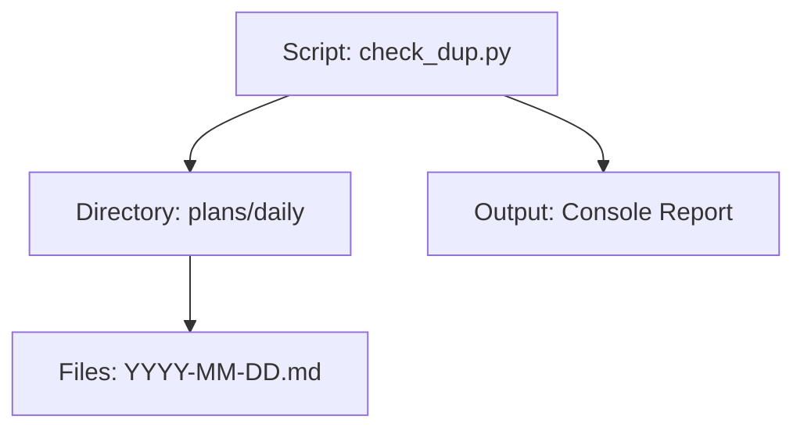
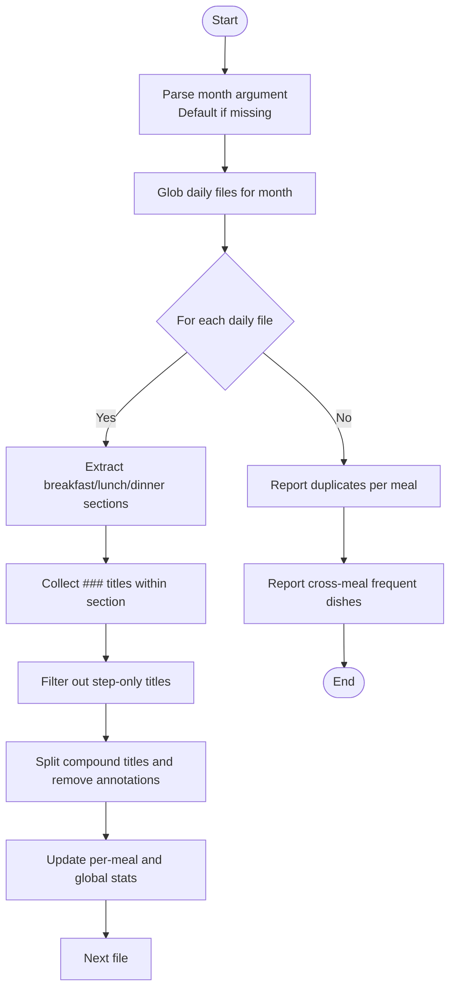
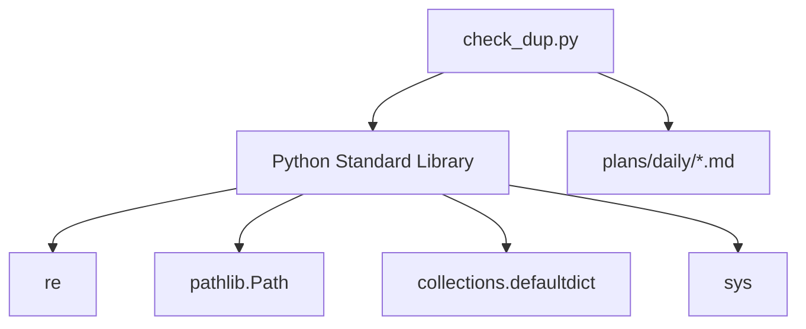

# Duplicate Detection System

<cite>
**Referenced Files in This Document**
- [check_dup.py](file://personal/meal/scripts/check_dup.py)
</cite>

## Table of Contents
1. [Introduction](#introduction)
2. [Project Structure](#project-structure)
3. [Core Components](#core-components)
4. [Architecture Overview](#architecture-overview)
5. [Detailed Component Analysis](#detailed-component-analysis)
6. [Dependency Analysis](#dependency-analysis)
7. [Performance Considerations](#performance-considerations)
8. [Troubleshooting Guide](#troubleshooting-guide)
9. [Conclusion](#conclusion)
10. [Appendices](#appendices)

## Introduction
This document explains the duplicate detection system implemented in check_dup.py. The script analyzes daily meal plan files for a given month to identify repeated dishes across breakfast, lunch, and dinner categories. It parses dish titles that may include compound entries, child versions, and special markers, then performs statistical analysis to track dish frequency per meal type and cross-meal occurrences. The output highlights duplicates within each meal category and lists dishes appearing three or more times across all meals during the month.

## Project Structure
The duplicate detection tool is part of the personal meal management scripts. It reads structured Markdown daily plans from a dedicated directory and produces a concise report of dish repetitions.

**Diagram sources**
- [check_dup.py:1-72](file://personal/meal/scripts/check_dup.py#L1-L72)

**Section sources**
- [check_dup.py:1-72](file://personal/meal/scripts/check_dup.py#L1-L72)

## Core Components
- Command-line interface: Accepts an optional month argument (format "YYYY-MM") with a default value if not provided.
- Meal segmentation: Identifies sections for breakfast, lunch, and dinner using specific Markdown headers.
- Dish parsing: Normalizes and splits dish titles into individual items, handling compound dishes, child versions, and special markers.
- Statistical tracking: Maintains counts and occurrence lists per meal type and globally across meals.
- Reporting: Prints duplicates per meal and cross-meal frequent dishes.

Key responsibilities:
- Input selection by month
- Section extraction per meal
- Title normalization and splitting
- Frequency aggregation
- Report generation

**Section sources**
- [check_dup.py:1-72](file://personal/meal/scripts/check_dup.py#L1-L72)

## Architecture Overview
The script follows a simple pipeline:
1. Parse command-line arguments to determine the target month.
2. Discover daily plan files matching the month pattern.
3. For each file, extract meal sections and collect dish titles.
4. Normalize and split titles into canonical dish names.
5. Aggregate statistics per meal and globally.
6. Print duplicate reports and cross-meal frequent dishes.

[No sources needed since this diagram shows conceptual workflow, not actual code structure]

## Detailed Component Analysis

### Command-Line Interface and File Discovery
- Argument handling: Reads the first positional argument as the month; defaults to a predefined value when omitted.
- Directory resolution: Locates the daily plans directory relative to the script’s location.
- File discovery: Uses a glob pattern to select files for the specified month.

Behavior notes:
- If no files are found, the script prints zero days and proceeds without errors.
- The month format must match the filename prefix used by generated plans.

**Section sources**
- [check_dup.py:1-10](file://personal/meal/scripts/check_dup.py#L1-L10)
- [check_dup.py:26-31](file://personal/meal/scripts/check_dup.py#L26-L31)

### Meal Section Extraction
- Meal identifiers: Uses emoji-prefixed headers to mark breakfast, lunch, and dinner sections.
- Segment isolation: Splits content at the current meal header and truncates at the next meal header or a shopping list marker to isolate the relevant segment.
- Robustness: Skips files or meals where expected headers are absent.

Operational details:
- The script iterates through meals in order and uses subsequent headers to bound the current segment.
- Titles are collected only within the bounded segment to avoid cross-contamination between meals.

**Section sources**
- [check_dup.py:10-11](file://personal/meal/scripts/check_dup.py#L10-L11)
- [check_dup.py:35-44](file://personal/meal/scripts/check_dup.py#L35-L44)

### Dish Parsing Logic
The parsing function normalizes and splits dish titles to produce canonical dish names.

Processing steps:
- Remove special prefixes such as “add-on” markers.
- Split on common separators used to combine multiple dishes.
- Strip whitespace and remove parenthetical annotations like child versions.
- Discard empty fragments after cleaning.

Supported title formats:
- Compound dishes separated by plus signs or enumeration marks.
- Child versions indicated by annotations in parentheses.
- Titles prefixed with special markers indicating add-ons.

Regex patterns used:
- Prefix removal: Matches and removes “add-on” style markers.
- Splitting: Splits on plus-like characters and enumeration marks.
- Annotation removal: Strips text inside parentheses.

Complexity:
- Time complexity per title: O(n), where n is the length of the title string.
- Space complexity: Proportional to the number of resulting dish fragments.

**Section sources**
- [check_dup.py:12-24](file://personal/meal/scripts/check_dup.py#L12-L24)

### Statistical Tracking and Aggregation
Data structures:
- Per-meal dictionary: Maps meal type to dish name to a list of days.
- Global dictionary: Maps dish name to a list of (meal type, day) tuples.

Aggregation process:
- For each normalized dish within a meal segment, append the day to the per-meal list and record the (meal, day) pair globally.
- After processing all files, compute duplicates per meal by filtering entries with more than one occurrence.
- Compute cross-meal frequent dishes by filtering global entries with three or more total occurrences.

Output formatting:
- Per-meal duplicates are sorted by descending frequency.
- Cross-meal frequent dishes are listed with total count and occurrence details.

**Section sources**
- [check_dup.py:26-28](file://personal/meal/scripts/check_dup.py#L26-L28)
- [check_dup.py:52-54](file://personal/meal/scripts/check_dup.py#L52-L54)
- [check_dup.py:56-71](file://personal/meal/scripts/check_dup.py#L56-L71)

### Regular Expression Patterns
Patterns and purposes:
- Prefix removal: Removes “add-on” markers before splitting.
- Splitting: Separates compound titles using plus-like symbols and enumeration marks.
- Annotation removal: Eliminates parenthetical notes such as child versions.
- Title collection: Captures Markdown subheaders within meal segments.

Notes:
- The title collection pattern targets lines starting with a specific Markdown heading level within the bounded segment.
- Filtering excludes step-oriented headings to avoid counting preparation instructions as dishes.

**Section sources**
- [check_dup.py:14-16](file://personal/meal/scripts/check_dup.py#L14-L16)
- [check_dup.py:21](file://personal/meal/scripts/check_dup.py#L21)
- [check_dup.py:46-50](file://personal/meal/scripts/check_dup.py#L46-L50)

### Data Structures Summary
- stat: Nested mapping from meal type to dish to list of days.
- all_stat: Mapping from dish to list of (meal type, day) pairs.
- MEALS: Ordered list of meal headers used for segmentation.

Usage:
- stat enables per-meal duplicate detection.
- all_stat supports cross-meal frequency analysis.

**Section sources**
- [check_dup.py:26-28](file://personal/meal/scripts/check_dup.py#L26-L28)
- [check_dup.py:10-11](file://personal/meal/scripts/check_dup.py#L10-L11)

## Dependency Analysis
External dependencies:
- Standard library modules: sys, re, pathlib.Path, collections.defaultdict.

Internal relationships:
- The script depends on the presence of daily plan files under a predictable directory path and naming convention.
- No external packages or configuration files are required.

**Diagram sources**
- [check_dup.py:1-6](file://personal/meal/scripts/check_dup.py#L1-L6)

**Section sources**
- [check_dup.py:1-6](file://personal/meal/scripts/check_dup.py#L1-L6)

## Performance Considerations
- I/O-bound operation: Reading many small Markdown files dominates runtime.
- Regex overhead: Minimal per-title processing; overall linear in total text size.
- Memory usage: Proportional to the number of unique dishes and their occurrences; typically small for monthly plans.
- Optimization opportunities:
  - Precompile regex patterns if extended to larger datasets.
  - Stream processing could reduce memory footprint for very large inputs.

[No sources needed since this section provides general guidance]

## Troubleshooting Guide
Common issues and resolutions:
- Incorrect month argument: Ensure the argument matches the filename prefix format used by daily plans.
- Missing daily files: Verify that the daily plans directory exists and contains files for the specified month.
- Unexpected duplicates: Check whether dish titles include additional annotations or separators that affect normalization.
- Empty results: Confirm that meal headers and subheaders are present in the plan files as expected.

Validation tips:
- Run the script with a known month containing several daily plans to verify baseline behavior.
- Inspect a sample daily plan to ensure headers and dish titles follow the expected conventions.

**Section sources**
- [check_dup.py:7-9](file://personal/meal/scripts/check_dup.py#L7-L9)
- [check_dup.py:32-34](file://personal/meal/scripts/check_dup.py#L32-L34)
- [check_dup.py:46-50](file://personal/meal/scripts/check_dup.py#L46-L50)

## Conclusion
The duplicate detection system provides a lightweight, dependency-free solution for identifying repeated dishes across monthly meal plans. By parsing structured Markdown, normalizing dish titles, and aggregating frequencies, it delivers actionable insights to improve recipe variety. Its simplicity makes it easy to integrate into existing workflows and extend with additional filters or reporting options.

[No sources needed since this section summarizes without analyzing specific files]

## Appendices

### Usage Examples
- Basic run with default month:
  - Execute the script without arguments to analyze the default month.
- Specify a different month:
  - Provide a month argument in "YYYY-MM" format to analyze a different period.
- Interpreting output:
  - Per-meal duplicates highlight dishes repeated within breakfast, lunch, or dinner.
  - Cross-meal frequent dishes indicate items appearing three or more times across all meals.

Actionable recommendations:
- Replace frequently repeated dishes with alternatives to increase variety.
- Adjust planning templates to diversify ingredient combinations.

[No sources needed since this section provides general guidance]