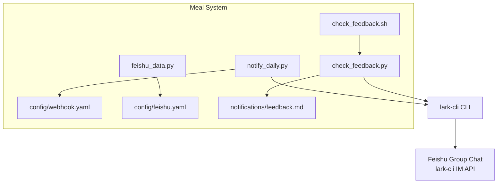
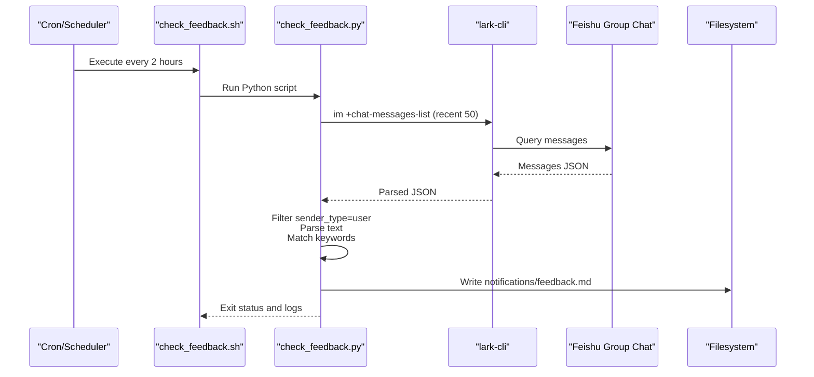
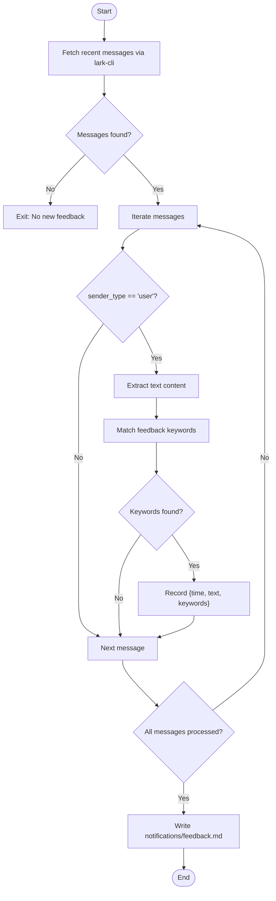
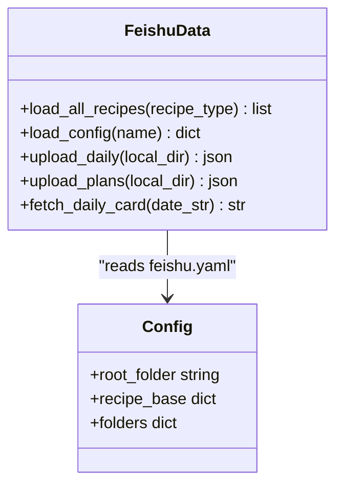
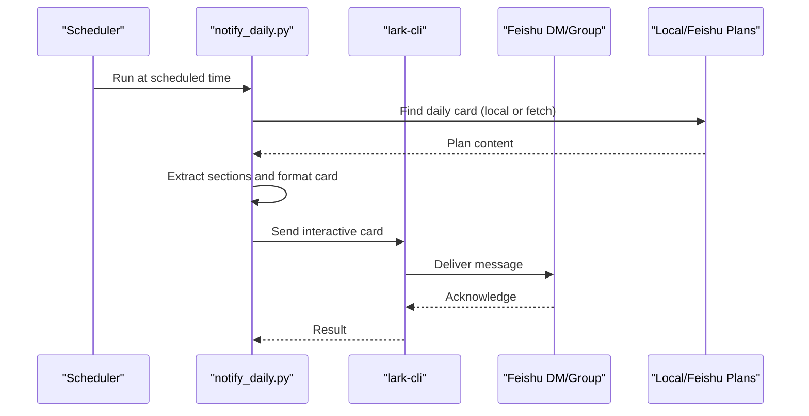
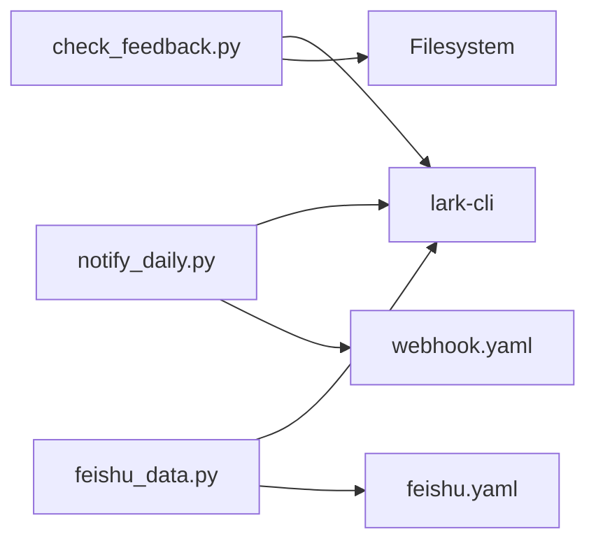

# Feedback Collection and Analysis

<cite>
**Referenced Files in This Document**
- [check_feedback.py](file://personal/meal/scripts/check_feedback.py)
- [check_feedback.sh](file://personal/meal/scripts/check_feedback.sh)
- [webhook.yaml](file://personal/meal/config/webhook.yaml)
- [feishu_data.py](file://personal/meal/scripts/feishu_data.py)
- [notify_daily.py](file://personal/meal/scripts/notify_daily.py)
</cite>

## Table of Contents
1. Introduction
2. Project Structure
3. Core Components
4. Architecture Overview
5. Detailed Component Analysis
6. Dependency Analysis
7. Performance Considerations
8. Troubleshooting Guide
9. Conclusion

## Introduction
This document explains the feedback collection and analysis system for family meal preferences. It focuses on how check_feedback.py processes user feedback from a Feishu group chat, documents the feedback data structure, outlines collection mechanisms (Feishu via lark-cli and manual input), and describes analysis logic that identifies trends and patterns. It also details integration points with the meal planning system to adjust future recipe selections based on feedback signals, and provides examples of entry formats, automated workflows, and reporting outputs.

## Project Structure
The feedback subsystem is implemented under personal/meal with scripts and configuration files:
- Scripts:
  - check_feedback.py: Polls Feishu group messages, detects feedback keywords, and writes structured feedback records.
  - check_feedback.sh: Wrapper to run the Python script periodically and log output.
  - feishu_data.py: Data layer for reading recipes and configs from Feishu Base and Drive; used by other scripts to source recipes and configurations.
  - notify_daily.py: Daily notification script that reads daily plans and sends them to Feishu; integrates with the same Feishu environment.
- Configuration:
  - webhook.yaml: Webhook URL and send time settings.
  - feishu.yaml: Feishu Base and Drive tokens and folder mappings.

**Diagram sources**
- [check_feedback.py:1-137](file://personal/meal/scripts/check_feedback.py#L1-L137)
- [check_feedback.sh:1-5](file://personal/meal/scripts/check_feedback.sh#L1-L5)
- [feishu_data.py:1-175](file://personal/meal/scripts/feishu_data.py#L1-L175)
- [notify_daily.py:1-300](file://personal/meal/scripts/notify_daily.py#L1-L300)
- [webhook.yaml:1-6](file://personal/meal/config/webhook.yaml#L1-L6)

**Section sources**
- [check_feedback.py:1-137](file://personal/meal/scripts/check_feedback.py#L1-L137)
- [check_feedback.sh:1-5](file://personal/meal/scripts/check_feedback.sh#L1-L5)
- [feishu_data.py:1-175](file://personal/meal/scripts/feishu_data.py#L1-L175)
- [notify_daily.py:1-300](file://personal/meal/scripts/notify_daily.py#L1-L300)
- [webhook.yaml:1-6](file://personal/meal/config/webhook.yaml#L1-L6)

## Core Components
- Feedback Collector (check_feedback.py):
  - Queries recent messages from a specific Feishu group using lark-cli.
  - Filters out bot messages and parses text content.
  - Matches feedback keywords to identify negative or adjustment requests.
  - Persists findings into notifications/feedback.md with timestamps and matched keywords.
- Automation Wrapper (check_feedback.sh):
  - Runs the collector script and appends logs to notifications/feedback_cron.log.
- Feishu Data Layer (feishu_data.py):
  - Loads recipes and config from Feishu Base/Drive via lark-cli.
  - Provides load_all_recipes and load_config functions used by other scripts.
- Daily Notification (notify_daily.py):
  - Reads daily plan cards (local or from Feishu), formats them, and sends to Feishu.
  - Uses webhook.yaml for optional webhook-based messaging and lark-cli for direct message delivery.

Key responsibilities:
- Data ingestion: Feishu group messages → structured feedback entries.
- Persistence: Markdown report file with latest and historical entries.
- Integration: Shared Feishu environment and data access for meal planning.

**Section sources**
- [check_feedback.py:1-137](file://personal/meal/scripts/check_feedback.py#L1-L137)
- [check_feedback.sh:1-5](file://personal/meal/scripts/check_feedback.sh#L1-L5)
- [feishu_data.py:1-175](file://personal/meal/scripts/feishu_data.py#L1-L175)
- [notify_daily.py:1-300](file://personal/meal/scripts/notify_daily.py#L1-L300)

## Architecture Overview
The system uses Feishu as the primary channel for feedback collection and meal plan distribution. The collector polls messages, extracts feedback, and writes a report. Other components (like notify_daily.py) use the same Feishu environment and data layer to serve meal plans.

**Diagram sources**
- [check_feedback.sh:1-5](file://personal/meal/scripts/check_feedback.sh#L1-L5)
- [check_feedback.py:1-137](file://personal/meal/scripts/check_feedback.py#L1-L137)

## Detailed Component Analysis

### Feedback Collector (check_feedback.py)
Responsibilities:
- Fetch recent messages from a configured Feishu group chat.
- Parse message content and extract plain text.
- Detect feedback using keyword matching.
- Persist feedback entries with metadata (time, text, keywords).
- Maintain a combined report including history.

Data flow:
- Input: Feishu group messages via lark-cli.
- Processing: Sender filtering, text extraction, keyword matching.
- Output: notifications/feedback.md with structured sections.

Feedback data structure (as persisted):
- Each entry includes:
  - time: ISO-like timestamp string from message create_time.
  - text: Extracted plain text content.
  - keywords: List of matched feedback keywords.

Keyword categories (examples):
- Taste/dislike: “不好吃”, “不喜欢”
- Change request: “换一个”, “换菜”, “换个”, “改一下”, “调整”
- Portion issues: “太多”, “太少”
- Seasoning: “太油”, “太咸”, “太淡”
- Repetition/boredom: “重复”, “一样”, “same”, “boring”

Automation:
- check_feedback.sh runs the collector and logs to notifications/feedback_cron.log.

Integration with meal planning:
- The feedback report can be consumed by downstream scripts to adjust recipe selection. For example, recipes frequently flagged with dislike or repetition can be deprioritized in future plans.

**Diagram sources**
- [check_feedback.py:43-133](file://personal/meal/scripts/check_feedback.py#L43-L133)

**Section sources**
- [check_feedback.py:1-137](file://personal/meal/scripts/check_feedback.py#L1-L137)
- [check_feedback.sh:1-5](file://personal/meal/scripts/check_feedback.sh#L1-L5)

### Feishu Data Layer (feishu_data.py)
Responsibilities:
- Load all recipes from Feishu Base by reading raw YAML fields and reconstructing recipe dicts.
- Cache and load configuration files (family, holidays, vacations) from Feishu Drive.
- Upload daily plans and monthly plans to Feishu Drive folders.
- Download daily card markdown for a given date if local copy is missing.

Usage in feedback context:
- While not directly invoked by check_feedback.py, this module provides shared access to recipes and configs used by other parts of the meal system. Downstream analysis could use load_all_recipes to map feedback keywords to specific recipes and adjust weights.

**Diagram sources**
- [feishu_data.py:1-175](file://personal/meal/scripts/feishu_data.py#L1-L175)

**Section sources**
- [feishu_data.py:1-175](file://personal/meal/scripts/feishu_data.py#L1-L175)

### Daily Notification (notify_daily.py)
Responsibilities:
- Determine target date (today/tomorrow) based on Beijing time.
- Read daily plan markdown (local or from Feishu).
- Format a rich interactive card and send it to Feishu via lark-cli.
- Optionally use webhook.yaml for webhook-based messaging.

Integration with feedback:
- The same Feishu environment ensures consistent communication channels. Future enhancements can read feedback reports to influence which recipes are included in the next day’s plan.

**Diagram sources**
- [notify_daily.py:1-300](file://personal/meal/scripts/notify_daily.py#L1-L300)

**Section sources**
- [notify_daily.py:1-300](file://personal/meal/scripts/notify_daily.py#L1-L300)
- [webhook.yaml:1-6](file://personal/meal/config/webhook.yaml#L1-L6)

## Dependency Analysis
External dependencies:
- lark-cli: Used by both check_feedback.py and notify_daily.py to interact with Feishu APIs (IM messages, drive operations).
- Filesystem: Writes feedback reports and logs.
- Optional webhook: notify_daily.py supports webhook-based messaging using webhook.yaml.

Coupling and cohesion:
- check_feedback.py depends only on lark-cli and filesystem; high cohesion around feedback detection and persistence.
- feishu_data.py encapsulates Feishu interactions for recipes and configs; reusable across scripts.
- notify_daily.py depends on lark-cli and optionally webhook.yaml; cohesive around daily plan delivery.

Potential circular dependencies:
- None observed; scripts are independent and communicate via files and external APIs.

**Diagram sources**
- [check_feedback.py:1-137](file://personal/meal/scripts/check_feedback.py#L1-L137)
- [notify_daily.py:1-300](file://personal/meal/scripts/notify_daily.py#L1-L300)
- [feishu_data.py:1-175](file://personal/meal/scripts/feishu_data.py#L1-L175)
- [webhook.yaml:1-6](file://personal/meal/config/webhook.yaml#L1-L6)

**Section sources**
- [check_feedback.py:1-137](file://personal/meal/scripts/check_feedback.py#L1-L137)
- [notify_daily.py:1-300](file://personal/meal/scripts/notify_daily.py#L1-L300)
- [feishu_data.py:1-175](file://personal/meal/scripts/feishu_data.py#L1-L175)
- [webhook.yaml:1-6](file://personal/meal/config/webhook.yaml#L1-L6)

## Performance Considerations
- Message polling window: The collector queries up to 50 recent messages per run. To reduce overhead, consider limiting page size or adding pagination offsets when necessary.
- Keyword matching: Simple substring checks are efficient; however, large message volumes may benefit from pre-tokenization or caching of normalized text.
- File I/O: Writing feedback.md involves reading existing content and rewriting; batching updates or appending new entries can reduce disk churn.
- Network latency: lark-cli calls depend on network stability; implement retries and timeouts where appropriate.

[No sources needed since this section provides general guidance]

## Troubleshooting Guide
Common issues and resolutions:
- lark-cli errors:
  - Symptom: Non-zero return code and stderr printed.
  - Action: Verify authentication and permissions for IM and Drive operations; ensure correct chat IDs and tokens.
- No messages found:
  - Symptom: Script prints no messages available.
  - Action: Confirm CHAT_ID matches the intended group; verify message visibility and bot permissions.
- JSON parsing failures:
  - Symptom: JSONDecodeError when parsing message content.
  - Action: Ensure content_raw is valid JSON; fallback handling is present but inspect malformed payloads.
- Feedback not saved:
  - Symptom: No entries in notifications/feedback.md.
  - Action: Check directory permissions and existence; ensure write access to notifications/.
- Webhook delivery failures:
  - Symptom: HTTP error or network error when sending via webhook.
  - Action: Validate webhook URL in webhook.yaml; check connectivity and payload formatting.

Operational tips:
- Use check_feedback.sh to automate periodic runs and review notifications/feedback_cron.log for execution history.
- Inspect notifications/feedback.md for recent feedback entries and historical records.

**Section sources**
- [check_feedback.py:33-41](file://personal/meal/scripts/check_feedback.py#L33-L41)
- [check_feedback.py:57-68](file://personal/meal/scripts/check_feedback.py#L57-L68)
- [check_feedback.py:84-101](file://personal/meal/scripts/check_feedback.py#L84-L101)
- [check_feedback.py:103-132](file://personal/meal/scripts/check_feedback.py#L103-L132)
- [notify_daily.py:210-233](file://personal/meal/scripts/notify_daily.py#L210-L233)

## Conclusion
The feedback collection and analysis system leverages Feishu group chats to capture family meal feedback through keyword-driven detection. The collector persists structured feedback entries, enabling trend analysis and potential adjustments to future recipe selections. Integration with the meal planning system is facilitated by shared Feishu data access and consistent communication channels. Operational automation via shell wrappers and logging supports reliable operation and troubleshooting.

[No sources needed since this section summarizes without analyzing specific files]