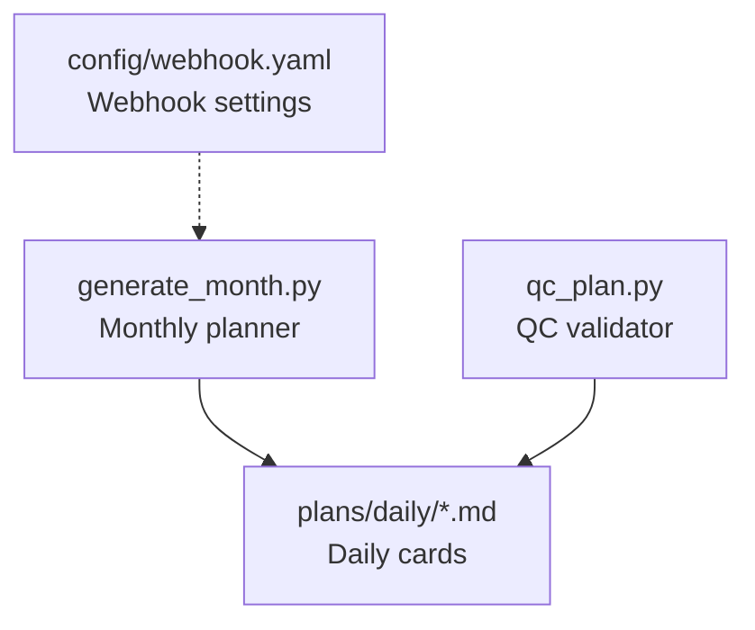
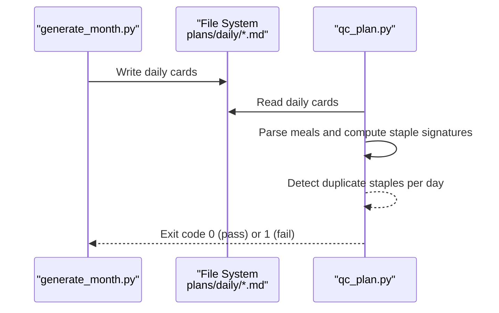
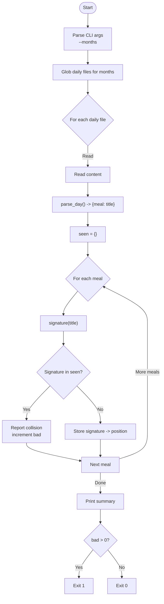
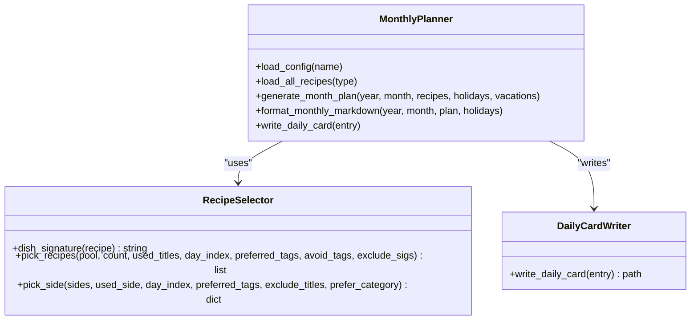
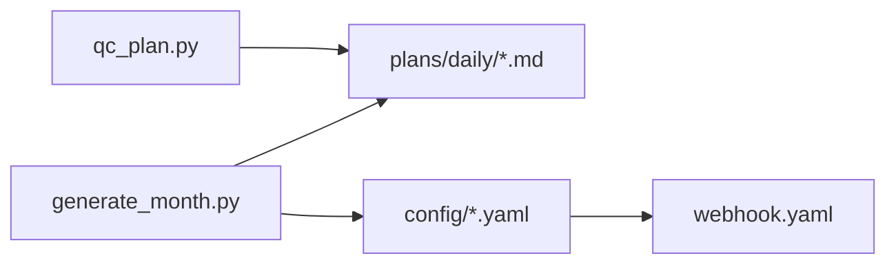

# Quality Control and Plan Validation

<cite>
**Referenced Files in This Document**
- [qc_plan.py](file://personal/meal/scripts/qc_plan.py)
- [generate_month.py](file://personal/meal/scripts/generate_month.py)
- [webhook.yaml](file://personal/meal/config/webhook.yaml)
</cite>

## Table of Contents
1. [Introduction](#introduction)
2. [Project Structure](#project-structure)
3. [Core Components](#core-components)
4. [Architecture Overview](#architecture-overview)
5. [Detailed Component Analysis](#detailed-component-analysis)
6. [Dependency Analysis](#dependency-analysis)
7. [Performance Considerations](#performance-considerations)
8. [Troubleshooting Guide](#troubleshooting-guide)
9. [Conclusion](#conclusion)
10. [Appendices](#appendices)

## Introduction
This document explains the quality control and validation system for meal plans, focusing on the cross-meal staple collision check implemented in qc_plan.py and its integration with the monthly generation workflow in generate_month.py. It also outlines how to extend the pipeline with additional validations (nutritional balance, ingredient availability, cooking time constraints), error reporting, warnings, automated correction suggestions, and configuration hooks.

## Project Structure
The relevant parts of the project include:
- scripts/qc_plan.py: Post-generation validator that scans daily plan files and detects same-day cross-meal staple collisions.
- scripts/generate_month.py: Monthly planner that generates daily cards and a monthly overview; it already enforces some intra-plan diversity rules.
- config/webhook.yaml: Webhook settings used by other components (e.g., notifications).

**Diagram sources**
- [generate_month.py:616-685](file://personal/meal/scripts/generate_month.py#L616-L685)
- [qc_plan.py:58-88](file://personal/meal/scripts/qc_plan.py#L58-L88)
- [webhook.yaml:1-6](file://personal/meal/config/webhook.yaml#L1-L6)

**Section sources**
- [qc_plan.py:1-88](file://personal/meal/scripts/qc_plan.py#L1-L88)
- [generate_month.py:1-685](file://personal/meal/scripts/generate_month.py#L1-L685)
- [webhook.yaml:1-6](file://personal/meal/config/webhook.yaml#L1-L6)

## Core Components
- Cross-meal staple collision checker (qc_plan.py):
  - Parses each daily card’s breakfast, lunch, dinner, and quick-lunch sections.
  - Extracts a “staple signature” from each meal title by taking the text before the first plus sign and removing parenthetical notes.
  - Detects if any two meals on the same day share the same staple signature and reports them.
  - Exits with non-zero status when issues are found, enabling CI or post-generation checks.

- Monthly planner (generate_month.py):
  - Generates daily cards and a monthly overview.
  - Applies diversity strategies such as rotating pools per month, avoiding repeated titles within a cycle, and excluding same-day staples across meals during selection.
  - Integrates with optional Feishu upload and local file outputs.

**Section sources**
- [qc_plan.py:24-56](file://personal/meal/scripts/qc_plan.py#L24-L56)
- [qc_plan.py:58-88](file://personal/meal/scripts/qc_plan.py#L58-L88)
- [generate_month.py:124-184](file://personal/meal/scripts/generate_month.py#L124-L184)
- [generate_month.py:218-342](file://personal/meal/scripts/generate_month.py#L218-L342)
- [generate_month.py:616-685](file://personal/meal/scripts/generate_month.py#L616-L685)

## Architecture Overview
The QC pipeline is designed to run after plan generation:
- generate_month.py produces daily markdown cards under plans/daily/.
- qc_plan.py scans those cards and validates cross-meal staple uniqueness per day.
- The script returns a non-zero exit code on failures, suitable for automation.

**Diagram sources**
- [generate_month.py:616-685](file://personal/meal/scripts/generate_month.py#L616-L685)
- [qc_plan.py:58-88](file://personal/meal/scripts/qc_plan.py#L58-L88)

## Detailed Component Analysis

### Cross-Meal Staple Collision Validator (qc_plan.py)
Responsibilities:
- Parse daily cards to extract meal titles for breakfast, lunch, dinner, and quick-lunch.
- Normalize titles into a “staple signature” by trimming at the first plus sign and removing parenthetical notes.
- Compare signatures within the same day and report duplicates.
- Provide a summary count and exit code for automation.

Key functions and behaviors:
- signature(title): Normalizes a meal title to a staple signature.
- first_h3(segment): Extracts the first H3 heading within a section.
- parse_day(content): Returns a mapping of meal positions to their titles.
- main(): Orchestrates scanning, validation, reporting, and exit code.

**Diagram sources**
- [qc_plan.py:24-56](file://personal/meal/scripts/qc_plan.py#L24-L56)
- [qc_plan.py:58-88](file://personal/meal/scripts/qc_plan.py#L58-L88)

**Section sources**
- [qc_plan.py:24-56](file://personal/meal/scripts/qc_plan.py#L24-L56)
- [qc_plan.py:58-88](file://personal/meal/scripts/qc_plan.py#L58-L88)

### Monthly Planner Integration (generate_month.py)
Responsibilities:
- Load recipes and configurations.
- Generate a monthly plan with diversity controls (rotation, avoidance, clustering).
- Write daily cards and monthly overview.
- Optionally upload to Feishu.

Relevant validation-related logic:
- dish_signature(recipe): Computes staple signature for recipe selection.
- pick_recipes(...): Enforces title uniqueness, excludes same-day staples via exclude_sigs, and applies preference/avoidance scoring.
- generate_month_plan(...): Builds daily entries, computes same-day staple sets, and passes exclude_sigs to avoid cross-meal collisions.

**Diagram sources**
- [generate_month.py:124-184](file://personal/meal/scripts/generate_month.py#L124-L184)
- [generate_month.py:218-342](file://personal/meal/scripts/generate_month.py#L218-L342)
- [generate_month.py:436-588](file://personal/meal/scripts/generate_month.py#L436-L588)

**Section sources**
- [generate_month.py:124-184](file://personal/meal/scripts/generate_month.py#L124-L184)
- [generate_month.py:218-342](file://personal/meal/scripts/generate_month.py#L218-L342)
- [generate_month.py:436-588](file://personal/meal/scripts/generate_month.py#L436-L588)
- [generate_month.py:616-685](file://personal/meal/scripts/generate_month.py#L616-L685)

## Dependency Analysis
- qc_plan.py depends only on Python standard libraries and reads generated daily markdown files.
- generate_month.py depends on YAML parsing and optionally Feishu data utilities; it writes daily cards consumed by qc_plan.py.
- webhook.yaml is referenced by other components for notifications but not directly by qc_plan.py.

**Diagram sources**
- [qc_plan.py:58-88](file://personal/meal/scripts/qc_plan.py#L58-L88)
- [generate_month.py:616-685](file://personal/meal/scripts/generate_month.py#L616-L685)
- [webhook.yaml:1-6](file://personal/meal/config/webhook.yaml#L1-L6)

**Section sources**
- [qc_plan.py:58-88](file://personal/meal/scripts/qc_plan.py#L58-L88)
- [generate_month.py:616-685](file://personal/meal/scripts/generate_month.py#L616-L685)
- [webhook.yaml:1-6](file://personal/meal/config/webhook.yaml#L1-L6)

## Performance Considerations
- Time complexity:
  - qc_plan.py: O(D × M) where D is number of daily files scanned and M is number of meals per day (typically ≤ 4). Signature computation is constant-time per meal.
  - generate_month.py: O(N × R log R) per day due to sorting by ingredient scores, where N is days in month and R is pool size. Rotation and set operations are linear.
- Memory usage:
  - qc_plan.py: Minimal; stores per-day seen signatures.
  - generate_month.py: Holds recipe pools and per-month rotation; memory proportional to total recipes.
- Optimization opportunities:
  - For large datasets, consider streaming daily files and early termination on first failure.
  - Cache signature computations if re-used across multiple validators.

[No sources needed since this section provides general guidance]

## Troubleshooting Guide
Common issues and resolutions:
- Non-zero exit code from qc_plan.py:
  - Indicates one or more same-day cross-meal staple collisions. Review reported lines to identify conflicting meals and adjust selections or titles.
- No daily files found:
  - Ensure generate_month.py has been executed for the target months and that plans/daily contains expected files.
- Title parsing anomalies:
  - If signatures do not match expectations, verify meal titles follow the convention (use plus signs and parentheses consistently).

Integration tips:
- Run qc_plan.py after generate_month.py in your automation pipeline.
- Use the exit code to gate publication or notify via webhook if desired.

**Section sources**
- [qc_plan.py:58-88](file://personal/meal/scripts/qc_plan.py#L58-L88)
- [generate_month.py:616-685](file://personal/meal/scripts/generate_month.py#L616-L685)

## Conclusion
The current QC system ensures cross-meal staple uniqueness per day through a lightweight parser and signature comparison. The monthly planner already incorporates similar logic during selection to reduce collisions. Extending the pipeline with nutritional balance checks, ingredient availability verification, and cooking time constraints can further strengthen plan integrity. Error reporting is straightforward via console output and exit codes, and can be integrated with notification systems using existing webhook configuration.

[No sources needed since this section summarizes without analyzing specific files]

## Appendices

### Example Scenarios
- Valid plan scenario:
  - Breakfast: “Oatmeal + Fresh Fruit”
  - Lunch: “Grilled Chicken Rice Bowl”
  - Dinner: “Vegetable Stir-Fry with Noodles”
  - Quick Lunch: “Tomato Egg Soup with Toast”
  - All staple signatures differ; no collision detected.

- Invalid plan scenario:
  - Breakfast: “Tomato Egg Noodles + Milk”
  - Dinner: “Tomato Egg Noodles + Fried Pork”
  - Both share the same staple signature “Tomato Egg Noodles”; qc_plan.py will report a collision.

[No sources needed since this section provides conceptual examples]

### Custom Validation Rule Configuration
To add new validations (e.g., nutritional balance, ingredient availability, cooking time constraints):
- Create a new script or extend qc_plan.py with additional checks.
- Define rule parameters in a YAML configuration file (e.g., thresholds, allowed categories).
- Integrate with generate_month.py by passing constraints into pick_recipes or adding post-processing steps.
- Emit structured warnings and suggestions (e.g., recommend alternative dishes based on available ingredients or time limits).
- Use webhook.yaml to send alerts when critical violations occur.

[No sources needed since this section provides general guidance]

### Integration Points with Monthly Generation Workflow
- After generate_month.py completes, invoke qc_plan.py against the generated daily cards.
- Gate publication on qc_plan.py’s exit code.
- Optionally, augment generate_month.py to pre-validate constraints during selection to reduce downstream fixes.

**Section sources**
- [generate_month.py:616-685](file://personal/meal/scripts/generate_month.py#L616-L685)
- [qc_plan.py:58-88](file://personal/meal/scripts/qc_plan.py#L58-L88)
- [webhook.yaml:1-6](file://personal/meal/config/webhook.yaml#L1-L6)