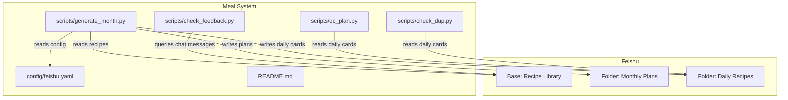
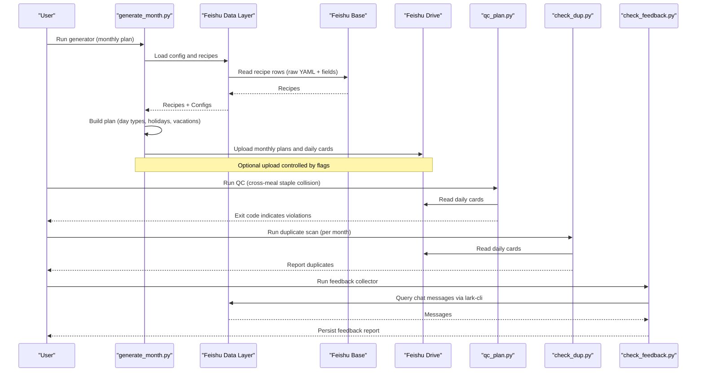
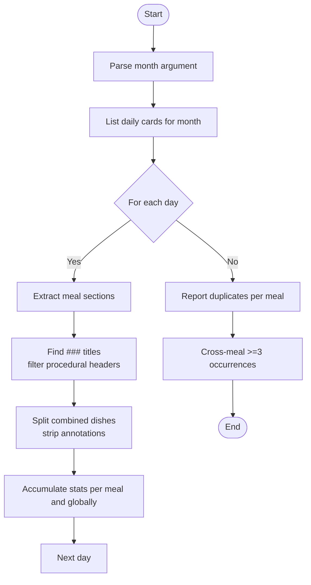
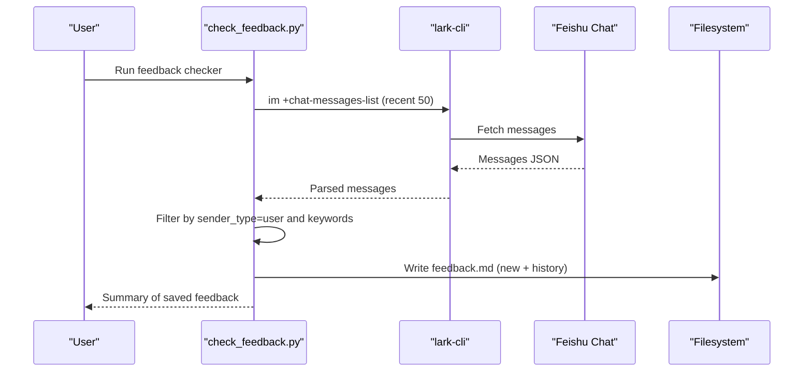
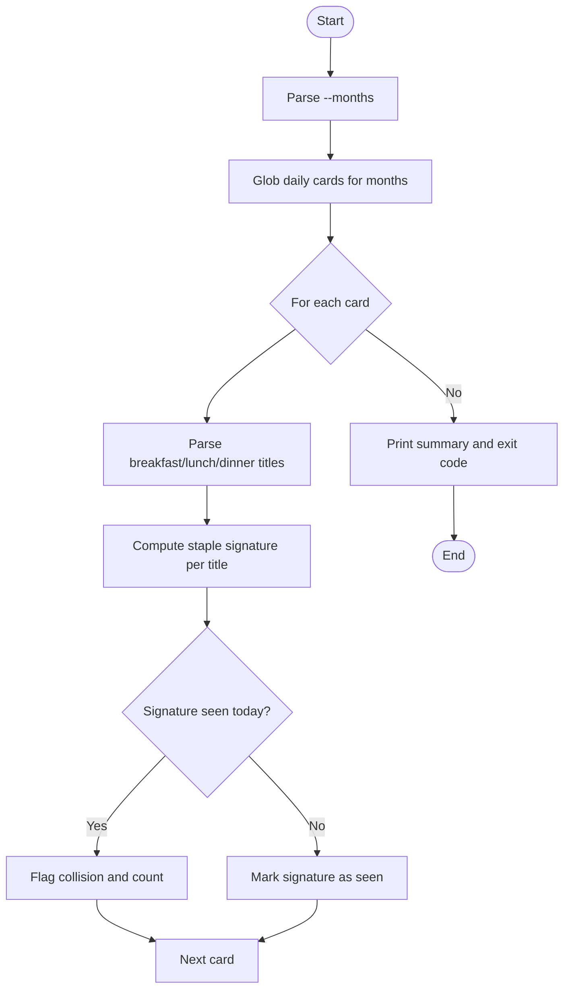
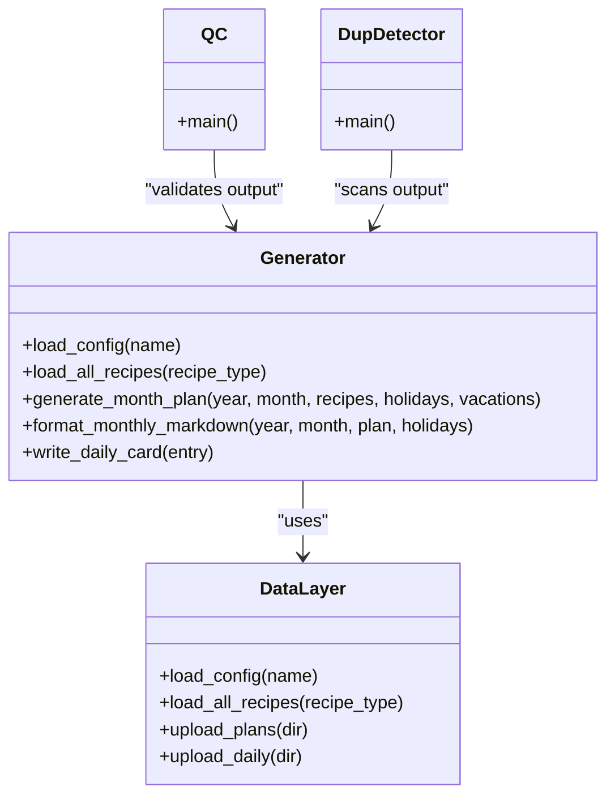
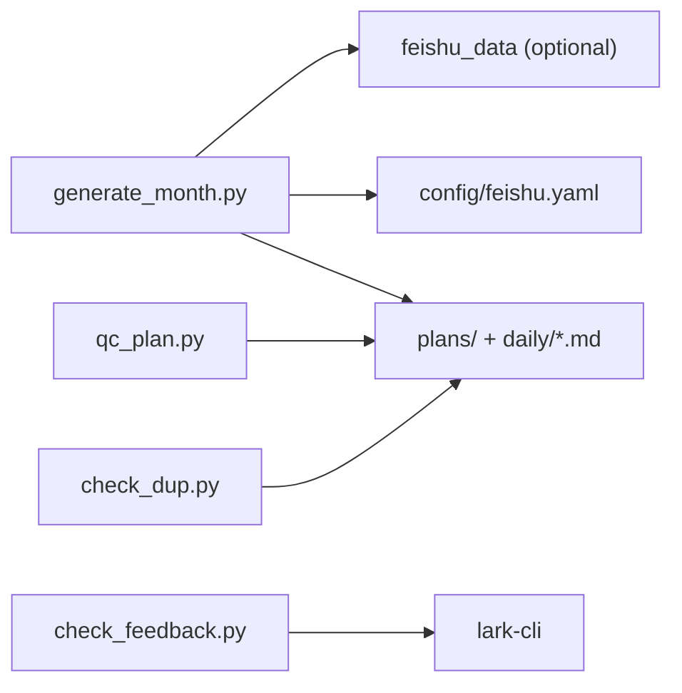

# Recipe Maintenance and Validation

<cite>
**Referenced Files in This Document**
- [check_dup.py](file://personal/meal/scripts/check_dup.py)
- [check_feedback.py](file://personal/meal/scripts/check_feedback.py)
- [qc_plan.py](file://personal/meal/scripts/qc_plan.py)
- [generate_month.py](file://personal/meal/scripts/generate_month.py)
- [README.md](file://personal/meal/README.md)
- [feishu.yaml](file://personal/meal/config/feishu.yaml)
</cite>

## Table of Contents
1. [Introduction](#introduction)
2. [Project Structure](#project-structure)
3. [Core Components](#core-components)
4. [Architecture Overview](#architecture-overview)
5. [Detailed Component Analysis](#detailed-component-analysis)
6. [Dependency Analysis](#dependency-analysis)
7. [Performance Considerations](#performance-considerations)
8. [Troubleshooting Guide](#troubleshooting-guide)
9. [Conclusion](#conclusion)
10. [Appendices](#appendices)

## Introduction
This document explains the recipe maintenance procedures and quality control processes for the family meal system. It focuses on:
- Duplicate detection across daily plans using check_dup.py
- Feedback collection from the Feishu group via check_feedback.py
- Quality control validation of cross-meal dish collisions using qc_plan.py
- The end-to-end recipe lifecycle from creation to publication, including validation rules, testing procedures, and common issues resolution
- Guidelines for updates, version management, and consistency across the recipe database
- Troubleshooting steps for malformed recipes and data integrity checks

The system stores recipes in a Feishu Base table and generates monthly plans and daily cards that are synchronized back to Feishu folders. Local scripts orchestrate generation, notification, and quality checks.

## Project Structure
Key directories and files relevant to maintenance and validation:
- personal/meal/scripts: contains all operational scripts (generation, notifications, QC tools)
- personal/meal/config: configuration mapping to Feishu resources
- personal/meal/README.md: project overview, usage commands, and workflow references

**Diagram sources**
- [generate_month.py:1-685](file://personal/meal/scripts/generate_month.py#L1-L685)
- [check_dup.py:1-72](file://personal/meal/scripts/check_dup.py#L1-L72)
- [check_feedback.py:1-137](file://personal/meal/scripts/check_feedback.py#L1-L137)
- [qc_plan.py:1-88](file://personal/meal/scripts/qc_plan.py#L1-L88)
- [feishu.yaml:1-19](file://personal/meal/config/feishu.yaml#L1-L19)
- [README.md:1-137](file://personal/meal/README.md#L1-L137)

**Section sources**
- [README.md:48-66](file://personal/meal/README.md#L48-L66)
- [README.md:87-112](file://personal/meal/README.md#L87-L112)
- [feishu.yaml:1-19](file://personal/meal/config/feishu.yaml#L1-L19)

## Core Components
- Duplicate detection (check_dup.py): Scans daily plan Markdowns for a given month, extracts dish titles per meal, normalizes them, and reports duplicates within each meal type and cross-meal frequency.
- Feedback collection (check_feedback.py): Queries recent messages from a specific Feishu chat using lark-cli, filters user feedback by keywords, and persists findings into a markdown file for review.
- Quality control validation (qc_plan.py): Validates that the same “staple signature” does not repeat across meals on the same day; exits non-zero if violations are found, suitable for CI-style post-generation checks.
- Plan generation (generate_month.py): Loads recipes and configs (from Feishu or local fallback), builds a monthly plan with constraints (day types, holidays, vacations), writes monthly overview and daily cards, and optionally uploads to Feishu.

**Section sources**
- [check_dup.py:1-72](file://personal/meal/scripts/check_dup.py#L1-L72)
- [check_feedback.py:1-137](file://personal/meal/scripts/check_feedback.py#L1-L137)
- [qc_plan.py:1-88](file://personal/meal/scripts/qc_plan.py#L1-L88)
- [generate_month.py:1-685](file://personal/meal/scripts/generate_month.py#L1-L685)
- [README.md:87-112](file://personal/meal/README.md#L87-L112)

## Architecture Overview
High-level flow from recipe creation to publication and validation:

**Diagram sources**
- [generate_month.py:1-685](file://personal/meal/scripts/generate_month.py#L1-L685)
- [qc_plan.py:1-88](file://personal/meal/scripts/qc_plan.py#L1-L88)
- [check_dup.py:1-72](file://personal/meal/scripts/check_dup.py#L1-L72)
- [check_feedback.py:1-137](file://personal/meal/scripts/check_feedback.py#L1-L137)
- [README.md:40-44](file://personal/meal/README.md#L40-L44)

## Detailed Component Analysis

### Duplicate Detection (check_dup.py)
Purpose:
- Identify repeated dishes within a month across breakfast/lunch/dinner sections of daily plan Markdowns.
- Normalize dish titles by removing prefixes like “add-on”, splitting combined dishes, and stripping parenthetical notes.

Processing logic:
- For each daily card matching the target month pattern:
  - Parse sections for each meal type.
  - Extract ### titles and filter out procedural headings.
  - Split combined titles and normalize names.
  - Aggregate counts per meal type and across all meals.
- Output:
  - Per-meal duplicates with occurrence counts and dates.
  - Cross-meal dishes appearing ≥3 times with occurrences.

**Diagram sources**
- [check_dup.py:1-72](file://personal/meal/scripts/check_dup.py#L1-L72)

**Section sources**
- [check_dup.py:1-72](file://personal/meal/scripts/check_dup.py#L1-L72)

### Feedback Collection (check_feedback.py)
Purpose:
- Monitor a specific Feishu chat for user feedback about recipes.
- Filter messages by predefined keywords and persist results to a markdown file.

Processing logic:
- Use lark-cli to list recent messages from a configured chat ID.
- Iterate messages, skip bot-sender entries, parse text content, and match against feedback keywords.
- Append new feedback entries to a markdown file with timestamps and matched keywords; preserve historical entries.

**Diagram sources**
- [check_feedback.py:1-137](file://personal/meal/scripts/check_feedback.py#L1-L137)

**Section sources**
- [check_feedback.py:1-137](file://personal/meal/scripts/check_feedback.py#L1-L137)

### Quality Control Validation (qc_plan.py)
Purpose:
- Ensure no staple dish repeats across different meals on the same day.
- Define “staple signature” as the first part before “+” or “＋”, with parentheses removed.

Processing logic:
- For each daily card in specified months:
  - Parse meal sections and extract the first ### title per meal.
  - Compute staple signature for each title.
  - Track signatures per day; flag collisions where the same signature appears in multiple meals.
- Exit code:
  - Non-zero if any collisions are detected; zero otherwise.

**Diagram sources**
- [qc_plan.py:1-88](file://personal/meal/scripts/qc_plan.py#L1-L88)

**Section sources**
- [qc_plan.py:1-88](file://personal/meal/scripts/qc_plan.py#L1-L88)

### Plan Generation and Lifecycle (generate_month.py)
Purpose:
- Generate monthly plans and daily cards based on recipe library and configurations.
- Apply constraints such as day types, holidays, vacations, and cross-meal staple uniqueness.
- Optionally upload generated plans and daily cards to Feishu.

Lifecycle stages:
- Creation:
  - Recipes are maintained in Feishu Base with structured columns and a raw YAML column for lossless reconstruction.
  - Configuration (family, holidays, vacations) is stored in Feishu folders and cached locally.
- Planning:
  - Determine day type (workday/weekend/holiday) considering holidays and workday compensation.
  - Decide which meals to include (breakfast always; lunch/dinner on weekends/holidays; quick lunch during school vacations on workdays).
  - Select recipes with scoring heuristics:
    - Avoid clustering ingredients across consecutive days for breakfast.
    - Prefer ingredient overlap for main meals to reduce waste.
    - Exclude same-day staple signatures across meals.
- Testing and Validation:
  - After generation, run qc_plan.py to detect cross-meal staple collisions.
  - Run check_dup.py to identify intra-month duplicates.
- Publication:
  - Upload monthly overview and daily cards to Feishu folders.
  - Notify users via daily push script (not analyzed here).

**Diagram sources**
- [generate_month.py:1-685](file://personal/meal/scripts/generate_month.py#L1-L685)
- [qc_plan.py:1-88](file://personal/meal/scripts/qc_plan.py#L1-L88)
- [check_dup.py:1-72](file://personal/meal/scripts/check_dup.py#L1-L72)

**Section sources**
- [generate_month.py:1-685](file://personal/meal/scripts/generate_month.py#L1-L685)
- [README.md:115-137](file://personal/meal/README.md#L115-L137)

## Dependency Analysis
- Scripts depend on:
  - Feishu Base for recipes and configuration via feishu_data layer (when available).
  - Filesystem for local caching and temporary outputs.
  - lark-cli for chat message retrieval.
- Coupling:
  - generate_month.py orchestrates data loading and plan generation, then optional upload.
  - qc_plan.py and check_dup.py operate independently on generated daily cards.
  - check_feedback.py operates independently on chat messages.

**Diagram sources**
- [generate_month.py:1-685](file://personal/meal/scripts/generate_month.py#L1-L685)
- [qc_plan.py:1-88](file://personal/meal/scripts/qc_plan.py#L1-L88)
- [check_dup.py:1-72](file://personal/meal/scripts/check_dup.py#L1-L72)
- [check_feedback.py:1-137](file://personal/meal/scripts/check_feedback.py#L1-L137)
- [feishu.yaml:1-19](file://personal/meal/config/feishu.yaml#L1-L19)

**Section sources**
- [README.md:40-44](file://personal/meal/README.md#L40-L44)
- [README.md:87-112](file://personal/meal/README.md#L87-L112)

## Performance Considerations
- Duplicate detection and QC operate on Markdown files; ensure only necessary months are scanned to minimize IO.
- Feedback collection limits to recent messages (e.g., last 50) to reduce API calls and parsing overhead.
- Plan generation uses deterministic selection with rotation seeds per month to avoid repetitive sequences without heavy computation.

[No sources needed since this section provides general guidance]

## Troubleshooting Guide
Common issues and resolutions:
- Malformed recipes:
  - Ensure the “Raw YAML” column in Feishu Base matches the expected structure; structured columns must be kept in sync.
  - Validate YAML syntax and required fields (title, type, ingredients, steps).
- Duplicate staples across meals:
  - Run qc_plan.py after generation; fix titles to differentiate staple signatures or adjust selections.
- Intra-month duplicates:
  - Run check_dup.py for the affected month; consider diversifying menu pools or adjusting selection heuristics.
- Feedback not captured:
  - Verify lark-cli authentication and chat ID; confirm keyword list covers user expressions.
- Upload failures:
  - Check network connectivity and permissions; use --no-upload to debug local generation separately.

**Section sources**
- [README.md:115-137](file://personal/meal/README.md#L115-L137)
- [qc_plan.py:1-88](file://personal/meal/scripts/qc_plan.py#L1-L88)
- [check_dup.py:1-72](file://personal/meal/scripts/check_dup.py#L1-L72)
- [check_feedback.py:1-137](file://personal/meal/scripts/check_feedback.py#L1-L137)

## Conclusion
The recipe maintenance system integrates automated planning, robust validation, and continuous feedback collection. By enforcing cross-meal staple uniqueness, detecting duplicates, and capturing user feedback, it ensures high-quality, consistent menus. Following the outlined lifecycle and troubleshooting steps helps maintain data integrity and operational reliability.

[No sources needed since this section summarizes without analyzing specific files]

## Appendices
- Usage commands:
  - Generate monthly plan: see README usage section.
  - Run QC: see README usage section.
  - Run duplicate detection: invoke check_dup.py with a month argument.
  - Collect feedback: invoke check_feedback.py.

**Section sources**
- [README.md:87-112](file://personal/meal/README.md#L87-L112)