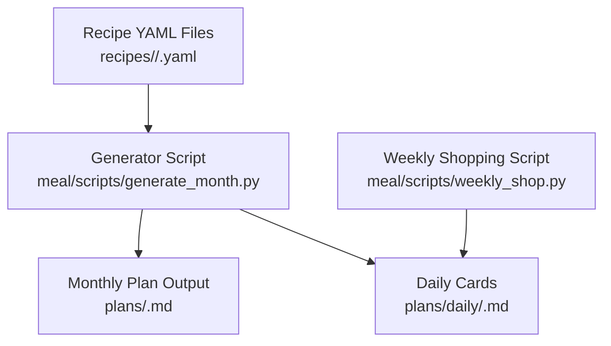
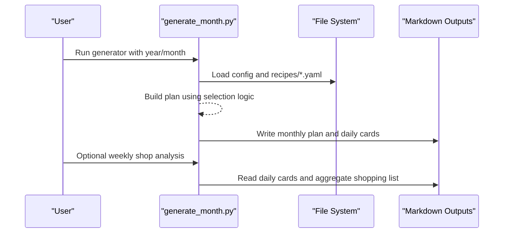
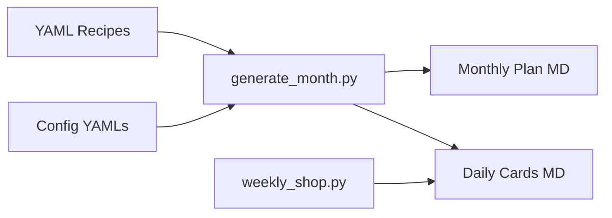

# Recipe Structure and Format

<cite>
**Referenced Files in This Document**
- [generate_month.py](file://meal/scripts/generate_month.py)
- [weekly_shop.py](file://meal/scripts/weekly_shop.py)
- [check_breakfast.py](file://meal/scripts/check_breakfast.py)
</cite>

## Table of Contents
1. [Introduction](#introduction)
2. [Project Structure](#project-structure)
3. [Core Components](#core-components)
4. [Architecture Overview](#architecture-overview)
5. [Detailed Component Analysis](#detailed-component-analysis)
6. [Dependency Analysis](#dependency-analysis)
7. [Performance Considerations](#performance-considerations)
8. [Troubleshooting Guide](#troubleshooting-guide)
9. [Conclusion](#conclusion)
10. [Appendices](#appendices)

## Introduction
This document defines the YAML-based recipe structure used by the meal planning system. It specifies all required fields, data types, validation rules, and formatting conventions for recipes. It also explains the nested ingredient model and preparation instruction formats for both night prep and morning steps. Concrete examples are provided to illustrate proper YAML formatting, ingredient specifications with amounts and units, and step-by-step preparation instructions.

## Project Structure
The recipe format is consumed by scripts that load YAML files from category directories (breakfast, lunch, dinner, side, lunch_quick), generate monthly plans, and render daily cards. The key consumer is a generator script that reads each recipe’s metadata and content to produce Markdown outputs and shopping lists.

**Diagram sources**
- [generate_month.py:34-64](file://meal/scripts/generate_month.py#L34-L64)
- [generate_month.py:436-588](file://meal/scripts/generate_month.py#L436-L588)
- [weekly_shop.py:39-54](file://meal/scripts/weekly_shop.py#L39-L54)

**Section sources**
- [generate_month.py:34-64](file://meal/scripts/generate_month.py#L34-L64)
- [generate_month.py:436-588](file://meal/scripts/generate_month.py#L436-L588)
- [weekly_shop.py:39-54](file://meal/scripts/weekly_shop.py#L39-L54)

## Core Components
A recipe YAML represents a single dish or meal component. The following top-level keys are used across categories:

- title: string; human-readable name of the dish or meal combination
- type: string; category identifier (e.g., breakfast, lunch, dinner, side, lunch_quick)
- difficulty: string; qualitative difficulty level
- total_time: string; total preparation time (e.g., “30 min”)
- servings: number or string; serving size or note (e.g., 2, “2 people”)
- tools: array of strings; kitchen tools required
- series: string; optional grouping tag (e.g., family theme)
- week: integer; optional scheduling hint
- day: integer; optional scheduling hint
- tags: array of strings; general tags (e.g., “quick”, “vegetarian”)
- ingredient_tags: array of strings; structured tags used for ingredient clustering and selection logic
- ingredients: object; keyed sections mapping to arrays of ingredient items
- night_prep: array of strings; steps to complete the night before
- morning_steps: array of strings; steps to execute in the morning
- notes: string; additional tips or reminders

Ingredient item schema (nested under ingredients):
- name: string; required
- amount: string; optional; quantity and unit (e.g., “200 g”, “1 cup”)
- note: string; optional; specific variant or substitution
- optional: boolean; optional; marks an ingredient as non-mandatory

Preparation instruction formats:
- night_prep: ordered list of plain text steps executed the previous evening
- morning_steps: ordered list of plain text steps executed on the day of cooking

Validation rules and data types:
- All scalar fields should be strings unless otherwise specified
- Arrays must contain strings
- Boolean flags must be true/false
- Numeric fields should be numbers when applicable
- Ingredient sections are arbitrary keys (e.g., “Main”, “Sauce”), each mapping to an array of ingredient items

Formatting conventions:
- Use consistent units and quantities in amount (e.g., grams, cups, pieces)
- Keep step descriptions concise and imperative
- Avoid special characters in titles; use simple punctuation if needed
- Ensure ingredient names are normalized to avoid duplicates

**Section sources**
- [generate_month.py:114-122](file://meal/scripts/generate_month.py#L114-L122)
- [generate_month.py:415-433](file://meal/scripts/generate_month.py#L415-L433)
- [generate_month.py:448-484](file://meal/scripts/generate_month.py#L448-L484)
- [generate_month.py:519-567](file://meal/scripts/generate_month.py#L519-L567)

## Architecture Overview
The recipe YAML schema drives plan generation and rendering. The generator loads recipes, applies selection heuristics (including ingredient_tag matching), and writes Markdown outputs. Daily cards include ingredients, steps, and shopping lists derived from the same schema.

**Diagram sources**
- [generate_month.py:616-684](file://meal/scripts/generate_month.py#L616-L684)
- [generate_month.py:218-342](file://meal/scripts/generate_month.py#L218-L342)
- [weekly_shop.py:137-327](file://meal/scripts/weekly_shop.py#L137-L327)

## Detailed Component Analysis

### Top-Level Fields Reference
- title: string; required; unique within category
- type: string; required; matches directory category
- difficulty: string; recommended; descriptive label
- total_time: string; recommended; duration label
- servings: number|string; recommended; serves count or note
- tools: array<string>; recommended; equipment list
- series: string; optional; thematic grouping
- week: integer; optional; scheduling hint
- day: integer; optional; scheduling hint
- tags: array<string>; optional; free-form labels
- ingredient_tags: array<string>; required for clustering; used by selection logic
- ingredients: object; required; sectioned ingredient lists
- night_prep: array<string>; optional; prior-night steps
- morning_steps: array<string>; optional; morning steps
- notes: string; optional; tips

Data types and constraints:
- Strings: no length limit; avoid leading/trailing whitespace
- Numbers: integers or floats where applicable
- Booleans: true/false only
- Arrays: homogeneous elements per field
- Ingredients: map keys are section names; values are arrays of items

**Section sources**
- [generate_month.py:114-122](file://meal/scripts/generate_month.py#L114-L122)
- [generate_month.py:415-433](file://meal/scripts/generate_month.py#L415-L433)
- [generate_month.py:448-484](file://meal/scripts/generate_month.py#L448-L484)
- [generate_month.py:519-567](file://meal/scripts/generate_month.py#L519-L567)

### Nested Ingredient Structure
Each ingredient item includes:
- name: string; required
- amount: string; optional; quantity + unit
- note: string; optional; variant or substitution
- optional: boolean; optional; marks non-mandatory

Example patterns:
- Main section: proteins, starches, vegetables
- Sauce section: seasonings, liquids
- Garnish section: herbs, toppings

Validation:
- name must be present
- amount should follow consistent unit notation
- optional flag affects shopping list inclusion

**Section sources**
- [generate_month.py:415-433](file://meal/scripts/generate_month.py#L415-L433)
- [generate_month.py:448-484](file://meal/scripts/generate_month.py#L448-L484)
- [generate_month.py:519-567](file://meal/scripts/generate_month.py#L519-L567)

### Preparation Instructions
night_prep:
- Ordered list of steps to prepare the night before
- Plain text strings; no tool annotations required

morning_steps:
- Ordered list of steps to execute on the day
- Plain text strings; keep steps concise and actionable

Steps may reference tools implicitly via context; explicit tool tagging is not required in these arrays.

**Section sources**
- [generate_month.py:448-484](file://meal/scripts/generate_month.py#L448-L484)

### Example Recipes (by path)
- Breakfast example: [breakfast/01-奶香玉米汁-西葫芦鸡蛋饼.yaml](file://meal/recipes/breakfast/01-奶香玉米汁-西葫芦鸡蛋饼.yaml)
- Dinner example: [dinner/01-香菇滑鸡-上汤娃娃菜.yaml](file://meal/recipes/dinner/01-香菇滑鸡-上汤娃娃菜.yaml)
- Lunch example: [lunch/01-茄汁肉酱蝴蝶面-鲫鱼汤.yaml](file://meal/recipes/lunch/01-茄汁肉酱蝴蝶面-鲫鱼汤.yaml)
- Side example: [side/01-蒜蓉油麦菜.yaml](file://meal/recipes/side/01-蒜蓉油麦菜.yaml)
- Quick lunch example: [lunch_quick/03-番茄虾仁蛋炒饭.yaml](file://meal/recipes/lunch_quick/03-番茄虾仁蛋炒饭.yaml)

These files demonstrate the expected YAML layout, including title, type, difficulty, total_time, servings, tools, series, week, day, tags, ingredient_tags, ingredients, night_prep, morning_steps, and notes.

**Section sources**
- [generate_month.py:47-64](file://meal/scripts/generate_month.py#L47-64)

## Dependency Analysis
The generator depends on:
- YAML parsing utilities
- File system access to recipes and config directories
- Selection heuristics based on ingredient_tags and dish signatures

The weekly shopping script depends on:
- Generated daily cards
- Perishability classification logic

**Diagram sources**
- [generate_month.py:34-64](file://meal/scripts/generate_month.py#L34-L64)
- [weekly_shop.py:39-54](file://meal/scripts/weekly_shop.py#L39-L54)

**Section sources**
- [generate_month.py:34-64](file://meal/scripts/generate_month.py#L34-L64)
- [weekly_shop.py:39-54](file://meal/scripts/weekly_shop.py#L39-L54)

## Performance Considerations
- Ingredient_tag matching uses set intersection; complexity is linear in the number of tags per recipe
- Dish signature extraction splits titles and removes parenthetical notes; minimal overhead
- Batch loading of recipes scales with file count; ensure consistent naming and small YAML sizes

[No sources needed since this section provides general guidance]

## Troubleshooting Guide
Common issues and resolutions:
- Missing ingredient_tags: selection logic cannot cluster; add relevant tags
- Inconsistent units in amount: leads to noisy shopping lists; normalize units
- Duplicate ingredient names: causes overcounting; standardize names
- Empty night_prep/morning_steps: ensure arrays exist even if empty
- Non-string fields: parser expects scalars; convert numbers/booleans appropriately

Relevant checks:
- Title uniqueness within category
- Tools array presence for complex dishes
- Notes clarity for substitutions

**Section sources**
- [generate_month.py:114-122](file://meal/scripts/generate_month.py#L114-L122)
- [generate_month.py:415-433](file://meal/scripts/generate_month.py#L415-L433)
- [generate_month.py:448-484](file://meal/scripts/generate_month.py#L448-L484)
- [generate_month.py:519-567](file://meal/scripts/generate_month.py#L519-L567)

## Conclusion
The YAML recipe schema is designed for clarity, consistency, and automation-friendly processing. By adhering to the defined fields, data types, and formatting conventions, you enable robust plan generation, accurate shopping lists, and effective ingredient clustering.

[No sources needed since this section summarizes without analyzing specific files]

## Appendices

### Field Validation Rules Summary
- Required: title, type, ingredients, ingredient_tags
- Recommended: difficulty, total_time, servings, tools, tags, notes
- Optional: series, week, day, night_prep, morning_steps
- Data types: strings, numbers, booleans, arrays, objects
- Formatting: consistent units, normalized names, concise steps

**Section sources**
- [generate_month.py:114-122](file://meal/scripts/generate_month.py#L114-L122)
- [generate_month.py:415-433](file://meal/scripts/generate_month.py#L415-L433)
- [generate_month.py:448-484](file://meal/scripts/generate_month.py#L448-L484)
- [generate_month.py:519-567](file://meal/scripts/generate_month.py#L519-L567)

### Ingredient Amount and Unit Conventions
- Use metric units (grams, milliliters) or common household measures (cups, tablespoons)
- Include both quantity and unit (e.g., “200 g”, “1 cup”)
- For optional items, set optional: true and omit from shopping lists

**Section sources**
- [generate_month.py:415-433](file://meal/scripts/generate_month.py#L415-L433)
- [generate_month.py:448-484](file://meal/scripts/generate_month.py#L448-L484)
- [generate_month.py:519-567](file://meal/scripts/generate_month.py#L519-L567)

### Step-by-Step Instruction Guidelines
- night_prep: actions completed the previous evening
- morning_steps: actions executed on the day of cooking
- Keep steps sequential and actionable
- Avoid ambiguous language; specify times and temperatures when relevant

**Section sources**
- [generate_month.py:448-484](file://meal/scripts/generate_month.py#L448-L484)