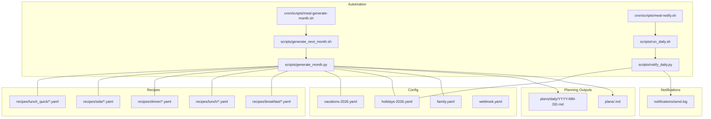
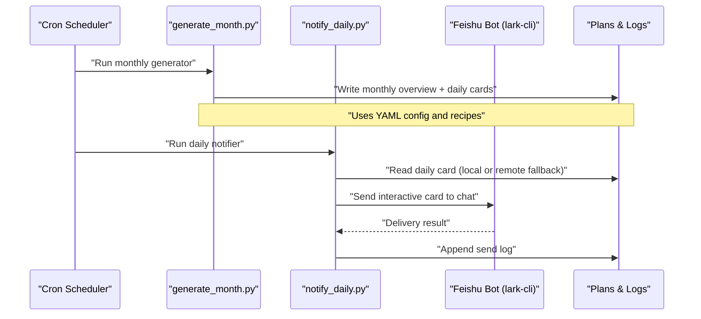
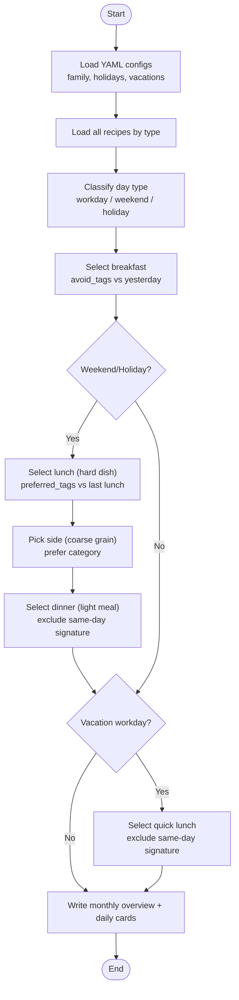
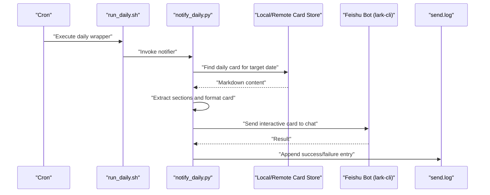
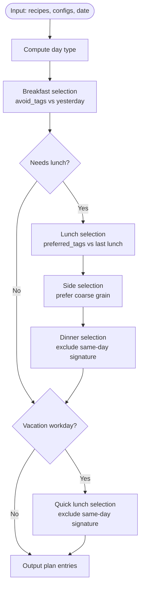
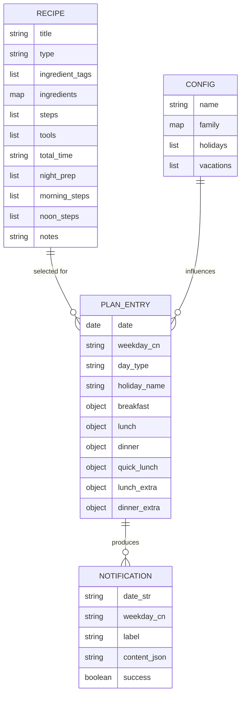
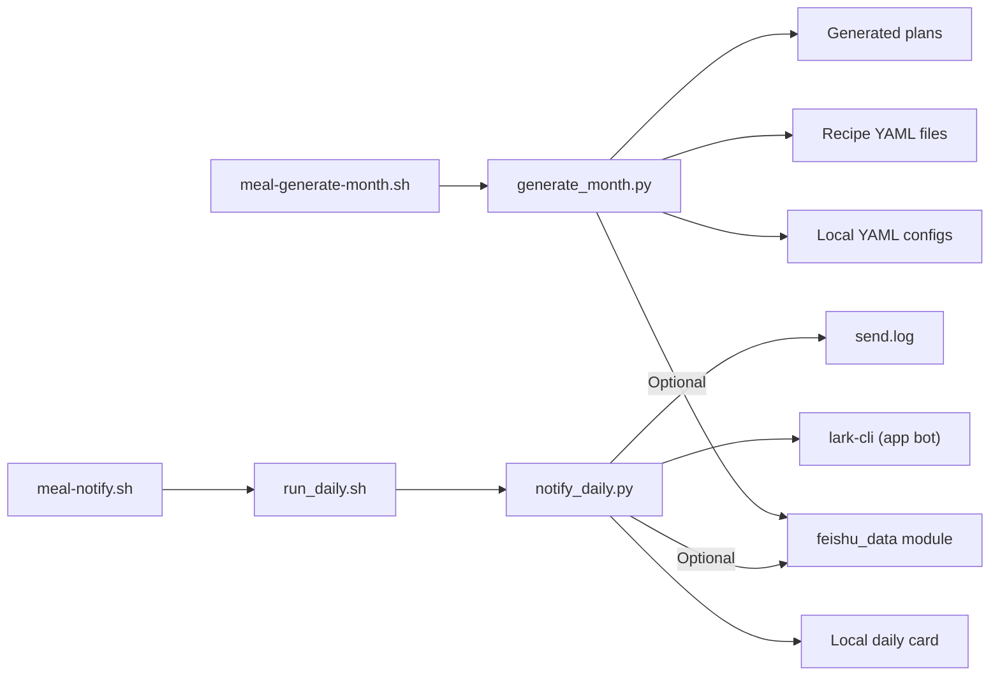

# System Architecture and Overview

<cite>
**Referenced Files in This Document**
- [meal-generate-month.sh](file://cron/scripts/meal-generate-month.sh)
- [meal-notify.sh](file://cron/scripts/meal-notify.sh)
- [generate_month.py](file://personal/meal/scripts/generate_month.py)
- [notify_daily.py](file://personal/meal/scripts/notify_daily.py)
- [run_daily.sh](file://personal/meal/scripts/run_daily.sh)
- [generate_next_month.sh](file://personal/meal/scripts/generate_next_month.sh)
</cite>

## Table of Contents
1. [Introduction](#introduction)
2. [Project Structure](#project-structure)
3. [Core Components](#core-components)
4. [Architecture Overview](#architecture-overview)
5. [Detailed Component Analysis](#detailed-component-analysis)
6. [Dependency Analysis](#dependency-analysis)
7. [Performance Considerations](#performance-considerations)
8. [Troubleshooting Guide](#troubleshooting-guide)
9. [Conclusion](#conclusion)

## Introduction
This document describes the architecture and data flow of the Family Meal Planning System designed for a family of four. The system automates monthly meal plan generation, produces daily recipe cards, and delivers Feishu (Lark) notifications at scheduled times. It is driven by YAML-based configurations and Python processing scripts that implement constraint-aware selection algorithms to ensure variety, minimize ingredient waste, and respect holidays, vacations, and workday compensation rules.

Key outcomes:
- Monthly plan generation with diverse breakfasts, lunches, dinners, and optional quick lunches during school vacations.
- Daily Markdown recipe cards with ingredients, steps, prep tasks, and shopping lists.
- Automated Feishu notifications sent via an app bot to a designated chat.

## Project Structure
The system is organized into configuration, recipes, planning outputs, notification logs, and automation scripts:
- Configuration: YAML files defining family preferences, holidays, vacations, and webhook settings.
- Recipes: YAML definitions grouped by meal type (breakfast, lunch, dinner, side, lunch_quick).
- Plans: Generated monthly overview and per-day Markdown cards.
- Notifications: Logs for delivery status.
- Scripts: Python generators and notifier; shell wrappers orchestrated by cron.

**Diagram sources**
- [meal-generate-month.sh:1-5](file://cron/scripts/meal-generate-month.sh#L1-L5)
- [meal-notify.sh:1-5](file://cron/scripts/meal-notify.sh#L1-L5)
- [generate_month.py:1-685](file://personal/meal/scripts/generate_month.py#L1-L685)
- [notify_daily.py:1-300](file://personal/meal/scripts/notify_daily.py#L1-L300)
- [run_daily.sh](file://personal/meal/scripts/run_daily.sh)
- [generate_next_month.sh](file://personal/meal/scripts/generate_next_month.sh)

**Section sources**
- [meal-generate-month.sh:1-5](file://cron/scripts/meal-generate-month.sh#L1-L5)
- [meal-notify.sh:1-5](file://cron/scripts/meal-notify.sh#L1-L5)
- [generate_month.py:1-685](file://personal/meal/scripts/generate_month.py#L1-L685)
- [notify_daily.py:1-300](file://personal/meal/scripts/notify_daily.py#L1-L300)
- [run_daily.sh](file://personal/meal/scripts/run_daily.sh)
- [generate_next_month.sh](file://personal/meal/scripts/generate_next_month.sh)

## Core Components
- Monthly Plan Generator: Loads YAML configs and recipes, applies constraints (holidays, vacations, workday compensation), selects meals using scoring and rotation strategies, writes monthly overview and daily cards, and optionally syncs to external storage.
- Daily Notifier: Determines target date based on local time, reads or fetches the daily card, formats a rich message, and sends it via an app bot to a specific chat.
- Cron Orchestration: Shell wrappers schedule monthly plan generation and daily notifications.

Responsibilities and interactions:
- Config-driven behavior: Holidays and vacations influence which meals are planned and when.
- Recipe database: YAML files define ingredients, steps, tools, and tags used for scoring and deduplication.
- Output artifacts: Monthly overview and per-day Markdown cards.
- Notification delivery: App bot integration through a CLI tool.

**Section sources**
- [generate_month.py:1-685](file://personal/meal/scripts/generate_month.py#L1-L685)
- [notify_daily.py:1-300](file://personal/meal/scripts/notify_daily.py#L1-L300)
- [meal-generate-month.sh:1-5](file://cron/scripts/meal-generate-month.sh#L1-L5)
- [meal-notify.sh:1-5](file://cron/scripts/meal-notify.sh#L1-L5)

## Architecture Overview
High-level flow from configuration and recipes to generated plans and notifications:

**Diagram sources**
- [meal-generate-month.sh:1-5](file://cron/scripts/meal-generate-month.sh#L1-L5)
- [meal-notify.sh:1-5](file://cron/scripts/meal-notify.sh#L1-L5)
- [generate_month.py:1-685](file://personal/meal/scripts/generate_month.py#L1-L685)
- [notify_daily.py:1-300](file://personal/meal/scripts/notify_daily.py#L1-L300)

## Detailed Component Analysis

### Monthly Plan Generation Flow
The generator orchestrates loading, planning, formatting, and output:

**Diagram sources**
- [generate_month.py:1-685](file://personal/meal/scripts/generate_month.py#L1-L685)

**Section sources**
- [generate_month.py:1-685](file://personal/meal/scripts/generate_month.py#L1-L685)

### Daily Notification Flow
The notifier determines the target date, retrieves the daily card, formats a rich message, and sends it via the app bot:

**Diagram sources**
- [meal-notify.sh:1-5](file://cron/scripts/meal-notify.sh#L1-L5)
- [run_daily.sh](file://personal/meal/scripts/run_daily.sh)
- [notify_daily.py:1-300](file://personal/meal/scripts/notify_daily.py#L1-L300)

**Section sources**
- [meal-notify.sh:1-5](file://cron/scripts/meal-notify.sh#L1-L5)
- [notify_daily.py:1-300](file://personal/meal/scripts/notify_daily.py#L1-L300)
- [run_daily.sh](file://personal/meal/scripts/run_daily.sh)

### Constraint-Based Selection Logic
Key algorithmic behaviors implemented in the generator:
- Day classification considers holidays, workday compensation, and weekends.
- Breakfast uses anti-clustering against previous day’s ingredient tags to avoid repetition.
- Lunch prefers dishes sharing ingredients with the previous lunch to reduce waste.
- Dinner excludes dishes whose main staple matches breakfast or lunch signatures to avoid duplication across meals.
- Quick lunches are added only during vacation workdays and also avoid same-day staple collisions.
- Rotation seeds per month prevent identical sequences across months.

**Diagram sources**
- [generate_month.py:1-685](file://personal/meal/scripts/generate_month.py#L1-L685)

**Section sources**
- [generate_month.py:1-685](file://personal/meal/scripts/generate_month.py#L1-L685)

### Data Models and Relationships
Conceptual entities involved in planning and notification:

[No sources needed since this diagram shows conceptual data models, not direct code structures]

## Dependency Analysis
External dependencies and integrations:
- Optional Feishu data layer: When available, configs and recipes can be loaded from Feishu Base; otherwise, local YAML files are used.
- Feishu app bot: Notifications are sent via a CLI tool to a specific chat ID.
- Cron scheduler: Triggers monthly generation and daily notifications.

**Diagram sources**
- [generate_month.py:1-685](file://personal/meal/scripts/generate_month.py#L1-L685)
- [notify_daily.py:1-300](file://personal/meal/scripts/notify_daily.py#L1-L300)
- [meal-generate-month.sh:1-5](file://cron/scripts/meal-generate-month.sh#L1-L5)
- [meal-notify.sh:1-5](file://cron/scripts/meal-notify.sh#L1-L5)
- [run_daily.sh](file://personal/meal/scripts/run_daily.sh)

**Section sources**
- [generate_month.py:1-685](file://personal/meal/scripts/generate_month.py#L1-L685)
- [notify_daily.py:1-300](file://personal/meal/scripts/notify_daily.py#L1-L300)
- [meal-generate-month.sh:1-5](file://cron/scripts/meal-generate-month.sh#L1-L5)
- [meal-notify.sh:1-5](file://cron/scripts/meal-notify.sh#L1-L5)
- [run_daily.sh](file://personal/meal/scripts/run_daily.sh)

## Performance Considerations
- Deterministic selection: Scoring and rotation strategies are lightweight and operate over small datasets (dozens of recipes), ensuring fast execution.
- I/O efficiency: Reads/writes are file-based; batch operations occur once per month and once per day.
- Fallback paths: Optional Feishu integration avoids blocking if unavailable; local files guarantee operation continuity.
- Logging: Minimal logging overhead; append-only logs for notifications.

[No sources needed since this section provides general guidance]

## Troubleshooting Guide
Common issues and checks:
- Missing daily card: If the target date’s card is absent locally, the notifier attempts to fetch from Feishu; if both fail, verify that the monthly generator has run and produced the expected files.
- Delivery failures: Inspect the send log for success/failure entries and review CLI invocation parameters.
- Timezone considerations: The notifier computes Beijing time internally; ensure environment time is correct.
- Configuration availability: Ensure required YAML configs exist or that the Feishu data layer is reachable.

Operational references:
- Monthly generation trigger: [meal-generate-month.sh:1-5](file://cron/scripts/meal-generate-month.sh#L1-L5)
- Daily notification trigger: [meal-notify.sh:1-5](file://cron/scripts/meal-notify.sh#L1-L5)
- Notifier logic and fallback: [notify_daily.py:1-300](file://personal/meal/scripts/notify_daily.py#L1-L300)
- Generator logic and outputs: [generate_month.py:1-685](file://personal/meal/scripts/generate_month.py#L1-L685)

**Section sources**
- [meal-generate-month.sh:1-5](file://cron/scripts/meal-generate-month.sh#L1-L5)
- [meal-notify.sh:1-5](file://cron/scripts/meal-notify.sh#L1-L5)
- [notify_daily.py:1-300](file://personal/meal/scripts/notify_daily.py#L1-L300)
- [generate_month.py:1-685](file://personal/meal/scripts/generate_month.py#L1-L685)

## Conclusion
The Family Meal Planning System combines YAML-driven configuration, a curated recipe database, and Python-based constraint-aware algorithms to produce varied, practical meal plans for a family of four. Automation via cron ensures timely monthly generation and daily Feishu notifications. The design balances reliability (local-first with remote fallback), clarity (Markdown outputs), and user experience (rich, actionable notifications).

[No sources needed since this section summarizes without analyzing specific files]