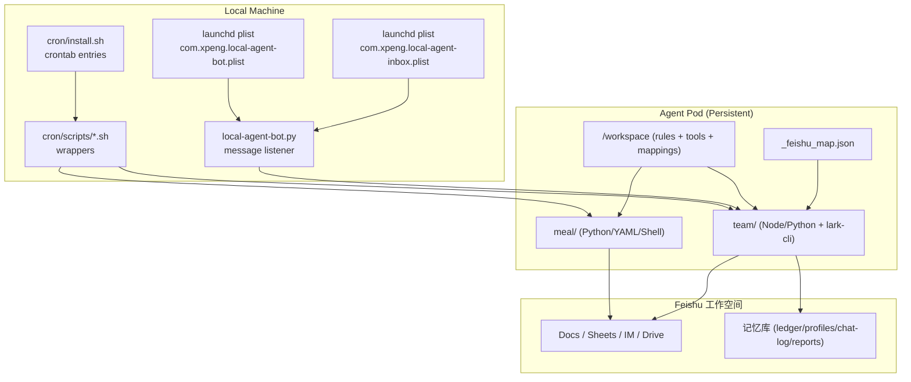
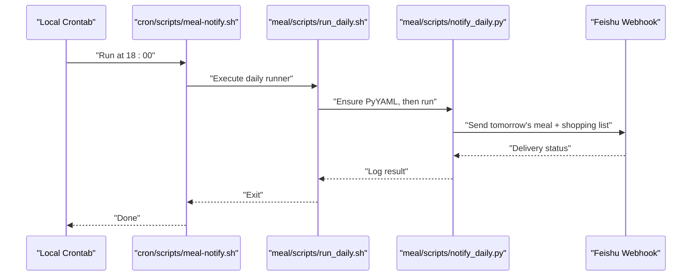
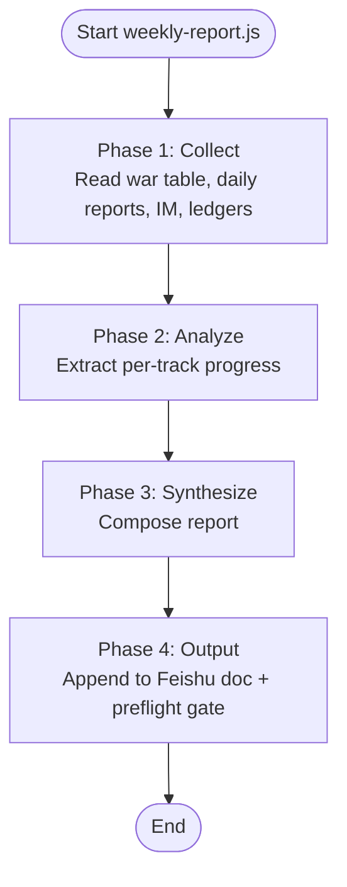
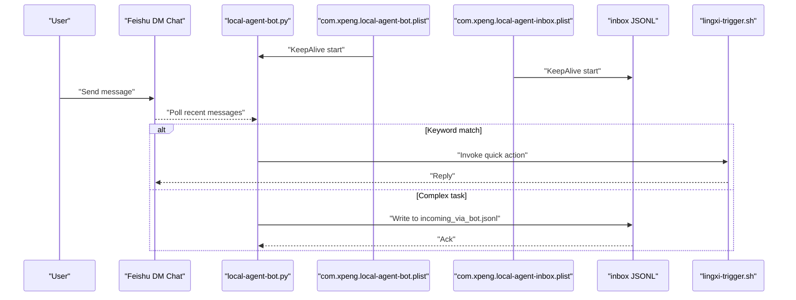
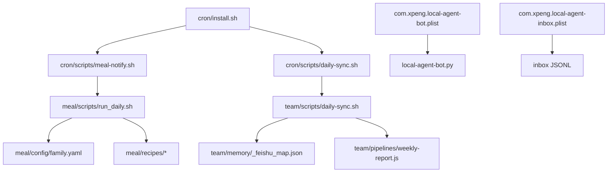

# Project Overview and Getting Started

<cite>
**Referenced Files in This Document**
- [README.md](file://README.md)
- [cron/README.md](file://cron/README.md)
- [cron/install.sh](file://cron/install.sh)
- [cron/scripts/meal-notify.sh](file://cron/scripts/meal-notify.sh)
- [cron/scripts/daily-sync.sh](file://cron/scripts/daily-sync.sh)
- [meal/README.md](file://meal/README.md)
- [meal/config/family.yaml](file://meal/config/family.yaml)
- [meal/scripts/run_daily.sh](file://meal/scripts/run_daily.sh)
- [team/CLAUDE.md](file://team/CLAUDE.md)
- [team/memory/_feishu_map.json](file://team/memory/_feishu_map.json)
- [team/pipelines/weekly-report.js](file://team/pipelines/weekly-report.js)
- [.zod/local-agent-bot/com.xpeng.local-agent-bot.plist](file://.zod/local-agent-bot/com.xpeng.local-agent-bot.plist)
- [.zod/local-agent-bot/com.xpeng.local-agent-inbox.plist](file://.zod/local-agent-bot/com.xpeng.local-agent-inbox.plist)
- [.zod/local-agent-bot/local-agent-bot.py](file://.zod/local-agent-bot/local-agent-bot.py)
</cite>

## Table of Contents
1. [Introduction](#introduction)
2. [Project Structure](#project-structure)
3. [Core Components](#core-components)
4. [Architecture Overview](#architecture-overview)
5. [Detailed Component Analysis](#detailed-component-analysis)
6. [Dependency Analysis](#dependency-analysis)
7. [Performance Considerations](#performance-considerations)
8. [Troubleshooting Guide](#troubleshooting-guide)
9. [Conclusion](#conclusion)

## Introduction
This monorepo hosts two independent systems under a single workspace:
- Family Meal Planning Automation (meal): automated daily meal planning, shopping list generation, and monthly plan creation, with notifications delivered to Feishu.
- Team Collaboration Platform (team): a Feishu-centric collaboration system that maintains a team memory base, generates weekly/biweekly reports, and orchestrates data collection from Feishu sources.

The workspace follows core principles:
- Single-source-of-truth with Feishu: all content lives in the 飞书工作空间; local storage contains only rules, tools, and mappings.
- Separation of rules from content: configuration and logic are kept separate from generated or authored content.
- Local cron scheduling: triggers and scheduled jobs run on the user’s machine; the cloud repository does not include runtime triggers.

Terminology used throughout:
- 灵犀: the agent-driven orchestration layer referenced by the project.
- 飞书工作空间: the collaborative workspace where documents, chats, and records live.
- 记忆库: the team memory system maintained via Feishu documents and indexed locally through mapping files.

Practical example of how the two systems work together while remaining independent:
- The team platform collects and synthesizes information into reports stored in the 飞书工作空间.
- The family meal system reads family preferences and recipes, then pushes daily plans and shopping lists to Feishu at scheduled times.
- Both systems rely on the same deployment model (Agent Pod for code, local cron for scheduling), but they do not share state or business logic.

[No sources needed since this section summarizes without analyzing specific files]

## Project Structure
At the root, the workspace organizes two parallel projects plus shared automation:
- .claude/: Workspace-wide rules and navigation for agents and skills.
- meal/: Family meal planning automation (Python + YAML + Shell + Feishu Webhook).
- team/: Simulation department Feishu workspace interaction (lark-cli + Node.js + Python).
- cron/: Centralized scheduling scripts and installation helper.

```mermaid
graph TB
Root["Workspace Root"] --> Claude[".claude/ (Rules & Skills)"]
Root --> Meal["meal/ (Family Meal Planning)"]
Root --> Team["team/ (Team Collaboration)"]
Root --> Cron["cron/ (Scheduling)"]
subgraph "Meal"
MConfig["config/ (family.yaml, holidays, webhook)"]
MRecipes["recipes/ (breakfast/lunch/dinner/side/special)"]
MPlans["plans/ (monthly + daily cards)"]
MScripts["scripts/ (generate_month.py, notify_daily.py, run_daily.sh)"]
end
subgraph "Team"
TMemory["memory/_feishu_map.json (Feishu token map)"]
TPipelines["pipelines/ (weekly-report.js, gic-report.js)"]
TScripts["scripts/ (preflight, check_report, etc.)"]
end
subgraph "Cron"
CInstall["install.sh (crontab installer)"]
CScrips["scripts/ (daily-sync.sh, meal-notify.sh, etc.)"]
end
Root --> MConfig
Root --> MRecipes
Root --> MPlans
Root --> MScripts
Root --> TMemory
Root --> TPipelines
Root --> TScripts
Root --> CInstall
Root --> CScrips
```

**Diagram sources**
- [README.md:1-75](file://README.md#L1-L75)
- [cron/README.md:1-36](file://cron/README.md#L1-L36)
- [meal/README.md:1-108](file://meal/README.md#L1-L108)
- [team/CLAUDE.md:1-37](file://team/CLAUDE.md#L1-L37)

**Section sources**
- [README.md:1-75](file://README.md#L1-L75)
- [cron/README.md:1-36](file://cron/README.md#L1-L36)
- [meal/README.md:1-108](file://meal/README.md#L1-L108)
- [team/CLAUDE.md:1-37](file://team/CLAUDE.md#L1-L37)

## Core Components
- Meal System:
  - Configuration: family preferences, holiday calendars, and Feishu webhook settings.
  - Recipe library: categorized YAML definitions for breakfast, lunch, dinner, side dishes, and special items.
  - Plan generation: monthly overview and daily detailed cards.
  - Notifications: daily push of next-day meals and shopping lists to Feishu.
  - Scheduling: triggered by local cron via wrapper scripts.

- Team System:
  - Rules and commands: centralized in .claude/team/, guiding memory updates, report writing, and publishing gates.
  - Feishu mapping: _feishu_map.json maps names to Feishu tokens and provides root folder references.
  - Pipelines: Node.js scripts orchestrate data collection, analysis, synthesis, and output directly to Feishu.
  - Tools: preflight checks, report validation, image generation utilities.

- Scheduling Layer:
  - cron/install.sh installs crontab entries for both systems.
  - Wrapper scripts call into meal and team pipelines at specified times.

**Section sources**
- [meal/config/family.yaml:1-74](file://meal/config/family.yaml#L1-L74)
- [meal/README.md:1-108](file://meal/README.md#L1-L108)
- [team/memory/_feishu_map.json:1-276](file://team/memory/_feishu_map.json#L1-L276)
- [team/pipelines/weekly-report.js:1-173](file://team/pipelines/weekly-report.js#L1-L173)
- [cron/install.sh:1-52](file://cron/install.sh#L1-L52)
- [cron/scripts/meal-notify.sh:1-5](file://cron/scripts/meal-notify.sh#L1-L5)
- [cron/scripts/daily-sync.sh:1-6](file://cron/scripts/daily-sync.sh#L1-L6)

## Architecture Overview
The architecture emphasizes separation of concerns and strict adherence to single-source-of-truth in Feishu:
- Rules and tools reside in the repository.
- Content and memory live exclusively in the 飞书工作空间.
- Local cron schedules trigger workflows that read/write Feishu via lark-cli or webhooks.
- Agent Pod hosts the workspace and persistent authorization; scheduling runs locally.

**Diagram sources**
- [cron/install.sh:1-52](file://cron/install.sh#L1-L52)
- [cron/scripts/meal-notify.sh:1-5](file://cron/scripts/meal-notify.sh#L1-L5)
- [cron/scripts/daily-sync.sh:1-6](file://cron/scripts/daily-sync.sh#L1-L6)
- [.zod/local-agent-bot/com.xpeng.local-agent-bot.plist:1-34](file://.zod/local-agent-bot/com.xpeng.local-agent-bot.plist#L1-L34)
- [.zod/local-agent-bot/com.xpeng.local-agent-inbox.plist:1-34](file://.zod/local-agent-bot/com.xpeng.local-agent-inbox.plist#L1-L34)
- [.zod/local-agent-bot/local-agent-bot.py:1-43](file://.zod/local-agent-bot/local-agent-bot.py#L1-L43)
- [team/memory/_feishu_map.json:1-276](file://team/memory/_feishu_map.json#L1-L276)
- [team/pipelines/weekly-report.js:1-173](file://team/pipelines/weekly-report.js#L1-L173)
- [README.md:1-75](file://README.md#L1-L75)

## Detailed Component Analysis

### Meal System: Daily Notification Flow
The meal system uses a simple pipeline:
- Local cron calls a wrapper script.
- The wrapper ensures dependencies and invokes the notification script.
- The notification script reads family config and recipe pool, then posts to Feishu.

**Diagram sources**
- [cron/install.sh:41-47](file://cron/install.sh#L41-L47)
- [cron/scripts/meal-notify.sh:1-5](file://cron/scripts/meal-notify.sh#L1-L5)
- [meal/scripts/run_daily.sh:1-9](file://meal/scripts/run_daily.sh#L1-L9)
- [meal/README.md:1-108](file://meal/README.md#L1-L108)

**Section sources**
- [cron/install.sh:41-47](file://cron/install.sh#L41-L47)
- [cron/scripts/meal-notify.sh:1-5](file://cron/scripts/meal-notify.sh#L1-L5)
- [meal/scripts/run_daily.sh:1-9](file://meal/scripts/run_daily.sh#L1-L9)
- [meal/README.md:1-108](file://meal/README.md#L1-L108)

### Team System: Weekly Report Pipeline
The team system’s weekly report pipeline is a four-phase workflow:
- Collect: pull data from Feishu docs, IM, and ledger via lark-cli.
- Analyze: extract structured progress per track (scene&production/SIL/HIL/Agents).
- Synthesize: compose a coherent report aligned with leadership preferences.
- Output: append to Feishu document and pass preflight gate.

**Diagram sources**
- [team/pipelines/weekly-report.js:1-173](file://team/pipelines/weekly-report.js#L1-L173)
- [team/memory/_feishu_map.json:1-276](file://team/memory/_feishu_map.json#L1-L276)

**Section sources**
- [team/pipelines/weekly-report.js:1-173](file://team/pipelines/weekly-report.js#L1-L173)
- [team/memory/_feishu_map.json:1-276](file://team/memory/_feishu_map.json#L1-L276)

### Local Agent Bot: Message Listener and Triggering
A persistent local agent bot listens to Feishu DM messages and routes them:
- Simple keywords trigger immediate actions via a shell trigger.
- Complex messages are queued for processing by an inbox agent.
- Managed by launchd UserAgents for KeepAlive behavior.

**Diagram sources**
- [.zod/local-agent-bot/com.xpeng.local-agent-bot.plist:1-34](file://.zod/local-agent-bot/com.xpeng.local-agent-bot.plist#L1-L34)
- [.zod/local-agent-bot/com.xpeng.local-agent-inbox.plist:1-34](file://.zod/local-agent-bot/com.xpeng.local-agent-inbox.plist#L1-L34)
- [.zod/local-agent-bot/local-agent-bot.py:1-43](file://.zod/local-agent-bot/local-agent-bot.py#L1-L43)

**Section sources**
- [.zod/local-agent-bot/com.xpeng.local-agent-bot.plist:1-34](file://.zod/local-agent-bot/com.xpeng.local-agent-bot.plist#L1-L34)
- [.zod/local-agent-bot/com.xpeng.local-agent-inbox.plist:1-34](file://.zod/local-agent-bot/com.xpeng.local-agent-inbox.plist#L1-L34)
- [.zod/local-agent-bot/local-agent-bot.py:1-43](file://.zod/local-agent-bot/local-agent-bot.py#L1-L43)

### Conceptual Overview
For beginners:
- A monorepo is a single repository containing multiple related projects. Here, it holds two independent systems sharing common conventions and tooling.
- “Single-source-of-truth” means authoritative content resides in one place—in this case, the 飞书工作空间—while the repo stores only rules and automation.
- “Separation of rules from content” ensures maintainability: changes to logic or policies do not mix with generated or authored documents.

For experienced developers:
- The architecture decouples scheduling (local cron) from execution (Pod-hosted workspace).
- Data flows are explicit: wrappers invoke Python/Node pipelines that interact with Feishu APIs via lark-cli or webhooks.
- Mapping files (_feishu_map.json) provide stable identifiers for dynamic content, enabling robust cross-references without duplicating content.

[No sources needed since this section doesn't analyze specific files]

## Dependency Analysis
Key dependencies and relationships:
- cron/install.sh depends on cron/scripts/* wrappers.
- meal/notify flow depends on meal/config/* and recipes/*.yaml.
- team pipelines depend on _feishu_map.json and lark-cli environment.
- Local agent bots depend on launchd plists and file-based IPC.

**Diagram sources**
- [cron/install.sh:1-52](file://cron/install.sh#L1-L52)
- [cron/scripts/meal-notify.sh:1-5](file://cron/scripts/meal-notify.sh#L1-L5)
- [cron/scripts/daily-sync.sh:1-6](file://cron/scripts/daily-sync.sh#L1-L6)
- [meal/scripts/run_daily.sh:1-9](file://meal/scripts/run_daily.sh#L1-L9)
- [meal/config/family.yaml:1-74](file://meal/config/family.yaml#L1-L74)
- [team/memory/_feishu_map.json:1-276](file://team/memory/_feishu_map.json#L1-L276)
- [team/pipelines/weekly-report.js:1-173](file://team/pipelines/weekly-report.js#L1-L173)
- [.zod/local-agent-bot/com.xpeng.local-agent-bot.plist:1-34](file://.zod/local-agent-bot/com.xpeng.local-agent-bot.plist#L1-L34)
- [.zod/local-agent-bot/com.xpeng.local-agent-inbox.plist:1-34](file://.zod/local-agent-bot/com.xpeng.local-agent-inbox.plist#L1-L34)

**Section sources**
- [cron/install.sh:1-52](file://cron/install.sh#L1-L52)
- [cron/scripts/meal-notify.sh:1-5](file://cron/scripts/meal-notify.sh#L1-L5)
- [cron/scripts/daily-sync.sh:1-6](file://cron/scripts/daily-sync.sh#L1-L6)
- [meal/scripts/run_daily.sh:1-9](file://meal/scripts/run_daily.sh#L1-L9)
- [meal/config/family.yaml:1-74](file://meal/config/family.yaml#L1-L74)
- [team/memory/_feishu_map.json:1-276](file://team/memory/_feishu_map.json#L1-L276)
- [team/pipelines/weekly-report.js:1-173](file://team/pipelines/weekly-report.js#L1-L173)
- [.zod/local-agent-bot/com.xpeng.local-agent-bot.plist:1-34](file://.zod/local-agent-bot/com.xpeng.local-agent-bot.plist#L1-L34)
- [.zod/local-agent-bot/com.xpeng.local-agent-inbox.plist:1-34](file://.zod/local-agent-bot/com.xpeng.local-agent-inbox.plist#L1-L34)

## Performance Considerations
- Minimize network round-trips by batching Feishu reads/writes where possible.
- Use targeted queries (e.g., date windows, page-size pagination) to reduce payload sizes.
- Cache frequently accessed mappings locally (_feishu_map.json) to avoid repeated lookups.
- Ensure cron tasks are idempotent to handle retries gracefully.
- For meal notifications, pre-generate monthly plans to reduce real-time computation.

[No sources needed since this section provides general guidance]

## Troubleshooting Guide
Common issues and resolutions:
- Missing dependencies after Pod restart:
  - The meal runner self-heals by installing PyYAML if absent before sending notifications.
- Crontab not installed or outdated:
  - Re-run cron/install.sh to refresh entries.
- Feishu authentication errors:
  - Verify /platform/.lark-cli persistence and permissions on Agent Pod.
- Local agent bot not responding:
  - Check launchd logs for com.xpeng.local-agent-bot and com.xpeng.local-agent-inbox.
  - Validate inbox JSONL queue and processed IDs tracking.

**Section sources**
- [meal/scripts/run_daily.sh:1-9](file://meal/scripts/run_daily.sh#L1-L9)
- [cron/install.sh:1-52](file://cron/install.sh#L1-L52)
- [.zod/local-agent-bot/com.xpeng.local-agent-bot.plist:1-34](file://.zod/local-agent-bot/com.xpeng.local-agent-bot.plist#L1-L34)
- [.zod/local-agent-bot/com.xpeng.local-agent-inbox.plist:1-34](file://.zod/local-agent-bot/com.xpeng.local-agent-inbox.plist#L1-L34)
- [.zod/local-agent-bot/local-agent-bot.py:1-43](file://.zod/local-agent-bot/local-agent-bot.py#L1-L43)

## Conclusion
This monorepo cleanly separates two independent systems while enforcing consistent operational principles:
- All content resides in the 飞书工作空间, ensuring a single source of truth.
- Rules and automation remain in the repository, promoting clarity and maintainability.
- Local cron scheduling drives reliable, repeatable workflows across both systems.
- The architecture supports scalability and resilience through clear boundaries, explicit data flows, and robust error handling.

[No sources needed since this section summarizes without analyzing specific files]