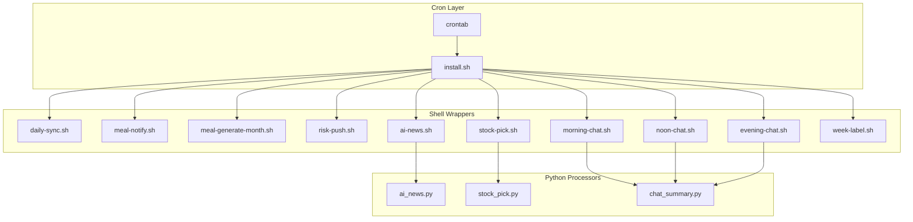
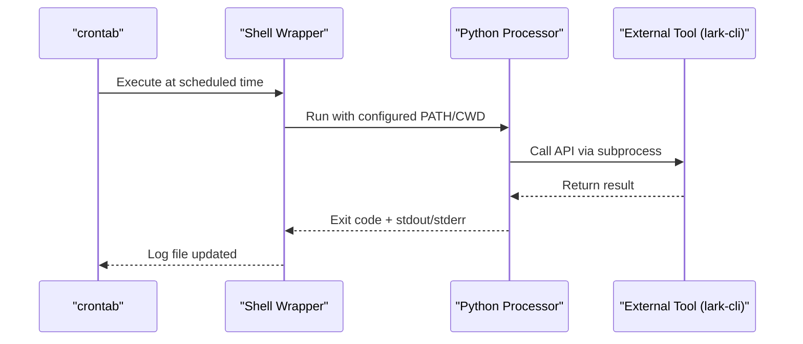
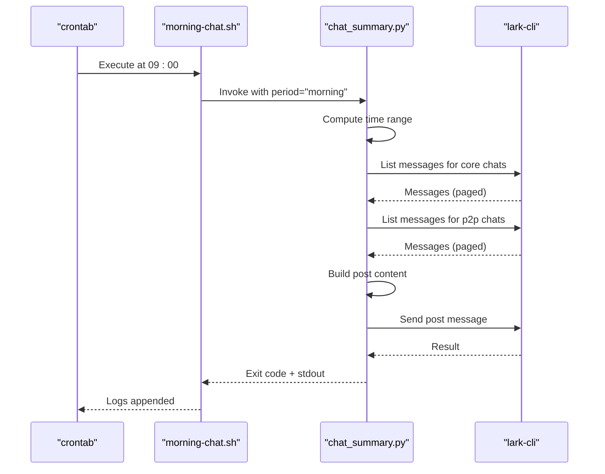
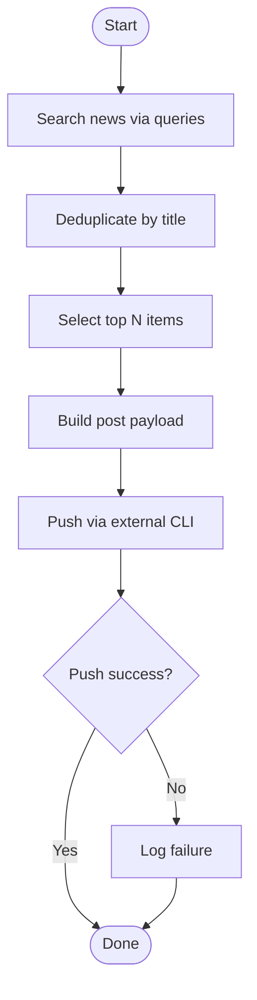
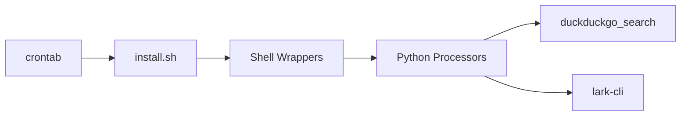

# Task Scheduling and Automation

<cite>
**Referenced Files in This Document**
- [cron/README.md](file://cron/README.md)
- [install.sh](file://cron/install.sh)
- [daily-sync.sh](file://cron/scripts/daily-sync.sh)
- [meal-notify.sh](file://cron/scripts/meal-notify.sh)
- [meal-generate-month.sh](file://cron/scripts/meal-generate-month.sh)
- [risk-push.sh](file://cron/scripts/risk-push.sh)
- [ai-news.sh](file://cron/scripts/ai-news.sh)
- [stock-pick.sh](file://cron/scripts/stock-pick.sh)
- [morning-chat.sh](file://cron/scripts/morning-chat.sh)
- [noon-chat.sh](file://cron/scripts/noon-chat.sh)
- [evening-chat.sh](file://cron/scripts/evening-chat.sh)
- [week-label.sh](file://cron/scripts/week-label.sh)
- [ai_news.py](file://cron/jobs/ai_news.py)
- [stock_pick.py](file://cron/jobs/stock_pick.py)
- [chat_summary.py](file://cron/jobs/chat_summary.py)
</cite>

## Table of Contents
1. [Introduction](#introduction)
2. [Project Structure](#project-structure)
3. [Core Components](#core-components)
4. [Architecture Overview](#architecture-overview)
5. [Detailed Component Analysis](#detailed-component-analysis)
6. [Dependency Analysis](#dependency-analysis)
7. [Performance Considerations](#performance-considerations)
8. [Troubleshooting Guide](#troubleshooting-guide)
9. [Conclusion](#conclusion)
10. [Appendices](#appendices)

## Introduction
This document explains the Task Scheduling and Automation system that orchestrates time-based tasks for both team and meal systems using cron job management. The system uses shell script wrappers to launch Python processors, centralizes installation via a single installer, and provides logging and error handling strategies suitable for automated execution. It covers job installation procedures, task definitions, configuration options (scheduling intervals, environment variables), monitoring approaches, and practical examples for creating new scheduled tasks and troubleshooting failures.

## Project Structure
The scheduling subsystem is organized under the cron directory:
- install.sh: Installs or replaces crontab entries with all scheduled jobs.
- scripts/: Shell wrappers that set up environment, change directories, and invoke either Python processors or other scripts.
- jobs/: Python processors invoked by some shell wrappers.

**Diagram sources**
- [install.sh:1-52](file://cron/install.sh#L1-L52)
- [daily-sync.sh:1-6](file://cron/scripts/daily-sync.sh#L1-L6)
- [meal-notify.sh:1-5](file://cron/scripts/meal-notify.sh#L1-L5)
- [meal-generate-month.sh:1-5](file://cron/scripts/meal-generate-month.sh#L1-L5)
- [risk-push.sh:1-5](file://cron/scripts/risk-push.sh#L1-L5)
- [ai-news.sh:1-7](file://cron/scripts/ai-news.sh#L1-L7)
- [stock-pick.sh:1-7](file://cron/scripts/stock-pick.sh#L1-L7)
- [morning-chat.sh:1-6](file://cron/scripts/morning-chat.sh#L1-L6)
- [noon-chat.sh:1-6](file://cron/scripts/noon-chat.sh#L1-L6)
- [evening-chat.sh:1-6](file://cron/scripts/evening-chat.sh#L1-L6)
- [week-label.sh:1-5](file://cron/scripts/week-label.sh#L1-L5)
- [ai_news.py:1-109](file://cron/jobs/ai_news.py#L1-L109)
- [stock_pick.py:1-120](file://cron/jobs/stock_pick.py#L1-L120)
- [chat_summary.py:1-297](file://cron/jobs/chat_summary.py#L1-L297)

**Section sources**
- [cron/README.md:1-36](file://cron/README.md#L1-L36)
- [install.sh:1-52](file://cron/install.sh#L1-L52)

## Core Components
- Cron Installer (install.sh): Defines PATH and schedules all jobs. It writes a complete crontab, replacing existing entries.
- Shell Wrappers (scripts/*): Provide consistent execution context (PATH, working directory), redirect logs, and call Python processors or other scripts.
- Python Processors (jobs/*): Implement business logic such as news aggregation, stock picks, and chat summaries; they interact with external tools via subprocess calls.

Key responsibilities:
- Centralized scheduling: All cron expressions are defined in one place.
- Environment isolation: Each wrapper sets PATH and working directory as needed.
- Logging: Standard output and errors are redirected to log files per job.
- Error handling: Shell wrappers use strict mode; Python processors catch exceptions and print status messages.

**Section sources**
- [install.sh:1-52](file://cron/install.sh#L1-L52)
- [ai-news.sh:1-7](file://cron/scripts/ai-news.sh#L1-L7)
- [stock-pick.sh:1-7](file://cron/scripts/stock-pick.sh#L1-L7)
- [morning-chat.sh:1-6](file://cron/scripts/morning-chat.sh#L1-L6)
- [noon-chat.sh:1-6](file://cron/scripts/noon-chat.sh#L1-L6)
- [evening-chat.sh:1-6](file://cron/scripts/evening-chat.sh#L1-L6)
- [ai_news.py:1-109](file://cron/jobs/ai_news.py#L1-L109)
- [stock_pick.py:1-120](file://cron/jobs/stock_pick.py#L1-L120)
- [chat_summary.py:1-297](file://cron/jobs/chat_summary.py#L1-L297)

## Architecture Overview
The system follows a thin-wrapper pattern:
- crontab invokes shell wrappers.
- Shell wrappers configure environment and execute Python processors or other scripts.
- Python processors perform work and communicate with external tools (e.g., lark-cli).

**Diagram sources**
- [install.sh:1-52](file://cron/install.sh#L1-L52)
- [ai-news.sh:1-7](file://cron/scripts/ai-news.sh#L1-L7)
- [ai_news.py:1-109](file://cron/jobs/ai_news.py#L1-L109)
- [stock-pick.sh:1-7](file://cron/scripts/stock-pick.sh#L1-L7)
- [stock_pick.py:1-120](file://cron/jobs/stock_pick.py#L1-L120)
- [morning-chat.sh:1-6](file://cron/scripts/morning-chat.sh#L1-L6)
- [chat_summary.py:1-297](file://cron/jobs/chat_summary.py#L1-L297)

## Detailed Component Analysis

### Cron Installation and Job Definitions
- The installer defines PATH and writes all cron entries, including team sync, risk push, AI news, stock picks, chat summaries, meal notifications, monthly plan generation, and weekly label updates.
- Jobs run at specific times; several jobs share the same minute but can be parallelized by design.

Practical usage:
- Install or reinstall crontab: run the installer from repository root.
- View current crontab: use the standard command to list entries.

Configuration highlights:
- PATH includes common binary locations to ensure commands like python3 and lark-cli are available.
- Each entry points to an absolute path within the repository to avoid ambiguity.

**Section sources**
- [cron/README.md:1-36](file://cron/README.md#L1-L36)
- [install.sh:1-52](file://cron/install.sh#L1-L52)

### Shell Wrapper Patterns
Common patterns used across wrappers:
- Strict mode: Fail fast on errors and undefined variables.
- Working directory changes: cd to module roots before invoking scripts.
- Absolute paths: Use full paths for interpreters and scripts.
- Logging redirection: Append stdout and stderr to dedicated log files.
- exec replacement: Replace shell process with Python when possible to simplify process trees.

Examples:
- Team daily sync wrapper changes into team directory and runs its own script, appending logs.
- Meal notification wrapper executes a meal script and appends logs to a notifications log.
- Monthly meal plan generator changes into meal directory and runs its generator script.
- Risk push wrapper directly invokes a Python processor and redirects logs.
- AI news, stock pick, and chat summary wrappers compute REPO_ROOT and exec into Python processors.

**Section sources**
- [daily-sync.sh:1-6](file://cron/scripts/daily-sync.sh#L1-L6)
- [meal-notify.sh:1-5](file://cron/scripts/meal-notify.sh#L1-L5)
- [meal-generate-month.sh:1-5](file://cron/scripts/meal-generate-month.sh#L1-L5)
- [risk-push.sh:1-5](file://cron/scripts/risk-push.sh#L1-L5)
- [ai-news.sh:1-7](file://cron/scripts/ai-news.sh#L1-L7)
- [stock-pick.sh:1-7](file://cron/scripts/stock-pick.sh#L1-L7)
- [morning-chat.sh:1-6](file://cron/scripts/morning-chat.sh#L1-L6)
- [noon-chat.sh:1-6](file://cron/scripts/noon-chat.sh#L1-L6)
- [evening-chat.sh:1-6](file://cron/scripts/evening-chat.sh#L1-L6)
- [week-label.sh:1-5](file://cron/scripts/week-label.sh#L1-L5)

### Python Processors
- ai_news.py: Searches AI-related news, deduplicates by title, builds a formatted post payload, and sends it via an external CLI tool.
- stock_pick.py: Searches financial news, selects top items, formats a post payload, and sends it via the same external CLI tool.
- chat_summary.py: Collects messages from core groups and p2p chats within a time window, summarizes them, and posts a digest.

Common behaviors:
- External tool invocation via subprocess with timeouts.
- JSON payload construction for rich message formatting.
- Basic try/except blocks to capture unexpected errors and print status.

**Section sources**
- [ai_news.py:1-109](file://cron/jobs/ai_news.py#L1-L109)
- [stock_pick.py:1-120](file://cron/jobs/stock_pick.py#L1-L120)
- [chat_summary.py:1-297](file://cron/jobs/chat_summary.py#L1-L297)

### Sequence: Chat Summary Workflow

**Diagram sources**
- [install.sh:1-52](file://cron/install.sh#L1-L52)
- [morning-chat.sh:1-6](file://cron/scripts/morning-chat.sh#L1-L6)
- [chat_summary.py:1-297](file://cron/jobs/chat_summary.py#L1-L297)

### Flowchart: News Aggregation and Push

**Diagram sources**
- [ai_news.py:1-109](file://cron/jobs/ai_news.py#L1-L109)
- [stock_pick.py:1-120](file://cron/jobs/stock_pick.py#L1-L120)

## Dependency Analysis
- Crontab depends on install.sh to define schedule and PATH.
- Shell wrappers depend on:
  - Python interpreter path (/opt/homebrew/bin/python3).
  - Repository structure (absolute paths to scripts and processors).
  - External CLI tool (lark-cli) availability in PATH.
- Python processors depend on:
  - duckduckgo_search library for news retrieval.
  - lark-cli for messaging.
  - Standard libraries (json, subprocess, datetime, sys).

Potential coupling:
- Hardcoded user IDs and profiles in Python processors.
- Fixed interpreter paths in wrappers.

**Diagram sources**
- [install.sh:1-52](file://cron/install.sh#L1-L52)
- [ai-news.sh:1-7](file://cron/scripts/ai-news.sh#L1-L7)
- [stock-pick.sh:1-7](file://cron/scripts/stock-pick.sh#L1-L7)
- [morning-chat.sh:1-6](file://cron/scripts/morning-chat.sh#L1-L6)
- [ai_news.py:1-109](file://cron/jobs/ai_news.py#L1-L109)
- [stock_pick.py:1-120](file://cron/jobs/stock_pick.py#L1-L120)
- [chat_summary.py:1-297](file://cron/jobs/chat_summary.py#L1-L297)

**Section sources**
- [install.sh:1-52](file://cron/install.sh#L1-L52)
- [ai_news.py:1-109](file://cron/jobs/ai_news.py#L1-L109)
- [stock_pick.py:1-120](file://cron/jobs/stock_pick.py#L1-L120)
- [chat_summary.py:1-297](file://cron/jobs/chat_summary.py#L1-L297)

## Performance Considerations
- Parallelism: Multiple jobs share the same minute (e.g., 09:00). Ensure external APIs can handle concurrent requests.
- Pagination: Chat summary fetches messages page-by-page; keep page sizes reasonable to balance memory and latency.
- Timeouts: Subprocess calls include timeouts to prevent hanging.
- Logging overhead: Redirecting large outputs may increase disk I/O; consider rotating logs if necessary.

[No sources needed since this section provides general guidance]

## Troubleshooting Guide
Common issues and resolutions:
- Command not found:
  - Ensure PATH includes /opt/homebrew/bin and other required directories.
  - Verify lark-cli and python3 are installed and accessible.
- Permission denied:
  - Confirm the cron user has read/write access to log directories and repository paths.
- Wrong working directory:
  - Some wrappers rely on cd to module roots; verify paths exist and are correct.
- Authentication/profile issues:
  - Check that the profile used by lark-cli is configured and valid.
- No output/logs:
  - Inspect job-specific log files appended by wrappers.
- Timezone differences:
  - Cron runs in the system timezone; confirm expected behavior.

Where to look:
- Installer and crontab entries: review install.sh for schedule and PATH.
- Wrapper logs: check each job’s log destination (stdout/stderr redirection).
- Python processor logs: inspect printed status messages and exception traces.

**Section sources**
- [install.sh:1-52](file://cron/install.sh#L1-L52)
- [daily-sync.sh:1-6](file://cron/scripts/daily-sync.sh#L1-L6)
- [meal-notify.sh:1-5](file://cron/scripts/meal-notify.sh#L1-L5)
- [risk-push.sh:1-5](file://cron/scripts/risk-push.sh#L1-L5)
- [ai_news.py:1-109](file://cron/jobs/ai_news.py#L1-L109)
- [stock_pick.py:1-120](file://cron/jobs/stock_pick.py#L1-L120)
- [chat_summary.py:1-297](file://cron/jobs/chat_summary.py#L1-L297)

## Conclusion
The Task Scheduling and Automation system provides a clear separation between scheduling (crontab), environment setup (shell wrappers), and business logic (Python processors). It centralizes installation, ensures consistent execution contexts, and supports logging and basic error handling. By following the patterns documented here, you can add new scheduled tasks reliably and troubleshoot issues effectively.

[No sources needed since this section summarizes without analyzing specific files]

## Appendices

### How to Install Cron Jobs
- From repository root, run the installer to replace crontab with the defined jobs.
- After installation, list crontab entries to verify.

**Section sources**
- [cron/README.md:19-36](file://cron/README.md#L19-L36)
- [install.sh:1-52](file://cron/install.sh#L1-L52)

### How to Create a New Scheduled Task
- Add a new shell wrapper under cron/scripts/ that sets PATH/CWD and invokes your processor or script, redirecting logs.
- Update install.sh to add a new crontab entry pointing to the wrapper.
- Re-run the installer to apply changes.

**Section sources**
- [install.sh:1-52](file://cron/install.sh#L1-L52)
- [ai-news.sh:1-7](file://cron/scripts/ai-news.sh#L1-L7)
- [stock-pick.sh:1-7](file://cron/scripts/stock-pick.sh#L1-L7)
- [morning-chat.sh:1-6](file://cron/scripts/morning-chat.sh#L1-L6)

### Configuration Options
- Scheduling intervals: Defined in install.sh using cron expressions.
- Environment variables: PATH is set globally in install.sh; additional variables can be exported in wrappers if needed.
- Logging levels: Not explicitly configured; logs are appended to files by wrappers. Adjust verbosity inside processors if needed.

**Section sources**
- [install.sh:1-52](file://cron/install.sh#L1-L52)
- [daily-sync.sh:1-6](file://cron/scripts/daily-sync.sh#L1-L6)
- [meal-notify.sh:1-5](file://cron/scripts/meal-notify.sh#L1-L5)

### Relationship Between Shell Scripts and Processors
- Shell wrappers provide environment and orchestration; Python processors implement domain logic.
- Examples:
  - ai-news.sh -> ai_news.py
  - stock-pick.sh -> stock_pick.py
  - morning-chat.sh, noon-chat.sh, evening-chat.sh -> chat_summary.py

**Section sources**
- [ai-news.sh:1-7](file://cron/scripts/ai-news.sh#L1-L7)
- [ai_news.py:1-109](file://cron/jobs/ai_news.py#L1-L109)
- [stock-pick.sh:1-7](file://cron/scripts/stock-pick.sh#L1-L7)
- [stock_pick.py:1-120](file://cron/jobs/stock_pick.py#L1-L120)
- [morning-chat.sh:1-6](file://cron/scripts/morning-chat.sh#L1-L6)
- [noon-chat.sh:1-6](file://cron/scripts/noon-chat.sh#L1-L6)
- [evening-chat.sh:1-6](file://cron/scripts/evening-chat.sh#L1-L6)
- [chat_summary.py:1-297](file://cron/jobs/chat_summary.py#L1-L297)

### Monitoring Approaches
- Review job-specific log files appended by wrappers.
- Monitor external tool responses and exit codes in processors.
- Optionally integrate centralized log collection or alerting based on log patterns.

**Section sources**
- [daily-sync.sh:1-6](file://cron/scripts/daily-sync.sh#L1-L6)
- [meal-notify.sh:1-5](file://cron/scripts/meal-notify.sh#L1-L5)
- [risk-push.sh:1-5](file://cron/scripts/risk-push.sh#L1-L5)
- [ai_news.py:1-109](file://cron/jobs/ai_news.py#L1-L109)
- [stock_pick.py:1-120](file://cron/jobs/stock_pick.py#L1-L120)
- [chat_summary.py:1-297](file://cron/jobs/chat_summary.py#L1-L297)