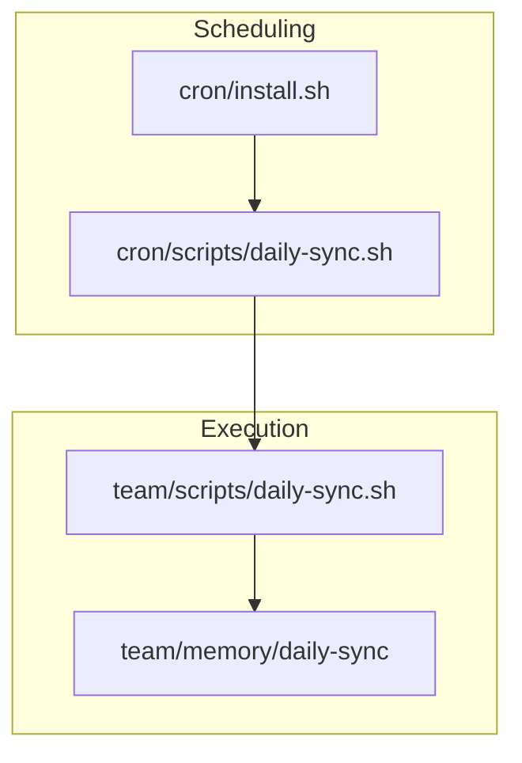
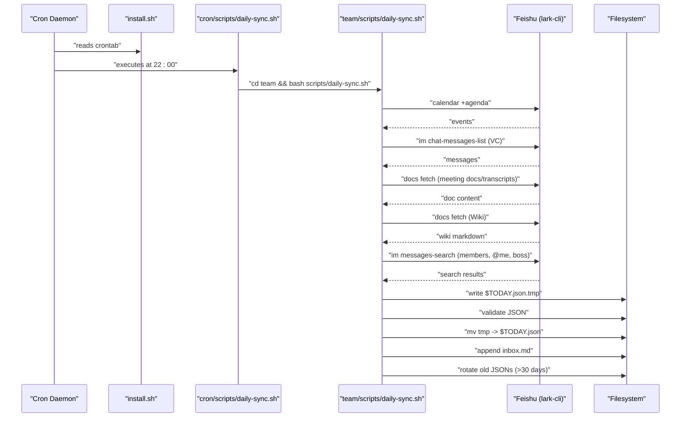
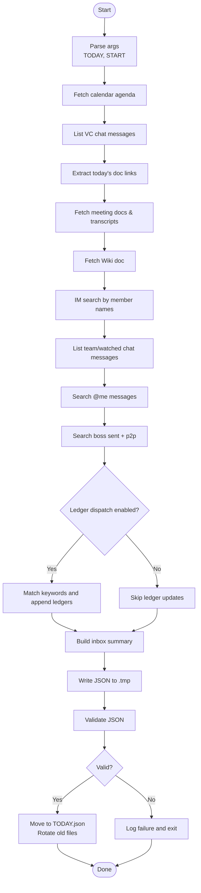
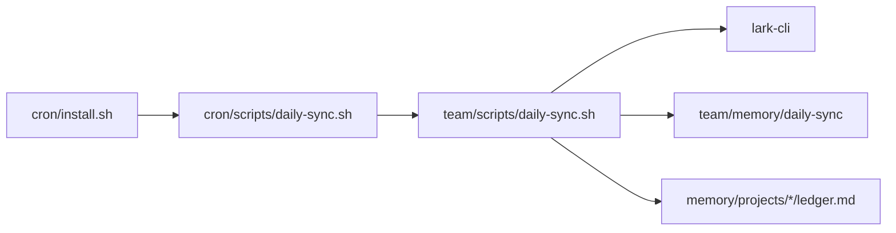

# Daily Data Sync Automation

<cite>
**Referenced Files in This Document**
- [cron/README.md](file://cron/README.md)
- [cron/install.sh](file://cron/install.sh)
- [cron/scripts/daily-sync.sh](file://cron/scripts/daily-sync.sh)
- [team/scripts/daily-sync.sh](file://team/scripts/daily-sync.sh)
</cite>

## Table of Contents
1. [Introduction](#introduction)
2. [Project Structure](#project-structure)
3. [Core Components](#core-components)
4. [Architecture Overview](#architecture-overview)
5. [Detailed Component Analysis](#detailed-component-analysis)
6. [Dependency Analysis](#dependency-analysis)
7. [Performance Considerations](#performance-considerations)
8. [Troubleshooting Guide](#troubleshooting-guide)
9. [Conclusion](#conclusion)

## Introduction
This document describes the Daily Data Sync Automation system that periodically collects collaboration data from a Feishu (Lark) workspace and persists it as structured artifacts for downstream use. The automation is scheduled via cron, invokes a wrapper script, and executes a main Bash+Python pipeline that queries calendar, documents, IM messages, and related resources, then writes daily JSON outputs and an inbox summary.

## Project Structure
The daily sync automation spans two layers:
- Scheduling layer: cron configuration and entry wrappers
- Execution layer: the main daily-sync pipeline under team/scripts

**Diagram sources**
- [cron/install.sh:1-52](file://cron/install.sh#L1-L52)
- [cron/scripts/daily-sync.sh:1-6](file://cron/scripts/daily-sync.sh#L1-L6)
- [team/scripts/daily-sync.sh:1-471](file://team/scripts/daily-sync.sh#L1-L471)

**Section sources**
- [cron/README.md:1-44](file://cron/README.md#L1-L44)
- [cron/install.sh:1-52](file://cron/install.sh#L1-L52)
- [cron/scripts/daily-sync.sh:1-6](file://cron/scripts/daily-sync.sh#L1-L6)
- [team/scripts/daily-sync.sh:1-471](file://team/scripts/daily-sync.sh#L1-L471)

## Core Components
- Cron installer: installs crontab entries including the daily sync job at 22:00.
- Wrapper script: changes to the team directory and runs the main pipeline, appending logs.
- Main pipeline: orchestrates data collection from multiple Feishu surfaces and writes outputs.

Key responsibilities:
- Schedule management and environment setup
- Robust execution with strict error handling
- Multi-source data aggregation into a single JSON artifact per day
- Inbox summary generation for quick human review

**Section sources**
- [cron/install.sh:1-52](file://cron/install.sh#L1-L52)
- [cron/scripts/daily-sync.sh:1-6](file://cron/scripts/daily-sync.sh#L1-L6)
- [team/scripts/daily-sync.sh:1-471](file://team/scripts/daily-sync.sh#L1-L471)

## Architecture Overview
End-to-end flow from schedule to output:

**Diagram sources**
- [cron/install.sh:1-52](file://cron/install.sh#L1-L52)
- [cron/scripts/daily-sync.sh:1-6](file://cron/scripts/daily-sync.sh#L1-L6)
- [team/scripts/daily-sync.sh:1-471](file://team/scripts/daily-sync.sh#L1-L471)

## Detailed Component Analysis

### Cron Installer
- Installs all scheduled tasks, including the daily sync at 22:00.
- Sets PATH for Homebrew and system binaries.
- Provides a single command to refresh crontab after edits.

Operational notes:
- After editing cron scripts or install.sh, re-run the installer to apply changes.
- Use crontab -l to inspect current entries.

**Section sources**
- [cron/README.md:1-44](file://cron/README.md#L1-L44)
- [cron/install.sh:1-52](file://cron/install.sh#L1-L52)

### Wrapper Script (cron/scripts/daily-sync.sh)
- Changes working directory to the team project root.
- Invokes the main pipeline and appends stdout/stderr to a launchd-style log file.
- Ensures consistent environment when executed by cron.

**Section sources**
- [cron/scripts/daily-sync.sh:1-6](file://cron/scripts/daily-sync.sh#L1-L6)

### Main Pipeline (team/scripts/daily-sync.sh)
Responsibilities:
- Parameterization: supports optional date arguments for single-day or multi-day backfill.
- Environment: resolves project root and sync directory; defines constants for VC chat and Wiki doc.
- Logging: centralized logging to sync.log.
- Data collection steps:
  1) Calendar agenda
  2) VC Assistant chat messages
  3) Extract today’s meeting docs and transcripts
  4) Fetch Wiki document
  5) IM member keyword searches
  6) IM group chat messages (team and watched chats)
  7) IM “@ me” messages
  7.5) Boss-related messages (sent and p2p)
  8) Write daily summary to inbox
  9) Optional ledger dispatch (disabled by default)
- Output:
  - Per-day JSON artifact under memory/daily-sync
  - Append-only inbox.md summary
  - Log rotation for older JSON files

Error handling and robustness:
- Strict shell mode (set -euo pipefail).
- Python subprocess calls wrapped with timeouts and error normalization.
- Graceful fallbacks for API failures (e.g., empty lists on errors).
- Atomic write pattern using .tmp and validation before final move.

Configuration highlights:
- Team members are dynamically fetched from a group chat; falls back to a static list if needed.
- Group chats include both core team and watched channels.
- Boss open_id is hardcoded for targeted capture.
- Ledger dispatch can be toggled via environment variable.

Outputs and side effects:
- JSON artifact: contains metadata, window timestamps, collected data, and update summaries.
- Inbox: human-readable summary appended daily.
- Logs: detailed run-time logs for troubleshooting.

**Section sources**
- [team/scripts/daily-sync.sh:1-471](file://team/scripts/daily-sync.sh#L1-L471)

#### Data Collection Flowchart

**Diagram sources**
- [team/scripts/daily-sync.sh:1-471](file://team/scripts/daily-sync.sh#L1-L471)

## Dependency Analysis
External dependencies and integration points:
- lark-cli: primary interface to Feishu APIs for calendar, docs, IM, and permissions.
- Python 3: embedded in the Bash script to orchestrate logic and JSON I/O.
- Filesystem: reads/writes within team/memory/daily-sync and project ledger files.

Coupling and cohesion:
- The wrapper script has minimal coupling, delegating to the main pipeline.
- The main pipeline encapsulates all collection and persistence logic, maintaining high cohesion around daily sync.

Potential circular dependencies:
- None observed; the flow is strictly top-down from scheduler to pipeline to filesystem.

External integrations:
- Feishu platform via lark-cli commands invoked through subprocess.

**Diagram sources**
- [cron/install.sh:1-52](file://cron/install.sh#L1-L52)
- [cron/scripts/daily-sync.sh:1-6](file://cron/scripts/daily-sync.sh#L1-L6)
- [team/scripts/daily-sync.sh:1-471](file://team/scripts/daily-sync.sh#L1-L471)

**Section sources**
- [cron/install.sh:1-52](file://cron/install.sh#L1-L52)
- [cron/scripts/daily-sync.sh:1-6](file://cron/scripts/daily-sync.sh#L1-L6)
- [team/scripts/daily-sync.sh:1-471](file://team/scripts/daily-sync.sh#L1-L471)

## Performance Considerations
- Pagination: Chat message listing uses manual pagination to avoid unsupported flags and ensure completeness.
- Timeouts: Subprocess calls enforce a timeout to prevent hanging on network issues.
- Idempotency: Ledger updates check for existing date sections to avoid duplicates.
- Cleanup: Old JSON artifacts beyond 30 days are pruned automatically.
- Batch operations: Member searches iterate over dynamic team lists; consider rate limits and adjust page sizes if necessary.

[No sources needed since this section provides general guidance]

## Troubleshooting Guide
Common issues and remedies:
- Permission errors: Ensure lark-cli is authenticated and has required scopes for user identity. For bot identity, enable appropriate app scopes.
- Empty results: Verify time windows, chat IDs, and member names; confirm the user has access to the groups/chats.
- Validation failures: If JSON validation fails, inspect the temporary file and sync.log for details.
- Scheduler not running: Confirm crontab installation and PATH; re-run the installer after changes.

Operational tips:
- Inspect logs in the sync directory for detailed traces.
- Re-run manually with explicit dates to validate backfill behavior.
- Toggle ledger dispatch via environment variable if needed.

**Section sources**
- [team/scripts/daily-sync.sh:1-471](file://team/scripts/daily-sync.sh#L1-L471)

## Conclusion
The Daily Data Sync Automation provides a reliable, scheduled pipeline to aggregate collaboration data across calendars, documents, and IM channels into structured daily artifacts. Its design emphasizes robustness, idempotency, and clear separation between scheduling and execution, making it easy to maintain and extend.

[No sources needed since this section summarizes without analyzing specific files]