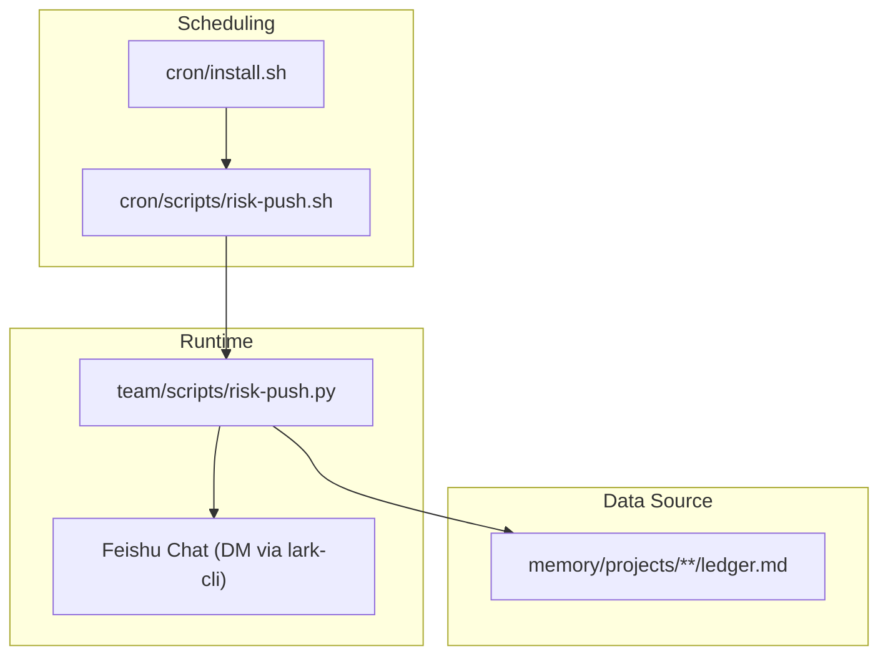
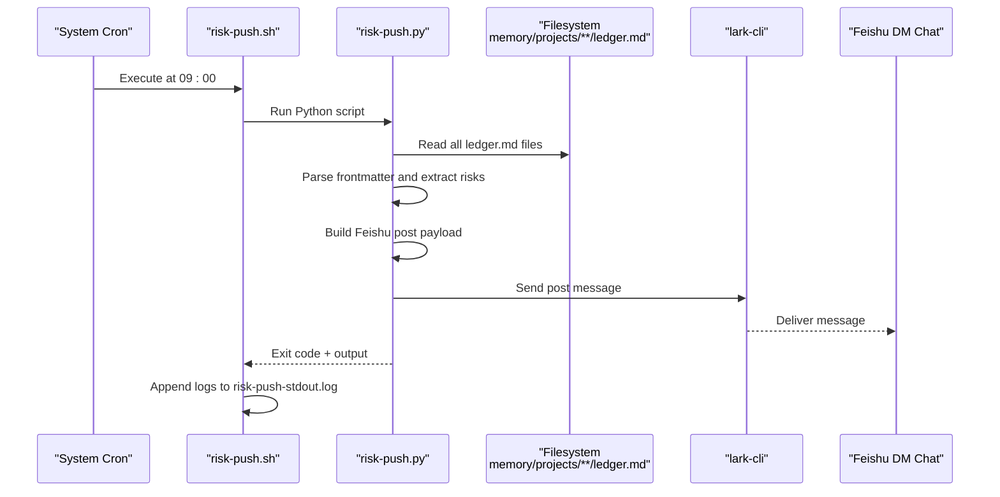
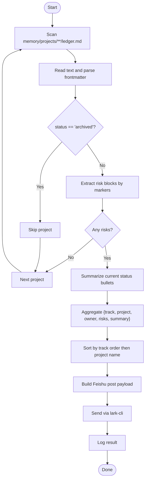
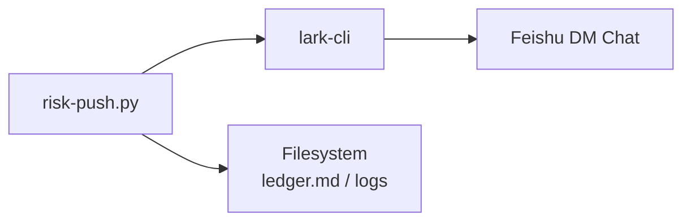

# Project Risk Notification System

<cite>
**Referenced Files in This Document**
- [risk-push.py](file://team/scripts/risk-push.py)
- [risk-push.sh](file://cron/scripts/risk-push.sh)
- [install.sh](file://cron/install.sh)
- [README.md](file://README.md)
- [cron README.md](file://cron/README.md)
</cite>

## Table of Contents
1. [Introduction](#introduction)
2. [Project Structure](#project-structure)
3. [Core Components](#core-components)
4. [Architecture Overview](#architecture-overview)
5. [Detailed Component Analysis](#detailed-component-analysis)
6. [Dependency Analysis](#dependency-analysis)
7. [Performance Considerations](#performance-considerations)
8. [Troubleshooting Guide](#troubleshooting-guide)
9. [Conclusion](#conclusion)

## Introduction
This document describes the Project Risk Notification System that automatically scans project risk logs and pushes a daily summary to a Feishu (Lark) chat via an app bot. The system is scheduled locally with cron, executes a Python script that reads structured ledger files, builds a rich message payload, and sends it through lark-cli.

## Project Structure
The risk notification system spans two areas:
- Scheduling and entrypoint shell scripts under cron/
- Core logic under team/scripts/

**Diagram sources**
- [install.sh:1-52](file://cron/install.sh#L1-L52)
- [risk-push.sh:1-5](file://cron/scripts/risk-push.sh#L1-L5)
- [risk-push.py:1-219](file://team/scripts/risk-push.py#L1-L219)

**Section sources**
- [README.md:1-79](file://README.md#L1-L79)
- [cron README.md:1-44](file://cron/README.md#L1-L44)
- [install.sh:1-52](file://cron/install.sh#L1-L52)
- [risk-push.sh:1-5](file://cron/scripts/risk-push.sh#L1-L5)
- [risk-push.py:1-219](file://team/scripts/risk-push.py#L1-L219)

## Core Components
- Scheduler installer: installs crontab entries for daily tasks including the risk push at 09:00.
- Entrypoint shell: invokes the Python script and captures stdout/stderr into a log file.
- Python processor:
  - Reads all ledger.md files under memory/projects/**/ledger.md
  - Parses YAML frontmatter and extracts risk items by markers
  - Builds a Feishu post payload
  - Sends the message using lark-cli to a configured DM chat
  - Logs execution results

Key responsibilities:
- File discovery and parsing
- Risk extraction and summarization
- Message composition
- Delivery via external CLI tool
- Logging and error handling

**Section sources**
- [install.sh:1-52](file://cron/install.sh#L1-L52)
- [risk-push.sh:1-5](file://cron/scripts/risk-push.sh#L1-L5)
- [risk-push.py:1-219](file://team/scripts/risk-push.py#L1-L219)

## Architecture Overview
End-to-end flow from schedule to delivery:

**Diagram sources**
- [install.sh:1-52](file://cron/install.sh#L1-L52)
- [risk-push.sh:1-5](file://cron/scripts/risk-push.sh#L1-L5)
- [risk-push.py:1-219](file://team/scripts/risk-push.py#L1-L219)

## Detailed Component Analysis

### Scheduler Installer (cron/install.sh)
- Purpose: Install/update crontab entries for multiple daily tasks, including the risk push at 09:00.
- Behavior:
  - Computes repository root path
  - Writes a heredoc-based crontab configuration
  - Installs via crontab command and lists current entries

Operational notes:
- Ensures PATH includes homebrew and system binaries
- Groups tasks by category (simulation sync, daily broadcasts, chat reports, meal notifications)

**Section sources**
- [install.sh:1-52](file://cron/install.sh#L1-L52)

### Entrypoint Script (cron/scripts/risk-push.sh)
- Purpose: Wrapper to run the Python processor with strict mode and capture logs.
- Behavior:
  - Uses set -euo pipefail for fail-fast behavior
  - Invokes Python interpreter with absolute paths
  - Appends both stdout and stderr to a dedicated log file

Operational notes:
- Log location is fixed relative to the workspace
- Suitable for local cron environments

**Section sources**
- [risk-push.sh:1-5](file://cron/scripts/risk-push.sh#L1-L5)

### Processor (team/scripts/risk-push.py)
Responsibilities:
- Configuration constants
- Frontmatter parsing
- Risk extraction by visual markers
- Summary extraction from status sections
- Project collection and ordering
- Feishu message building
- Delivery via lark-cli
- Logging and main orchestration

Key functions and behaviors:
- parse_frontmatter(text): Extracts simple key-value pairs from YAML-like frontmatter delimited by --- blocks.
- extract_risks(text): Scans lines for risk markers and collects indented continuation lines into blocks.
- extract_monthly_target(text): Pulls a short summary from the “Current Status” section by taking up to two non-risk bullet points.
- collect_project_risks(): Walks memory/projects/**/ledger.md, filters archived projects, infers track/project names from path, aggregates risks and summaries, then sorts by a predefined track order and project name.
- build_feishu_message(projects): Composes a Feishu post payload with title counts and per-project details; handles empty case gracefully.
- push(payload): Executes lark-cli to send a post message to a specific DM chat; raises on non-zero exit codes.
- log(msg): Appends timestamped messages to a log file under memory/daily-sync/.
- main(): Orchestrates collection, composition, sending, logging, and prints a concise success message.

Configuration:
- DM_CHAT: Target chat ID for the app bot DM
- BASE_DIR: Resolved directory of the script’s parent (team/)
- PROJECTS_DIR: memory/projects
- LOG_FILE: memory/daily-sync/risk-push.log

Processing logic highlights:
- Track ordering ensures consistent presentation across runs
- Archived projects are skipped
- Empty content yields a friendly “no risks” message

Error handling:
- Non-zero return from lark-cli triggers a RuntimeError with truncated output
- All exceptions are logged before re-raising

**Section sources**
- [risk-push.py:1-219](file://team/scripts/risk-push.py#L1-L219)

#### Data Flow and Parsing Logic

**Diagram sources**
- [risk-push.py:22-122](file://team/scripts/risk-push.py#L22-L122)
- [risk-push.py:125-181](file://team/scripts/risk-push.py#L125-L181)
- [risk-push.py:184-214](file://team/scripts/risk-push.py#L184-L214)

## Dependency Analysis
External dependencies and integration points:
- lark-cli: Used to send Feishu messages as an app bot to a DM chat
- Filesystem: Reads markdown ledger files and writes logs
- Standard library modules: json, os, re, subprocess, datetime, pathlib

Coupling and cohesion:
- Low coupling to external systems (only lark-cli for messaging)
- High cohesion within the processor around risk aggregation and delivery

Potential circular dependencies:
- None observed; linear pipeline from scan to send

Integration contracts:
- Ledger format expectations:
  - Optional YAML frontmatter with keys such as status and owner
  - Risk lines marked with specific emoji or symbols
  - Indented continuation lines included as part of a risk block
  - “Current Status” section used for summary extraction

**Diagram sources**
- [risk-push.py:184-195](file://team/scripts/risk-push.py#L184-L195)

**Section sources**
- [risk-push.py:1-219](file://team/scripts/risk-push.py#L1-L219)

## Performance Considerations
- File scanning uses recursive globbing over ledger.md; performance scales with number of projects.
- Regex operations are lightweight but executed per file; consider caching if ledger size grows significantly.
- External call to lark-cli has a timeout guard; network latency can affect overall runtime.
- Sorting is O(n log n) with small n (number of projects), negligible overhead.

[No sources needed since this section provides general guidance]

## Troubleshooting Guide
Common issues and remedies:
- No message delivered:
  - Verify lark-cli is installed and authenticated
  - Confirm DM_CHAT is correct and accessible by the app bot
  - Check stderr captured in the shell log file
- Permission or scope errors:
  - Ensure the app bot has required scopes and visibility for the target chat
- Ledger not found or empty:
  - Confirm memory/projects/**/ledger.md exists and follows expected structure
  - Ensure projects are not marked as archived
- Logging:
  - Inspect risk-push-stdout.log for shell-level output
  - Inspect risk-push.log for application-level logs

Operational checks:
- Validate crontab installation and schedule
- Manually execute the shell wrapper to reproduce issues
- Review lark-cli invocation parameters and response truncation in logs

**Section sources**
- [risk-push.sh:1-5](file://cron/scripts/risk-push.sh#L1-L5)
- [risk-push.py:184-214](file://team/scripts/risk-push.py#L184-L214)

## Conclusion
The Project Risk Notification System provides a reliable, scheduled mechanism to aggregate project risks from structured ledger files and deliver a concise daily briefing to a Feishu DM chat. Its design emphasizes simplicity, clear separation of concerns, and robust logging, making it easy to operate and extend.