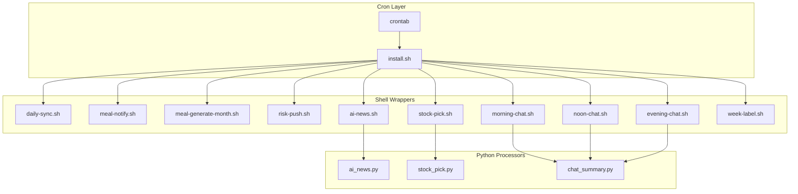
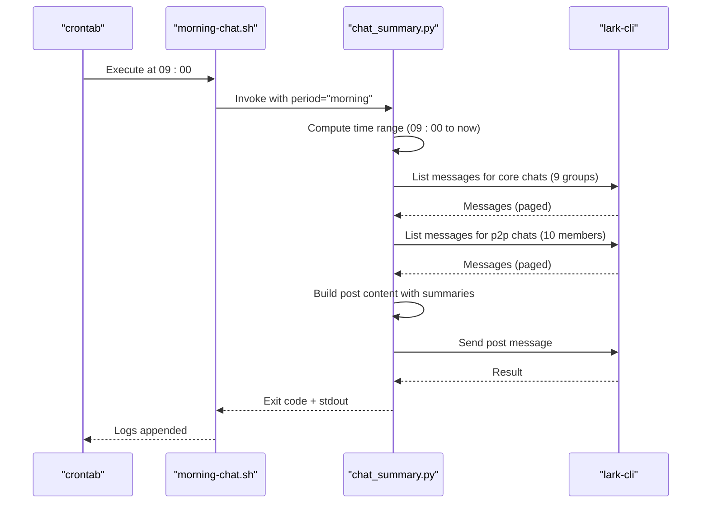
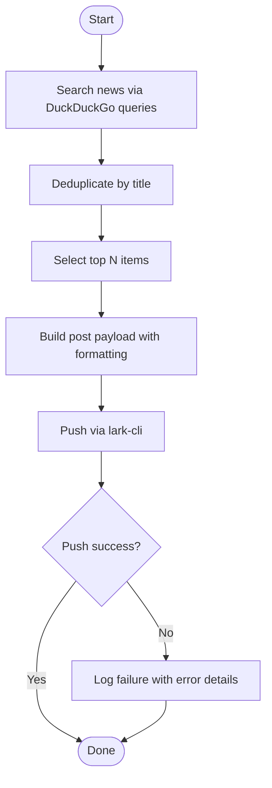
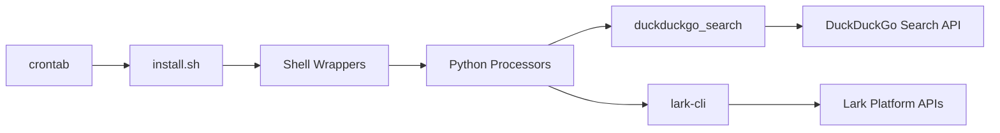

# Task Scheduling and Automation

<cite>
**Referenced Files in This Document**
- [cron/README.md](file://cron/README.md)
- [install.sh](file://cron/install.sh)
- [daily-sync.sh](file://cron/scripts/daily-sync.sh)
- [meal-notify.sh](file://cron/scripts/meal-notify.sh)
- [meal-generate-month.sh](file://cron/scripts/meal-generate-month.sh)
- [risk-push.sh](file://cron/scripts/risk-push.sh)
- [ai-news.sh](file://cron/scripts/ai-news.sh)
- [stock-pick.sh](file://cron/scripts/stock-pick.sh)
- [morning-chat.sh](file://cron/scripts/morning-chat.sh)
- [noon-chat.sh](file://cron/scripts/noon-chat.sh)
- [evening-chat.sh](file://cron/scripts/evening-chat.sh)
- [week-label.sh](file://cron/scripts/week-label.sh)
- [ai_news.py](file://cron/jobs/ai_news.py)
- [stock_pick.py](file://cron/jobs/stock_pick.py)
- [chat_summary.py](file://cron/jobs/chat_summary.py)
</cite>

## Update Summary
**Changes Made**
- Updated Project Structure section to reflect current cron job organization
- Enhanced Core Components section with detailed descriptions of all active automation tasks
- Updated Architecture Overview diagram to show complete job relationships
- Added comprehensive coverage of AI news aggregation, stock picking, and chat summary workflows
- Removed references to non-existent meal-check-feedback.sh script
- Completed documentation of all current automation tasks including team sync, risk push, and weekly label updates

## Table of Contents
1. [Introduction](#introduction)
2. [Project Structure](#project-structure)
3. [Core Components](#core-components)
4. [Architecture Overview](#architecture-overview)
5. [Detailed Component Analysis](#detailed-component-analysis)
6. [Dependency Analysis](#dependency-analysis)
7. [Performance Considerations](#performance-considerations)
8. [Troubleshooting Guide](#troubleshooting-guide)
9. [Conclusion](#conclusion)
10. [Appendices](#appendices)

## Introduction
This document explains the Task Scheduling and Automation system that orchestrates time-based tasks for both team and meal systems using cron job management. The system uses shell script wrappers to launch Python processors, centralizes installation via a single installer, and provides logging and error handling strategies suitable for automated execution. It covers job installation procedures, task definitions, configuration options (scheduling intervals, environment variables), monitoring approaches, and practical examples for creating new scheduled tasks and troubleshooting failures.

The system currently manages three main categories of automation:
- **Team Operations**: Daily data synchronization, project risk notifications, and weekly label updates
- **Information Aggregation**: AI news collection, stock market analysis, and chat message summarization  
- **Meal System Management**: Recipe notifications and monthly plan generation

## Project Structure
The scheduling subsystem is organized under the cron directory with a clear separation between shell wrappers and Python processors:

```
cron/
├── install.sh              # One-click crontab installation (replaces existing crontab)
├── jobs/                   # Python task scripts
│   ├── ai_news.py          # Top 10 AI industry news headlines
│   ├── chat_summary.py     # Chat reports (morning/noon/evening)
│   └── stock_pick.py       # 10 most valuable investment stocks
└── scripts/                # Entry point scripts for each task
    ├── daily-sync.sh       # Daily 22:00 — Data synchronization
    ├── risk-push.sh        # Daily 09:00 — Project risk broadcast
    ├── week-label.sh       # Monday 08:00 — Weekly title update
    ├── ai-news.sh          # Daily 09:00 — Top 10 AI news headlines
    ├── stock-pick.sh       # Daily 09:00 — 10 most valuable stocks
    ├── morning-chat.sh     # Daily 09:00 — Morning chat report
    ├── noon-chat.sh        # Daily 12:00 — Noon chat report
    ├── evening-chat.sh     # Daily 18:00 — Evening chat report
    ├── meal-notify.sh      # Daily 18:00 — Recipe notification
    └── meal-generate-month.sh  # Last day of month 20:00 — Next month plan generation
```

**Updated** The structure now clearly separates shell wrappers (scripts/) from Python processors (jobs/), providing better organization and maintainability.

**Section sources**
- [cron/README.md:1-44](file://cron/README.md#L1-L44)
- [install.sh:1-52](file://cron/install.sh#L1-L52)

## Core Components
The system consists of three primary layers working together:

### Cron Installer (install.sh)
Defines PATH and schedules all jobs by writing a complete crontab, replacing existing entries. Currently manages 10 different scheduled tasks across multiple time slots.

### Shell Wrappers (scripts/*)
Provide consistent execution context (PATH, working directory), redirect logs, and call Python processors or other scripts. Each wrapper follows a standard pattern:
- Set strict mode (`set -euo pipefail`)
- Calculate repository root path
- Execute Python processor with absolute paths
- Use `exec` replacement for cleaner process trees

### Python Processors (jobs/*)
Implement business logic for specialized tasks:
- **AI News Aggregation**: Searches AI-related news using DuckDuckGo, deduplicates by title, builds formatted posts, and sends via Lark CLI
- **Stock Market Analysis**: Searches financial news, selects top investment opportunities, formats content, and pushes recommendations
- **Chat Summarization**: Collects messages from core groups and personal chats within time windows, summarizes content, and posts digests

Key responsibilities:
- Centralized scheduling: All cron expressions defined in one place
- Environment isolation: Each wrapper sets PATH and working directory as needed
- Logging: Standard output and errors redirected to log files per job
- Error handling: Shell wrappers use strict mode; Python processors catch exceptions and print status messages

**Section sources**
- [install.sh:1-52](file://cron/install.sh#L1-L52)
- [ai-news.sh:1-7](file://cron/scripts/ai-news.sh#L1-L7)
- [stock-pick.sh:1-7](file://cron/scripts/stock-pick.sh#L1-L7)
- [morning-chat.sh:1-6](file://cron/scripts/morning-chat.sh#L1-L6)
- [ai_news.py:1-109](file://cron/jobs/ai_news.py#L1-L109)
- [stock_pick.py:1-120](file://cron/jobs/stock_pick.py#L1-L120)
- [chat_summary.py:1-297](file://cron/jobs/chat_summary.py#L1-L297)

## Architecture Overview
The system follows a thin-wrapper pattern with clear separation of concerns:



**Diagram sources**
- [install.sh:1-52](file://cron/install.sh#L1-L52)
- [daily-sync.sh:1-6](file://cron/scripts/daily-sync.sh#L1-L6)
- [meal-notify.sh:1-5](file://cron/scripts/meal-notify.sh#L1-L5)
- [meal-generate-month.sh:1-5](file://cron/scripts/meal-generate-month.sh#L1-L5)
- [risk-push.sh:1-5](file://cron/scripts/risk-push.sh#L1-L5)
- [ai-news.sh:1-7](file://cron/scripts/ai-news.sh#L1-L7)
- [stock-pick.sh:1-7](file://cron/scripts/stock-pick.sh#L1-L7)
- [morning-chat.sh:1-6](file://cron/scripts/morning-chat.sh#L1-L6)
- [noon-chat.sh:1-6](file://cron/scripts/noon-chat.sh#L1-L6)
- [evening-chat.sh:1-6](file://cron/scripts/evening-chat.sh#L1-L6)
- [week-label.sh:1-5](file://cron/scripts/week-label.sh#L1-L5)
- [ai_news.py:1-109](file://cron/jobs/ai_news.py#L1-L109)
- [stock_pick.py:1-120](file://cron/jobs/stock_pick.py#L1-L120)
- [chat_summary.py:1-297](file://cron/jobs/chat_summary.py#L1-L297)

The architecture ensures:
- **Separation of Concerns**: Shell scripts handle environment setup, Python handles business logic
- **Consistent Execution**: All jobs run with proper PATH and working directory
- **Scalability**: Easy to add new tasks by following established patterns
- **Maintainability**: Clear file organization and standardized wrapper structure

## Detailed Component Analysis

### Cron Installation and Job Definitions
The installer defines PATH and writes all cron entries, organizing jobs into logical categories:

**Team Operations (09:00 parallel execution)**:
- Project risk broadcast
- Stock market analysis  
- AI news aggregation
- Morning chat summary

**Daily Operations**:
- Data synchronization (22:00)
- Weekly label updates (Monday 08:00)

**Meal System Management**:
- Recipe notifications (18:00)
- Monthly plan generation (last day 20:00)

Practical usage:
- Install or reinstall crontab: run the installer from repository root
- View current crontab: use the standard command to list entries

Configuration highlights:
- PATH includes common binary locations to ensure commands like python3 and lark-cli are available
- Each entry points to an absolute path within the repository to avoid ambiguity
- Jobs are grouped by functional area with clear comments

**Section sources**
- [cron/README.md:1-44](file://cron/README.md#L1-L44)
- [install.sh:1-52](file://cron/install.sh#L1-L52)

### Shell Wrapper Patterns
Common patterns used across all wrappers ensure consistency and reliability:

**Standard Wrapper Structure**:
```bash
#!/usr/bin/env bash
# Description comment
set -euo pipefail
REPO_ROOT="$(cd "$(dirname "$0")/../.." && pwd)"
exec /opt/homebrew/bin/python3 "${REPO_ROOT}/cron/jobs/processor.py" [arguments]
```

**Key Features**:
- **Strict Mode**: Fail fast on errors and undefined variables
- **Repository Detection**: Dynamic calculation of REPO_ROOT for portability
- **Absolute Paths**: Full paths for interpreters and scripts
- **Process Replacement**: `exec` replaces shell process with Python for cleaner process trees
- **Argument Passing**: Some wrappers pass parameters (e.g., chat period) to processors

Examples:
- Team daily sync wrapper changes into team directory and runs its own script
- Meal notification wrapper executes meal script with proper context
- AI news, stock pick, and chat summary wrappers compute REPO_ROOT and exec into Python processors

**Section sources**
- [daily-sync.sh:1-6](file://cron/scripts/daily-sync.sh#L1-L6)
- [meal-notify.sh:1-5](file://cron/scripts/meal-notify.sh#L1-L5)
- [meal-generate-month.sh:1-5](file://cron/scripts/meal-generate-month.sh#L1-L5)
- [risk-push.sh:1-5](file://cron/scripts/risk-push.sh#L1-L5)
- [ai-news.sh:1-7](file://cron/scripts/ai-news.sh#L1-L7)
- [stock-pick.sh:1-7](file://cron/scripts/stock-pick.sh#L1-L7)
- [morning-chat.sh:1-6](file://cron/scripts/morning-chat.sh#L1-L6)
- [noon-chat.sh:1-6](file://cron/scripts/noon-chat.sh#L1-L6)
- [evening-chat.sh:1-6](file://cron/scripts/evening-chat.sh#L1-L6)
- [week-label.sh:1-5](file://cron/scripts/week-label.sh#L1-L5)

### Python Processors

#### AI News Aggregation (ai_news.py)
Searches AI-related news using DuckDuckGo Search API with focused queries covering large language models, world models, autonomous driving, and embodied AI. Implements deduplication by title and formats results into rich post messages for Lark delivery.

**Key Features**:
- Multi-source search with 5 different query combinations
- Title-based deduplication to avoid duplicate content
- Formatted post construction with source attribution
- Error handling with user-friendly status messages

#### Stock Market Analysis (stock_pick.py)
Analyzes financial news to identify top investment opportunities, categorizing them into long-term potential (5 stocks) and short-term momentum plays (5 stocks). Prioritizes Hong Kong and US markets while providing appropriate disclaimers.

**Key Features**:
- Financial news aggregation from multiple sources
- Investment categorization strategy
- Risk disclaimer inclusion
- Structured content formatting for readability

#### Chat Summarization (chat_summary.py)
Comprehensive chat message aggregation system that collects messages from core group chats and personal conversations within specified time windows. Supports morning, noon, and evening reporting periods with intelligent message filtering and formatting.

**Key Features**:
- Multi-chat aggregation from 9 core groups and 10 personal chats
- Time-range based message filtering
- Message type parsing (text, interactive cards)
- @mention detection and highlighting
- Pagination support for large message volumes
- Configurable time periods (morning/noon/evening)

**Section sources**
- [ai_news.py:1-109](file://cron/jobs/ai_news.py#L1-L109)
- [stock_pick.py:1-120](file://cron/jobs/stock_pick.py#L1-L120)
- [chat_summary.py:1-297](file://cron/jobs/chat_summary.py#L1-L297)

### Sequence: Chat Summary Workflow


**Diagram sources**
- [install.sh:1-52](file://cron/install.sh#L1-L52)
- [morning-chat.sh:1-6](file://cron/scripts/morning-chat.sh#L1-L6)
- [chat_summary.py:1-297](file://cron/jobs/chat_summary.py#L1-L297)

### Flowchart: News Aggregation and Push


**Diagram sources**
- [ai_news.py:1-109](file://cron/jobs/ai_news.py#L1-L109)
- [stock_pick.py:1-120](file://cron/jobs/stock_pick.py#L1-L120)

## Dependency Analysis
The system has well-defined dependencies across its layers:

**Crontab Dependencies**:
- Depends on install.sh to define schedule and PATH
- Requires proper system timezone configuration

**Shell Wrapper Dependencies**:
- Python interpreter path (/opt/homebrew/bin/python3)
- Repository structure (absolute paths to scripts and processors)
- External CLI tool (lark-cli) availability in PATH

**Python Processor Dependencies**:
- duckduckgo_search library for news retrieval
- lark-cli for messaging and chat operations
- Standard libraries (json, subprocess, datetime, sys)

**External Service Dependencies**:
- DuckDuckGo Search API for news aggregation
- Lark platform APIs for messaging and chat operations

Potential coupling considerations:
- Hardcoded user IDs and profiles in Python processors
- Fixed interpreter paths in wrappers
- Network dependency on external APIs



**Diagram sources**
- [install.sh:1-52](file://cron/install.sh#L1-L52)
- [ai-news.sh:1-7](file://cron/scripts/ai-news.sh#L1-L7)
- [stock-pick.sh:1-7](file://cron/scripts/stock-pick.sh#L1-L7)
- [morning-chat.sh:1-6](file://cron/scripts/morning-chat.sh#L1-L6)
- [ai_news.py:1-109](file://cron/jobs/ai_news.py#L1-L109)
- [stock_pick.py:1-120](file://cron/jobs/stock_pick.py#L1-L120)
- [chat_summary.py:1-297](file://cron/jobs/chat_summary.py#L1-L297)

**Section sources**
- [install.sh:1-52](file://cron/install.sh#L1-L52)
- [ai_news.py:1-109](file://cron/jobs/ai_news.py#L1-L109)
- [stock_pick.py:1-120](file://cron/jobs/stock_pick.py#L1-L120)
- [chat_summary.py:1-297](file://cron/jobs/chat_summary.py#L1-L297)

## Performance Considerations
The system is designed with performance and scalability in mind:

**Parallelism Strategy**:
- Multiple jobs share the same minute (09:00) but are designed to run concurrently
- External API calls include timeouts to prevent resource exhaustion
- Chat summary uses pagination to handle large message volumes efficiently

**Resource Management**:
- Subprocess calls include 30-second timeouts to prevent hanging processes
- Message fetching uses pagination with configurable page sizes (default 50)
- Memory-efficient processing through streaming and selective data retention

**Network Optimization**:
- Batch API calls where possible (multiple news searches in single session)
- Efficient deduplication algorithms to minimize redundant processing
- Intelligent message filtering to reduce data transfer

**Logging Strategy**:
- Redirecting outputs to dedicated log files per job
- Consider log rotation for high-volume jobs if necessary
- Minimal logging overhead with essential error information only

## Troubleshooting Guide
Common issues and their resolutions:

**Command Not Found Errors**:
- Ensure PATH includes /opt/homebrew/bin and other required directories
- Verify lark-cli and python3 are installed and accessible
- Check that all dependencies (duckduckgo_search) are properly installed

**Permission Denied Issues**:
- Confirm the cron user has read/write access to log directories and repository paths
- Verify executable permissions on shell scripts
- Check file ownership and access controls

**Working Directory Problems**:
- Some wrappers rely on dynamic REPO_ROOT calculation
- Verify paths exist and are correct after repository moves
- Test wrapper execution manually before relying on cron

**Authentication and Profile Issues**:
- Check that the profile used by lark-cli is configured and valid
- Verify API credentials and network connectivity
- Ensure target user IDs are correct and accessible

**No Output or Logs**:
- Inspect job-specific log files appended by wrappers
- Check cron daemon status and error logs
- Verify crontab entries are properly installed

**Timezone and Scheduling Issues**:
- Cron runs in system timezone; confirm expected behavior
- Test job execution timing manually
- Verify system clock and timezone settings

**Where to Look**:
- Installer and crontab entries: review install.sh for schedule and PATH configuration
- Wrapper logs: check each job's log destination (stdout/stderr redirection)
- Python processor logs: inspect printed status messages and exception traces
- External service responses: monitor API call success/failure rates

**Section sources**
- [install.sh:1-52](file://cron/install.sh#L1-L52)
- [daily-sync.sh:1-6](file://cron/scripts/daily-sync.sh#L1-L6)
- [meal-notify.sh:1-5](file://cron/scripts/meal-notify.sh#L1-L5)
- [risk-push.sh:1-5](file://cron/scripts/risk-push.sh#L1-L5)
- [ai_news.py:1-109](file://cron/jobs/ai_news.py#L1-L109)
- [stock_pick.py:1-120](file://cron/jobs/stock_pick.py#L1-L120)
- [chat_summary.py:1-297](file://cron/jobs/chat_summary.py#L1-L297)

## Conclusion
The Task Scheduling and Automation system provides a robust foundation for managing diverse automated tasks across team operations, information aggregation, and meal system management. The clear separation between scheduling (crontab), environment setup (shell wrappers), and business logic (Python processors) ensures maintainability and scalability.

Key strengths include:
- **Centralized Management**: Single installer handles all cron job definitions
- **Consistent Execution**: Standardized wrapper patterns ensure reliable operation
- **Extensible Architecture**: Easy to add new tasks following established patterns
- **Comprehensive Coverage**: Handles team sync, risk notifications, news aggregation, stock analysis, and chat summarization

By following the documented patterns and best practices, you can reliably extend the system with new scheduled tasks and troubleshoot issues effectively.

## Appendices

### How to Install Cron Jobs
From repository root, run the installer to replace crontab with the defined jobs:
```bash
bash cron/install.sh
```
After installation, verify by listing crontab entries:
```bash
crontab -l
```

**Section sources**
- [cron/README.md:27-44](file://cron/README.md#L27-L44)
- [install.sh:1-52](file://cron/install.sh#L1-L52)

### How to Create a New Scheduled Task
Follow these steps to add a new automated task:

1. **Create Python Processor** (optional): Add business logic in `cron/jobs/your_task.py`
2. **Create Shell Wrapper**: Add `cron/scripts/your-task.sh` with standard wrapper pattern
3. **Update Installer**: Add new crontab entry in `cron/install.sh`
4. **Install Changes**: Run `bash cron/install.sh` to apply

Example wrapper template:
```bash
#!/usr/bin/env bash
# Your task description
set -euo pipefail
REPO_ROOT="$(cd "$(dirname "$0")/../.." && pwd)"
exec /opt/homebrew/bin/python3 "${REPO_ROOT}/cron/jobs/your_task.py" [arguments]
```

**Section sources**
- [install.sh:1-52](file://cron/install.sh#L1-L52)
- [ai-news.sh:1-7](file://cron/scripts/ai-news.sh#L1-L7)
- [stock-pick.sh:1-7](file://cron/scripts/stock-pick.sh#L1-L7)
- [morning-chat.sh:1-6](file://cron/scripts/morning-chat.sh#L1-L6)

### Configuration Options
**Scheduling Intervals**: Defined in install.sh using cron expressions with clear comments
**Environment Variables**: PATH set globally in install.sh; additional variables can be exported in wrappers
**Logging Levels**: Not explicitly configured; logs are appended to files by wrappers. Adjust verbosity inside processors if needed
**Task Parameters**: Pass arguments to Python processors through shell wrappers (e.g., chat periods)

**Section sources**
- [install.sh:1-52](file://cron/install.sh#L1-L52)
- [daily-sync.sh:1-6](file://cron/scripts/daily-sync.sh#L1-L6)
- [meal-notify.sh:1-5](file://cron/scripts/meal-notify.sh#L1-L5)

### Relationship Between Shell Scripts and Processors
Shell wrappers provide environment and orchestration; Python processors implement domain logic. Current mappings:

- **ai-news.sh → ai_news.py**: AI news aggregation and distribution
- **stock-pick.sh → stock_pick.py**: Stock market analysis and recommendations  
- **morning-chat.sh → chat_summary.py**: Morning chat summary (period="morning")
- **noon-chat.sh → chat_summary.py**: Noon chat summary (period="noon")
- **evening-chat.sh → chat_summary.py**: Evening chat summary (period="evening")
- **daily-sync.sh → team scripts**: Direct team synchronization
- **meal-notify.sh → meal scripts**: Recipe notification system
- **meal-generate-month.sh → meal scripts**: Monthly plan generation
- **risk-push.sh → Python processor**: Project risk notifications
- **week-label.sh → team scripts**: Weekly title management

**Section sources**
- [ai-news.sh:1-7](file://cron/scripts/ai-news.sh#L1-L7)
- [ai_news.py:1-109](file://cron/jobs/ai_news.py#L1-L109)
- [stock-pick.sh:1-7](file://cron/scripts/stock-pick.sh#L1-L7)
- [stock_pick.py:1-120](file://cron/jobs/stock_pick.py#L1-L120)
- [morning-chat.sh:1-6](file://cron/scripts/morning-chat.sh#L1-L6)
- [noon-chat.sh:1-6](file://cron/scripts/noon-chat.sh#L1-L6)
- [evening-chat.sh:1-6](file://cron/scripts/evening-chat.sh#L1-L6)
- [chat_summary.py:1-297](file://cron/jobs/chat_summary.py#L1-L297)

### Monitoring Approaches
Effective monitoring strategies for the automation system:

**Log File Review**: Check job-specific log files appended by wrappers for errors and status updates
**Exit Code Monitoring**: Monitor Python processor exit codes for success/failure detection
**External Tool Responses**: Track lark-cli and API call success rates
**Scheduled Job Verification**: Regularly verify crontab entries match expected configuration
**Performance Metrics**: Monitor execution times and resource usage for optimization

**Recommended Tools**:
- Centralized log collection (e.g., ELK stack, CloudWatch)
- Alerting based on error patterns or missing logs
- Health check endpoints for critical services
- Dashboard visualization of job success rates

**Section sources**
- [daily-sync.sh:1-6](file://cron/scripts/daily-sync.sh#L1-L6)
- [meal-notify.sh:1-5](file://cron/scripts/meal-notify.sh#L1-L5)
- [risk-push.sh:1-5](file://cron/scripts/risk-push.sh#L1-L5)
- [ai_news.py:1-109](file://cron/jobs/ai_news.py#L1-L109)
- [stock_pick.py:1-120](file://cron/jobs/stock_pick.py#L1-L120)
- [chat_summary.py:1-297](file://cron/jobs/chat_summary.py#L1-L297)