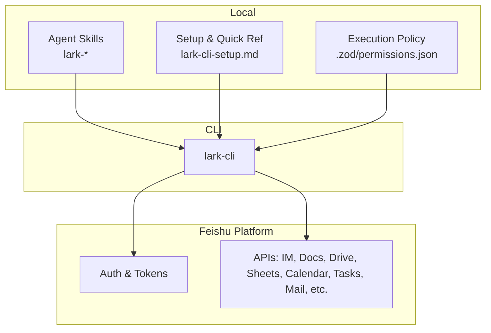
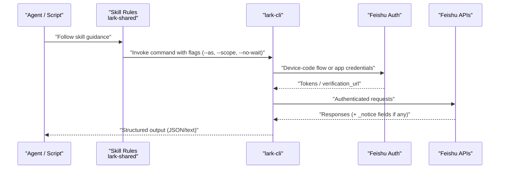
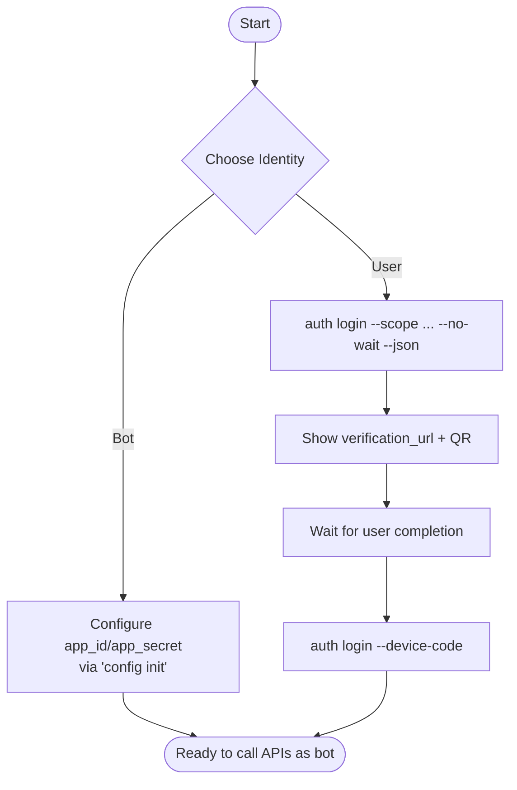
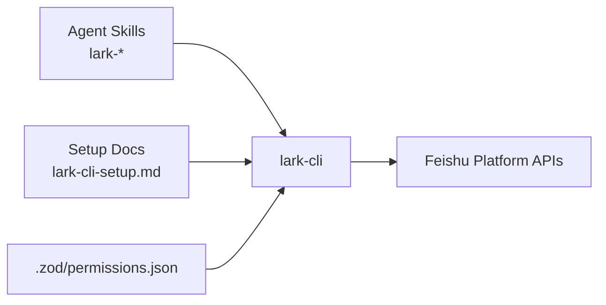

# Feishu Integration Layer

<cite>
**Referenced Files in This Document**
- [lark-shared SKILL.md](file://team/.agents/skills/lark-shared/SKILL.md)
- [lark-cli-setup.md](file://team/simworld/docs/feishu/lark-cli-setup.md)
- [permissions.json](file://.zod/permissions.json)
</cite>

## Table of Contents
1. [Introduction](#introduction)
2. [Project Structure](#project-structure)
3. [Core Components](#core-components)
4. [Architecture Overview](#architecture-overview)
5. [Detailed Component Analysis](#detailed-component-analysis)
6. [Dependency Analysis](#dependency-analysis)
7. [Performance Considerations](#performance-considerations)
8. [Troubleshooting Guide](#troubleshooting-guide)
9. [Conclusion](#conclusion)
10. [Appendices](#appendices)

## Introduction
This document describes the Feishu Integration Layer that provides programmatic access to Feishu services via lark-cli. It explains authentication mechanisms, token management, API abstraction patterns, and the single-source-of-truth architecture where all content-type data (project ledgers, person profiles, chat logs, weekly reports) resides exclusively in Feishu while local storage contains only rules and metadata mappings. It also includes practical command examples, error handling strategies, rate limiting considerations, permission management, and guidance for common integration issues such as authentication failures, document synchronization problems, and API quota management.

## Project Structure
The repository organizes Feishu-related capabilities under agent skills and documentation:
- Agent skills define how to use lark-cli commands across domains (IM, Docs, Drive, Sheets, Calendar, Tasks, etc.).
- Documentation provides setup instructions and quick references for using lark-cli with user or bot identity.
- Local permissions are defined in a JSON policy file used by the execution environment.

[No sources needed since this diagram shows conceptual workflow, not actual code structure]

**Section sources**
- [lark-shared SKILL.md:1-169](file://team/.agents/skills/lark-shared/SKILL.md#L1-L169)
- [lark-cli-setup.md:62-92](file://team/simworld/docs/feishu/lark-cli-setup.md#L62-L92)
- [permissions.json:1-145](file://.zod/permissions.json#L1-L145)

## Core Components
- Authentication and Identity Management
  - Two identities: user (--as user) and bot (--as bot). User identity requires explicit login; bot identity uses app credentials configured during initialization.
  - Split-flow authorization flow supports non-blocking device-code-based login flows suitable for AI agents.
- Token Management
  - Tokens are managed by lark-cli after successful login or bot configuration. The CLI handles refresh and usage transparently.
- API Abstraction Patterns
  - Commands are organized by service and action (e.g., im +messages-send, docs +create).
  - High-risk write operations require explicit confirmation (--yes) and can be previewed with --dry-run.
- Single Source of Truth Architecture
  - All content-type data lives in Feishu. Local files store only rules, templates, and metadata mappings.

Practical examples (paths only):
- Initialize config and login: [lark-cli-setup.md:62-73](file://team/simworld/docs/feishu/lark-cli-setup.md#L62-L73)
- Send message as user: [lark-cli-setup.md:77-86](file://team/simworld/docs/feishu/lark-cli-setup.md#L77-L86)
- Create doc from Markdown: [lark-cli-setup.md:77-86](file://team/simworld/docs/feishu/lark-cli-setup.md#L77-L86)
- Public permission patch on drive: [lark-cli-setup.md:77-86](file://team/simworld/docs/feishu/lark-cli-setup.md#L77-L86)

**Section sources**
- [lark-shared SKILL.md:24-105](file://team/.agents/skills/lark-shared/SKILL.md#L24-L105)
- [lark-cli-setup.md:62-92](file://team/simworld/docs/feishu/lark-cli-setup.md#L62-L92)

## Architecture Overview
The integration layer composes three layers:
- Local orchestration: Agent skills and setup docs instruct how to call lark-cli safely and correctly.
- CLI runtime: lark-cli manages auth, tokens, request construction, retries, and output formatting.
- Feishu platform: APIs enforce scopes and quotas; responses may include notices (e.g., update prompts) and structured errors.

**Diagram sources**
- [lark-shared SKILL.md:67-105](file://team/.agents/skills/lark-shared/SKILL.md#L67-L105)
- [lark-cli-setup.md:62-73](file://team/simworld/docs/feishu/lark-cli-setup.md#L62-L73)

## Detailed Component Analysis

### Authentication and Authorization Flow
- Identity selection:
  - Bot identity (--as bot): Requires app_id/app_secret configured during init; no user login required.
  - User identity (--as user): Requires scope grants plus user login.
- Split-flow authorization:
  - Initiate with --no-wait --json to obtain verification_url and device_code.
  - Present URL and QR code to user; do not cache these values.
  - Complete login later with --device-code.

**Diagram sources**
- [lark-shared SKILL.md:24-105](file://team/.agents/skills/lark-shared/SKILL.md#L24-L105)

**Section sources**
- [lark-shared SKILL.md:24-105](file://team/.agents/skills/lark-shared/SKILL.md#L24-L105)

### Token Management System
- Tokens are obtained and refreshed by lark-cli after successful login or when using bot credentials.
- For user identity, multiple logins accumulate scopes incrementally.
- Always re-initiate authorization flows per session; do not reuse verification URLs or device codes.

Operational notes:
- Use auth status to verify current identity and state.
- Prefer minimal scopes and domain-scoped authorizations.

**Section sources**
- [lark-shared SKILL.md:58-66](file://team/.agents/skills/lark-shared/SKILL.md#L58-L66)
- [lark-cli-setup.md:62-73](file://team/simworld/docs/feishu/lark-cli-setup.md#L62-L73)

### API Abstraction Patterns
- Command organization: service + action (e.g., im +messages-send, docs +create).
- Flags:
  - --as user|bot to select identity.
  - --scope to limit authorization scope.
  - --no-wait --json for split-flow authorization.
  - --dry-run to preview high-risk requests without triggering confirmation gates.
  - --yes to confirm high-risk writes after explicit consent.
- Output conventions:
  - Structured JSON outputs may include _notice fields (e.g., update prompts).

Examples (paths only):
- Send messages: [lark-cli-setup.md:77-86](file://team/simworld/docs/feishu/lark-cli-setup.md#L77-L86)
- Create doc from Markdown: [lark-cli-setup.md:77-86](file://team/simworld/docs/feishu/lark-cli-setup.md#L77-L86)
- Patch drive public permission: [lark-cli-setup.md:77-86](file://team/simworld/docs/feishu/lark-cli-setup.md#L77-L86)

**Section sources**
- [lark-shared SKILL.md:107-123](file://team/.agents/skills/lark-shared/SKILL.md#L107-L123)
- [lark-cli-setup.md:77-86](file://team/simworld/docs/feishu/lark-cli-setup.md#L77-L86)

### Single-Source-of-Truth Architecture
- Content-type data (project ledgers, person profiles, chat logs, weekly reports) is stored exclusively in Feishu.
- Local storage holds only:
  - Rules and policies (e.g., .zod/permissions.json).
  - Metadata mappings and templates.
  - Scripts and automation glue.

Implications:
- Avoid duplicating authoritative content locally.
- Use lark-cli to read/write canonical records in Feishu.
- Keep local artifacts small and deterministic.

**Section sources**
- [lark-cli-setup.md:62-92](file://team/simworld/docs/feishu/lark-cli-setup.md#L62-L92)

### Practical Command Examples
- Setup and verification:
  - Initialize config and login: [lark-cli-setup.md:62-73](file://team/simworld/docs/feishu/lark-cli-setup.md#L62-L73)
  - Check auth status: [lark-cli-setup.md:62-73](file://team/simworld/docs/feishu/lark-cli-setup.md#L62-L73)
- Messaging:
  - Send private/group message as user: [lark-cli-setup.md:77-86](file://team/simworld/docs/feishu/lark-cli-setup.md#L77-L86)
- Documents:
  - Create doc from Markdown: [lark-cli-setup.md:77-86](file://team/simworld/docs/feishu/lark-cli-setup.md#L77-L86)
- Permissions:
  - Make drive item publicly editable (bot): [lark-cli-setup.md:77-86](file://team/simworld/docs/feishu/lark-cli-setup.md#L77-L86)

**Section sources**
- [lark-cli-setup.md:62-92](file://team/simworld/docs/feishu/lark-cli-setup.md#L62-L92)

### Error Handling Strategies
- Permission denied:
  - Inspect response for permission_violations, console_url, hint.
  - For bot: direct to developer console via console_url.
  - For user: run auth login with specific scope(s).
- High-risk write gate:
  - Exit code 10 with structured envelope indicates confirmation_required.
  - Confirm with user, then retry with --yes appended to original argv.
  - Use --dry-run to preview dangerous operations before confirming.
- Update notices:
  - If _notice.update appears, propose updating lark-cli and skills afterward.

**Section sources**
- [lark-shared SKILL.md:45-105](file://team/.agents/skills/lark-shared/SKILL.md#L45-L105)
- [lark-shared SKILL.md:131-169](file://team/.agents/skills/lark-shared/SKILL.md#L131-L169)
- [lark-shared SKILL.md:107-123](file://team/.agents/skills/lark-shared/SKILL.md#L107-L123)

### Rate Limiting Considerations
- Respect Feishu API quotas and backoff behavior.
- Batch operations where supported (e.g., batch create/update).
- Stagger requests and implement exponential backoff for transient errors.
- Monitor _notice and error responses for hints about throttling.

[No sources needed since this section provides general guidance]

### Permission Management
- Scope-driven access control:
  - Grant minimal scopes necessary for each operation.
  - Use domain-scoped authorization when appropriate.
- Identity boundaries:
  - Bot cannot access user resources; user cannot act as another user.
- Execution policy:
  - Local execution policy is enforced by .zod/permissions.json.

**Section sources**
- [lark-shared SKILL.md:35-66](file://team/.agents/skills/lark-shared/SKILL.md#L35-L66)
- [permissions.json:1-145](file://.zod/permissions.json#L1-L145)

## Dependency Analysis
The integration depends on:
- Agent skills providing operational guidance and safe invocation patterns.
- lark-cli as the runtime bridge to Feishu APIs.
- Local policy file controlling allowed shell executions within the environment.

**Diagram sources**
- [lark-shared SKILL.md:1-169](file://team/.agents/skills/lark-shared/SKILL.md#L1-L169)
- [lark-cli-setup.md:62-92](file://team/simworld/docs/feishu/lark-cli-setup.md#L62-L92)
- [permissions.json:1-145](file://.zod/permissions.json#L1-L145)

**Section sources**
- [lark-shared SKILL.md:1-169](file://team/.agents/skills/lark-shared/SKILL.md#L1-L169)
- [lark-cli-setup.md:62-92](file://team/simworld/docs/feishu/lark-cli-setup.md#L62-L92)
- [permissions.json:1-145](file://.zod/permissions.json#L1-L145)

## Performance Considerations
- Prefer batch endpoints to reduce round trips.
- Cache stable identifiers (e.g., space IDs, view IDs) locally as metadata only.
- Implement retry with jitter for transient network errors.
- Avoid unnecessary reads; fetch only what is needed for the task.

[No sources needed since this section provides general guidance]

## Troubleshooting Guide
Common issues and resolutions:
- Authentication failures:
  - Ensure correct identity (--as user vs --as bot).
  - For user identity, complete split-flow login and avoid caching verification links.
  - Re-run auth login with missing scopes if permission_violations appear.
- Document synchronization problems:
  - Verify the target document exists and you have access under the selected identity.
  - Use --dry-run to validate payloads before overwrites.
  - Confirm that local changes are only metadata; authoritative content must be updated in Feishu.
- API quota management:
  - Observe error responses and notices; back off and retry.
  - Reduce request frequency and consolidate operations.

**Section sources**
- [lark-shared SKILL.md:45-105](file://team/.agents/skills/lark-shared/SKILL.md#L45-L105)
- [lark-shared SKILL.md:131-169](file://team/.agents/skills/lark-shared/SKILL.md#L131-L169)
- [lark-cli-setup.md:62-92](file://team/simworld/docs/feishu/lark-cli-setup.md#L62-L92)

## Conclusion
The Feishu Integration Layer leverages lark-cli to provide secure, scoped, and consistent access to Feishu services. By enforcing a single source of truth in Feishu and keeping local artifacts limited to rules and metadata, the system ensures consistency, auditability, and resilience. Following the authentication, permission, and error-handling practices outlined here will help maintain reliable integrations and smooth operations at scale.

[No sources needed since this section summarizes without analyzing specific files]

## Appendices
- Quick reference for initial setup and common commands: [lark-cli-setup.md:62-92](file://team/simworld/docs/feishu/lark-cli-setup.md#L62-L92)
- Shared skill rules for safe usage and high-risk operations: [lark-shared SKILL.md:1-169](file://team/.agents/skills/lark-shared/SKILL.md#L1-L169)
- Local execution policy: [permissions.json:1-145](file://.zod/permissions.json#L1-L145)