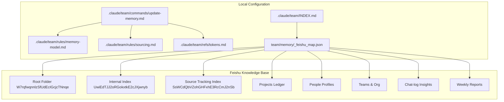
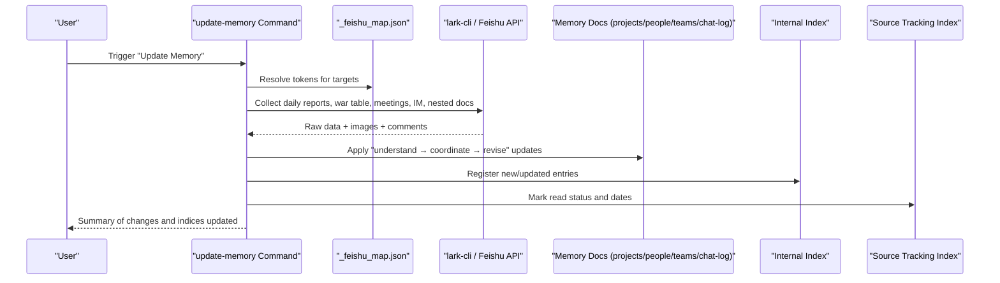
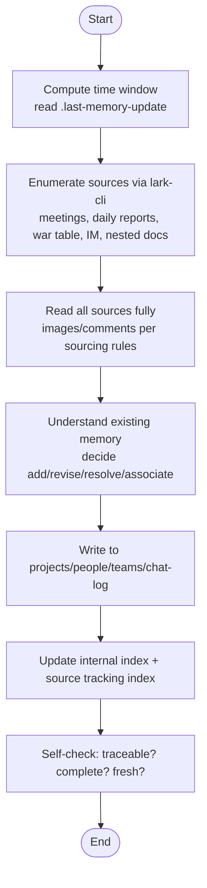
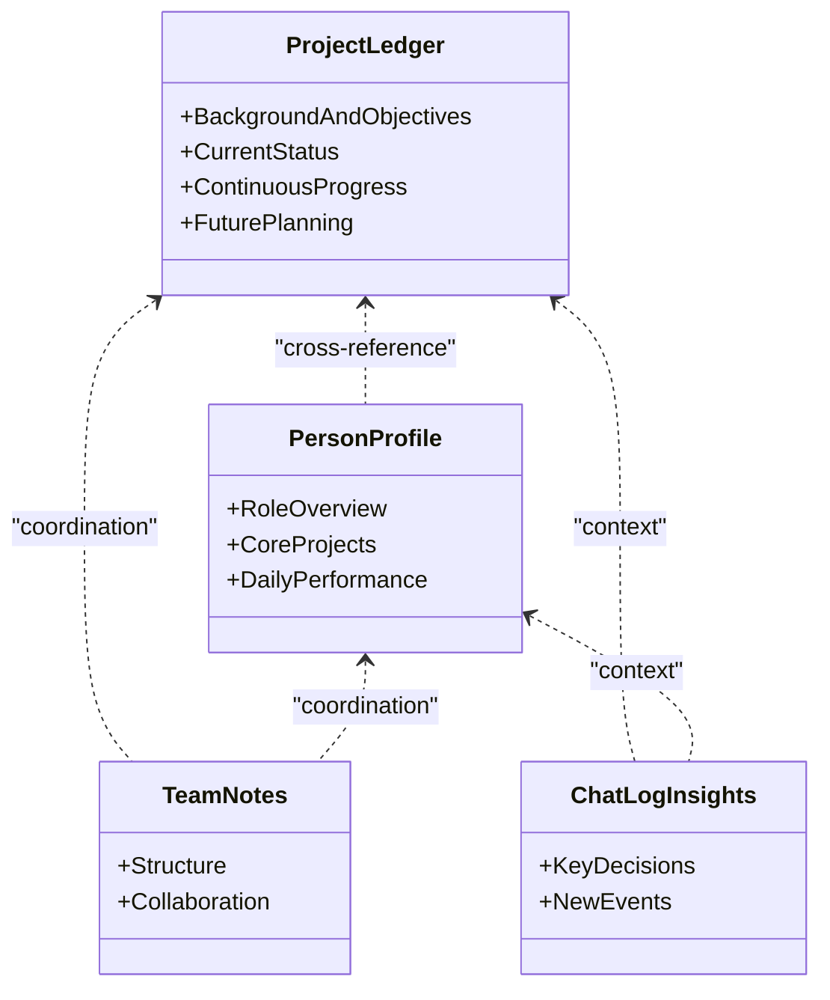
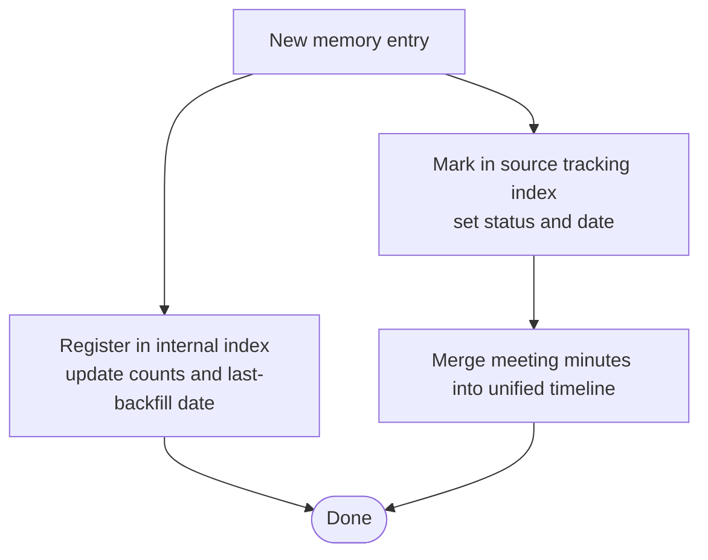
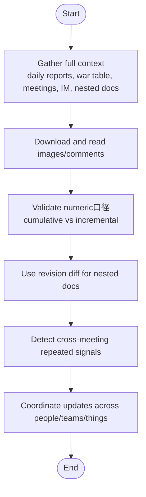
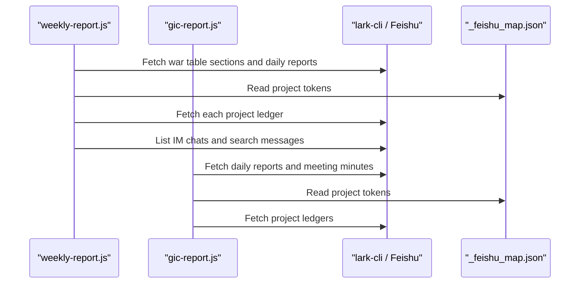
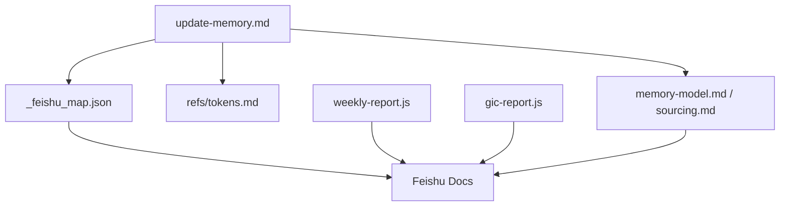

# Memory Management System

<cite>
**Referenced Files in This Document**
- [team/CLAUDE.md](file://team/CLAUDE.md)
- [.claude/team/INDEX.md](file://.claude/team/INDEX.md)
- [.claude/team/commands/update-memory.md](file://.claude/team/commands/update-memory.md)
- [.claude/team/rules/memory-model.md](file://.claude/team/rules/memory-model.md)
- [.claude/team/rules/sourcing.md](file://.claude/team/rules/sourcing.md)
- [.claude/team/refs/tokens.md](file://.claude/team/refs/tokens.md)
- [team/memory/_feishu_map.json](file://team/memory/_feishu_map.json)
- [team/pipelines/weekly-report.js](file://team/pipelines/weekly-report.js)
- [team/pipelines/gic-report.js](file://team/pipelines/gic-report.js)
</cite>

## Table of Contents
1. [Introduction](#introduction)
2. [Project Structure](#project-structure)
3. [Core Components](#core-components)
4. [Architecture Overview](#architecture-overview)
5. [Detailed Component Analysis](#detailed-component-analysis)
6. [Dependency Analysis](#dependency-analysis)
7. [Performance Considerations](#performance-considerations)
8. [Troubleshooting Guide](#troubleshooting-guide)
9. [Conclusion](#conclusion)

## Introduction
This document explains the Memory Management System used to maintain structured knowledge for projects, people, and teams. The system is designed around a single authoritative source on Feishu (Lark), with local configuration only mapping names to document tokens. It enforces strict sourcing, coordination-before-modification, and a dual-index model (internal index and source tracking). The primary workflow is triggered by the update-memory command, which orchestrates reading multiple sources, analyzing changes, and updating project ledgers, person profiles, chat-log insights, and both indexes.

## Project Structure
The memory system is organized into:
- Rules and commands that define how memory is created, updated, and verified
- A token map that links human-readable names to Feishu document tokens
- Pipelines that demonstrate how data is collected from Feishu and transformed into reports or memory updates

**Diagram sources**
- [.claude/team/INDEX.md:24-34](file://.claude/team/INDEX.md#L24-L34)
- [.claude/team/commands/update-memory.md:1-58](file://.claude/team/commands/update-memory.md#L1-L58)
- [.claude/team/rules/memory-model.md:1-72](file://.claude/team/rules/memory-model.md#L1-L72)
- [.claude/team/rules/sourcing.md:1-65](file://.claude/team/rules/sourcing.md#L1-L65)
- [.claude/team/refs/tokens.md:1-37](file://.claude/team/refs/tokens.md#L1-L37)
- [team/memory/_feishu_map.json:1-276](file://team/memory/_feishu_map.json#L1-L276)

**Section sources**
- [team/CLAUDE.md:26-37](file://team/CLAUDE.md#L26-L37)
- [.claude/team/INDEX.md:24-34](file://.claude/team/INDEX.md#L24-L34)

## Core Components
- Update-memory command: Defines the authoritative workflow for syncing new information into memory. It enforces time-windowing, full-spectrum source collection, understanding before modification, and synchronized updates across project ledger, person profile, team notes, and chat-log.
- Memory model: Specifies golden templates for project ledger and person profile, three-line association principles (people, teams, things), what not to include, and dual-index maintenance rules.
- Sourcing rules: Enforce “source-first” discipline, image/comment reading requirements, numeric precision, cross-meeting signal detection, and revision-diff-based incremental reads.
- Token map: Provides name-to-token mappings for projects, people, teams, insights, and weekly reports; also points to internal and source-tracking indexes.
- Pipelines: Demonstrate real-world usage of lark-cli to collect from Feishu and transform into structured outputs, illustrating how memory sources are consumed.

**Section sources**
- [.claude/team/commands/update-memory.md:1-58](file://.claude/team/commands/update-memory.md#L1-L58)
- [.claude/team/rules/memory-model.md:1-72](file://.claude/team/rules/memory-model.md#L1-L72)
- [.claude/team/rules/sourcing.md:1-65](file://.claude/team/rules/sourcing.md#L1-L65)
- [team/memory/_feishu_map.json:1-276](file://team/memory/_feishu_map.json#L1-L276)
- [team/pipelines/weekly-report.js:21-116](file://team/pipelines/weekly-report.js#L21-L116)
- [team/pipelines/gic-report.js:49-73](file://team/pipelines/gic-report.js#L49-L73)

## Architecture Overview
The memory system follows a clear separation between local orchestration and cloud content:
- Local layer: rules, commands, token map, and scripts
- Cloud layer: Feishu documents as the single source of truth
- Data flow: update-memory triggers collection from Feishu, analysis against existing memory, coordinated updates, and index maintenance

**Diagram sources**
- [.claude/team/commands/update-memory.md:1-58](file://.claude/team/commands/update-memory.md#L1-L58)
- [.claude/team/rules/memory-model.md:43-50](file://.claude/team/rules/memory-model.md#L43-L50)
- [.claude/team/rules/sourcing.md:26-31](file://.claude/team/rules/sourcing.md#L26-L31)
- [team/memory/_feishu_map.json:1-276](file://team/memory/_feishu_map.json#L1-L276)

## Detailed Component Analysis

### Update-Memory Workflow
The update-memory command defines a six-phase process:
- Phase 1: Inventory — compute time window using last-update marker and list all sources via lark-cli
- Phase 2: Read sources — daily reports, war table, nested docs, meeting minutes, and transcripts
- Phase 3: Chat context — resolve parent messages, links, and surrounding context
- Phase 4: Understand and revise — apply additions, revisions, resolutions, and associations across lines
- Phase 5: Index maintenance — update internal index and source tracking index
- Phase 6: Self-check — verify traceability, completeness, and freshness

**Diagram sources**
- [.claude/team/commands/update-memory.md:14-58](file://.claude/team/commands/update-memory.md#L14-L58)
- [.claude/team/rules/sourcing.md:26-31](file://.claude/team/rules/sourcing.md#L26-L31)

**Section sources**
- [.claude/team/commands/update-memory.md:1-58](file://.claude/team/commands/update-memory.md#L1-L58)

### Golden Templates and Three-Line Association
- Project ledger template includes four parts: background/objectives, current status, continuous progress (time-ordered), and future planning. Continuous progress must be appended chronologically with single-date rows and explicit sources.
- Person profile template includes three parts: role overview, core projects, and daily performance (weekly granularity).
- Three-line association requires coordinated updates across people, teams, and things. Changes like owner transitions or departures must propagate across related entities.

**Diagram sources**
- [.claude/team/rules/memory-model.md:12-38](file://.claude/team/rules/memory-model.md#L12-L38)

**Section sources**
- [.claude/team/rules/memory-model.md:12-38](file://.claude/team/rules/memory-model.md#L12-L38)

### Dual-Index System (Internal Index and Source Tracking)
- Internal index records what has been captured in memory, including counts and last-backfill dates per section.
- Source tracking index records where information came from and reading status, with standardized states and date stamps. Meeting minutes are merged into a single timeline rather than fragmented sections.

**Diagram sources**
- [.claude/team/rules/memory-model.md:43-50](file://.claude/team/rules/memory-model.md#L43-L50)

**Section sources**
- [.claude/team/rules/memory-model.md:43-50](file://.claude/team/rules/memory-model.md#L43-L50)

### Strict Sourcing Requirements and Coordination-Before-Modification
- Source-first discipline: always gather full context before writing; avoid editing text without tracing its origin.
- Mandatory reading of images and comments in daily reports; machine gates enforce compliance.
- Numeric precision: distinguish cumulative vs incremental, do not paraphrase numbers, and mark unverified items.
- Cross-meeting signals: detect repeated risks or dependencies across weeks and elevate them accordingly.
- Nested doc diffs: prefer revision diff to extract window-specific changes instead of re-reading entire documents.

**Diagram sources**
- [.claude/team/rules/sourcing.md:1-65](file://.claude/team/rules/sourcing.md#L1-L65)

**Section sources**
- [.claude/team/rules/sourcing.md:1-65](file://.claude/team/rules/sourcing.md#L1-L65)

### What Content Should Not Be Included
- Do not write claims without reading source documents; mark as pending verification if needed.
- Do not infer from summaries; require verifiable evidence.
- Do not include decisions without original citations.
- Do not record other teams’ initiatives as this team’s progress; only owner-owned items qualify.

**Section sources**
- [.claude/team/rules/memory-model.md:39-42](file://.claude/team/rules/memory-model.md#L39-L42)

### Concrete Examples from Codebase
- Weekly report pipeline demonstrates collecting from Feishu sources (war table, daily reports, project ledgers, IM) and synthesizing structured outputs. It shows how to fetch sections, iterate pages, and handle images/comments.
- GIC report pipeline similarly collects over a two-week window, pulling daily reports, meeting minutes, and project ledgers.

**Diagram sources**
- [team/pipelines/weekly-report.js:21-116](file://team/pipelines/weekly-report.js#L21-L116)
- [team/pipelines/gic-report.js:49-73](file://team/pipelines/gic-report.js#L49-L73)
- [team/memory/_feishu_map.json:1-276](file://team/memory/_feishu_map.json#L1-L276)

**Section sources**
- [team/pipelines/weekly-report.js:21-116](file://team/pipelines/weekly-report.js#L21-L116)
- [team/pipelines/gic-report.js:49-73](file://team/pipelines/gic-report.js#L49-L73)

## Dependency Analysis
The memory system depends on:
- Local configuration files for navigation and token mapping
- Feishu documents as authoritative content
- lark-cli for reading/writing and media handling
- Pipelines that consume the same sources to produce reports

**Diagram sources**
- [.claude/team/commands/update-memory.md:1-58](file://.claude/team/commands/update-memory.md#L1-L58)
- [.claude/team/rules/memory-model.md:1-72](file://.claude/team/rules/memory-model.md#L1-L72)
- [.claude/team/rules/sourcing.md:1-65](file://.claude/team/rules/sourcing.md#L1-L65)
- [.claude/team/refs/tokens.md:1-37](file://.claude/team/refs/tokens.md#L1-L37)
- [team/memory/_feishu_map.json:1-276](file://team/memory/_feishu_map.json#L1-L276)
- [team/pipelines/weekly-report.js:21-116](file://team/pipelines/weekly-report.js#L21-L116)
- [team/pipelines/gic-report.js:49-73](file://team/pipelines/gic-report.js#L49-L73)

**Section sources**
- [.claude/team/INDEX.md:24-34](file://.claude/team/INDEX.md#L24-L34)
- [team/memory/_feishu_map.json:1-276](file://team/memory/_feishu_map.json#L1-L276)

## Performance Considerations
- Prefer revision diffs for nested documents to minimize token consumption and speed up incremental reads.
- Use parallel collection where possible (e.g., war table and IM in weekly pipeline) to reduce latency.
- Avoid re-reading entire documents when diffs suffice; fall back to full fetch only when history is unavailable.
- Ensure pagination is handled correctly for IM lists and searches to prevent silent failures.

[No sources needed since this section provides general guidance]

## Troubleshooting Guide
- If updates appear missing, verify the time window calculation and ensure the last-update marker was written.
- If images or comments are not reflected, confirm they were downloaded and read per sourcing rules; check machine gate logs for unread images.
- If numeric discrepancies occur, validate cumulative vs incremental口径 and ensure exact values are preserved.
- If cross-meeting signals are missed, scan transcripts for repeated mentions and escalate risks accordingly.
- If nested doc changes are not captured, use revision history to extract diffs and compare editors.

**Section sources**
- [.claude/team/rules/sourcing.md:26-31](file://.claude/team/rules/sourcing.md#L26-L31)
- [.claude/team/rules/sourcing.md:57-65](file://.claude/team/rules/sourcing.md#L57-L65)

## Conclusion
The Memory Management System centralizes knowledge on Feishu while enforcing rigorous sourcing, coordination, and indexing practices. The update-memory command orchestrates a disciplined workflow that ensures project ledgers, person profiles, team notes, and chat-log insights remain accurate, traceable, and actionable. The dual-index model guarantees transparency about what is recorded and where it originated, supporting reliable reporting and decision-making.