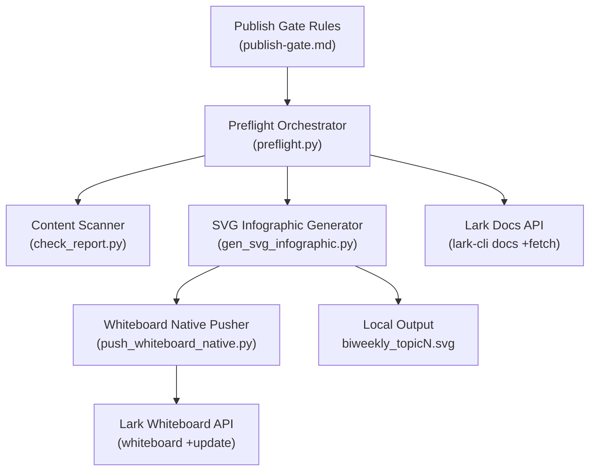
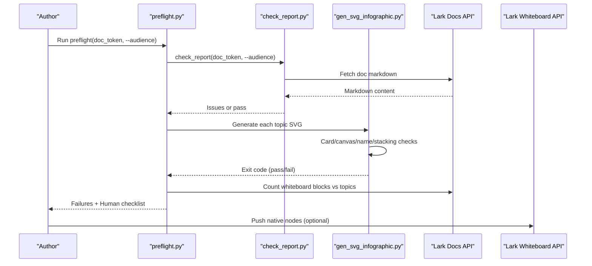
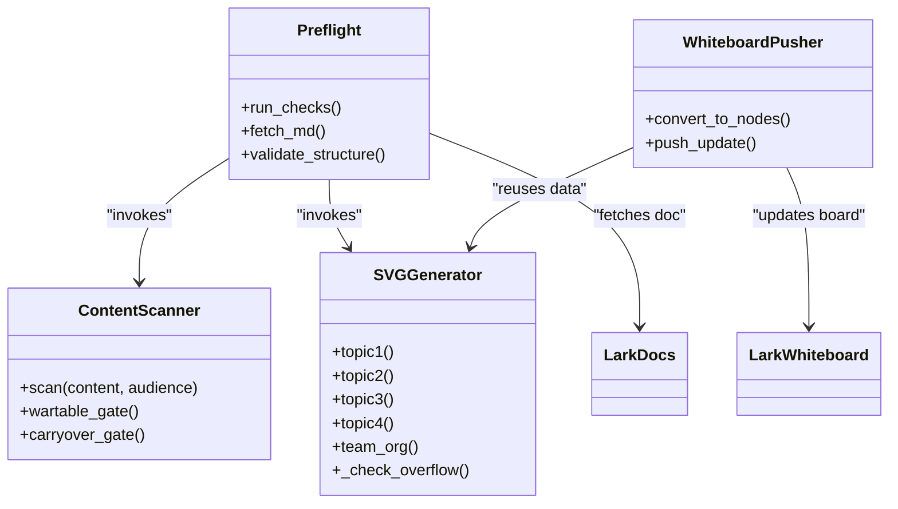

# Quality Assurance & Publishing Gates

<cite>
**Referenced Files in This Document**
- [publish-gate.md](file://.claude/team/rules/publish-gate.md)
- [preflight.py](file://team/scripts/preflight.py)
- [check_report.py](file://team/scripts/check_report.py)
- [gen_svg_infographic.py](file://team/scripts/gen_svg_infographic.py)
- [push_whiteboard_native.py](file://team/scripts/push_whiteboard_native.py)
</cite>

## Table of Contents
1. [Introduction](#introduction)
2. [Project Structure](#project-structure)
3. [Core Components](#core-components)
4. [Architecture Overview](#architecture-overview)
5. [Detailed Component Analysis](#detailed-component-analysis)
6. [Dependency Analysis](#dependency-analysis)
7. [Performance Considerations](#performance-considerations)
8. [Troubleshooting Guide](#troubleshooting-guide)
9. [Conclusion](#conclusion)

## Introduction
This document defines the pre-publication validation and content standards enforcement for external reports (weekly/biweekly/GIC). It explains the publish-gate system that prevents reactive point-by-point delivery, enforces mandatory quality checks, and ensures all external artifacts meet content and style requirements before being declared complete. The system combines automated gates with explicit human judgment checkpoints to balance speed and rigor.

## Project Structure
The publishing gate is implemented as a small set of scripts and rules:
- Rulebook: publish-gate policy and workflow
- Preflight orchestrator: single command to run all mechanical checks
- Content scanner: deterministic linting against exclusion lists, audience rules, jargon, hearsay, duplication, and source leakage
- SVG infographic generator: deterministic rendering with geometric overflow, canvas bounds, name redaction, and text-box stacking checks
- Whiteboard pusher: converts generated visuals into native whiteboard nodes for editability

**Diagram sources**
- [publish-gate.md:1-48](file://.claude/team/rules/publish-gate.md#L1-L48)
- [preflight.py:1-110](file://team/scripts/preflight.py#L1-L110)
- [check_report.py:1-195](file://team/scripts/check_report.py#L1-L195)
- [gen_svg_infographic.py:1-485](file://team/scripts/gen_svg_infographic.py#L1-L485)
- [push_whiteboard_native.py:1-65](file://team/scripts/push_whiteboard_native.py#L1-L65)

**Section sources**
- [publish-gate.md:1-48](file://.claude/team/rules/publish-gate.md#L1-L48)

## Core Components
- Publish Gate Policy: Defines the “single entry” preflight rule, mandatory gates, and the principle that no item should be delivered reactively without full self-review.
- Preflight Orchestrator: Runs all mechanical checks in one pass and surfaces remaining human-only items.
- Content Scanner: Scans fetched Markdown for excluded topics, audience violations, internal codes, hearsay, jargon, duplication, and source leakage; supports optional war-table image read-check and carryover detection.
- SVG Infographic Generator: Generates topic visuals deterministically and enforces multiple rendering gates (card overflow, canvas bounds, name redaction, stacked-text regression).
- Whiteboard Native Pusher: Converts SVG data into native whiteboard nodes to preserve editability while retaining visual formatting.

Key responsibilities and boundaries are enforced by exit codes and explicit warnings so that automation blocks unsafe publication while guiding human review.

**Section sources**
- [publish-gate.md:1-48](file://.claude/team/rules/publish-gate.md#L1-L48)
- [preflight.py:1-110](file://team/scripts/preflight.py#L1-L110)
- [check_report.py:1-195](file://team/scripts/check_report.py#L1-L195)
- [gen_svg_infographic.py:1-485](file://team/scripts/gen_svg_infographic.py#L1-L485)
- [push_whiteboard_native.py:1-65](file://team/scripts/push_whiteboard_native.py#L1-L65)

## Architecture Overview
The publish-gate pipeline is orchestrated by preflight, which calls the content scanner and the SVG generator, then validates document structure and authorship constraints. The SVG generator performs its own rendering gates and outputs artifacts consumed by the whiteboard pusher.

**Diagram sources**
- [preflight.py:1-110](file://team/scripts/preflight.py#L1-L110)
- [check_report.py:1-195](file://team/scripts/check_report.py#L1-L195)
- [gen_svg_infographic.py:1-485](file://team/scripts/gen_svg_infographic.py#L1-L485)
- [push_whiteboard_native.py:1-65](file://team/scripts/push_whiteboard_native.py#L1-L65)

## Detailed Component Analysis

### Preflight Orchestrator
Purpose:
- Single entrypoint for all mechanical checks.
- Enforces the rule that you must not declare completion until all gates pass and manual items are reviewed.

What it runs:
- Content scanner (exclusions, audience, jargon, hearsay, duplication, source leakage).
- SVG generation per topic with geometric and naming checks.
- Document completeness: number of whiteboard blocks matches expected topics.
- Name leakage scan for specific audiences.

Human-only reminders:
- Data correctness vs source documents.
- Whether bullets represent real refactors versus abbreviations.
- Reader comprehension without reading sources.

Exit behavior:
- Non-zero on any hard failure; zero only when all mechanical gates pass.

Operational notes:
- Uses lark-cli to fetch document content in Markdown format.
- Supports audience selection and topic filtering.

**Section sources**
- [preflight.py:1-110](file://team/scripts/preflight.py#L1-L110)
- [publish-gate.md:1-48](file://.claude/team/rules/publish-gate.md#L1-L48)

### Content Scanner (Sourcing Gate)
Purpose:
- Deterministic scanning of report content to prevent leaks, off-topic content, and low-signal writing patterns.

Checks include:
- Excluded items list (departmental metrics, unrelated work).
- Audience violation (writing about the recipient’s own tasks).
- Diary-style entries (multiple dates crammed into one bullet).
- Role-guessing words requiring source verification.
- Gossipy parentheses and process chatter.
- Source leakage tokens and meeting references left in body text.
- Jargon/slang that obscures meaning.
- Internal experiment codes and hearsay markers (“estimated”, “in testing”, etc.).
- Duplicate phrases across bullets.

Optional modes:
- War-table image read-check: scans images in a specified window and compares against a read log; unread images block release.
- Carryover detection: compares current report to previous report to flag near-duplicate segments likely copied from prior windows.

Exit behavior:
- Zero if clean; non-zero otherwise.

Integration:
- Invoked by preflight; can also be run standalone for targeted checks.

**Section sources**
- [check_report.py:1-195](file://team/scripts/check_report.py#L1-L195)
- [publish-gate.md:1-48](file://.claude/team/rules/publish-gate.md#L1-L48)

### SVG Infographic Generator (Rendering Gate)
Purpose:
- Deterministic generation of topic visuals with strict layout and readability constraints.
- Prevents uneditable SVG blobs and ensures consistent, machine-verifiable output.

Rendering gates:
- Card overflow: every bullet bounding box must fit within its card.
- Canvas bounds: all text boxes must remain inside the W×H canvas.
- Name redaction: forbids team/leader names in visuals (except team org chart).
- Stacked-text regression: disallows multi-line bullets split into multiple independent text elements; requires a single text node with tspan-based line breaks.

Data model:
- Topic functions return self-contained SVG strings.
- Geometry tracking collects card rectangles and text bounding boxes for validation.

Output:
- Writes biweekly_topicN.svg to a local directory.
- Exits with distinct codes for different failures to guide fixes.

Editability strategy:
- Prefer native whiteboard nodes via the pusher script rather than raw SVG insertion.

**Section sources**
- [gen_svg_infographic.py:1-485](file://team/scripts/gen_svg_infographic.py#L1-L485)
- [publish-gate.md:1-48](file://.claude/team/rules/publish-gate.md#L1-L48)

### Whiteboard Native Pusher
Purpose:
- Convert SVG-generated content into native whiteboard nodes to preserve editability while keeping visual fidelity.

Workflow:
- Reuses generator logic to collect bullet metadata.
- Translates labels and bodies into separate nodes: colored bold label box plus a single multi-line editable text box.
- Calls whiteboard CLI to convert SVG to OpenAPI JSON, then updates the target whiteboard token with raw input format.

Constraints:
- Token must be freshly fetched from the document; replacing blocks changes tokens.
- After pushing, export PNG for visual sanity check.

**Section sources**
- [push_whiteboard_native.py:1-65](file://team/scripts/push_whiteboard_native.py#L1-L65)
- [publish-gate.md:1-48](file://.claude/team/rules/publish-gate.md#L1-L48)

### Content Writing Standards and Style Requirements
Standards enforced by the gates:
- No internal experiment codes or hearsay phrasing in external-facing text.
- No source leakage tokens or meeting references embedded in the body.
- Avoid diary-style listing; prefer outcome-focused bullets.
- Remove jargon or explain clearly for external readers.
- Ensure figures match textual claims; update both when editing text.
- For biweekly reports, ensure each topic has a detail diagram; missing diagrams block completion.

Style guidance:
- Use native whiteboard nodes for editability.
- Keep visuals concise; rely on the generator’s wrapping and sizing logic.
- Do not hand-edit generated SVG files; modify the generator’s data and regenerate.

**Section sources**
- [publish-gate.md:1-48](file://.claude/team/rules/publish-gate.md#L1-L48)
- [gen_svg_infographic.py:1-485](file://team/scripts/gen_svg_infographic.py#L1-L485)

## Dependency Analysis
Component relationships and coupling:
- Preflight depends on Lark Docs API and invokes both the content scanner and the SVG generator.
- The content scanner depends on Lark Docs API to fetch Markdown.
- The SVG generator is self-contained but exposes geometry checks used by preflight.
- The whiteboard pusher depends on the SVG generator’s data structures and uses whiteboard CLI and Lark Whiteboard API.

Potential circular dependencies:
- None observed; the flow is strictly top-down from preflight to sub-tools.

External integrations:
- Lark Docs API for fetching documents.
- Lark Whiteboard API for updating visuals.
- Local file system for intermediate SVG/JSON artifacts.

**Diagram sources**
- [preflight.py:1-110](file://team/scripts/preflight.py#L1-L110)
- [check_report.py:1-195](file://team/scripts/check_report.py#L1-L195)
- [gen_svg_infographic.py:1-485](file://team/scripts/gen_svg_infographic.py#L1-L485)
- [push_whiteboard_native.py:1-65](file://team/scripts/push_whiteboard_native.py#L1-L65)

**Section sources**
- [preflight.py:1-110](file://team/scripts/preflight.py#L1-L110)
- [check_report.py:1-195](file://team/scripts/check_report.py#L1-L195)
- [gen_svg_infographic.py:1-485](file://team/scripts/gen_svg_infographic.py#L1-L485)
- [push_whiteboard_native.py:1-65](file://team/scripts/push_whiteboard_native.py#L1-L65)

## Performance Considerations
- Preflight runs sequentially through checks; keep topic sets minimal during iterative edits using the topics filter.
- SVG generation is lightweight but repeated per topic; batch regeneration only when necessary.
- War-table image read-check and carryover detection add extra API calls; use them during final passes rather than frequent iterations.
- Prefer editing generator data over hand-editing SVG to avoid rework and redundant renders.

[No sources needed since this section provides general guidance]

## Troubleshooting Guide
Common quality gate failures and resolutions:

- Sourcing gate fails due to excluded items or audience violations
  - Root cause: Including department-level metrics or writing about the recipient’s own tasks.
  - Resolution: Remove excluded content; rewrite bullets to focus on your team’s outcomes.

- Sourcing gate flags hearsay or internal codes
  - Root cause: Phrases like “estimated savings” or internal experiment identifiers appear in the body.
  - Resolution: Replace with verified numbers and external-friendly descriptions.

- Sourcing gate detects source leakage
  - Root cause: Tokens or meeting references left in the document body.
  - Resolution: Strip internal pointers; keep sourcing in private notes.

- Sourcing gate finds duplicate phrases
  - Root cause: Same fact repeated across bullets.
  - Resolution: Consolidate into a single bullet with clear status.

- Rendering gate exits with overflow error
  - Root cause: Text exceeds card boundaries.
  - Resolution: Shorten text, reduce font size, or adjust coordinates; regenerate and re-run.

- Rendering gate exits with canvas bounds error
  - Root cause: Elements placed outside the W×H canvas.
  - Resolution: Move elements inward or adjust layout parameters.

- Rendering gate exits with name redaction error
  - Root cause: Team/leader names present in visuals (except team org chart).
  - Resolution: Replace names with roles or team descriptors.

- Rendering gate exits with stacked-text regression error
  - Root cause: Multi-line bullets split into multiple independent text nodes.
  - Resolution: Use a single text node with tspan-based line breaks; regenerate.

- Preflight reports missing whiteboard blocks
  - Root cause: Not all topics have corresponding whiteboard visuals.
  - Resolution: Insert or replace missing visuals; ensure counts match topics.

- Preflight reports name leakage in body
  - Root cause: Team member names appear in the main text (excluding architecture sections).
  - Resolution: Remove names from body text; keep them only where allowed.

- War-table image read-check fails
  - Root cause: Images in the specified window were not marked as read.
  - Resolution: Review each image and update the read log accordingly.

- Carryover detection flags old content
  - Root cause: Copying past progress into the current window.
  - Resolution: Rewrite to reflect only delta within the reporting window; verify dates.

**Section sources**
- [check_report.py:1-195](file://team/scripts/check_report.py#L1-L195)
- [gen_svg_infographic.py:1-485](file://team/scripts/gen_svg_infographic.py#L1-L485)
- [preflight.py:1-110](file://team/scripts/preflight.py#L1-L110)
- [publish-gate.md:1-48](file://.claude/team/rules/publish-gate.md#L1-L48)

## Conclusion
The publish-gate system shifts quality assurance from ad-hoc, reactive fixes to a disciplined, automated-first process. By enforcing a single preflight entrypoint, deterministic content scanning, and rigorous rendering checks, it prevents incomplete or leaky publications from reaching external audiences. Automation handles what can be measured; humans focus on judgment-heavy items such as data accuracy and narrative clarity. Integrating these gates into daily workflows ensures consistent, high-quality external reporting at scale.