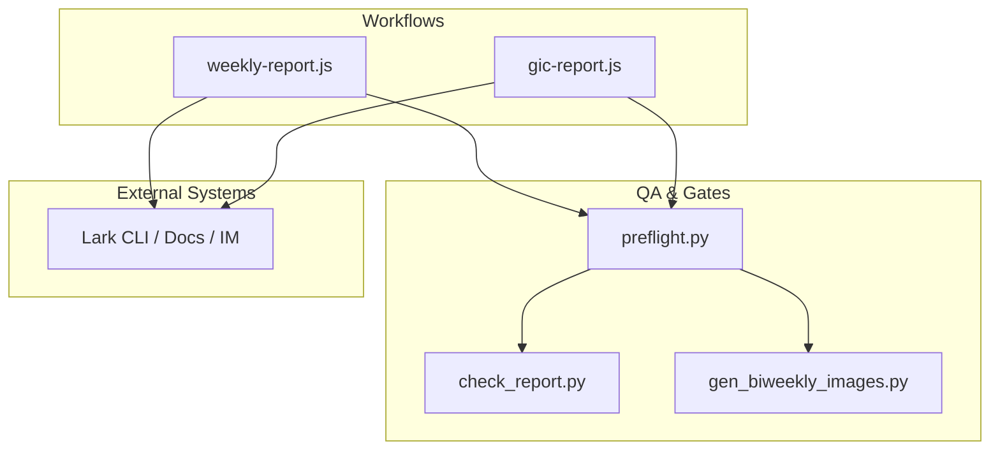
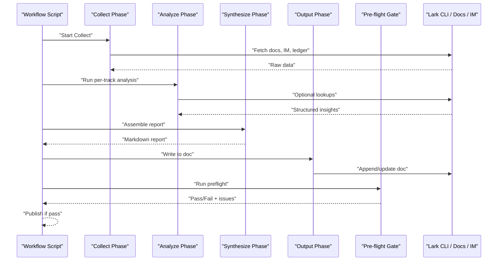
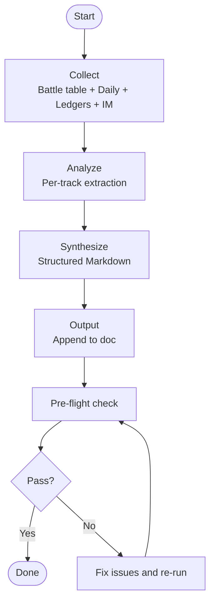
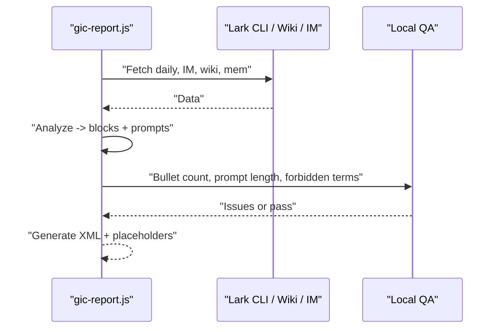
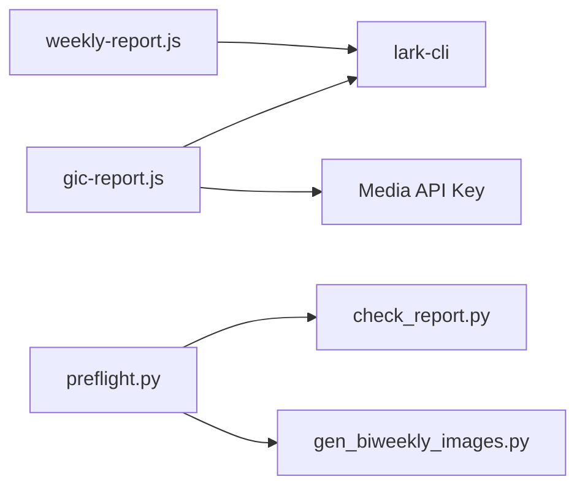

# Report Generation Pipeline

<cite>
**Referenced Files in This Document**
- [weekly-report.js](file://team/pipelines/weekly-report.js)
- [gic-report.js](file://team/pipelines/gic-report.js)
- [preflight.py](file://team/scripts/preflight.py)
- [check_report.py](file://team/scripts/check_report.py)
- [publish-gate.md](file://team/.claude/team/rules/publish-gate.md)
- [gen_biweekly_images.py](file://team/scripts/gen_biweekly_images.py)
</cite>

## Table of Contents
1. [Introduction](#introduction)
2. [Project Structure](#project-structure)
3. [Core Components](#core-components)
4. [Architecture Overview](#architecture-overview)
5. [Detailed Component Analysis](#detailed-component-analysis)
6. [Dependency Analysis](#dependency-analysis)
7. [Performance Considerations](#performance-considerations)
8. [Troubleshooting Guide](#troubleshooting-guide)
9. [Conclusion](#conclusion)
10. [Appendices](#appendices)

## Introduction
This document describes the automated weekly and bi-weekly report generation pipeline. The system collects data from multiple sources (meeting notes, project ledgers, chat messages), analyzes progress across four tracks, synthesizes structured reports, and publishes them to a collaborative doc platform. It includes quality assurance gates, publishing standards, pre-flight checks, and practical guidance for triggering and customizing reports.

## Project Structure
The pipeline is implemented as two main workflows:
- Weekly report workflow: multi-stage collection, analysis, synthesis, and output.
- Bi-weekly (GIC) report workflow: similar flow with emphasis on visual summaries and grid layouts.

Quality assurance and pre-flight checks are provided by Python scripts that enforce content rules, image completeness, and audience-specific constraints.

**Diagram sources**
- [weekly-report.js:1-173](file://team/pipelines/weekly-report.js#L1-L173)
- [gic-report.js:1-233](file://team/pipelines/gic-report.js#L1-L233)
- [preflight.py:1-110](file://team/scripts/preflight.py#L1-L110)
- [check_report.py:1-195](file://team/scripts/check_report.py#L1-L195)
- [gen_biweekly_images.py:29-43](file://team/scripts/gen_biweekly_images.py#L29-L43)

**Section sources**
- [weekly-report.js:1-173](file://team/pipelines/weekly-report.js#L1-L173)
- [gic-report.js:1-233](file://team/pipelines/gic-report.js#L1-L233)
- [preflight.py:1-110](file://team/scripts/preflight.py#L1-L110)
- [check_report.py:1-195](file://team/scripts/check_report.py#L1-L195)
- [gen_biweekly_images.py:29-43](file://team/scripts/gen_biweekly_images.py#L29-L43)

## Core Components
- Weekly report workflow: orchestrates data collection from battle tables, daily logs, meeting minutes, project ledgers, and IM chats; analyzes by four tracks; synthesizes a structured Markdown report; writes to a collaborative doc; runs pre-flight before publication.
- Bi-weekly (GIC) report workflow: collects two weeks of data, extracts up to three thematic blocks, generates bullet points and image prompts, and returns XML-ready content for final assembly and publishing.
- Pre-flight gate: a single command that runs source verification, rendering checks, image completeness, and name-leak checks; enforces publish policy.
- Source verification script: scans document text for excluded items, audience violations, internal jargon, hearsay, duplication, and source leakage.
- Image generation helper: provides prompts and supports SVG infographic generation for bi-weekly visuals.

**Section sources**
- [weekly-report.js:1-173](file://team/pipelines/weekly-report.js#L1-L173)
- [gic-report.js:1-233](file://team/pipelines/gic-report.js#L1-L233)
- [preflight.py:1-110](file://team/scripts/preflight.py#L1-L110)
- [check_report.py:1-195](file://team/scripts/check_report.py#L1-L195)
- [gen_biweekly_images.py:29-43](file://team/scripts/gen_biweekly_images.py#L29-L43)

## Architecture Overview
The pipeline follows a four-phase pattern: Collect → Analyze → Synthesize → Output, with QA gates at the end.

**Diagram sources**
- [weekly-report.js:21-173](file://team/pipelines/weekly-report.js#L21-L173)
- [gic-report.js:63-233](file://team/pipelines/gic-report.js#L63-L233)
- [preflight.py:39-105](file://team/scripts/preflight.py#L39-L105)

## Detailed Component Analysis

### Weekly Report Workflow
- Phases:
  - Collect: Reads battle table sections, daily logs, project ledgers, nested documents, and IM chats within a defined reporting window.
  - Analyze: Processes data per track using keywords and owner lists to extract progress, risks, and milestones.
  - Synthesize: Produces a structured Markdown report aligned with reviewer preferences and writing rules.
  - Output: Appends content to a collaborative doc, verifies content, and runs pre-flight before completion.

**Diagram sources**
- [weekly-report.js:21-173](file://team/pipelines/weekly-report.js#L21-L173)
- [preflight.py:39-105](file://team/scripts/preflight.py#L39-L105)

**Section sources**
- [weekly-report.js:1-173](file://team/pipelines/weekly-report.js#L1-L173)

#### Four-Track Categorization System
Tracks define focus areas, keywords, and owners:
- Scene & Production: scenario production, 3DGS, extreme mode, scene editing, AVM, fish-eye, generalization, WM, feedforward, overseas, CLI, trigger, camera model.
- SIL: vehicle generalization, fixers, rendering optimization, IQA metrics, evaluation pipelines, ref images, encoder/decoder.
- HIL: test benches, nodes, VMs, slow mode, efficiency ratio, OLM, mirrors, GPUs/XPU, VIL, Chief, Pose, CameraImage, RTM.
- Agents: reproducibility agents, Diffusion agent, evaluator, prompts, false positives, accuracy, large models, simworld, regression tests, OnCall.

These tracks guide extraction and ensure each section contains quantified outcomes, owners, and sources.

**Section sources**
- [weekly-report.js:77-82](file://team/pipelines/weekly-report.js#L77-L82)

#### Data Collection Details
- Battle table: fetches specific sections and parses daily entries within the reporting window.
- Daily logs: outlines for the period.
- Project ledgers: reads tokens from a mapping file and extracts current status, ongoing progress, and risks.
- Nested documents: resolves all referenced doc/wiki tokens and fetches full content.
- IM chats: retrieves meeting minutes group messages and key group/P2P discussions; performs keyword-based cross-group search.

**Section sources**
- [weekly-report.js:21-72](file://team/pipelines/weekly-report.js#L21-L72)

#### Synthesis and Output
- Synthesis aligns with reviewer preferences: prioritizes AI, code quality, timelines, closed-loop outcomes, and efficiency.
- Output appends content to a collaborative doc, verifies via fetch, and triggers pre-flight.

**Section sources**
- [weekly-report.js:110-173](file://team/pipelines/weekly-report.js#L110-L173)

### Bi-weekly (GIC) Report Workflow
- Phases:
  - Collect: gathers two weeks of daily logs, meeting minutes, project ledgers, wiki updates, and team memory references.
  - Analyze: extracts up to three thematic blocks with bullets and image prompts.
  - Generate: builds XML-like structure with citations, optional grids, and image placeholders; returns content for final assembly.

**Diagram sources**
- [gic-report.js:63-233](file://team/pipelines/gic-report.js#L63-L233)

**Section sources**
- [gic-report.js:1-233](file://team/pipelines/gic-report.js#L1-L233)

### Quality Assurance Gates and Publishing Standards
- Single entry point: run pre-flight before declaring completion.
- Source verification: excludes non-team metrics, audience violations, internal codes, hearsay, jargon, duplication, and source leakage.
- Rendering gate: regenerates topic images and checks for overflow.
- Image completeness: ensures whiteboard blocks match topics.
- Name leak check: prevents team member names in body text (except architecture diagrams).

Publishing standards emphasize:
- No local storage of report content; only rules and mappings remain locally.
- Strict adherence to sourcing and writing rules.
- Audience-aware content (boss vs xianming).

**Section sources**
- [preflight.py:1-110](file://team/scripts/preflight.py#L1-L110)
- [check_report.py:1-195](file://team/scripts/check_report.py#L1-L195)
- [publish-gate.md:1-19](file://team/.claude/team/rules/publish-gate.md#L1-L19)

### Pre-flight Check System
The pre-flight script consolidates checks into one command:
- Runs source verification against the document token.
- Regenerates topic images and validates geometry.
- Counts whiteboard blocks versus topics.
- Checks for name leaks depending on audience.

It outputs hard failures and manual review reminders. Non-zero exit indicates issues must be resolved before publishing.

**Section sources**
- [preflight.py:39-105](file://team/scripts/preflight.py#L39-L105)
- [check_report.py:68-111](file://team/scripts/check_report.py#L68-L111)

### Practical Examples

- Trigger weekly report generation:
  - Execute the weekly report workflow which will collect, analyze, synthesize, output, and run pre-flight automatically.
  - Reference: [weekly-report.js:1-173](file://team/pipelines/weekly-report.js#L1-L173)

- Trigger bi-weekly (GIC) report generation:
  - Run the GIC workflow to collect two weeks of data, generate blocks and image prompts, and return content for final assembly.
  - Reference: [gic-report.js:1-233](file://team/pipelines/gic-report.js#L1-L233)

- Customize report formats:
  - For weekly reports, adjust track definitions, keywords, and owners to reflect current priorities.
  - For bi-weekly reports, modify block themes, bullet counts, and image prompts to fit presentation needs.
  - References:
    - [weekly-report.js:77-82](file://team/pipelines/weekly-report.js#L77-L82)
    - [gic-report.js:132-178](file://team/pipelines/gic-report.js#L132-L178)

- Handle data validation failures:
  - Run pre-flight to identify hard failures and warnings.
  - Address source verification issues (excluded items, audience violations, internal codes, hearsay, jargon, duplication, source leakage).
  - Resolve rendering issues (image overflow) and missing images.
  - Remove unauthorized names from body text.
  - References:
    - [preflight.py:39-105](file://team/scripts/preflight.py#L39-L105)
    - [check_report.py:68-111](file://team/scripts/check_report.py#L68-L111)

## Dependency Analysis
The workflows depend on external systems and internal scripts:
- Workflows call lark-cli to fetch docs and IM data.
- Pre-flight depends on source verification and image generation helpers.
- Bi-weekly workflow uses an API key mechanism for media generation and returns XML content for final assembly.

**Diagram sources**
- [weekly-report.js:21-72](file://team/pipelines/weekly-report.js#L21-L72)
- [gic-report.js:51-61](file://team/pipelines/gic-report.js#L51-L61)
- [preflight.py:54-69](file://team/scripts/preflight.py#L54-L69)
- [check_report.py:68-71](file://team/scripts/check_report.py#L68-L71)
- [gen_biweekly_images.py:29-43](file://team/scripts/gen_biweekly_images.py#L29-L43)

**Section sources**
- [weekly-report.js:1-173](file://team/pipelines/weekly-report.js#L1-L173)
- [gic-report.js:1-233](file://team/pipelines/gic-report.js#L1-L233)
- [preflight.py:1-110](file://team/scripts/preflight.py#L1-L110)
- [check_report.py:1-195](file://team/scripts/check_report.py#L1-L195)
- [gen_biweekly_images.py:29-43](file://team/scripts/gen_biweekly_images.py#L29-L43)

## Performance Considerations
- Parallel collection: the weekly workflow runs parallel tasks for battle table and IM data to reduce latency.
- Chunked appending: when writing long reports, split content to avoid exceeding limits.
- Selective fetching: use scoped fetches and outline modes to minimize payload sizes.
- Image regeneration: regenerate images during pre-flight to catch overflow early and avoid repeated iterations.

[No sources needed since this section provides general guidance]

## Troubleshooting Guide
Common issues and resolutions:
- Source verification failures:
  - Excluded items present: remove non-team metrics and unrelated content.
  - Audience violations: avoid writing about the reviewer’s own actions.
  - Internal codes/hearsay: replace with results and verified numbers.
  - Jargon/duplication: clarify terms and consolidate repeated facts.
  - Source leakage: remove internal tokens and meeting references from body text.
- Rendering issues:
  - Image overflow: adjust coordinates, reduce max pixel size, or simplify copy.
- Missing images:
  - Ensure whiteboard blocks match topics and images are inserted/replaced.
- Name leaks:
  - Remove team member names from body text except architecture diagrams.

Operational steps:
- Run pre-flight with appropriate audience flag.
- Review generated issue list and fix until pass.
- Re-run pre-flight to confirm resolution.

**Section sources**
- [preflight.py:39-105](file://team/scripts/preflight.py#L39-L105)
- [check_report.py:68-111](file://team/scripts/check_report.py#L68-L111)

## Conclusion
The report generation pipeline automates end-to-end creation of weekly and bi-weekly reports with robust quality gates. By standardizing data sources, enforcing four-track categorization, applying strict publishing standards, and running comprehensive pre-flight checks, it ensures accurate, audience-appropriate, and visually coherent reports ready for publication.

[No sources needed since this section summarizes without analyzing specific files]

## Appendices

### Configuration and Rules
- Publishing gate policy: mandates pre-flight as the single entry point and enumerates mandatory checks.
- Writing rules: inform synthesis and output phases to maintain clarity and precision.

**Section sources**
- [publish-gate.md:1-19](file://team/.claude/team/rules/publish-gate.md#L1-L19)