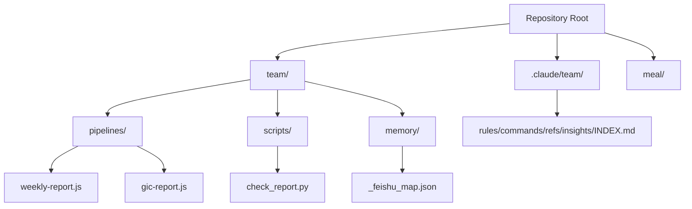
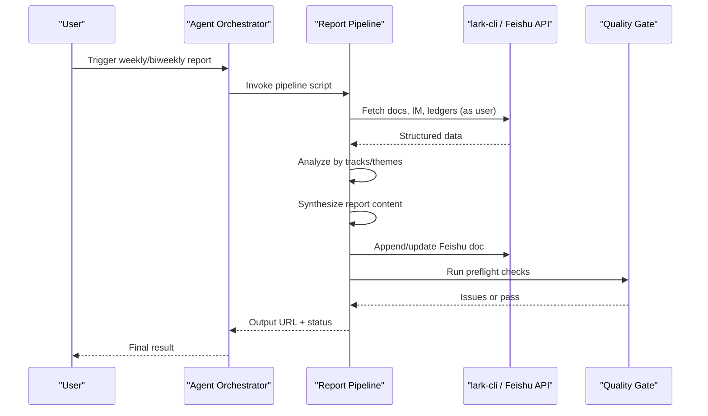
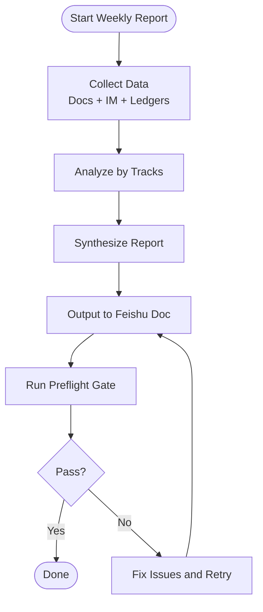
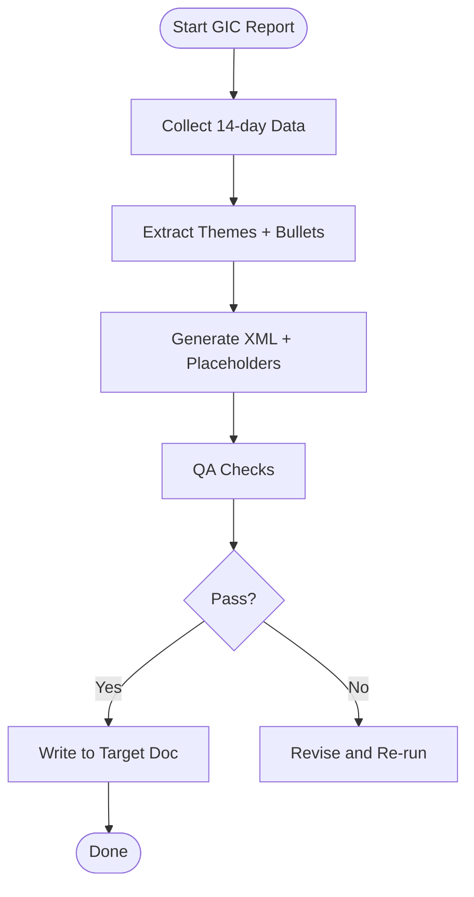
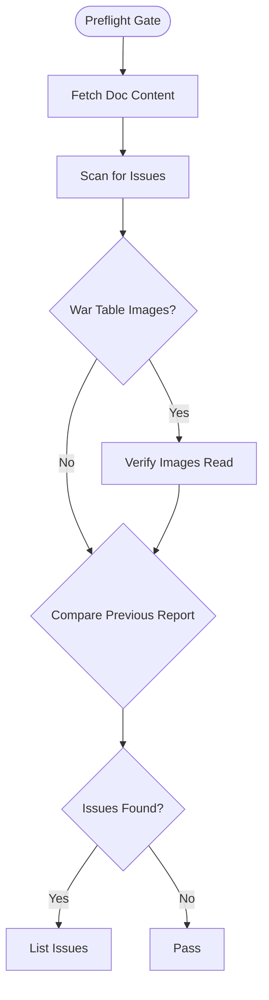
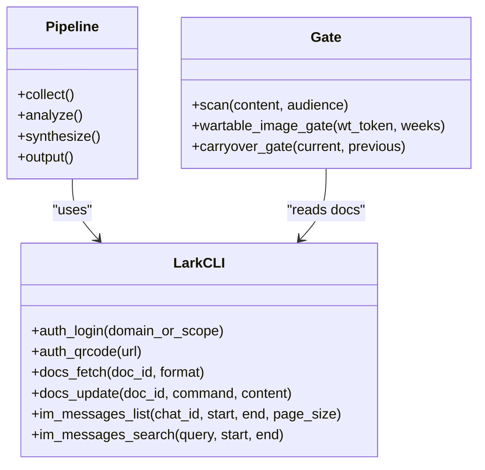
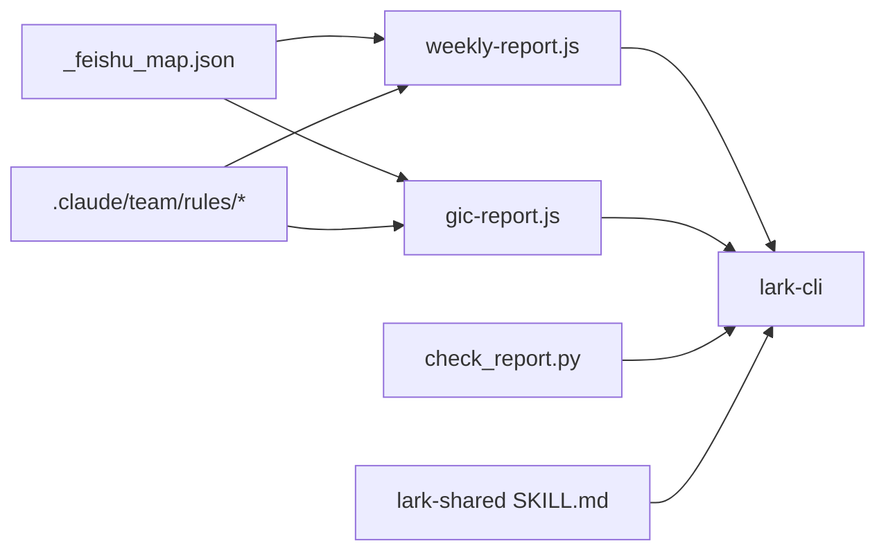

# Team Collaboration Platform

<cite>
**Referenced Files in This Document**
- [README.md](file://README.md)
- [team/CLAUDE.md](file://team/CLAUDE.md)
- [.claude/team/INDEX.md](file://.claude/team/INDEX.md)
- [team/memory/_feishu_map.json](file://team/memory/_feishu_map.json)
- [team/pipelines/weekly-report.js](file://team/pipelines/weekly-report.js)
- [team/pipelines/gic-report.js](file://team/pipelines/gic-report.js)
- [team/scripts/check_report.py](file://team/scripts/check_report.py)
- [team/.claude/skills/lark-shared/SKILL.md](file://team/.claude/skills/lark-shared/SKILL.md)
- [team/simworld/docs/feishu/lark-cli-setup.md](file://team/simworld/docs/feishu/lark-cli-setup.md)
</cite>

## Table of Contents
1. Introduction
2. Project Structure
3. Core Components
4. Architecture Overview
5. Detailed Component Analysis
6. Dependency Analysis
7. Performance Considerations
8. Troubleshooting Guide
9. Conclusion

## Introduction
This document describes the Team Collaboration Platform for a simulation department workspace integrated with Feishu (Lark). The platform uses lark-cli to programmatically access Feishu services and implements a single-source-of-truth architecture where all team memory content resides exclusively in Feishu documents. Local storage holds only rules, commands, references, and token mappings. The system provides automated weekly report generation and quality assurance gates to ensure consistency and correctness before publishing.

Key goals:
- Maintain a single source of truth for team memory in Feishu
- Provide automated pipelines for weekly and biweekly reports
- Enforce quality gates prior to publication
- Offer clear configuration for project ledgers, person profiles, and report templates
- Document authentication patterns and common troubleshooting strategies

## Project Structure
The repository is a monorepo containing two independent projects. The Team Collaboration Platform lives under the team directory and integrates with Feishu via lark-cli. Rules, commands, and references are centralized under .claude/team. Memory content is stored in Feishu; local files maintain only mappings and tooling.

**Diagram sources**
- [README.md:1-75](file://README.md#L1-L75)
- [team/CLAUDE.md:26-37](file://team/CLAUDE.md#L26-L37)
- [.claude/team/INDEX.md:1-43](file://.claude/team/INDEX.md#L1-L43)
- [team/memory/_feishu_map.json:1-20](file://team/memory/_feishu_map.json#L1-L20)
- [team/pipelines/weekly-report.js:1-20](file://team/pipelines/weekly-report.js#L1-L20)
- [team/pipelines/gic-report.js:1-25](file://team/pipelines/gic-report.js#L1-L25)
- [team/scripts/check_report.py:1-20](file://team/scripts/check_report.py#L1-L20)

**Section sources**
- [README.md:1-75](file://README.md#L1-L75)
- [team/CLAUDE.md:26-37](file://team/CLAUDE.md#L26-L37)
- [.claude/team/INDEX.md:1-43](file://.claude/team/INDEX.md#L1-L43)

## Core Components
- Single-source-of-truth memory model: All memory artifacts (project ledger, person profiles, chat-log, weekly reports, indexes) live in Feishu. Local mapping file links names to Feishu tokens.
- Weekly report pipeline: Collects data from Feishu docs, IM, and project ledgers; analyzes by tracks; synthesizes structured report; outputs to Feishu doc and runs preflight gate.
- Biweekly (GIC) report pipeline: Similar flow with style constraints and image placeholders; returns XML structure for final writing.
- Quality assurance gates: Deterministic checks for excluded content, audience violations, jargon, hearsay, duplication, and carryover detection.
- Authentication and identity management: User vs bot identity guidance, split-flow authorization, and scope handling.

Configuration anchors:
- Project ledger and person profile tokens are defined in the mapping file.
- Report styles and rules are maintained under .claude/team/rules and referenced by pipelines.

**Section sources**
- [team/memory/_feishu_map.json:1-20](file://team/memory/_feishu_map.json#L1-L20)
- [team/pipelines/weekly-report.js:1-20](file://team/pipelines/weekly-report.js#L1-L20)
- [team/pipelines/gic-report.js:1-25](file://team/pipelines/gic-report.js#L1-L25)
- [team/scripts/check_report.py:1-20](file://team/scripts/check_report.py#L1-L20)
- [team/.claude/skills/lark-shared/SKILL.md:35-105](file://team/.claude/skills/lark-shared/SKILL.md#L35-L105)

## Architecture Overview
The platform orchestrates data collection from Feishu, analysis and synthesis into structured reports, and output back to Feishu with mandatory quality gates. Identity selection (user vs bot) and authorization flows are enforced through lark-cli skills.

**Diagram sources**
- [team/pipelines/weekly-report.js:21-173](file://team/pipelines/weekly-report.js#L21-L173)
- [team/pipelines/gic-report.js:63-233](file://team/pipelines/gic-report.js#L63-L233)
- [team/scripts/check_report.py:68-195](file://team/scripts/check_report.py#L68-L195)
- [team/.claude/skills/lark-shared/SKILL.md:35-105](file://team/.claude/skills/lark-shared/SKILL.md#L35-L105)

## Detailed Component Analysis

### Single-Source-of-Truth Memory Model
- Content-only-in-Feishu: Project ledger, person profiles, chat-log, weekly reports, and indexes reside in Feishu.
- Local mapping: _feishu_map.json maps names to Feishu tokens and includes root folder and index documents.
- Indexes: Internal index (what was recorded) and source index (where it came from) are both in Feishu.

Practical usage:
- To update team memory, edit the relevant Feishu document directly using the token from the mapping file.
- Pipelines read from Feishu using lark-cli and do not rely on local copies.

**Section sources**
- [team/CLAUDE.md:26-37](file://team/CLAUDE.md#L26-L37)
- [.claude/team/INDEX.md:24-43](file://.claude/team/INDEX.md#L24-L43)
- [team/memory/_feishu_map.json:1-20](file://team/memory/_feishu_map.json#L1-L20)

### Weekly Report Generation Pipeline
Phases:
- Collect: Reads Q3 war table, daily standup notes, project ledgers, and IM messages within the reporting window.
- Analyze: Extracts progress per track (Scene & Production, SIL, HIL, Agents) with owners and risks.
- Synthesize: Produces structured Markdown aligned with audience preferences.
- Output: Appends to Feishu doc, enforces safe editing, runs preflight gate, and returns URL and status.

Key behaviors:
- Uses lark-cli with user identity to access personal resources.
- Downloads images referenced in docs for full reading.
- Updates mapping if creating new weekly report doc.

**Diagram sources**
- [team/pipelines/weekly-report.js:21-173](file://team/pipelines/weekly-report.js#L21-L173)
- [team/scripts/check_report.py:68-195](file://team/scripts/check_report.py#L68-L195)

**Section sources**
- [team/pipelines/weekly-report.js:1-173](file://team/pipelines/weekly-report.js#L1-L173)

### Biweekly (GIC) Report Generation Pipeline
Phases:
- Collect: Past 14 days of daily notes, meeting minutes, project ledgers, and cross-group references.
- Analyze: Distills ≤3 themes with bullet points and image prompts.
- Generate: Builds XML structure with grid layouts and citation tags; leaves image placeholders for manual upload.

Style constraints:
- Bullet-focused, column/grid layout, core information in images.
- Avoid internal jargon and competitor mentions.

**Diagram sources**
- [team/pipelines/gic-report.js:63-233](file://team/pipelines/gic-report.js#L63-L233)

**Section sources**
- [team/pipelines/gic-report.js:1-233](file://team/pipelines/gic-report.js#L1-L233)

### Quality Assurance Gates
Deterministic checks include:
- Excluded content scanning
- Audience violation detection
- Jargon and hearsay flags
- Duplication across bullets
- Carryover detection against previous report
- Image-read verification for war table windows

Usage:
- Run check_report.py with audience flag and optional war table and previous report tokens.

**Diagram sources**
- [team/scripts/check_report.py:68-195](file://team/scripts/check_report.py#L68-L195)

**Section sources**
- [team/scripts/check_report.py:1-195](file://team/scripts/check_report.py#L1-L195)

### Configuration Options
- Project ledgers: Tokens listed under projects in _feishu_map.json.
- Person profiles: Tokens listed under people in _feishu_map.json.
- Report templates and styles: Rules under .claude/team/rules (e.g., gic-report-style.md, weekly-report-doc.md) referenced by pipelines.
- Mapping file fields:
  - root_folder: Feishu drive folder ID
  - index_doc/source_index: Internal and source index doc tokens
  - projects/people/teams/insights/weekly-reports: Named entries with token, type, url

**Section sources**
- [team/memory/_feishu_map.json:1-276](file://team/memory/_feishu_map.json#L1-L276)
- [.claude/team/INDEX.md:1-43](file://.claude/team/INDEX.md#L1-L43)

### Feishu API Integration Patterns
- Identity selection: Use --as user for personal resources; --as bot for app-scoped operations without auth login.
- Authorization: Split-flow device-code login recommended for agents; avoid blocking same-turn execution.
- Commands: Docs fetch/update, IM message listing/search, permission patching, and more via lark-cli.

**Diagram sources**
- [team/.claude/skills/lark-shared/SKILL.md:35-105](file://team/.claude/skills/lark-shared/SKILL.md#L35-L105)
- [team/simworld/docs/feishu/lark-cli-setup.md:62-92](file://team/simworld/docs/feishu/lark-cli-setup.md#L62-L92)
- [team/pipelines/weekly-report.js:21-173](file://team/pipelines/weekly-report.js#L21-L173)
- [team/scripts/check_report.py:68-195](file://team/scripts/check_report.py#L68-L195)

**Section sources**
- [team/.claude/skills/lark-shared/SKILL.md:35-105](file://team/.claude/skills/lark-shared/SKILL.md#L35-L105)
- [team/simworld/docs/feishu/lark-cli-setup.md:62-92](file://team/simworld/docs/feishu/lark-cli-setup.md#L62-L92)

## Dependency Analysis
- Pipelines depend on:
  - _feishu_map.json for resource tokens
  - Rules under .claude/team for style and sourcing guidelines
  - lark-cli for Feishu API calls
- Quality gates depend on:
  - lark-cli to fetch doc content
  - Optional previous report token for carryover checks
- Authentication depends on:
  - lark-cli skills for identity and authorization flows

**Diagram sources**
- [team/memory/_feishu_map.json:1-20](file://team/memory/_feishu_map.json#L1-L20)
- [team/pipelines/weekly-report.js:1-20](file://team/pipelines/weekly-report.js#L1-L20)
- [team/pipelines/gic-report.js:1-25](file://team/pipelines/gic-report.js#L1-L25)
- [team/scripts/check_report.py:1-20](file://team/scripts/check_report.py#L1-L20)
- [team/.claude/skills/lark-shared/SKILL.md:35-105](file://team/.claude/skills/lark-shared/SKILL.md#L35-L105)

**Section sources**
- [team/memory/_feishu_map.json:1-20](file://team/memory/_feishu_map.json#L1-L20)
- [team/pipelines/weekly-report.js:1-20](file://team/pipelines/weekly-report.js#L1-L20)
- [team/pipelines/gic-report.js:1-25](file://team/pipelines/gic-report.js#L1-L25)
- [team/scripts/check_report.py:1-20](file://team/scripts/check_report.py#L1-L20)
- [team/.claude/skills/lark-shared/SKILL.md:35-105](file://team/.claude/skills/lark-shared/SKILL.md#L35-L105)

## Performance Considerations
- Batch reads: Use section-scope fetching for large docs to reduce payload size.
- Pagination: For IM lists, use page-size and page-token loops to avoid timeouts.
- Parallel collection: Where possible, run independent collectors concurrently to shorten pipeline duration.
- Image handling: Ensure images referenced in docs are downloaded/read fully to avoid incomplete analysis.
- Rate limiting: Respect API limits by pacing requests and avoiding unnecessary retries.

[No sources needed since this section provides general guidance]

## Troubleshooting Guide
Common issues and resolutions:
- API rate limiting:
  - Reduce request frequency; implement backoff; prefer section-scope fetches.
- Document synchronization:
  - Verify tokens in _feishu_map.json; confirm correct doc IDs and scopes.
- Report validation failures:
  - Run check_report.py with appropriate audience flag; fix flagged items such as excluded content, audience violations, jargon, hearsay, duplication, and carryover.
- Authentication problems:
  - Use split-flow authorization; ensure scopes are granted; verify user vs bot identity alignment with target resources.

Operational tips:
- Always run preflight gate before declaring completion.
- Keep temporary files in team/tmp and discard after use.
- Update mapping file when creating new weekly report docs.

**Section sources**
- [team/scripts/check_report.py:68-195](file://team/scripts/check_report.py#L68-L195)
- [team/.claude/skills/lark-shared/SKILL.md:35-105](file://team/.claude/skills/lark-shared/SKILL.md#L35-L105)
- [team/pipelines/weekly-report.js:147-173](file://team/pipelines/weekly-report.js#L147-L173)

## Conclusion
The Team Collaboration Platform centralizes team memory in Feishu while providing robust automation for weekly and biweekly reports. It enforces quality gates and follows strict authentication and identity practices via lark-cli. By maintaining a single source of truth and leveraging deterministic checks, the platform ensures reliable, auditable, and high-quality deliverables for the simulation department.

[No sources needed since this section summarizes without analyzing specific files]