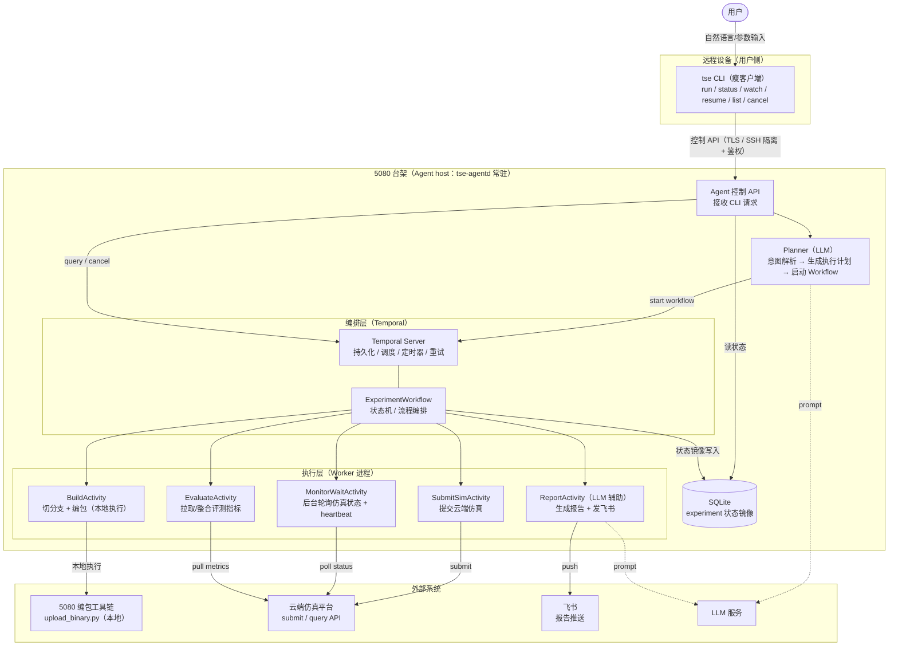
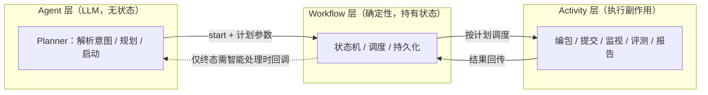
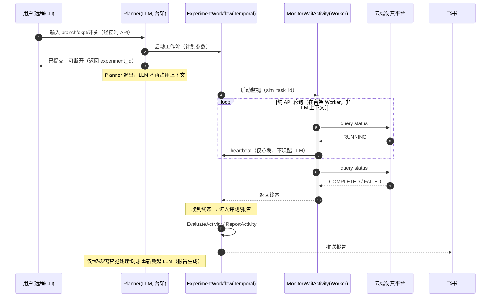
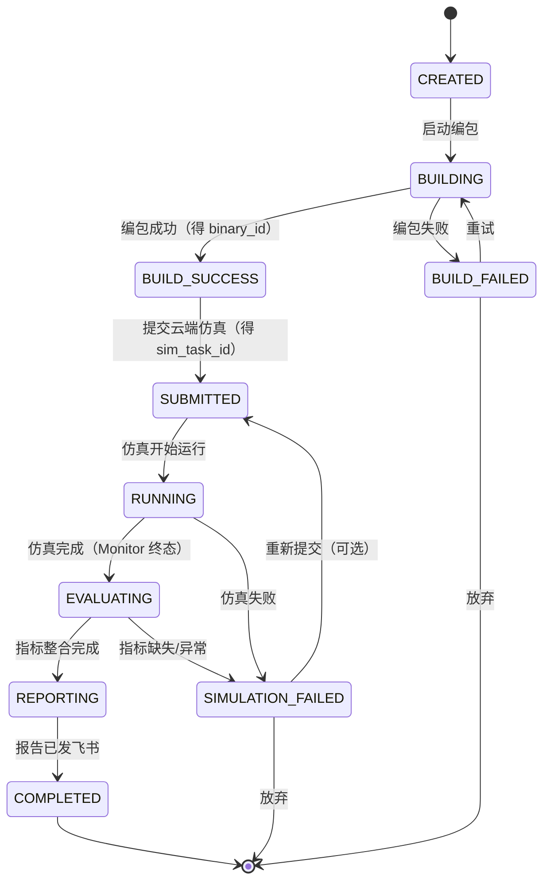
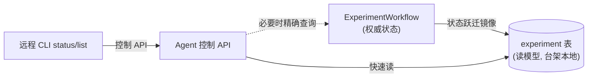
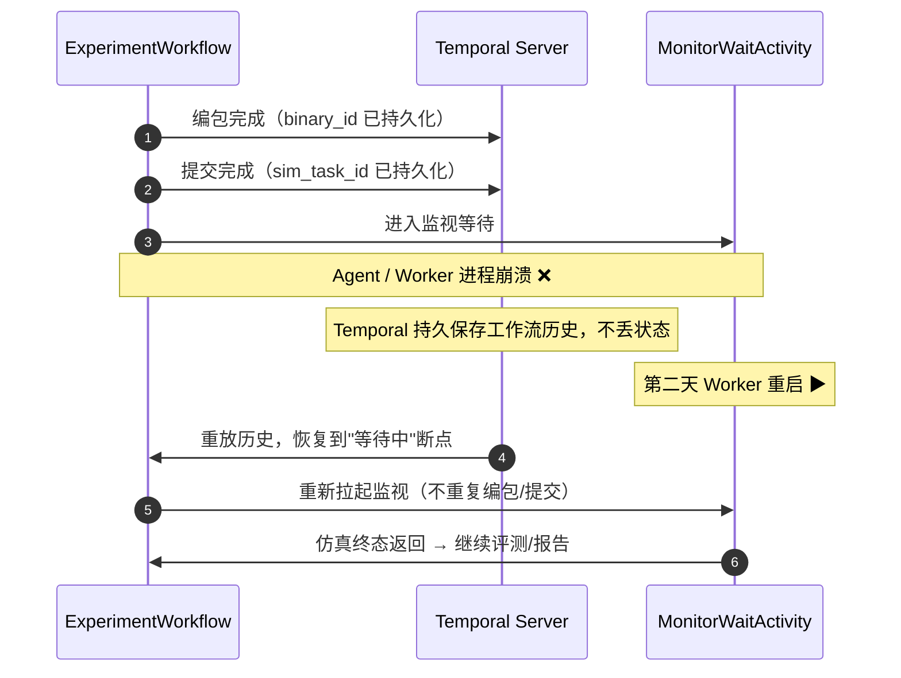
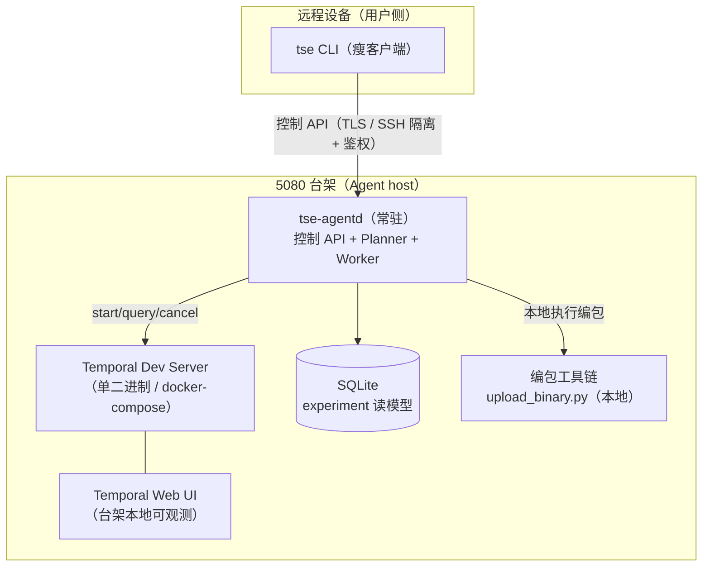

# 训练仿真评测闭环 Agent —— 架构设计文档

> ⚠️ **实现现状更新（v1.1）**：评测与报告链路已调整为**全程无 LLM**。
> 评测阶段直接运行 simworld 仓库 `tools/` 下脚本产出报告物料——
> 渲染耗时统计（`render_time_analysis/log_downloader` + `time_analyze`，输出 CSV）
> 与 FM 轨迹评测（`eval_tools/eval_tasks_download` + `eval_main`，输出图片）；
> 报告阶段（`ReportActivity`）直接把 CSV + 图片通过飞书发给接收人，不再调用 LLM 生成摘要。
> 本文下文中涉及 `Planner/LLM 报告生成/Metrics` 的描述为早期设计稿，最新行为以 README 与代码为准。
>
> 版本：v1.0 ｜ 日期：2026-06-15 ｜ 状态：设计稿
>
> 本文档描述"训练仿真评测闭环 Agent"的总体架构、核心设计决策与落地方案。需求来源见 [project-description-doc.md](../project-description-doc.md)。

---

## 目录

1. [概述与目标](#1-概述与目标)
2. [总体架构](#2-总体架构)
3. [核心设计决策](#3-核心设计决策)
4. [长流程等待与 Monitor 机制（核心）](#4-长流程等待与-monitor-机制核心)
5. [Workflow 与状态机设计](#5-workflow-与状态机设计)
6. [各组件详细设计](#6-各组件详细设计)
7. [数据模型](#7-数据模型)
8. [失败恢复、重试与幂等](#8-失败恢复重试与幂等)
9. [接口设计](#9-接口设计)
10. [部署与运行](#10-部署与运行)
11. [安全考量](#11-安全考量)
12. [目录结构与技术栈](#12-目录结构与技术栈)
13. [实施路线与里程碑](#13-实施路线与里程碑)
14. [风险与未决项](#14-风险与未决项)

---

## 1. 概述与目标

### 1.1 背景

模型迭代过程中，需要对待测试的模型权重在仿真环境中进行闭环评测。当前人工流程为：

1. 准备待测模型权重路径（ckpt）与全局开关配置；
2. 在本地 5080 台架选取测试分支编包，得到 Binary id；
3. 在网页端用 `binary id + ckpt path + 开关配置` 提交云端闭环仿真任务；
4. 等任务跑完，拉取模型评测输出，整合成报告并提交到飞书。

该流程步骤多、跨系统、单次仿真耗时长（可达数小时甚至跨天），且容易因人工等待、状态遗忘、中途失败而中断。本项目用一个 **Agent + 工作流引擎** 将上述闭环自动化。

### 1.2 目标

- **端到端自动化**：用户一次性输入 `branch / ckpt_path / 开关`，系统自动完成 编包 → 提交仿真 → 等待 → 拉取评测 → 生成报告 → 发送飞书。
- **长流程可靠编排**：流程状态由工作流引擎持久化，**Agent 自身不记忆流程状态**；支持可恢复、可重试、幂等。
- **低成本等待**：仿真等待期不通过 LLM 轮询，**等待阶段的 LLM token 成本趋近于 0**（核心诉求，见第 4 节）。
- **可观测**：任意时刻可通过 CLI / Web UI 查询实验状态与历史。

### 1.3 范围

| 范围内（In Scope） | 范围外（Out of Scope，本期不做） |
| --- | --- |
| 单用户形态：台架侧 Agent 常驻 + 远程瘦客户端 CLI | 多用户在线服务 / 权限系统 |
| 编包、提交仿真、等待、评测拉取、报告、飞书推送的闭环编排 | 仿真平台本身、台架编包系统的实现 |
| 基于 Temporal 的持久化工作流与状态机 | 模型训练、权重产出 |
| 失败恢复 / 重试 / 幂等 | 报告内容的算法级深度分析（仅做指标整合与摘要） |
| Planner（LLM）解析用户意图并生成执行计划 | 复杂的多分支实验对比编排（后续迭代） |

### 1.4 非目标（Non-Goals）

- 不追求把 LLM 嵌入到流程的每一步；LLM 仅用于"自然语言意图解析 / 规划"与"报告生成"两处。
- 不自研工作流引擎的持久化/重试机制，复用 Temporal 的能力。

---

## 2. 总体架构

### 2.1 分层架构图



### 2.2 组件职责一览

| 层 | 组件 | 职责 | 是否使用 LLM |
| --- | --- | --- | --- |
| 交互层（远程设备） | **CLI（瘦客户端）** | 接收用户输入；经控制 API 启动 / 查询 / 续跑 / 取消实验；展示状态与报告链接 | 否 |
| 接入层（台架） | **Agent 控制 API（tse-agentd）** | 台架侧常驻入口；接收远程 CLI 请求，转交 Planner / 查询 Temporal 与读模型 | 否 |
| 规划层（台架） | **Planner Agent** | 解析自然语言或结构化输入，校验参数，生成执行计划，启动 Temporal 工作流 | **是** |
| 编排层 | **ExperimentWorkflow** | 闭环流程的状态机与调度；持久化每一步；驱动各 Activity；维护状态转移 | 否（确定性代码） |
| 执行层 | **BuildActivity** | 在 simulation / simworld 仓切分支并执行 `upload_binary.py` 编包，回收 binary id | 否 |
| 执行层 | **SubmitSimActivity** | 用 `binary_id + ckpt + 开关` 提交云端闭环仿真，回收 sim_task_id | 否 |
| 执行层 | **MonitorWaitActivity** | 在 Worker 进程后台轮询仿真状态、发送 heartbeat，直至终态才返回（核心，见第 4 节） | 否 |
| 执行层 | **EvaluateActivity** | 拉取仿真产物 / 评测指标并整合为结构化数据 | 否 |
| 执行层 | **ReportActivity** | 用指标生成报告文本并提交飞书 | **是（辅助）** |
| 存储 | **台架 DB（SQLite）** | `experiment` 表，镜像工作流状态供 agentd（服务远程 CLI）快速查询 | 否 |

### 2.3 关键设计原则

1. **状态外置**：流程状态由 Temporal（及其镜像到 DB）持有，Agent / LLM 无状态、可随时重启。
2. **LLM 与编排解耦**：LLM 只做"解析规划"和"报告生成"，不参与等待与轮询循环。
3. **确定性编排**：工作流是确定性代码，所有副作用（外部调用）都封装在 Activity 中，保证可重放（replay）与可恢复。
4. **幂等优先**：编包 / 提交等高代价、不可逆操作均设计幂等键，避免重复执行。
5. **控制面 / 执行面分离**：远程 CLI 仅承担控制与展示，编包 / 编排 / 等待等重逻辑全部在台架 agentd 内，凭据与算力不出台架。

---

## 3. 核心设计决策

### 3.1 为什么选择 Temporal 作为工作流引擎

需求明确要求"不要让 Agent 自己记忆流程状态，必须有 Workflow"，且强调"可恢复 & 可重试 & 幂等"。下面对比候选方案：

| 维度 | **Temporal（选定）** | LangGraph | 自研状态机 + DB |
| --- | --- | --- | --- |
| 持久化执行 | 原生（事件溯源，自动持久化每步） | 需自接 checkpointer | 全部自研 |
| 崩溃恢复 | 原生（重放历史自动恢复到断点） | 部分（依赖 checkpoint 实现） | 自研，易出错 |
| 重试 / 超时 | 原生（Activity 级重试策略、超时） | 需自实现 | 自研 |
| 长时等待（跨天） | 原生（durable timer，等待期零计算） | 进程需常驻 | 自研定时 |
| 幂等支持 | 配合幂等键易实现 | 需自实现 | 需自实现 |
| 信号 / 外部唤醒 | 原生 Signal | 需自实现 | 需自实现 |
| 可观测 | 自带 Web UI | 弱 | 自研 |
| 学习 / 运维成本 | 中（需跑 Temporal Server） | 低 | 低-中 |

**结论**：本场景的痛点恰好是 Temporal 的核心能力——**长流程、崩溃恢复、持久定时、重试**。需求文档中“编包成功 → 仿真提交成功 → Agent 挂了，第二天恢复时不能重新编包”的恢复场景，用 Temporal 几乎是“免费”获得的。因此选定 Temporal。

> 本场景下 Temporal 部署在 5080 台架（Agent host），以 dev server（单二进制或 docker-compose）运行，仅供台架本地的 agentd / Worker 访问，运维成本可接受，详见第 10 节。

### 3.2 Agent / Workflow / Activity 的职责边界

这是本架构最重要的边界划分：



- **Planner Agent（LLM）**：是“真正使用 LLM 并和用户交互的 Agent”，运行在台架侧 agentd 内、由远程 CLI 经控制 API 触发。它把自然语言/结构化输入转成**执行计划**与**工作流启动参数**，随后**退出**——不进入等待循环。
- **ExperimentWorkflow（确定性代码）**：持有全部流程状态，是状态机本体；不调用 LLM。
- **Activities（执行单元）**：封装一切有副作用的外部调用（编包、提交、轮询、拉取、发飞书）。其中 ReportActivity 内部可调用 LLM 生成报告文本，但 LLM 调用本身被封装为一次普通的、可重试的 Activity 执行。

### 3.3 为什么编包/提交/评测是 Activity 而非 Agent

这些步骤是**确定性工具调用**，没有需要"推理/决策"的空间，用 LLM 反而引入不确定性、增加成本与失败面。把它们实现为 Activity，可获得 Temporal 的重试、超时、幂等保证。LLM 仅保留在两处真正需要"理解/生成"的环节：意图解析（Planner）与报告撰写（ReportActivity）。

---

## 4. 长流程等待与 Monitor 机制（核心）

> 本节直接回应需求 Notice #1：**仿真过程时间长，若用轮询方式让 Agent 获取"是否完成"会非常消耗 token。** 参考 Claude Code 的 Monitor tool 设计解决。

### 4.1 问题本质

朴素实现会让 LLM Agent 进入这样的循环：

```
while True:
    status = query_sim_status()   # 每次都把结果喂回 LLM 上下文
    if status == DONE: break
    llm.think("还没好，继续等")     # ← 每轮消耗 token，且上下文不断膨胀
    sleep(60)
```

仿真可能跑数小时到跨天，这种"LLM in the loop"的轮询会：

- 每一轮把状态结果塞进 LLM 上下文 → **token 持续消耗**；
- 上下文不断增长 → 成本随时间线性甚至超线性上升；
- 进程必须常驻，Agent 一挂等待状态即丢失。

### 4.2 Claude Code Monitor tool 的核心思想

Claude Code 的 Monitor tool 做法是：**Claude 写一个小脚本在后台执行 watch，事件到达时才"interject"（打断/唤起）模型**；在等待期间用户/模型可以继续做别的事，模型上下文不被轮询占用。关键点：

1. **监视逻辑在后台脚本中运行，不在 LLM 上下文里**；
2. **只有"状态发生变化 / 事件命中"时才把信息回传给模型**；
3. 等待本身不消耗模型推理。

我们把这一思想映射到本系统，得到 **Monitor 机制**。

### 4.3 本系统的 Monitor 机制

核心理念：**把"等待"从 LLM 层下沉到 Temporal 编排层 + Worker 执行层，LLM 只在"状态跃迁需要智能处理"时被重新唤起。**

本系统采用**纯 API 轮询**实现监视（不依赖飞书完成消息等外部推送），将轮询封装在后台 Activity 中：

#### 后台轮询 Activity + Temporal 持久等待

- 工作流调用 `MonitorWaitActivity`，该 Activity 运行在台架 **Worker 进程**（不是 LLM 上下文）；
- Activity 内部以合理间隔轮询云端仿真平台的状态 API，**每次轮询发送 heartbeat** 给 Temporal；
- Activity 配置较长的 `start_to_close_timeout` 与 `heartbeat_timeout`；
- **只有当仿真到达终态（COMPLETED / FAILED）时，Activity 才返回**；中间态不返回、不打扰工作流，更不触碰 LLM；
- 若 Worker 崩溃，Temporal 依据 heartbeat 超时自动重试该 Activity，**轮询从断点续起**（仿真 task 仍在云端跑，重连即可）。

> 关键点：轮询发生在台架 Worker 进程内，**与 LLM 上下文完全隔离**。无论轮询多少次，都不会把状态结果喂回 LLM，因此等待期 LLM token 成本为 0（见 4.4）。这正是 Claude Code Monitor “监视在后台脚本、仅在事件命中时唤起模型” 思想的落地。



### 4.4 等待期 token 成本分析

| 方案 | 等待期 LLM 调用 | 上下文增长 | 进程要求 | 崩溃后等待状态 |
| --- | --- | --- | --- | --- |
| 朴素 LLM 轮询 | 每轮一次 | 持续膨胀 | LLM 进程常驻 | 丢失 |
| **本系统 Monitor 机制** | **0 次** | **不增长** | 仅 Worker 常驻（轻量） | **Temporal 持久保存，自动恢复** |

**关键结论**：等待阶段 LLM token 成本 ≈ 0。LLM 仅在两个"端点"被使用：① 启动时的意图解析（一次）；② 完成后的报告生成（一次）。中间无论等待几小时还是跨天，都不触碰 LLM。

### 4.5 CLI 侧的 watch 体验

用户视角同样无需"人肉轮询"：

- `run` 提交后立即返回 `experiment_id`，可直接断开；
- `watch <experiment_id>` 经控制 API 订阅状态变化，仅在状态跃迁时刷新一行输出（不是忙等刷屏）；
- 流程完成后飞书收到报告；CLI 也可 `status` 查询最终结果。

---

## 5. Workflow 与状态机设计

### 5.1 状态机

沿用需求定义的状态，转移关系如下：



### 5.2 状态到 Temporal 阶段的映射

工作流是一段确定性 Python 代码，按顺序推进；每个阶段更新状态并镜像到 DB：

| 状态 | 触发动作 | 对应 Activity | 产出 |
| --- | --- | --- | --- |
| `CREATED` | 工作流启动 | —（写入初始记录） | experiment_id |
| `BUILDING` | 进入编包 | `BuildActivity` | — |
| `BUILD_SUCCESS` | 编包返回 | （记录 binary_id） | binary_id |
| `BUILD_FAILED` | 编包异常 | （重试或终止） | error |
| `SUBMITTED` | 提交仿真 | `SubmitSimActivity` | sim_task_id |
| `RUNNING` | 仿真运行中 | `MonitorWaitActivity`（持久等待） | — |
| `SIMULATION_FAILED` | 仿真终态失败 | （重试或终止） | error |
| `EVALUATING` | 拉取指标 | `EvaluateActivity` | metrics |
| `REPORTING` | 生成报告 | `ReportActivity` | report 文本 |
| `COMPLETED` | 发飞书成功 | （记录 report_url） | report_url |

### 5.3 工作流骨架（示意）

```python
@workflow.defn
class ExperimentWorkflow:
    @workflow.run
    async def run(self, req: ExperimentRequest) -> ExperimentResult:
        await self._set_status(Status.CREATED)

        # 1) 编包（幂等：相同 branch+ckpt+switches 复用已有 binary）
        await self._set_status(Status.BUILDING)
        binary_id = await workflow.execute_activity(
            build_binary, req,
            start_to_close_timeout=timedelta(hours=1),
            retry_policy=BUILD_RETRY,
        )
        await self._set_status(Status.BUILD_SUCCESS, binary_id=binary_id)

        # 2) 提交仿真（幂等：相同 binary_id+switches 复用已有 task）
        sim_task_id = await workflow.execute_activity(
            submit_simulation, SubmitArgs(binary_id, req),
            start_to_close_timeout=timedelta(minutes=10),
            retry_policy=SUBMIT_RETRY,
        )
        await self._set_status(Status.SUBMITTED, sim_task_id=sim_task_id)
        await self._set_status(Status.RUNNING)

        # 3) 监视等待：纯 API 轮询，封装在后台 Activity，仅终态返回（不触碰 LLM）
        final = await workflow.execute_activity(
            monitor_wait, sim_task_id,
            start_to_close_timeout=timedelta(hours=12),
            heartbeat_timeout=timedelta(minutes=5),
            retry_policy=MONITOR_RETRY,
        )
        if final.failed:
            await self._set_status(Status.SIMULATION_FAILED, error=final.error)
            raise ApplicationError("simulation failed", non_retryable=True)

        # 4) 评测拉取
        await self._set_status(Status.EVALUATING)
        metrics = await workflow.execute_activity(
            evaluate, sim_task_id,
            start_to_close_timeout=timedelta(minutes=30),
            retry_policy=EVAL_RETRY,
        )

        # 5) 报告 + 飞书
        await self._set_status(Status.REPORTING)
        report_url = await workflow.execute_activity(
            generate_and_send_report, ReportArgs(req, metrics),
            start_to_close_timeout=timedelta(minutes=15),
            retry_policy=REPORT_RETRY,
        )
        await self._set_status(Status.COMPLETED, report_url=report_url)
        return ExperimentResult(report_url=report_url)
```

> 注：以上为说明性伪代码，省略了部分错误处理与状态镜像细节。

---

## 6. 各组件详细设计

### 6.1 Planner Agent（LLM）

**职责**：把用户输入转成结构化的 `ExperimentRequest` 与执行计划，并启动工作流。

**输入示例**（需求原文）：

```
测试：
branch: dev_difix_zf_0612
ckpt_path: /mnt/xxx.ckpt
开关：
use_difix=true
use_nvfixer=false
```

**处理流程**：

1. LLM 解析自然语言/半结构化输入，抽取 `branch / ckpt_path / switches`；
2. 参数校验（分支名合法、ckpt 路径存在、开关键名在白名单内）；
3. 生成可读执行计划（供用户确认）：

   ```
   1. checkout branch dev_difix_zf_0612
   2. build binary
   3. get binary id
   4. submit simulation
   5. wait completion (monitor, no LLM polling)
   6. collect metrics
   7. generate report
   8. send feishu
   ```

4. 启动 `ExperimentWorkflow`，把 `workflow_id` 与 `experiment_id` 返回给 CLI，随后退出。

**关键约束**：Planner **不持有流程状态**、**不进入等待循环**；解析与规划是一次性的 LLM 调用。

### 6.2 BuildActivity（编包）

**职责**：在 simulation / simworld 仓切换分支并执行编包，回收 binary id。

**参考命令**（需求原文）：

```bash
cd /sandbox/simulation/simulation && \
./scripts/upload_binary.py --cn --foundation_model --enable_simworld \
  -v XP5 -f --build_region sh -n <name>
```

**设计要点**：

- 通过 `BuildExecutor` 抽象屏蔽"本地执行 / 远程 SSH"差异（默认本地执行于 5080 台架；远程时用 SSH）；
- 当前需求仅需在 simulation 与 simworld 两仓切分支（pipeline 多仓管理）；
- 解析 `upload_binary.py` 的输出，提取 binary id；
- **幂等键** `build_key = hash(branch + ckpt + switches)`：先查 DB / 平台是否已有对应成功 binary，命中则直接复用，避免重复编包（高代价操作）。

### 6.3 SubmitSimActivity（提交仿真）

**职责**：用 `binary_id + ckpt_path + 开关` 调用云端仿真平台 submit 接口，回收 `sim_task_id`。

**设计要点**：

- 封装平台 submit API（替代人工网页端设置）；
- **幂等键** `submit_key = hash(binary_id + ckpt + switches)`：防止因重试重复提交同一仿真任务；
- 返回的 `sim_task_id` 持久化到工作流与 DB。

### 6.4 MonitorWaitActivity（监视等待，核心）

**职责**：后台轮询仿真状态直至终态，期间发送 heartbeat，**不打扰 LLM**。详见第 4 节。

**设计要点**：

- 轮询间隔自适应（如前期 30s、长时间后退避到数分钟）；
- 每次轮询 `activity.heartbeat(progress)`，以便崩溃后续起与超时检测；
- 仅返回终态（COMPLETED / FAILED）；
- 配置长 `start_to_close_timeout`（如 12h，按仿真上限设定）与 `heartbeat_timeout`（如 5min）。

### 6.5 EvaluateActivity（评测拉取与整合）

**职责**：仿真完成后拉取模型评测输出，整合为结构化指标。

**设计要点**：

- 从云端产物（对象存储 / 平台 API / 指定路径）拉取评测结果文件；
- 解析为统一的 `metrics` 结构（指标名 → 值 / 曲线 / 表格）；
- 缺失或异常时进入 `SIMULATION_FAILED` 或触发有限重试。

### 6.6 ReportActivity（报告生成与飞书推送，LLM 辅助）

**职责**：把 `metrics` 整合成报告并提交飞书，回收 `report_url`。

**设计要点**：

- 用模板 + LLM 生成可读摘要（如关键指标对比、异常高亮）；
- LLM 调用封装在 Activity 内，作为一次可重试的执行（失败重试不影响整体流程）；
- 通过飞书机器人发送报告（Markdown → 飞书富文本 / 文档）；
- **幂等**：以 `experiment_id` 为消息幂等键，避免重试导致重复发送（或先撤回再发）。

---

## 7. 数据模型

### 7.1 `experiment` 表

在需求给出的字段基础上扩展，用于 CLI 快速查询与失败恢复：

| 字段 | 类型 | 说明 |
| --- | --- | --- |
| `id` | TEXT (PK) | 实验 ID（experiment_id） |
| `branch` | TEXT | 测试分支 |
| `ckpt_path` | TEXT | 权重路径 |
| `switches` | JSON | 全局开关配置（如 use_difix / use_nvfixer） |
| `binary_id` | TEXT | 编包产物 ID（编包成功后写入） |
| `sim_task_id` | TEXT | 云端仿真任务 ID（提交后写入） |
| `status` | TEXT | 当前状态（10 态之一） |
| `report_url` | TEXT | 报告链接（完成后写入） |
| `error` | TEXT | 最近一次错误信息（失败时写入） |
| `temporal_workflow_id` | TEXT | 关联的 Temporal 工作流 ID（用于恢复 / 查询 / 取消） |
| `build_key` | TEXT | 编包幂等键 |
| `submit_key` | TEXT | 提交幂等键 |
| `feishu_msg_id` | TEXT | 飞书消息 ID（报告去重 / 可撤回） |
| `retry_count` | JSON | 各阶段重试计数 |
| `created_at` | DATETIME | 创建时间 |
| `updated_at` | DATETIME | 最近更新时间 |

### 7.2 DB 与 Temporal 的关系

- **Temporal 是状态的"权威源"（source of truth）**：工作流历史完整记录每一步。
- **DB 是“读模型 / 镜像”**：工作流在每次状态跃迁时把关键字段写入 DB，供 agentd（服务远程 CLI）/ Web 低成本查询，避免每次都查询 Temporal。
- 二者一致性：以工作流为准；DB 写入失败不阻断流程（最终一致）。



---

## 8. 失败恢复、重试与幂等

### 8.1 需求场景回放

> 编包成功 → 仿真提交成功 → Agent 挂了，第二天恢复时**不能重新编包**，而应从 DB 读取状态 → Running → 继续等待结果。

本架构如何天然满足：



**关键**：编包、提交的结果都已作为工作流历史事件持久化。崩溃后 Temporal **重放（replay）历史**，已完成的 Activity 不会重跑，工作流直接恢复到"等待仿真"的断点继续。这正是选用 Temporal 的核心收益。

### 8.2 幂等设计

即便在极端场景（如 Activity 已执行成功但结果未及落库就崩溃）下，幂等键提供二次保障：

| 操作 | 幂等键 | 行为 |
| --- | --- | --- |
| 编包 | `hash(branch + ckpt + switches)` | 先查是否已有成功 binary，命中复用，杜绝重复编包 |
| 提交仿真 | `hash(binary_id + ckpt + switches)` | 先查是否已有对应 sim_task，命中复用，杜绝重复提交 |
| 发送报告 | `experiment_id` | 命中已发送则跳过 / 撤回重发，避免刷屏 |

### 8.3 重试策略

| 阶段 | 重试 | 退避 | 不可重试错误 |
| --- | --- | --- | --- |
| 编包 | 有限次（如 3） | 指数退避 | 分支不存在、编译错误（代码问题） |
| 提交仿真 | 有限次 | 指数退避 | 参数非法、配额不足 |
| 监视等待 | 按 heartbeat 超时自动续起 | — | 仿真终态 FAILED（业务失败，不重试） |
| 评测拉取 | 有限次 | 指数退避 | 产物结构不符 |
| 报告 | 有限次 | 指数退避 | 模板/权限错误 |

- 可重试 vs 不可重试通过 `ApplicationError(non_retryable=...)` 区分；
- 业务失败（如仿真本身 FAILED）不应无脑重试，交由用户决策是否 `resume` 重新提交。

### 8.4 恢复与续跑入口

- 进程级恢复：重启 Worker，Temporal 自动恢复在途工作流，无需人工干预。
- 人工续跑：`tse resume <experiment_id>`，对处于 `*_FAILED` 的实验，从失败阶段重新驱动（依据状态选择重入点）。

---

## 9. 接口设计

### 9.1 CLI 命令

| 命令 | 说明 |
| --- | --- |
| `tse run`（或交互式输入） | 提交新实验；解析输入 → 规划 → 启动工作流；返回 experiment_id |
| `tse status <id>` | 查询单个实验当前状态、各阶段产出与报告链接 |
| `tse list` | 列出全部实验及状态 |
| `tse watch <id>` | 订阅状态变化，仅在跃迁时刷新（非忙等） |
| `tse resume <id>` | 对失败实验从断点续跑 |
| `tse cancel <id>` | 取消在途实验（终止工作流） |
| `tse logs <id>` | 查看某实验各阶段日志 |

`tse run` 输入示例：

```bash
tse run --rerun-job-id 134316 \
        --sim-x-token <仿真平台x-token> \
        --sim-x-account you@xiaopeng.com \
        --set use_difix=true --set use_nvfixer=false
# 编包分支已 hardcode 在服务端 constants，run 不再接受 --branch / --ckpt
```

> CLI 为**远程瘦客户端**，通过 `--endpoint`（或配置文件 `~/.tse/config`）指向台架 agentd 的控制 API 地址；除展示外不做重逻辑。

### 9.2 Activity 接口签名（示意）

```python
async def build_binary(req: ExperimentRequest) -> str: ...           # -> binary_id
async def submit_simulation(args: SubmitArgs) -> str: ...             # -> sim_task_id
async def monitor_wait(sim_task_id: str) -> SimResult: ...            # 仅终态返回
async def evaluate(sim_task_id: str) -> Metrics: ...                  # -> 指标
async def generate_and_send_report(args: ReportArgs) -> str: ...      # -> report_url
```

### 9.3 外部系统集成接口

| 外部系统 | 接口 | 用途 | 备注 |
| --- | --- | --- | --- |
| 5080 编包工具链 | `upload_binary.py`（本地/SSH） | 切分支 + 编包 | 经 `BuildExecutor` 抽象，默认台架本地 |
| 云端仿真平台 | `submit` API | 提交闭环仿真 | 替代网页端人工操作 |
| 云端仿真平台 | `query status` API | Monitor 纯轮询 | 唯一的完成判定来源 |
| 云端仿真平台 | 产物拉取（OSS/API/路径） | 评测指标 | EvaluateActivity 使用 |
| 飞书 | 机器人发送消息 | 报告推送 | ReportActivity 使用 |
| LLM 服务 | Chat/Completion API | 意图解析、报告生成 | Planner / ReportActivity |

### 9.4 CLI ↔ Agent 控制 API（跨设备）

远程 CLI 与台架 agentd 之间的薄控制接口（gRPC / HTTP 二选一），承载与 CLI 命令一一对应的操作：

| 操作 | 入参 | 说明 |
| --- | --- | --- |
| `Plan` | 原始输入 | 触发台架 Planner 解析并返回可读执行计划（可选预览/确认） |
| `Run` | ExperimentRequest / 原始输入 | 启动 `ExperimentWorkflow`，返回 experiment_id |
| `Status` / `List` | experiment_id / — | 读取读模型，返回状态与产出 |
| `Watch` | experiment_id | 服务端推送状态跃迁（流式） |
| `Resume` / `Cancel` | experiment_id | 续跑 / 取消工作流 |

- 传输层加密（TLS）或经 SSH 隔离；附带鉴权令牌（见第 11 节）。
- agentd 内部用本地 Temporal 客户端驱动工作流；Temporal frontend 不直接暴露到用户网络。

---

## 10. 部署与运行

### 10.1 部署拓扑（远程 CLI + 台架 Agent）



### 10.2 运行要素

- **台架（Agent host）常驻**：
  - **Temporal Dev Server**：`temporal server start-dev` 单二进制（或 docker-compose），提供持久化、定时器、Web UI；仅监听台架本地，不对用户网络暴露。
  - **tse-agentd**：单进程内承载 **控制 API + Planner（LLM）+ Temporal Worker（所有 Activity）**，从任务队列拉取执行；**流程在后台跑，远程 CLI 可随时断开/重连**。
  - **SQLite**：台架本地 experiment 读模型；零运维。
  - 编包在台架本地执行（`BuildExecutor` 默认 local 模式）。
- **远程设备**：仅 **tse CLI** 瘦客户端，经控制 API 与 agentd 通信，不需要台架访问权限或 LLM 凭据。

### 10.3 启动顺序

```bash
# —— 在 5080 台架（Agent host）——
# 1) 启动 Temporal dev server（持久化模式，仅监听本地）
temporal server start-dev --db-filename ./temporal.db --ip 127.0.0.1

# 2) 启动 agentd（控制 API + Planner + Worker 常驻）
tse-agentd start --listen 0.0.0.0:8443 --tls ...   # 对外仅暴露控制 API

# —— 在远程设备（用户侧）——
# 3) 配置 endpoint 后提交实验
tse --endpoint https://<bench-host>:8443 \
    run --rerun-job-id <模板job> --sim-x-token <x-token> --sim-x-account <账号> --set ...
```

> 仿真等待期间，即使关闭远程 CLI，台架 agentd + Temporal 仍持续监视；完成后飞书收到报告。台架重启后，agentd/Worker 重连 Temporal 即自动恢复在途实验。

---

## 11. 安全考量

| 风险点 | 措施 |
| --- | --- |
| 凭据管理（飞书 token / LLM key / 平台 token） | 通过环境变量或台架本地密钥文件读取，**不入库、不硬编码、不写日志**；最小权限原则；凭据仅存于台架，远程设备不持有 |
| CLI ↔ Agent 跨设备通信 | 控制 API 经 **TLS（或 SSH 隔离）** 加密，附带**鉴权令牌**；Temporal frontend 不对用户网络暴露，仅 agentd 本地访问 |
| 命令注入（编包参数拼接） | 对 branch / name 等参数做白名单与转义校验，避免拼接进 shell 造成注入（OWASP A03） |
| 输入校验 | Planner 解析结果在进入工作流前做 schema 校验（分支名、路径、开关键名白名单） |
| 敏感信息外泄 | 报告 / 日志中对路径、内部地址按需脱敏 |
| LLM 提示注入 | 解析阶段对自然语言输入做边界约束，规划结果须经结构化校验后才执行，不直接据 LLM 文本拼接命令 |

---

## 12. 目录结构与技术栈

### 12.1 技术栈

| 类别 | 选型 |
| --- | --- |
| 语言 | Python 3.10+ |
| 工作流 | Temporal（`temporalio` SDK） |
| LLM | 直接 LLM SDK（轻量自研编排，不引入重型框架） |
| CLI | `typer` / `click` |
| 数据校验 | `pydantic` |
| 编包执行 | 台架本地 `subprocess`（默认）；`paramiko` / `fabric`（可选 SSH 模式） |
| 控制 API | gRPC（`grpcio`）或 HTTP（`FastAPI` + `uvicorn`），CLI ↔ agentd |
| 飞书 | 飞书开放平台 SDK（`lark-oapi`） |
| 存储 | SQLite |

### 12.2 建议目录结构

```
train-sim-eval-agent/
├── docs/
│   └── architecture-design.md
├── tse/
│   ├── cli/                  # CLI 命令（run/status/watch/resume/...）
│   ├── planner/             # Planner Agent（LLM 意图解析与规划）
│   ├── workflows/
│   │   └── experiment.py    # ExperimentWorkflow（状态机/编排）
│   ├── activities/
│   │   ├── build.py         # BuildActivity（+ BuildExecutor 抽象）
│   │   ├── submit.py        # SubmitSimActivity
│   │   ├── monitor.py       # MonitorWaitActivity（核心）
│   │   ├── evaluate.py      # EvaluateActivity
│   │   └── report.py        # ReportActivity（LLM 辅助）
│   ├── integrations/
│   │   ├── bench.py         # 5080 编包工具链 / upload_binary.py 封装
│   │   ├── sim_cloud.py     # 云端仿真平台 API（submit / query / 产物）
│   │   └── feishu.py        # 飞书机器人（报告推送）
│   ├── server/
│   │   ├── agentd.py        # tse-agentd 入口（控制 API + Planner + Worker）
│   │   └── control_api.py   # CLI ↔ Agent 控制 API（gRPC / HTTP）
│   ├── models/              # pydantic 模型 + DB schema
│   ├── store/               # SQLite 读模型读写
│   └── worker.py            # Temporal Worker 注册（被 agentd 装载）
├── pyproject.toml
└── README.md
```

---

## 13. 实施路线与里程碑

| 阶段 | 目标 | 关键交付 |
| --- | --- | --- |
| **M1 骨架** | Temporal + Worker + SQLite 跑通最小闭环 | `ExperimentWorkflow` 串起占位 Activity；本地 `run/status` |
| **M2 真实集成** | 接入真实编包/提交/评测/飞书 | Build/Submit/Evaluate/Report Activity 落地；幂等键 |
| **M3 Monitor 机制** | 长流程纯轮询等待 + 崩溃恢复 | `MonitorWaitActivity` + heartbeat + 重试；恢复演练 |
| **M4 Planner** | LLM 意图解析与规划 | Planner Agent；自然语言输入支持 |
| **M5 远程 CLI / agentd** | 控制面/执行面分离，CLI 跨设备 | `tse-agentd` 控制 API + 鉴权/TLS；远程 `run/status/watch` |
| **M6 打磨** | 可观测、安全、文档 | `watch/resume/cancel`；凭据管理；用户手册 |

---

## 14. 风险与未决项

### 14.1 未决项（建议确认）

> 已确认：① 工作流引擎 Temporal + Python；② Agent 常驻 5080 台架、CLI 远程瘦客户端；③ 仿真完成判定采用**纯 API 轮询**（不使用飞书完成消息）；④ 编包默认台架本地执行。

| 编号 | 未决项 | 当前默认假设 |
| --- | --- | --- |
| Q1 | Planner / Report 使用的 LLM 提供方与编排库 | 直接 LLM SDK + 轻量自研（避免与 Temporal 职责重叠） |
| Q2 | 控制 API 形态与鉴权（gRPC vs HTTP；令牌 / mTLS / SSH 隔离） | 默认 HTTP + 鉴权令牌 + TLS；可换 gRPC 或 SSH 隔离 |
| Q3 | 评测指标来源（OSS / 路径 / API）与报告模板格式 | 假设可从云端产物拉取；报告 Markdown → 飞书富文本 |

### 14.2 风险

| 风险 | 影响 | 缓解 |
| --- | --- | --- |
| 仿真平台无稳定 query API | Monitor 轮询失效（完成判定唯一来源） | 优先推动平台暴露稳定状态 API；退化方案：轮询仿真产物是否落地作为完成判据 |
| 编包耗时/失败率高 | 流程整体变慢 | 幂等复用 binary；编包失败精准分类（代码错误不重试） |
| 远程 CLI 与台架网络中断 | 无法下发/查询，但不影响在途流程 | 流程在台架 agentd 后台持续运行；CLI 重连后 `status/watch` 即可恢复观测 |
| 台架 Temporal 运维 | 台架依赖增加 | 用 dev server 单二进制；提供一键启动脚本；agentd 与 Temporal 同机降低网络面 |

---

## 附录 A：需求条目对照

| 需求条目（project-description-doc.md） | 本文档对应 |
| --- | --- |
| pipeline 4 步流程 | 第 1.1 / 第 5 / 第 6 节 |
| Planner / Build / Simulation / Report Agent 拆分 | 第 2.2 / 第 6 节 |
| Workflow Engine（推荐 Temporal） | 第 3.1 / 第 5 节 |
| 状态机 10 态 | 第 5.1 / 第 5.2 节 |
| `experiment` 表字段 | 第 7.1 节 |
| 失败恢复 & 可重试 & 幂等 | 第 8 节 |
| Notice #1：长流程轮询省 token（Monitor 思想） | **第 4 节（核心）** |
| 仿真 Agent 切分支 / `upload_binary.py` | 第 6.2 节 |
| 仿真完成判定：纯 API 轮询（状态查询 API） | 第 4.3 / 第 9.3 节 |
| Agent 常驻台架 + 远程 CLI | 第 2.1 / 第 10 节 |
```
