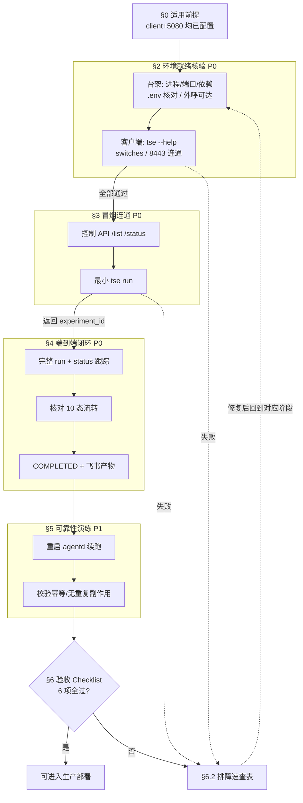
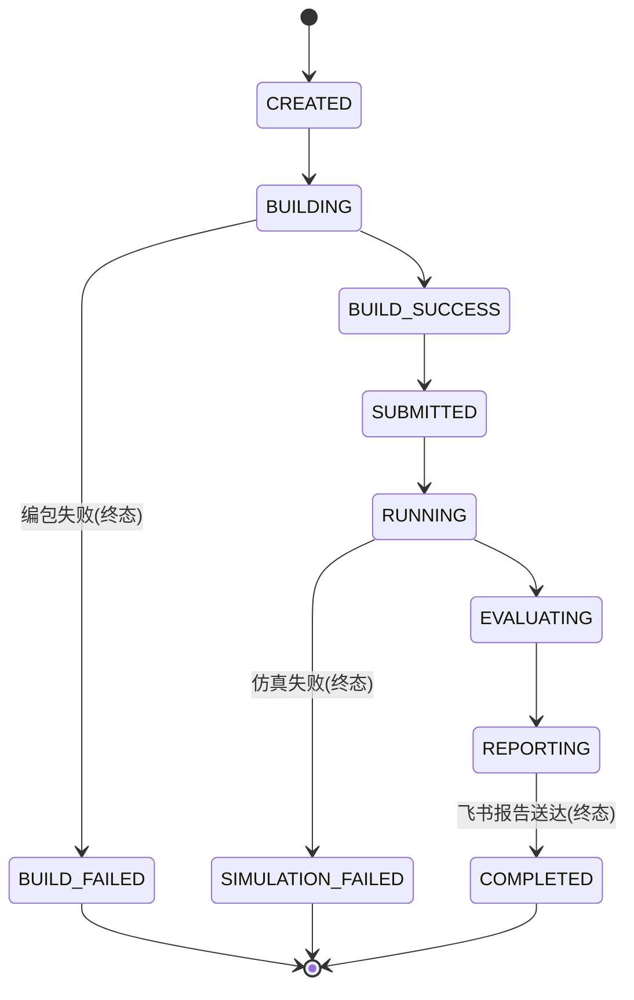

# 生产部署前测试指南

> **适用前提**：本文档面向**已完成 client 侧与 5080 台架侧环境配置**的工程师，用于在正式投入生产前，按层级递进地验证「编包 → 提交仿真 → 等待 → 评测 → 发飞书」整条闭环确实**可用、可恢复、可观测**。
>
> 📌 本文档**专注测试编排，不重复安装/部署步骤**。环境搭建请先完成以下两份既有文档：
> - 台架侧（`agentd` + Temporal dev server）部署：[deployment-bench.md](deployment-bench.md)
> - 客户端（`tse` 瘦客户端）安装与使用：[client-cli-setup.md](client-cli-setup.md)
>
> 若上述任一环境尚未就绪，请先返回对应文档完成部署，再回到本指南。

---

## 0. 适用前提与文档关系

### 0.1 前提核对

开始测试前，请确认以下条件均已满足（具体核验方法见 §2）：

| 前提 | 说明 | 依据文档 |
| --- | --- | --- |
| 5080 台架已部署 | Temporal dev server + `tse-agentd` 两进程已按 systemd/常驻方式跑起来 | [deployment-bench.md](deployment-bench.md) §3 |
| 台架 `.env` 已配置 | 飞书凭据、仿真平台凭据回退、`TSE_SIMWORLD_REPO_ROOT`、编包 `TSE_BUILD_*` 均已填真实值 | [deployment-bench.md](deployment-bench.md) §3.4 |
| 客户端已安装 `tse` | `tse` 命令可用，默认指向台架 `http://10.99.75.210:8443`（或经 `TSE_ENDPOINT` 覆盖） | [client-cli-setup.md](client-cli-setup.md) §2 |
| 网络可达 | 5080 → 仿真平台 `cloudsim.xiaopeng.link` 与飞书 OpenAPI 可达；客户端 → 台架 `8443` 可达 | 本文 §2.3 / §2.4 |

### 0.2 写作约定（每步「命令 + 预期/判据」）

为保证可照做性，本文档**每个测试步骤**都遵循统一格式：

- **命令**：可直接复制执行（占位符用 `<尖括号>` 标注，执行前替换为真实值）。
- **预期结果 / 通过判据**：明确「看到什么算通过」。
- **失败处置**：未达判据时，跳转 [§6.2 排障速查表](#62-排障速查表) 对应条目。

> ⚠️ **一致性提示**：本文档命令、参数、状态名、环境变量均与现网代码（`tse/constants.py`、`tse/cli`、`.env.example`）对齐。
> 编包分支已 **hardcode** 在服务端，`tse run` **不再接受** `--branch` / `--ckpt`（已移除）；控制 API **已移除 token 鉴权**。请勿照搬任何含这些已删参数的旧示例。

---

## 1. 测试阶段总览

测试采用**分层递进**编排：每一层都有「进入门禁」，**上一层全部通过方可进入下一层**；任一层失败则跳转 [§6.2 排障速查表](#62-排障速查表)，修复后回到该层重测。



| 阶段 | 章节 | 目标 | 通过判据 | 优先级 |
| --- | --- | --- | --- | --- |
| ① 环境就绪核验 | [§2](#2-环境就绪核验部署前预检) | 进程/端口/依赖/`.env`/网络/TLS 全部就位 | 台架两进程 `active`、`7233`/`8443` 监听、依赖可导入、`.env` 关键项已核对、外呼可达、客户端 `tse` 可用且连通 8443 | P0 |
| ② 冒烟连通测试 | [§3](#3-冒烟连通测试最小可用) | 打通客户端 → 台架链路 | `curl /list` 通；最小 `tse run` 返回 `experiment_id` | P0 |
| ③ 端到端闭环验证 | [§4](#4-端到端闭环验证与状态流转核对) | 跑通一次真实实验直至 `COMPLETED` | 状态流转完整、飞书收到 CSV + 评测图片、`list`/`status` 返回报告链接 | P0 |
| ④ 可靠性演练 | [§5](#5-可靠性演练崩溃恢复--幂等--重试) | 长流程可恢复/可重试/幂等 | 重启 `tse-agentd` 后续跑、不重复编包/提交/发报、常驻与开机自启生效 | P1 |
| ⑤ 验收判定 | [§6.1](#61-上线验收-checklist) | 给出「可/不可上线」决策 | 6 项 Checklist 全部勾选 | P1 |
| 🔧 排障速查 | [§6.2](#62-排障速查表) | 任一阶段失败时定位处置 | —（贯穿支持） | P1 |

---

## 2. 环境就绪核验（部署前预检）

> **目标**：进入冒烟前，确认台架与客户端两侧的进程、端口、依赖、`.env`、网络、TLS 全部就位。
> 本节台架部分的核验命令与 [deployment-bench.md](deployment-bench.md) §3.5.1 一致，可交叉对照。

### 2.1 台架进程 / 端口 / 依赖

**① 两进程存活**

```bash
# 在 5080 台架执行
systemctl is-active temporal-dev tse-agentd          # 期望两行均输出 active
sudo systemctl status tse-agentd --no-pager          # 期望 Active: active (running)
```
- **通过判据**：`temporal-dev` 与 `tse-agentd` 均为 `active`。
- **失败处置**：任一非 active → [§6.2](#62-排障速查表)「agentd 起不来 / 连不上 7233」「关掉 ssh 后服务停了」。

**② 端口监听（`7233` 仅本地、`8443` 对外）**

```bash
ss -tlnp | grep -E ':7233|:8443'
```
- **通过判据**：`7233` 监听在 `127.0.0.1`（仅本地）、`8443` 监听在 `0.0.0.0`（对外）。
- **失败处置**：缺 `7233` → dev server 未起；缺 `8443` → `agentd` 未起，见 [§6.2](#62-排障速查表)。

**③ 依赖可导入**

```bash
# 在台架项目目录、已激活 venv 下执行
python -c "import temporalio, fastapi, uvicorn; print('server deps OK')"
python -c "import pandas, matplotlib, numpy; print('eval deps OK')"
```
- **通过判据**：两行分别打印 `server deps OK` / `eval deps OK`，无 `ImportError`。
- **失败处置**：`ImportError` → 依赖未装全，按 [deployment-bench.md](deployment-bench.md) §2 重装 `pip install -e ".[server,eval]"`。

### 2.2 关键 `.env` 核对清单

逐项核对台架 `.env`（凭据只存台架，切勿提交）。完整项见 `.env.example` 注释，下表为**必须核对**项：

| 变量 | 核对要点 | 备注 |
| --- | --- | --- |
| `TSE_SIMWORLD_REPO_ROOT` | **必须指向含 `tools/` 的真实克隆根**（如 `/home/<user>/tse-deploy/simworld`）。`.env.example` 默认的 `/workspace` **仅开发沙箱用，必须改成真实克隆路径** | 评测脚本（`tools/render_time_analysis`、`tools/eval_tools`）经 `importlib` 加入 `sys.path` 运行，路径错则评测必失败 |
| `TSE_FEISHU_APP_ID` / `TSE_FEISHU_APP_SECRET` | 飞书自建应用凭据，已填真实值 | 报告阶段发文件/图片所需 |
| `TSE_FEISHU_RECEIVE_EMAIL` 或 `TSE_FEISHU_RECEIVE_ID` | 报告接收人已配置 | 二者填其一 |
| `TSE_SIM_X_TOKEN` / `TSE_SIM_X_ACCOUNT` | 仿真平台凭据**回退值**。**现由客户端每次 `tse run --sim-x-token/--sim-x-account` 传入**，台架这两项可留空，仅作未传入时的回退 | x-token 是会过期的 JWT |
| 编包 `TSE_BUILD_*` | nested 三层拓扑：宿主机 → SSH 虚拟机 → docker 容器，按真实台架核对（默认值见 `.env.example`） | 编包失败常源于此，参见 `xp5_simulation_build_guide.md` |

**快速核对（不打印敏感值，仅看键是否存在）**：

```bash
# 在含 .env 的项目目录执行；仅列出已设置的关键键名，便于核对是否齐全
grep -E '^(TSE_SIMWORLD_REPO_ROOT|TSE_FEISHU_APP_ID|TSE_FEISHU_RECEIVE_|TSE_BUILD_)' .env | cut -d= -f1
# 重点确认 TSE_SIMWORLD_REPO_ROOT 不再是 /workspace
grep -E '^TSE_SIMWORLD_REPO_ROOT=' .env
```
- **通过判据**：关键键均存在；`TSE_SIMWORLD_REPO_ROOT` 指向真实克隆路径（**非** `/workspace`）。
- **失败处置**：缺项或仍为 `/workspace` → 按 [deployment-bench.md](deployment-bench.md) §3.4 补齐后 `sudo systemctl restart tse-agentd`。

### 2.3 外呼网络可达性探测（5080 → 外部）

台架需主动外呼**仿真平台**（提交/查询 job）与**飞书 OpenAPI**（发报告）。在 5080 台架执行：

```bash
# ① 仿真平台 DNS + HTTPS 可达
getent hosts cloudsim.xiaopeng.link            # 期望解析出 IP
curl -sS -o /dev/null -w '%{http_code}\n' https://cloudsim.xiaopeng.link    # 期望返回 HTTP 状态码（非空、非超时即说明可达）

# ② 飞书 OpenAPI 可达
getent hosts open.feishu.cn
curl -sS -o /dev/null -w '%{http_code}\n' https://open.feishu.cn/open-apis/   # 期望返回 HTTP 状态码
```
- **通过判据**：DNS 能解析、`curl` 返回 HTTP 状态码（任意非超时状态码均说明 TCP/TLS 通达，鉴权失败属正常）。
- **失败处置**：解析失败 / `curl` 超时 → [§6.2](#62-排障速查表)「提交仿真超时 / 报告发不出」，排查台架出网代理、DNS、防火墙。

### 2.4 客户端预检（含 TLS）

在**客户端**机器执行：

**① CLI 可用**

```bash
tse --help            # 期望列出 run / status / list / switches 子命令
tse switches          # 期望列出可用开关简称 -> 平台完整 token（如 use_difix -> simworld@use_difix:1）
```
- **通过判据**：`--help` 列出子命令；`switches` 打印开关映射表。
- **失败处置**：`command not found` → 客户端未装好，见 [client-cli-setup.md](client-cli-setup.md) §2。

**② 到台架 8443 连通**

```bash
# 默认地址已 hardcode 为 http://10.99.75.210:8443；如指向其它台架，先覆盖：
# export TSE_ENDPOINT=http://<台架IP>:8443

tse list                       # 经 CLI 直接验证端到端连通（返回历史实验列表，新部署可能为空）
# 或直连控制 API（替换为真实台架地址）：
curl -sS http://10.99.75.210:8443/list
```
- **通过判据**：`tse list` 正常返回（空列表也算通过）；或 `curl` 返回 JSON 数组。
- **失败处置**：连接被拒/超时 → [§6.2](#62-排障速查表)「客户端连不上 / 超时」。

**③ TLS / 协议注意点**

- 默认地址是 `https://`。若台架 `agentd` **未配置 TLS 证书**，请改用 **`http://`** 前缀覆盖：`export TSE_ENDPOINT=http://<台架IP>:8443`。
- 若台架用**自签证书**：客户端默认校验证书链，自签会报 SSL 错误。解决：把台架 CA 加入信任，或 `export SSL_CERT_FILE=/path/to/bench-ca.pem`（详见 [client-cli-setup.md](client-cli-setup.md) §3）。
- **失败处置**：SSL 错误 → [§6.2](#62-排障速查表)「SSL / 自签证书错误」。

> ✅ **进入门禁**：§2.1~§2.4 全部通过后，方可进入 [§3 冒烟连通测试](#3-冒烟连通测试最小可用)。

---

## 3. 冒烟连通测试（最小可用）

> **目标**：先验证控制 API 存活，再从客户端发起一次**最小 `run`** 并确认实验创建，打通客户端 → 台架链路。

### 3.1 控制 API 存活探测

> 控制 API **已移除 token 鉴权**——凡能访问 `8443` 的内网客户端均可调用 `/run` `/status` `/list` `/cancel`，请确保 8443 仅在可信内网开放。

```bash
# 在台架本地（127.0.0.1）或客户端（替换为台架地址）执行
curl -sS http://127.0.0.1:8443/list                 # 列出最近实验（新部署可能为空数组 [])
# 已知某实验 ID 时查询单条状态：
curl -sS http://127.0.0.1:8443/status/<experiment_id>
```
- **通过判据**：`/list` 返回 JSON 数组（`[]` 也算通过，说明服务存活）；`/status/{eid}` 对存在的实验返回状态行，不存在则返回 `404 not found`（属正常）。
- **失败处置**：连接拒绝/超时 → [§6.2](#62-排障速查表)「agentd 起不来 / 连不上 7233」「客户端连不上 / 超时」。

### 3.2 最小 `tse run`

发起一次**最小必填参数**的实验。三个必填参数为 `--rerun-job-id` / `--sim-x-token` / `--sim-x-account`：

```bash
# 建议用 read -s 读入 token，避免明文进 shell 历史与进程列表
read -s -p "sim x-token: " SIM_TOKEN; echo

tse run \
  --rerun-job-id <模板 e2e job_id> \
  --sim-x-token "$SIM_TOKEN" \
  --sim-x-account <you@xiaopeng.com>
```

> 📌 **编包分支已 hardcode 在服务端** `tse/constants.py`：simulation 仓库 `dev_xngp_xp5_zf`、simworld 仓库 `dev_zf_nvfixer`。
> 因此 `tse run` **不接受** `--branch` / `--simworld-branch`，也**不需要** `--ckpt`（均已移除）。
> 如需更换编包分支，改服务端 `SIMULATION_BRANCH` / `SIMWORLD_BRANCH` 常量。

> ⚠️ `--sim-x-token` / `--sim-x-account` 为**必填**：仿真平台凭据由客户端每次随请求传入。x-token 是会过期的 JWT，过期就更新重跑。

### 3.3 通过判据

成功后命令行输出：

```
experiment_id = <实验ID>
```

- **通过判据**：返回非空 `experiment_id` → 视为**客户端 → 台架链路连通**，可进入 [§4 端到端闭环验证](#4-端到端闭环验证与状态流转核对)。随后可 `tse status <experiment_id>` 看到 `CREATED` 或已进入 `BUILDING`。
- **失败处置**：未返回 `experiment_id`（报错/超时/鉴权失败）→ 跳转 [§6.2](#62-排障速查表)，按报错定位**连通 / 鉴权 / 网络**问题：
  - 连接相关 → 「客户端连不上 / 超时」「SSL / 自签证书错误」
  - x-token / 仿真平台相关 → 「提交仿真超时 / 报告发不出（x-token 过期）」

> ✅ **进入门禁**：§3 返回 `experiment_id` 后，方可进入 [§4](#4-端到端闭环验证与状态流转核对)。

---

## 4. 端到端闭环验证与状态流转核对

> **目标**：跑通一次**真实端到端实验**，核对完整 10 态流转直至 `COMPLETED` 与飞书报告送达。

### 4.1 完整 `tse run` 示例 + 进度跟踪

发起一次带开关与基线的完整实验（参数说明见 [client-cli-setup.md](client-cli-setup.md) §4.2）：

```bash
read -s -p "sim x-token: " SIM_TOKEN; echo

tse run \
  --rerun-job-id <模板 e2e job_id> \
  --sim-x-token "$SIM_TOKEN" \
  --sim-x-account <you@xiaopeng.com> \
  --job-name <可选任务名，如 difix_0622_e2e> \
  --set use_difix=true \
  --baseline 3dgs_3w=133785 \
  --baseline origin_png=134316
# 输出：experiment_id = <实验ID>
```

跟踪进度：

```bash
tse status <experiment_id>     # 返回当前状态（10 态之一）及报告链接等
tse list                       # 每行：实验ID  状态  报告URL
```

### 4.2 状态机流转核对

实验状态机共 **10 态**（与 `tse/constants.py` 的 `Status` 枚举一致），正常路径应依次经过：

```
CREATED → BUILDING → BUILD_SUCCESS → SUBMITTED → RUNNING → EVALUATING → REPORTING → COMPLETED
```



| 状态 | 含义 | 是否终态 |
| --- | --- | --- |
| `CREATED` | 实验已创建，工作流启动 | 否 |
| `BUILDING` | 正在编包（simulation/simworld 已 checkout 到 hardcode 分支） | 否 |
| `BUILD_SUCCESS` | 编包成功，得到 binary | 否 |
| `BUILD_FAILED` | **编包失败（终态）** | ✅ 失败终态 |
| `SUBMITTED` | 已向仿真平台提交云端 job | 否 |
| `RUNNING` | 云端仿真运行中（耗时最长阶段） | 否 |
| `SIMULATION_FAILED` | **仿真失败（终态）** | ✅ 失败终态 |
| `EVALUATING` | 仿真完成，运行 simworld 评测工具（出 CSV + 评测图片） | 否 |
| `REPORTING` | 正在把产物发送飞书 | 否 |
| `COMPLETED` | **全流程完成、飞书报告送达（终态）** | ✅ 成功终态 |

- **通过判据**：状态最终到达 `COMPLETED`，过程中状态按上述序列单调推进。
- **失败终态判读**：
  - 停在 `BUILD_FAILED` → 编包阶段失败，核对 nested 三层 `TSE_BUILD_*` 与编包日志（见 `xp5_simulation_build_guide.md`、[§6.2](#62-排障速查表)「编包失败」）。
  - 停在 `SIMULATION_FAILED` → 云端仿真失败，查仿真平台 job 详情、x-token 是否过期、`--rerun-job-id` 模板是否有效。

### 4.3 `COMPLETED` 产物验收

到达 `COMPLETED` 后核对产物：

| 产物 | 验收方式 | 通过判据 |
| --- | --- | --- |
| 渲染耗时 CSV | 检查飞书报告接收人（`TSE_FEISHU_RECEIVE_EMAIL`/`ID`）会话 | 收到渲染耗时统计 CSV 文件 |
| FM 轨迹评测图片 | 同上 | 收到 FM 轨迹评测图片 |
| 报告链接 | `tse status <experiment_id>` / `tse list` | 返回中含 `report_url`（非空） |

```bash
tse status <experiment_id>     # 期望 status=COMPLETED，且返回含 report_url
tse list                       # 对应行展示 COMPLETED 与报告 URL
```
- **通过判据**：飞书收到 CSV + 评测图片，且 `status`/`list` 返回非空报告链接。
- **失败处置**：状态 `COMPLETED` 但飞书未收到 → 核对飞书凭据/接收人，见 [§6.2](#62-排障速查表)「提交仿真超时 / 报告发不出」。

### 4.4 长流程观测（耗时数小时至跨天）

> ⏳ 单次端到端实验耗时可能达**数小时甚至跨天**（仿真 `RUNNING` 阶段最长）。等待期**纯 API 轮询，无 LLM 调用，token 成本为 0**，无需值守。

低成本等待期观测方式：

```bash
# ① 客户端轮询状态（间隔可放宽到数分钟）
watch -n 300 tse status <experiment_id>

# ② 台架 Temporal Web UI（dev server 自带，查看工作流执行/重试详情）
#    浏览器访问 dev server 的 Web UI（默认 8233，按台架实际端口）

# ③ 台架服务日志
journalctl -u tse-agentd -f
```
- **建议**：仿真 `RUNNING` 期间放宽轮询间隔；进入 `EVALUATING`/`REPORTING` 后再密切关注产物送达。

> ✅ **进入门禁**：§4 到达 `COMPLETED` 且产物验收通过后，方可进入 [§5 可靠性演练](#5-可靠性演练崩溃恢复--幂等--重试)。

---

## 5. 可靠性演练（崩溃恢复 / 幂等 / 重试）

> **目标**：验证长流程的可恢复、可重试、幂等特性，确保中途重启**不重复编包 / 提交 / 发报**。
> 流程状态由 Temporal 工作流引擎持久化（`agentd` 自身不记忆流程状态），重启后 Worker 自动重连续跑。

### 5.1 崩溃恢复演练

在一次实验**编包成功（`BUILD_SUCCESS`）或提交成功（`SUBMITTED`）后**，主动重启 `agentd`，验证从持久化状态续跑：

```bash
# ① 记录重启前状态
tse status <experiment_id>           # 记下当前状态（如 SUBMITTED / RUNNING）

# ② 重启 agentd（模拟崩溃恢复）
sudo systemctl restart tse-agentd

# ③ 重启后确认服务恢复并续跑
systemctl is-active tse-agentd        # 期望 active
tse status <experiment_id>            # 期望状态 ≥ 重启前（继续向前推进，不回退）
```

- **通过判据**：重启后实验**从持久化状态续跑**，状态不回退、不重置为 `CREATED`/`BUILDING`；最终仍能推进到 `COMPLETED`。
- **幂等依据**（`tse/constants.py` 重试/幂等策略）：
  - 编包/提交阶段重试上限 `maximum_attempts=3`（`BUILD_RETRY` / `SUBMIT_RETRY`）；监视阶段 `maximum_attempts=100`（`MONITOR_RETRY`，长时运行靠 heartbeat 超时续起）。
  - 幂等键 `build_key` / `submit_key` / `experiment_id` 保证**已完成的编包/提交不会因重启重复执行**。

### 5.2 常驻与开机自启验证

```bash
# ① 断 ssh 验证：退出当前 ssh 会话后重连，确认两服务仍 active
#    （在本地或另一终端）重新 ssh 登录台架后执行：
systemctl is-active temporal-dev tse-agentd     # 期望仍均为 active

# ② 可选：开机自启演练（生产建议做一次）
systemctl is-enabled temporal-dev tse-agentd    # 期望 enabled
sudo reboot
#    重启完成后重新登录，确认两服务被 systemd 自动拉起：
systemctl is-active temporal-dev tse-agentd     # 期望均为 active
```
- **通过判据**：断 ssh / `reboot` 后两服务仍/重新为 `active`，且 `is-enabled` 为 `enabled`。
- **失败处置**：关 ssh 后服务退出 → 未用 systemd 常驻，见 [deployment-bench.md](deployment-bench.md) §3.5 / [§6.2](#62-排障速查表)「关掉 ssh 后服务停了」。

### 5.3 恢复正确性核对（无重复副作用）

通过日志、状态镜像、Temporal Web UI 三方交叉确认恢复后**状态正确、无重复副作用**：

```bash
# ① 服务日志：确认重启后是「续跑」而非「重新编包/重新提交」
journalctl -u tse-agentd -n 300 --no-pager
#    重点：重启后不应再次出现「开始编包」「提交云端 job」等已完成阶段的重复日志

# ② Temporal Web UI：查看该工作流的活动历史与重试次数
#    确认 BUILD / SUBMIT 活动未被重复成功执行（幂等键命中应跳过）
```
- **通过判据**：
  - 日志中**已完成阶段不重复执行**（无重复编包、无重复提交云端 job、无重复发飞书）。
  - 仿真平台侧**未出现重复 job**；飞书侧**未收到重复报告**。
  - Temporal Web UI 中工作流为单一连续执行，活动重试符合预期策略。
- **失败处置**：发现重复副作用 → 记录 `experiment_id` 与日志，按 [§6.2](#62-排障速查表) 排查幂等键是否生效。

> ✅ **进入门禁**：§5 演练通过后，进入 [§6 验收与排障](#6-验收与排障)。

---

## 6. 验收与排障

### 6.1 上线验收 Checklist

以下 6 项**全部勾选**方判定「可进入生产部署」；任一未过 → 回到对应阶段重测：

- [ ] **环境就绪**（[§2](#2-环境就绪核验部署前预检)）：台架两进程 `active`、`7233`/`8443` 监听、依赖可导入、`.env` 关键项已核对（`TSE_SIMWORLD_REPO_ROOT` 非 `/workspace`）、外呼可达、客户端 `tse` 可用且连通 8443。
- [ ] **冒烟通过**（[§3](#3-冒烟连通测试最小可用)）：`curl /list` 通；最小 `tse run` 返回 `experiment_id`。
- [ ] **端到端 COMPLETED**（[§4](#4-端到端闭环验证与状态流转核对)）：状态完整流转至 `COMPLETED`，无失败终态。
- [ ] **飞书产物送达**（[§4.3](#43-completed-产物验收)）：飞书收到渲染耗时 CSV + FM 轨迹评测图片，`status`/`list` 返回非空报告链接。
- [ ] **崩溃恢复无重复副作用**（[§5.1](#51-崩溃恢复演练) / [§5.3](#53-恢复正确性核对无重复副作用)）：重启 `tse-agentd` 后续跑，不重复编包/提交/发报。
- [ ] **常驻与自启生效**（[§5.2](#52-常驻与开机自启验证)）：断 ssh / `reboot` 后两服务仍 `active`，`is-enabled` 为 `enabled`。

✅ 6 项全过 → **可进入生产部署**。

### 6.2 排障速查表

| 现象 | 可能原因 / 处置 | 文档指引 |
| --- | --- | --- |
| `pip install` 卡在编译 temporalio | 下到源码包而非二进制 wheel；用 `--only-binary=:all: --platform manylinux2014_x86_64` 重抓 | [deployment-bench.md](deployment-bench.md) §2.2 / §5 |
| `temporal: command not found` | CLI 没装或不在 PATH | [deployment-bench.md](deployment-bench.md) §2.4 / §5 |
| agentd 起不来 / 连不上 7233 | dev server 没起 或 `TSE_TEMPORAL_TARGET` 配错；先 `temporal server start-dev` | [deployment-bench.md](deployment-bench.md) §5 |
| 提交仿真超时 / 报告发不出 | 5080 → cloudsim 或飞书 OpenAPI 网络不可达；或 `TSE_SIM_X_TOKEN`（JWT）已过期 → 更新 x-token 重跑 | 本文 §2.3；[deployment-bench.md](deployment-bench.md) §5 |
| 客户端连不上 / 超时 | 检查 8443 是否在内网开放、`tse` 端 `TSE_ENDPOINT` 或 hardcode 地址是否指向正确台架 IP | 本文 §2.4；[client-cli-setup.md](client-cli-setup.md) §6 |
| 编包失败（停在 `BUILD_FAILED`） | 核对 nested 三层 `TSE_BUILD_*`：SSH 能进虚拟机、容器名/路径正确 | `xp5_simulation_build_guide.md`；[deployment-bench.md](deployment-bench.md) §5 |
| SSL / 自签证书错误 | 台架未配 TLS → 改用 `http://` 的 `TSE_ENDPOINT`；自签 → 信任 CA 或设 `SSL_CERT_FILE` | 本文 §2.4；[client-cli-setup.md](client-cli-setup.md) §3 |
| 关掉 ssh 后服务停了 | 没用 systemd / tmux 常驻 | [deployment-bench.md](deployment-bench.md) §3.5 |
| 重启后重复编包 / 重复提交 | 幂等键未生效或状态未持久化；核对 `build_key`/`submit_key`/`experiment_id` 与日志 | 本文 §5.3 |

---

> 📎 **相关文档**：[deployment-bench.md](deployment-bench.md)（台架部署）· [client-cli-setup.md](client-cli-setup.md)（客户端安装与使用）· `xp5_simulation_build_guide.md`（编包细节）
